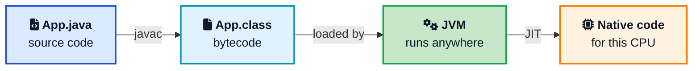
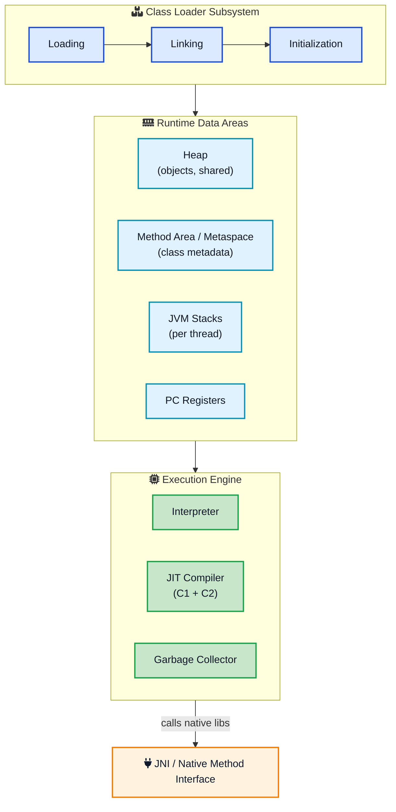
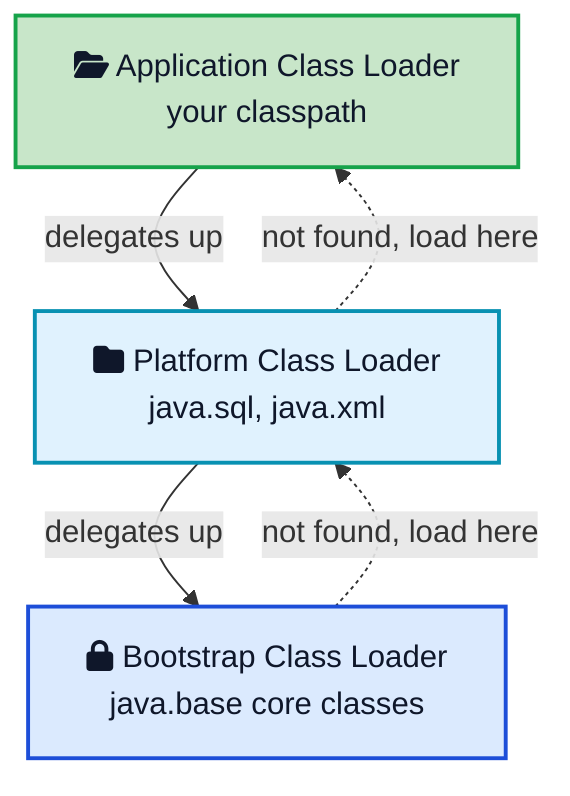
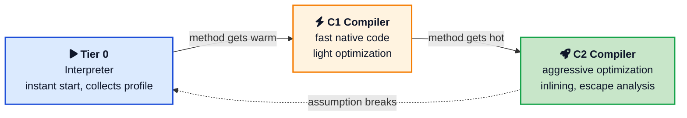
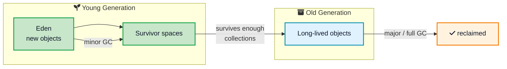

You write a `.java` file, hit run, and a few moments later your program is alive. Between those two moments a surprising amount of machinery kicks in. Your human-readable code gets turned into a compact instruction set, loaded into memory, checked for safety, and then run by an engine that quietly rewrites the slow parts into fast native code while cleaning up memory behind your back. That engine is the **Java Virtual Machine**, and most developers use it every day without ever seeing inside.

Understanding **how the JVM works** is not academic trivia. It is the difference between staring blankly at an `OutOfMemoryError` and knowing exactly which memory area blew up. It explains why your service is slow for the first few seconds and then speeds up, why a tight loop suddenly gets faster, and what all those `-Xmx` and `-XX` flags actually control. Once you can picture the moving parts, Java stops feeling like magic.

This post walks through the whole journey: from source code to bytecode, through the class loader, into the runtime memory areas, and finally to the execution engine where interpretation, JIT compilation, and garbage collection happen. We will keep the language plain and use diagrams to make each stage concrete.



## <i class="fas fa-file-code"></i> From Source Code to Bytecode

The JVM never reads your `.java` files. It reads **bytecode**. So the story starts with the compiler.

When you run `javac App.java`, the Java compiler translates your source into [bytecode](/glossary/bytecode/){:target="_blank" rel="noopener"} and writes it into a `.class` file. Bytecode is a compact, platform-independent instruction set. It is not machine code for Intel, ARM, or any specific CPU. It is machine code for an imaginary computer: the JVM.

Take this tiny method:

```java
int add(int a, int b) {
    return a + b;
}
```

`javac` turns it into bytecode that looks roughly like this when you inspect it with `javap -c`:

```
iload_1      // push local variable a onto the operand stack
iload_2      // push local variable b onto the operand stack
iadd         // pop both, add them, push the result
ireturn      // return the top of the stack
```

Notice there are no CPU registers here. The JVM is a **stack-based machine**: instructions push and pop values on an operand stack rather than naming registers like `eax` or `r0`. This design keeps bytecode simple and portable.

That portability is the whole point. The bytecode for `App.class` is byte-for-byte identical whether you compiled it on a Mac or a Linux server. Only the JVM itself is built differently for each platform. This is Java's famous **Write Once, Run Anywhere** promise, and it is why the same JAR file can run on your laptop and in a cloud container without recompiling.



One thing worth clearing up early: the terms **JDK, JRE, and JVM** get mixed up constantly. The JVM is the engine that runs bytecode. The JRE (Java Runtime Environment) is the JVM plus the standard class libraries. The JDK (Java Development Kit) is the JRE plus developer tools like `javac`, `jar`, and the profilers. You build with the JDK and run on the JVM. If you want a tour of what the modern JDK ships with, the [Java 25 features guide](/java-25-lts-features/){:target="_blank" rel="noopener"} is a good companion read.

## <i class="fas fa-sitemap"></i> The Big Picture: JVM Architecture

Before we zoom into each stage, here is the whole machine in one view. The JVM has three major subsystems that work together:

1. **Class Loader Subsystem** loads your `.class` files into memory and prepares them.
2. **Runtime Data Areas** are the memory regions the JVM uses while running: heap, stacks, method area, and more.
3. **Execution Engine** actually runs the bytecode, using an interpreter, a JIT compiler, and a garbage collector.





Everything else in this post is just a closer look at one of these three boxes. Let us start where your code enters the JVM: the class loader.

## <i class="fas fa-boxes"></i> The Class Loader Subsystem

Java does not load your entire program up front. Classes are loaded **lazily**, the first time they are actually referenced. When the JVM meets a class it has not seen yet, the [class loader](/glossary/class-loader/){:target="_blank" rel="noopener"} runs it through three phases.

### 1. Loading

The class loader finds the `.class` file, reads its binary contents, parses the constant pool and metadata, and stores that information in the method area. It also creates one `java.lang.Class` object on the heap to represent the type. That `Class` object is the handle you touch whenever you use reflection, the same reflection that powers [custom annotations](/java-custom-annotations/){:target="_blank" rel="noopener"} and most frameworks.

Loading uses a **parent-first delegation model** with a chain of loaders:

- **Bootstrap class loader** loads the core `java.base` classes like `String` and `Object`. It is written in native code and sits at the top.
- **Platform class loader** loads standard platform modules such as `java.sql` and `java.xml`.
- **Application (system) class loader** loads the classes from your application's classpath or module path.

When a loader is asked for a class, it first asks its parent, and only loads the class itself if the parent cannot. This delegation is a security feature: it stops someone from slipping in a fake `java.lang.String` and having it shadow the real one.



### 2. Linking

Linking prepares the loaded class to run. It has three sub-steps:

- **Verification** checks that the bytecode is well-formed and safe. It confirms the stack never underflows, types line up, and no instruction can jump outside the method. This is why you cannot hand the JVM arbitrary bytes and expect them to run: bad bytecode is rejected here with a `VerifyError`.
- **Preparation** allocates memory for `static` fields and sets them to default values (`0`, `false`, `null`). Your real values are not assigned yet.
- **Resolution** replaces symbolic references in the constant pool (names like "the method `println` on `PrintStream`") with direct references that point to the actual memory location.

### 3. Initialization

Finally the JVM runs the class's static initializers and `static` blocks, and assigns the real values to static fields, in the order they appear in the source. This happens exactly once per class and the JVM guarantees it is thread-safe. This is the phase that turns a loaded, linked class into one that is genuinely ready to use.

## <i class="fas fa-memory"></i> Runtime Data Areas: How the JVM Uses Memory

Once classes are loaded, the JVM needs somewhere to put everything: objects, variables, method calls, and class metadata. It divides memory into a handful of well-defined **runtime data areas**. Understanding these is the single most useful thing you can learn for debugging memory problems and doing **JVM memory management** well.

Some areas are shared by every thread. Others are private to each thread.


### The heap

The **heap** is the big shared pool where every object and array lives. When you write `new User()`, the object is allocated on the heap. All threads share one heap, and it is the region the [garbage collector](/glossary/garbage-collection/){:target="_blank" rel="noopener"} manages. When people talk about tuning `-Xmx` (maximum heap size) or chasing a memory leak, the heap is what they mean. A `java.lang.OutOfMemoryError: Java heap space` means this area filled up and the GC could not free enough.

### The method area (Metaspace)

The **method area** stores per-class information: the structure of each class, its methods' bytecode, field details, and the runtime constant pool. In modern HotSpot JVMs this lives in **Metaspace**, which sits in native memory outside the main heap. Metaspace replaced the old fixed-size PermGen in Java 8, which is why `OutOfMemoryError: PermGen space` is a thing of the past and `OutOfMemoryError: Metaspace` took its place.

### The JVM stacks

Each thread gets its own **JVM stack**. Every time you call a method, the JVM pushes a new **frame** onto that thread's stack. A frame holds the method's local variables and its operand stack (the scratch space those `iload`/`iadd` instructions use). When the method returns, its frame is popped. This is exactly why deep or infinite recursion throws `StackOverflowError`: you kept pushing frames until the stack ran out of room.

Because each thread has a private stack, local variables are naturally thread-safe. Objects on the shared heap are not, which is the root of most concurrency bugs.

### PC register and native method stack

Each thread also has a **program counter (PC) register** that tracks which bytecode instruction it is currently executing, and a **native method stack** used when Java code calls into native C or C++ libraries through the JNI (Java Native Interface).

## <i class="fas fa-microchip"></i> The Execution Engine: Interpreter and JIT

Now for the part that actually runs your code. The bytecode is loaded, memory is laid out, and the **execution engine** takes over. Here is the clever bit: the JVM does not simply interpret bytecode, and it does not simply compile it ahead of time. It does both, and it decides which to use on the fly.

### Starting with the interpreter

When execution begins, the JVM **interprets** the bytecode: it reads one instruction, does what it says, moves to the next. Interpreting is slow per instruction, but it needs zero warmup, so your program starts almost instantly. This is why the interpreter is called Tier 0.

The problem is repetition. If a method runs a million times, interpreting it a million times wastes enormous effort doing the same translation over and over.

### The JIT compiler kicks in

While the program runs, the JVM profiles it. It counts how often each method is called and how often loops spin. When a method crosses a threshold, it is declared **hot**, and the [JIT (Just-In-Time) compiler](/glossary/jit-compilation/){:target="_blank" rel="noopener"} compiles that method's bytecode straight into optimized native machine code for your CPU. The next time the method is called, the JVM runs the fast native version instead of interpreting.

HotSpot, the standard JVM, uses **tiered compilation** with two compilers:

- **C1 (the client compiler)** compiles quickly with light optimizations. It gets hot code to native speed fast while gathering more profiling data.
- **C2 (the server compiler)** compiles more slowly but applies aggressive optimizations: method **inlining**, loop unrolling, dead code elimination, and **escape analysis** that can even avoid allocating short-lived objects on the heap.





### Why your app speeds up over time

This design explains a behavior every Java developer notices: an application is a little sluggish right after it starts, then gets faster and settles into a steady, quick pace. That is the JIT warming up, moving hot methods from interpreted to C1 to C2. It is the reason benchmarks always include a warmup phase before measuring.

The dashed line back to the interpreter in the diagram is **deoptimization**. C2 makes optimistic bets, for example "this method call always targets the same class." If that bet later turns out wrong, the JVM throws away the compiled code and falls back to the interpreter, then may recompile with better information. This ability to speculate and recover is a big part of why a good JIT can sometimes rival, or even beat, statically compiled languages for long-running workloads.

Worth a mention: newer approaches like **AOT (ahead-of-time) compilation** with GraalVM Native Image compile bytecode to a native executable before running, trading peak throughput for near-instant startup and lower memory. That is a great fit for short-lived serverless functions, while the classic JIT still shines for long-running servers.

## <i class="fas fa-recycle"></i> Garbage Collection: Automatic Memory Management

In languages like C, you allocate memory and you free it. Forget to free, and you leak. Free too early, and you crash. The JVM takes that whole burden off your hands with **garbage collection**. You just create objects; the GC figures out when they are no longer reachable and reclaims their memory on the heap.

Most JVM collectors are **generational**, based on a simple observation: most objects die young. A request handler creates a pile of temporary objects that become garbage almost immediately, while a few objects (caches, connection pools) live for the whole run.



New objects are born in the **young generation** (specifically Eden). A quick, cheap **minor GC** sweeps it often, keeping the survivors and promoting the ones that stick around into the **old generation**. The old generation is collected less frequently with a more expensive **major (or full) GC**. Splitting memory this way means the GC spends most of its effort on the small young region where most garbage is, instead of scanning the whole heap every time.

The default collector in modern Java is **G1 (Garbage-First)**, which splits the heap into regions and aims to keep pauses short and predictable. For latency-sensitive systems there are low-pause collectors like **ZGC** and **Shenandoah** that keep GC pauses to a few milliseconds even on large heaps. The trade-off is always the same triangle: throughput, latency, and memory footprint. **Java performance tuning** is largely about picking the right collector and heap sizes for your workload, then measuring.

## <i class="fas fa-play-circle"></i> Putting It Together: What Happens When You Run `java App`

Let us trace one real command end to end so the pieces click. Say you run:

```bash
java App
```

with this program:

```java
public class App {
    public static void main(String[] args) {
        System.out.println(new Greeter().greet("world"));
    }
}

class Greeter {
    String greet(String name) {
        return "Hello, " + name;
    }
}
```

Here is what the JVM does:

1. **Launch.** The `java` launcher starts a JVM process and asks the class loader for `App`.
2. **Load and link `App`.** The application class loader reads `App.class`, verifies its bytecode, prepares its static fields, and resolves references. Because `main` uses `System.out`, the JVM also loads core classes like `System` and `String` (via the bootstrap loader) if they are not already in memory.
3. **Initialize `App`** and start executing `main` on the main thread. A new stack frame is pushed for `main`.
4. **`new Greeter()`** triggers loading and initializing the `Greeter` class the first time, then allocates a `Greeter` object on the **heap**.
5. **Call `greet("world")`.** A frame for `greet` is pushed onto the main thread's stack, holding the `name` local variable. The string concatenation creates a new `String` on the heap.
6. **Interpret first, compile if hot.** For a one-shot program like this, everything runs in the interpreter; nothing gets hot enough to JIT. In a real server, methods like `greet` called millions of times would be compiled to native code by C1 then C2.
7. **Print and return.** `println` runs, frames pop as methods return, and when `main` finishes the main thread ends.
8. **Garbage collection**, if it ran at all, would reclaim the short-lived `Greeter` and `String` objects once nothing references them.

Every Java program you have ever run, from a one-line demo to a huge microservice, follows this same shape. Speaking of larger systems, the same runtime powers many of the backend designs covered in the [payment system design](/payment-system-design/){:target="_blank" rel="noopener"} and [notification system design](/notification-system-design/){:target="_blank" rel="noopener"} guides.

## <i class="fas fa-tachometer-alt"></i> JVM Tuning and Observability

You do not need to tune the JVM to use it, but knowing the levers helps when performance matters. A few of the most common flags:

- `-Xms` and `-Xmx` set the initial and maximum **heap** size. Setting them equal avoids resize pauses in production.
- `-XX:+UseG1GC`, `-XX:+UseZGC`, and similar choose the garbage collector.
- `-XX:MaxMetaspaceSize` caps Metaspace so a class-loading leak cannot eat all native memory.
- `-Xss` sets the per-thread stack size.

For observability, the JDK ships tools that read the very data areas we discussed:

- `jps` and `jcmd` list and command running JVMs.
- `jstat` reports live GC and heap statistics.
- `jmap` and heap dumps let you inspect what is filling the heap.
- **Java Flight Recorder (JFR)** and Mission Control give low-overhead profiling suitable for production, and pair well with broader [application performance monitoring](/distributed-tracing-jaeger-vs-tempo-vs-zipkin/){:target="_blank" rel="noopener"} setups.

The habit that matters most: measure before you tune. Guessing at flags without data usually makes things worse. Watch GC logs and real throughput, change one thing, and measure again.

## <i class="fas fa-exclamation-triangle"></i> Common Misconceptions About the JVM

A few myths trip up even experienced developers.

- **"Java is interpreted, so it is slow."** Half true at best. Java starts interpreted, but hot code is JIT-compiled to native machine code. Long-running Java services routinely hit performance close to C++.
- **"The garbage collector means no memory leaks."** The GC only frees **unreachable** objects. If you keep adding to a static `Map` and never remove entries, those objects stay reachable forever. That is a leak, and it will still throw `OutOfMemoryError`.
- **"More heap is always better."** A giant heap can mean longer GC pauses and wasted memory. The right size is the one your workload actually needs, found by measuring.
- **"The JVM and the JDK are the same thing."** The JVM runs bytecode; the JDK is the full toolkit you build with. The JVM is one component inside it.
- **"Bytecode is machine code."** Bytecode targets the imaginary JVM, not your CPU. The JIT is what finally produces real machine code.

## <i class="fas fa-flag-checkered"></i> Wrapping Up

The JVM can look intimidating from the outside, but its job breaks down into three clear stages. The **class loader** brings your `.class` files in, verifies them, and initializes them. The **runtime data areas** organize memory into a shared heap for objects and per-thread stacks for method calls. The **execution engine** runs your bytecode, starting with the interpreter for fast startup and handing hot methods to the JIT compiler for native speed, while the garbage collector quietly reclaims memory.

Once you can picture that flow, a lot of everyday Java makes more sense. You know which memory area an `OutOfMemoryError` points to, why your service warms up before it gets fast, and what your GC flags are really doing. You do not need to memorize the spec. Keep this mental model handy, reach for the JDK's built-in tools when something goes wrong, and the JVM turns from a black box into a machine you can reason about.

---

**Related posts:**

- [Java 25 LTS Features](/java-25-lts-features/){:target="_blank" rel="noopener"} - What the newest JDK adds on top of everything here
- [Java Custom Annotations](/java-custom-annotations/){:target="_blank" rel="noopener"} - Uses the reflection and class metadata the loader builds
- [Payment System Design](/payment-system-design/){:target="_blank" rel="noopener"} - A backend design that runs on the JVM at scale
- [Notification System Design](/notification-system-design/){:target="_blank" rel="noopener"} - Another large system where JVM tuning matters
- [Distributed Tracing: Jaeger vs Tempo vs Zipkin](/distributed-tracing-jaeger-vs-tempo-vs-zipkin/){:target="_blank" rel="noopener"} - Observability that complements JVM profiling

*Further reading: the [Java Virtual Machine Specification](https://docs.oracle.com/javase/specs/jvms/se21/html/index.html){:target="_blank" rel="noopener"}, the [HotSpot Garbage Collection Tuning Guide](https://docs.oracle.com/en/java/javase/21/gctuning/introduction-garbage-collection-tuning.html){:target="_blank" rel="noopener"}, and Oracle's [Getting Started with the G1 Garbage Collector](https://www.oracle.com/technical-resources/articles/java/g1gc.html){:target="_blank" rel="noopener"}.*
