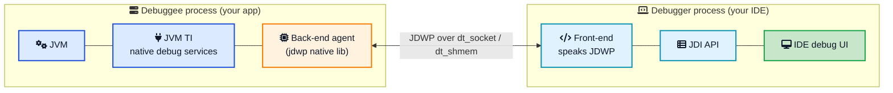
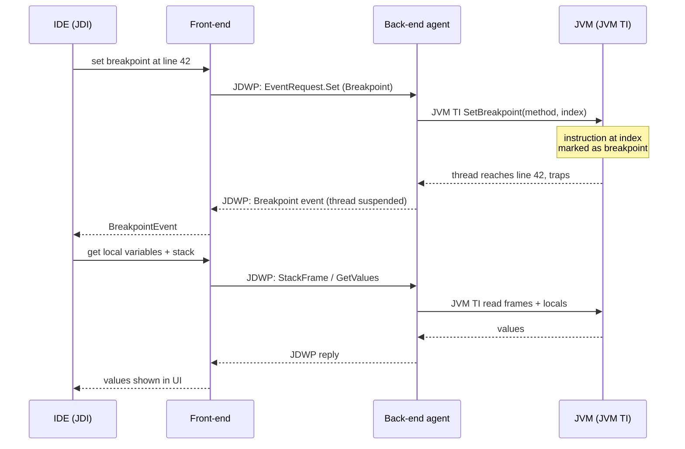
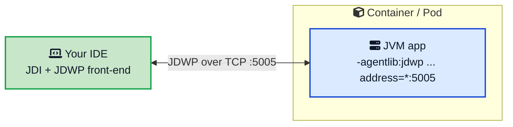

You set a breakpoint, hit debug, and your program freezes exactly on the line you picked. The variables panel fills up, you step one line at a time, hover over a value to inspect it, and change a variable on the fly. It feels like the IDE is doing something magical to your code. It is not. Almost none of that lives in the IDE. It lives in the JVM.

Debugging is a built-in feature of the Java Virtual Machine. The JVM ships with a full set of hooks for pausing threads, reading memory, and trapping execution, and it exposes them through a standard design that any debugger can plug into. IntelliJ, Eclipse, VS Code, and the command-line `jdb` all use the exact same machinery. Once you understand that machinery, remote debugging, "why is my breakpoint slowing everything down," and "how do I attach to a service running in a container" all stop being mysteries.

This post opens up that machinery. We will walk through the **Java Platform Debugger Architecture (JPDA)** and its three layers, decode the `-agentlib:jdwp` flag you have probably copy-pasted a hundred times, see how a breakpoint actually stops your code, and set up remote debugging safely. If you want the bigger picture of how the runtime executes your code first, the [how the JVM works](/how-jvm-works/){:target="_blank" rel="noopener"} guide is a good companion.



## <i class="fas fa-bug"></i> What Really Happens When You Hit a Breakpoint

Start with the moment everyone knows: execution stops on a line and you can look around. Here is the chain of events behind that single pause.

1. In your IDE you click the gutter next to a line. The IDE records "breakpoint at `OrderService.java` line 42."
2. When you launch in debug mode, the IDE and the JVM open a connection. The IDE sends a request: "notify me when execution reaches this location."
3. The JVM marks that location internally so that reaching it traps out of normal execution.
4. Your program runs at full speed until a thread hits line 42. At that point the JVM suspends the thread and sends an event back to the IDE.
5. The IDE asks follow-up questions over the same connection: what are the local variables, what is the call stack, what is `this`. The JVM answers each one.
6. You click step or resume. The IDE sends a step or resume command, and the JVM continues.

Notice that the IDE never touches your process memory directly. It asks the JVM to do everything and reads back the answers. That request-and-answer conversation is the heart of Java debugging, and it follows a precise, documented design.

## <i class="fas fa-sitemap"></i> The Big Picture: JPDA and Its Three Layers

Every part of that conversation is defined by the [Java Platform Debugger Architecture](https://docs.oracle.com/en/java/javase/26/docs/specs/jpda/jpda.html){:target="_blank" rel="noopener"}, or JPDA. It splits debugging into three layers so that debugger authors, VM authors, and transport authors can each work independently.

- **JVM TI (JVM Tool Interface)** is the lowest layer. It is a native interface implemented inside the VM that provides the actual debugging services: set a breakpoint, suspend a thread, read a local variable, get notified when a class loads.
- **JDWP (Java Debug Wire Protocol)** is the middle layer. It defines the format of the requests and events that flow between the process being debugged (the debuggee) and the debugger. It is a protocol, not a program.
- **JDI (Java Debug Interface)** is the top layer. It is a clean Java API that debugger and IDE authors program against, so they never have to hand-assemble protocol packets.

The two ends of the connection have names too. The **back-end** lives inside the debuggee: it is a native agent that uses JVM TI and speaks JDWP. The **front-end** lives inside the debugger: it speaks JDWP and exposes JDI to the tool.





Read the diagram left to right and the whole system clicks. Your application runs in the debuggee on the left. The debug agent inside it uses JVM TI to control the VM and speaks JDWP over a socket. Your IDE on the right speaks JDWP too, turns it into the friendly JDI API, and paints the debug UI. The beauty of this split is portability: because the layers only agree on JDWP and JDI, a debugger written once works across every JVM vendor, platform, and JDK version. Let us look at each layer on its own.

## <i class="fas fa-plug"></i> JVM TI: The Foundation Inside the VM

The [Java Virtual Machine Tool Interface](https://docs.oracle.com/en/java/javase/21/docs/specs/jvmti.html){:target="_blank" rel="noopener"} is where the real power lives. It is a native (C/C++) interface that the VM implements, and it is the same interface that profilers, monitoring tools, and coverage tools use. Debugging is just one thing it enables.

A tool that uses JVM TI is called an **agent**. An agent is a native library loaded into the JVM at startup with a flag like `-agentlib:` or `-agentpath:`. Once loaded, it can:

- Ask the VM for **capabilities** it wants, such as the ability to generate breakpoint events or access local variables.
- Register **callbacks** for events: class loaded, thread started, breakpoint hit, exception thrown, method entered.
- Call **functions** to act on the VM: suspend a thread, get the stack frames, read and write local variables, set a breakpoint at a location, even redefine a class.

This event-and-callback model is exactly what a debugger needs. When you set a breakpoint, something eventually calls the JVM TI `SetBreakpoint` function. When that breakpoint is reached, the VM fires the breakpoint event and the agent's callback runs. The catch is that JVM TI is native and low-level. You would not want your IDE written in C against it directly, and it would tie the IDE to one machine. That is the problem the next layer solves.

## <i class="fas fa-network-wired"></i> JDWP: The Wire Protocol

The [Java Debug Wire Protocol](/glossary/jdwp/){:target="_blank" rel="noopener"} is the language the two processes speak. It defines the exact byte format of two kinds of messages: **command packets** (the debugger asking for something, like "set a breakpoint" or "give me the value of this field") and **reply and event packets** (the debuggee answering, or telling the debugger that something happened, like "a breakpoint was hit").

Crucially, JDWP defines only the format of the messages, not how they travel. The transport is pluggable. The two standard transports are:

- **`dt_socket`**, a TCP socket. This is what you use almost always, and the only option for debugging across machines.
- **`dt_shmem`**, shared memory, for a debugger and debuggee on the same Windows host.

This is why remote debugging just works. The debugger does not care whether the JVM is on your laptop or a server in another data center. It opens a socket, speaks JDWP, and the distance is irrelevant.

You have met JDWP already, even if you did not know its name, every time you saw this flag:

```bash
java -agentlib:jdwp=transport=dt_socket,server=y,suspend=n,address=*:5005 -jar app.jar
```

That flag tells the JVM to load the JDWP back-end agent (the native library `jdwp.so`, `jdwp.dll`, or `libjdwp.dylib` shipped with the JDK) and configure it. Here is what each option means.

| Option | What it does | Common value |
|---|---|---|
| `transport` | How packets travel | `dt_socket` (TCP), or `dt_shmem` (Windows, local) |
| `server` | Who listens for the connection | `y` = the JVM waits for a debugger to attach; `n` = the JVM connects out to a listening debugger |
| `suspend` | Whether to pause at startup | `y` = freeze the VM until a debugger attaches; `n` = start running immediately |
| `address` | Host and port to use | `*:5005` (all interfaces), or `localhost:5005` (safer) |

The two options people get wrong are `server` and `suspend`. Set `server=y` when you want the JVM to sit and wait for your IDE to connect, which is the usual case. Set `suspend=y` when the bug happens during startup and you must attach before any code runs; otherwise use `suspend=n` so the app boots normally and you attach whenever you like.

One note on history: you may still see the older `-Xdebug -Xrunjdwp:...` form in blog posts. It does the same job but has been deprecated for years. Use `-agentlib:jdwp` on any modern JDK.

## <i class="fas fa-code"></i> JDI: The API Your IDE Actually Uses

Speaking JDWP by hand is painful, so almost nobody does. Instead, debuggers use the [Java Debug Interface](https://docs.oracle.com/en/java/javase/26/docs/specs/jpda/architecture.html){:target="_blank" rel="noopener"} (JDI), a pure Java API that models the debuggee as a set of objects: a `VirtualMachine`, its `ThreadReference`s, `StackFrame`s, `LocalVariable`s, and events like `BreakpointEvent`. The front-end translates every JDI call into JDWP packets and back, so tool authors think in Java objects, not bytes.

The nice part is that JDI is public. You can write your own debugger. Here is a tiny program that attaches to a JVM already running with the JDWP agent on port 5005 and prints its name:

```java
import com.sun.jdi.*;
import com.sun.jdi.connect.*;
import java.util.Map;

public class TinyDebugger {
    public static void main(String[] args) throws Exception {
        AttachingConnector connector = Bootstrap.virtualMachineManager()
                .attachingConnectors().stream()
                .filter(c -> c.name().equals("com.sun.jdi.SocketAttach"))
                .findFirst()
                .orElseThrow();

        Map<String, Connector.Argument> params = connector.defaultArguments();
        params.get("hostname").setValue("localhost");
        params.get("port").setValue("5005");

        VirtualMachine vm = connector.attach(params);
        System.out.println("Attached to: " + vm.name() + " (" + vm.version() + ")");

        for (ThreadReference thread : vm.allThreads()) {
            System.out.println("  thread: " + thread.name());
        }
        vm.dispose();
    }
}
```

From here you could request class-prepare events, set a breakpoint by line, wait for it to hit, and read locals, which is exactly the loop IntelliJ and Eclipse run. When people say a debugger is "just" a JDI client, this is what they mean. The command-line [`jdb`](https://docs.oracle.com/en/java/javase/21/docs/specs/man/jdb.html){:target="_blank" rel="noopener"} tool that ships with the JDK is a small JDI client you can try without any IDE.

## <i class="fas fa-hand-paper"></i> How a Breakpoint Actually Stops Your Code

Now for the detail that surprises most people. A line breakpoint is not the CPU checking "am I on line 42 yet" before every instruction. That would be impossibly slow. It is far more clever.

Your source line maps to a specific [bytecode](/glossary/bytecode/){:target="_blank" rel="noopener"} index inside a method. When a breakpoint is set there, HotSpot effectively **swaps the instruction at that index for an internal breakpoint opcode** and remembers the original. Execution runs at full native or interpreted speed everywhere else. Only when a thread reaches that exact spot does it hit the special opcode, which traps into the debug agent. The agent suspends the thread and fires a breakpoint event over JDWP. When you resume, the JVM executes the saved original instruction and carries on.





This design explains a few things you may have noticed:

- **A plain breakpoint is basically free until it is hit.** Code with a breakpoint that never triggers runs at normal speed, because nothing is polling.
- **Conditional breakpoints can be brutally slow.** The JVM still stops every single time the line is reached, and only then is the condition evaluated to decide whether to really pause. Put one on a line inside a million-iteration loop and the constant stopping and checking can bring the app to its knees. If you need this, a targeted log line or a condition on a rarely hit line is often faster.
- **Watchpoints (field access or modification) are even heavier**, because the VM must trap on reads or writes of a field wherever they happen.

## <i class="fas fa-server"></i> Remote Debugging in Practice

Put the layers together and remote debugging is simple. You start the target JVM with the JDWP agent listening, then point your IDE at it.

```bash
# On the server or container: start the app with the debug agent
java -agentlib:jdwp=transport=dt_socket,server=y,suspend=n,address=*:5005 \
     -jar app.jar
```

In IntelliJ IDEA you create a **Remote JVM Debug** run configuration, in Eclipse a **Remote Java Application**, set the host and port (5005 here), and hit debug. The IDE opens a socket, the JDWP handshake runs, and your breakpoints light up as if the code were local.

For containers, expose the port. A Docker run maps it with `-p 5005:5005`, and the same idea applies in Kubernetes.





Two practical tips save a lot of pain. First, the JDK version of the debuggee and the debugger do not have to match exactly, but very different versions can behave oddly, so keep them close. Second, if you want the JVM to pause and wait so you can debug startup code, flip `suspend=y`; the process will block until your IDE attaches, which is perfect for catching bugs in static initializers or early configuration.

## <i class="fas fa-shield-alt"></i> The Security Warning You Cannot Skip

Everything that makes debugging powerful also makes it dangerous. A debugger connected over JDWP can read and write memory, invoke arbitrary methods, and change running code. JDWP has **no authentication of its own**. Anyone who can reach the port effectively owns the JVM, which is why an exposed debug port is a classic remote code execution path.

Follow a few rules and you stay safe:

- **Never enable JDWP in production.** Keep it to development and staging.
- **Bind to localhost, not the world.** Prefer `address=localhost:5005` over `address=*:5005`, which listens on every interface.
- **Tunnel instead of exposing.** To debug a remote box, bind JDWP to localhost there and forward the port over SSH: `ssh -L 5005:localhost:5005 user@host`. Your IDE connects to `localhost:5005` and the traffic rides the encrypted tunnel.
- **Treat it like a shell.** If leaving JDWP open feels as risky as leaving an unauthenticated root shell open, you have the right instinct, because it is roughly the same thing.

If you build services that must be exposed to real users, the same care applies to every open port. The [what happens when you type a URL](/what-happens-when-you-type-url-in-browser/){:target="_blank" rel="noopener"} walk-through is a good reminder of how many hops a request already makes before it reaches your JVM.

## <i class="fas fa-exclamation-triangle"></i> Debugging, the JIT, and HotSwap

A common worry is whether attaching a debugger secretly slows everything down. Mostly it does not. With the JDWP agent loaded but no breakpoints set, overhead is small. The cost shows up around the code you are actually inspecting.

There is a real interaction with the [JIT compiler](/glossary/jit-compilation/){:target="_blank" rel="noopener"} worth knowing. To let you step line by line and read every local variable, the JVM sometimes has to fall back from optimized native code to the interpreter for the affected method, a process called **deoptimization**. Aggressive optimizations like inlining can also make stepping look strange, because the code the CPU runs no longer maps one-to-one to your source. This is normal and only affects the methods under the debugger, not the whole program.

The same debug machinery powers one of Java's neatest tricks: **HotSwap**, also known as hot code replace. Because JVM TI can redefine a class while the VM runs, you can edit a method body, recompile, and see the change take effect without restarting, all mediated by the [class loader](/glossary/class-loader/){:target="_blank" rel="noopener"} and the debug agent. The standard HotSwap has limits: you can change the inside of a method, but you cannot add or remove methods or fields or change signatures. Tools like JRebel and newer JDK enhancements push those limits further, but the humble built-in version already saves countless restarts.

## <i class="fas fa-terminal"></i> Debugging Without an IDE

You do not need a graphical IDE to use any of this. The JDK ships `jdb`, a command-line debugger that is a thin JDI client. It is handy on a server where you only have a terminal.

```bash
# Attach jdb to a JVM already listening on port 5005
jdb -attach localhost:5005
```

From the `jdb` prompt you can `stop at OrderService:42` to set a breakpoint, `cont` to continue, `locals` to print variables, `step` to move one line, and `print someVar` to evaluate an expression. It is bare-bones, but it speaks the exact same JPDA layers as your IDE, which makes it a great way to prove to yourself that the whole architecture is real and not IDE magic. For quick production-style inspection, pair it with the JDK tools covered in the [how the JVM works](/how-jvm-works/){:target="_blank" rel="noopener"} guide, like `jps` to find the process and `jstack` to grab a thread dump.

## <i class="fas fa-flag-checkered"></i> Wrapping Up

Java debugging feels like an IDE superpower, but the power belongs to the JVM. The runtime was built from the start to be inspected and controlled, and it exposes that through the three clean layers of JPDA. **JVM TI** does the actual work inside the VM, **JDWP** carries the requests and events between processes, and **JDI** gives tool authors a friendly Java API to build on. Your IDE is simply the prettiest client of that stack.

Once you can picture the layers, the everyday questions answer themselves. Remote debugging is just JDWP over a socket. A slow conditional breakpoint is the VM stopping and checking on every hit. An open debug port is dangerous because JDWP hands over full control with no password. And HotSwap works because the same interface that sets breakpoints can also redefine a class. Keep this mental model handy, respect the security rules, and the debugger turns from a black box into a tool you genuinely understand.

---

**Related posts:**

- [How the JVM Works](/how-jvm-works/){:target="_blank" rel="noopener"} - The runtime that provides all these debugging hooks
- [Java 25 LTS Features](/java-25-lts-features/){:target="_blank" rel="noopener"} - What the latest JDK adds to the platform
- [Java Custom Annotations](/java-custom-annotations/){:target="_blank" rel="noopener"} - Reflection and metadata, the same class data a debugger reads
- [What Happens When You Type a URL](/what-happens-when-you-type-url-in-browser/){:target="_blank" rel="noopener"} - The many hops before a request reaches your JVM

*Further reading: the [Java Platform Debugger Architecture overview](https://docs.oracle.com/en/java/javase/26/docs/specs/jpda/jpda.html){:target="_blank" rel="noopener"} and [structure guide](https://docs.oracle.com/en/java/javase/26/docs/specs/jpda/architecture.html){:target="_blank" rel="noopener"} from Oracle, the [JVM TI specification](https://docs.oracle.com/en/java/javase/21/docs/specs/jvmti.html){:target="_blank" rel="noopener"}, and Baeldung's [intro to the Java Debug Interface](https://www.baeldung.com/java-debug-interface){:target="_blank" rel="noopener"}.*
