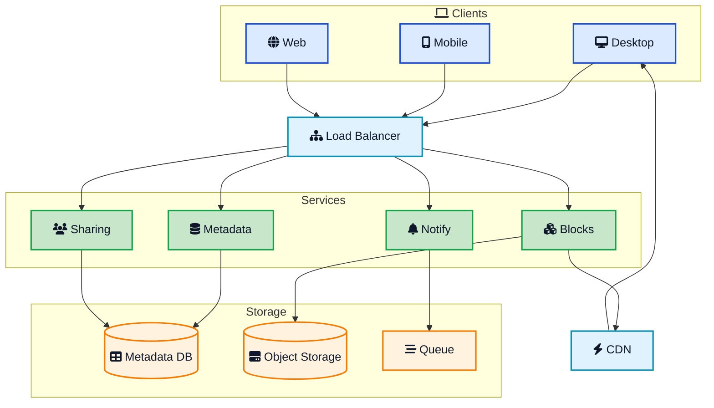
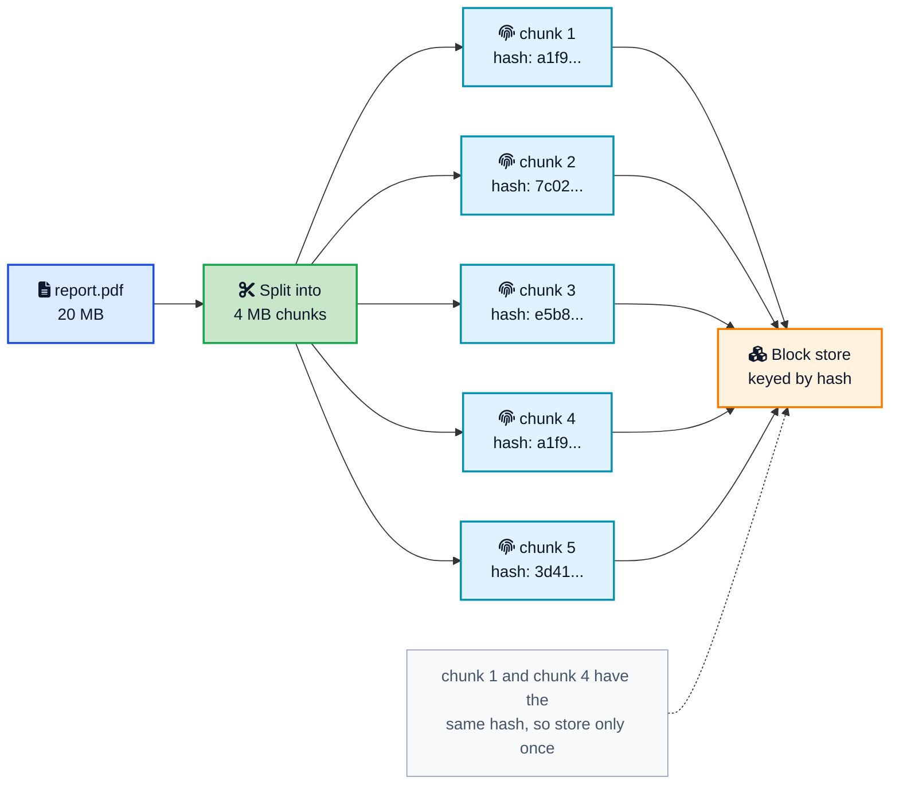
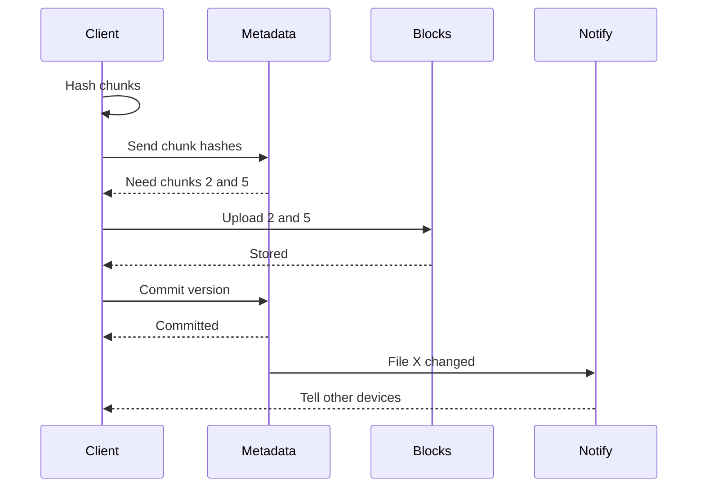
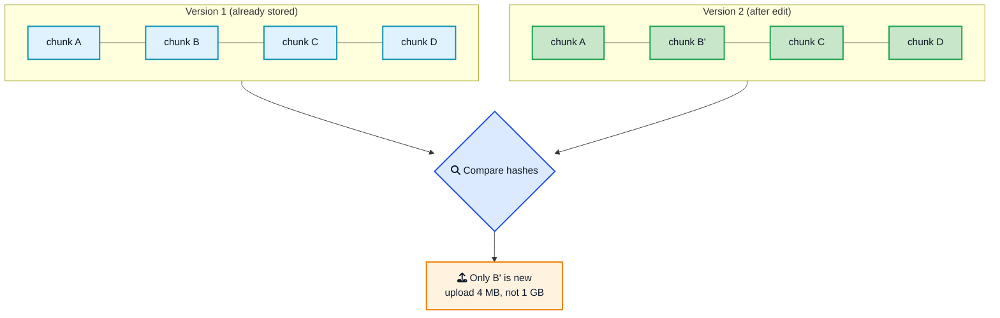
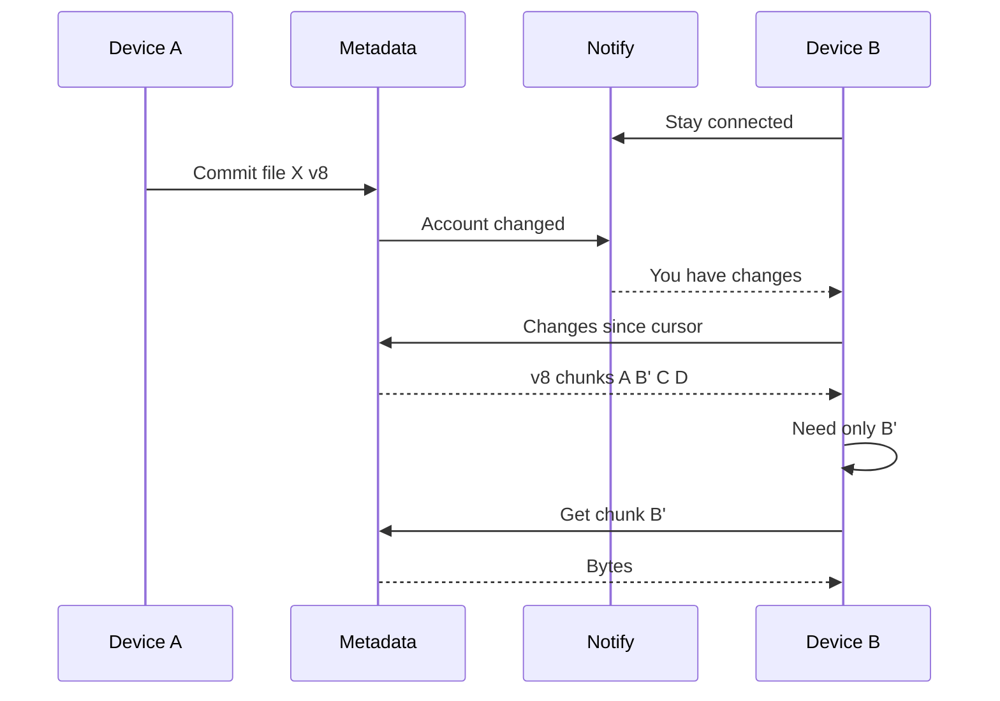
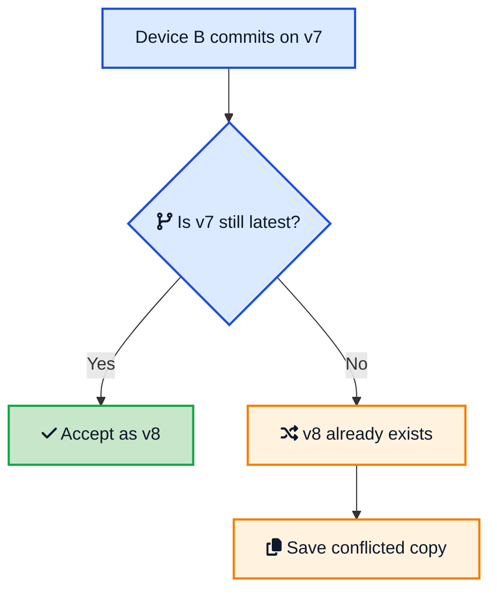

You save a 20MB presentation to your laptop's Dropbox folder. Before you have switched tabs, it is on your phone, on your desktop at home, and shared with a coworker who sees it appear in their folder. You change one slide and it syncs again in a second, even though the file is huge. Nothing looks complicated from the outside. Underneath, a lot of careful engineering makes that feel instant and never loses a byte.

This post is a full **Dropbox system design** walkthrough in plain language. The same design applies if you are asked to **design Google Drive**, a **cloud file storage** service, or any **file sync system**. We will build it up piece by piece: how files are split and stored, how the service avoids uploading the same data twice, how an edit to a large file syncs in kilobytes, how changes reach every device, and how conflicts are handled without losing work. If you have seen [how Amazon S3 works](/how-amazon-s3-works/){:target="_blank" rel="noopener"}, some of the storage ideas will feel familiar, because object storage is one of the building blocks we lean on.



## <i class="fas fa-clipboard-list"></i> Requirements: What We Are Actually Building

Before drawing boxes, pin down what the system must do. Getting this straight is half the interview and most of the real work.

**Functional requirements:**

- Upload and download files of any size, from a few kilobytes to several gigabytes.
- Automatically sync files across all of a user's devices.
- Let a user share files and folders with other users.
- Keep version history so a user can go back to an older copy.
- Work offline and catch up when the device reconnects.

**Non-functional requirements:**

- **Durability.** A stored file must never be lost. This is the promise that matters most.
- **Availability.** The service should stay up even when individual machines fail.
- **Scalability.** Hundreds of millions of users and billions of files.
- **Low bandwidth use.** Do not re-upload data we already have, and do not send whole files for small edits.
- **Reasonable latency.** Changes should propagate to other devices in seconds, not minutes.

Notice a deliberate trade-off baked into the requirements. We favor durability and availability over strong, instant consistency across every device. A file that shows up on your phone two seconds after your laptop is fine. A file that gets silently corrupted or lost is not. This nudges us toward [eventual consistency](/glossary/eventual-consistency/){:target="_blank" rel="noopener"} between devices, which is the honest model for anything syncing over flaky networks.

## <i class="fas fa-sitemap"></i> High-Level Architecture

Here is the whole system at a glance. The single most important decision is the split between **block storage** (the raw file bytes) and the **metadata service** (everything we know about those bytes). Keep that split in mind as you read the rest.



Each piece has one job:

- **Client** watches a local folder, detects changes, chunks files, talks to the services, and applies remote changes locally.
- **Metadata service** is the source of truth for the file namespace: which files exist, their versions, and the ordered list of chunks that make up each version. It never stores file bytes.
- **Block service** handles the raw chunk bytes: accept an uploaded chunk, hand back a stored chunk. It talks to [object storage](/how-amazon-s3-works/){:target="_blank" rel="noopener"}.
- **Notification service** is a lightweight channel that tells online devices "something in your account changed, come look." It carries no file data.
- **Sharing service** manages permissions and shared links.
- **CDN** sits in front of downloads so a shared file served to many people comes from an edge near them, an idea covered in the [CDN system design](/cdn-system-design/){:target="_blank" rel="noopener"} post.

The reason this split matters: bytes and metadata have completely different access patterns. Blocks are large, immutable, and written once then read many times, which is exactly what object storage is built for. Metadata is small, relational, frequently updated, and queried constantly. Trying to serve both from one system means one of them is always fighting the other.

## <i class="fas fa-cut"></i> Chunking: Split the File First

The client never uploads a whole file as one blob. It splits the file into fixed-size **chunks** (Dropbox historically used 4MB blocks). A 20MB file becomes five chunks. A 1GB file becomes 256 chunks.

Chunking buys three things at once:

1. **Parallel, resumable uploads.** Chunks upload independently. A dropped connection means retrying one 4MB chunk, not a 1GB file.
2. **Deduplication.** If two files (or two versions) share a chunk, we store it once.
3. **Delta sync.** When a file changes, only the chunks that changed move over the network.

Each chunk is then fingerprinted with a cryptographic hash of its contents, for example SHA-256. That hash becomes the chunk's name. This is the idea of [content-addressable storage](/glossary/content-addressable-storage/){:target="_blank" rel="noopener"}: a block is addressed by what it contains, not by where it lives. If you have read [how Git stores data internally](/how-git-stores-data-internally/){:target="_blank" rel="noopener"}, this will feel familiar, because Git names every object by its hash for the same reasons.

Because the hash is derived from the bytes, it does double duty. It is the key we store the chunk under, and it is a built-in integrity check. When a client downloads a chunk, it re-hashes the bytes and compares. If they do not match, the chunk is corrupt and gets re-fetched. Naming by content and verifying by content are the same operation.

## <i class="fas fa-clone"></i> Deduplication: Never Store the Same Bytes Twice

Once chunks are named by their hash, [data deduplication](/glossary/data-deduplication/){:target="_blank" rel="noopener"} falls out almost for free. Before uploading a chunk, the client asks the metadata service: "do you already have a chunk with hash `a1f9...`?" If yes, there is nothing to upload. The client just records that this file version includes that chunk.

This helps constantly in the real world:

- The same company logo sits in a thousand employees' folders. It is stored once.
- You copy a folder to make a backup. The copy adds almost no storage.
- A popular PDF is shared with a whole team. One physical copy backs all of them.

Dedup can be scoped a few ways. **Global dedup** shares chunks across all users and saves the most space, but raises privacy questions and a subtle security concern: if uploads are skipped for data that already exists, an attacker could probe whether a chunk exists. Many systems scope dedup per user or per account to avoid that, trading some savings for safety. This is a real trade-off worth calling out in an interview rather than hand-waving.

## <i class="fas fa-upload"></i> The Upload Flow, Step by Step

Now put chunking and dedup together into the actual upload path. Follow the sequence.



Read the flow carefully and a few good design habits show up:

- **Metadata is asked first.** The client sends only hashes, which are tiny, and the server replies with the subset it actually needs. This is the dedup check and it happens before a single byte of file content moves.
- **Blocks are written before the commit.** The new version is only committed to metadata after its chunks are safely stored. If the client dies mid-upload, there is no half-written version pointing at chunks that do not exist.
- **The commit is the atomic moment.** Writing the new version and its chunk list is the point where the file "officially" changes. Everything before it is preparation.
- **Notification comes last, and carries no data.** Once the version is committed, the notification service simply tells other devices to sync.

Make the whole path **idempotent**. If the client retries the commit because it did not hear back, committing the same version with the same chunk list twice must be harmless. Uploading a chunk that already exists must be a no-op. Idempotency is what lets clients retry freely over bad networks without ever corrupting a file, an idea explored more in the [idempotent receiver](/distributed-systems/idempotent-receiver/){:target="_blank" rel="noopener"} pattern.

## <i class="fas fa-code-branch"></i> Delta Sync: The Trick That Makes Large Edits Cheap

Here is where the design earns its keep. You have a 1GB video file already synced. You trim a few seconds from the start and save. A naive service re-uploads a full gigabyte. A well-designed one uploads a few megabytes.

This is [delta sync](/glossary/delta-sync/){:target="_blank" rel="noopener"}, also called block-level sync. Because the file is already stored as a list of chunk hashes, the client re-chunks the edited file, re-hashes each chunk, and compares the new hash list against the old one. Only the chunks whose hashes changed are new. Everything else is already in storage.

There is one subtlety worth knowing. With **fixed-size** chunks, inserting a few bytes at the start of a file shifts every following chunk boundary, so every chunk hash changes and the delta becomes useless. Systems that need to handle inserts well use **content-defined chunking**, where boundaries are chosen based on the data itself (a rolling hash), so an insert only affects the one chunk around it. Fixed-size chunking is simpler and works great for the common case of overwriting bytes in place; content-defined chunking is the upgrade when in-place edits and inserts are common. Mentioning this distinction shows you understand where the simple version breaks.

## <i class="fas fa-bell"></i> Sync and Notifications: Push a Hint, Pull the Data

A common mistake is to imagine the server pushing file bytes to every device. It does not. Sync is a **notification plus pull** model, and separating the two channels is a core design choice.

- The **notification channel** is cheap and always-on. Each client keeps a long-lived connection (a [long poll](/glossary/long-polling/){:target="_blank" rel="noopener"} or [WebSocket](/glossary/websocket/){:target="_blank" rel="noopener"}) to the notification service. When something changes, the server sends a tiny "you have changes" message, not the file.
- The **data channel** does the heavy lifting on demand. After the hint, the client asks the metadata service what changed, diffs it against local state, and downloads only the missing chunks from block storage or the CDN.



Why keep the channels separate? Because they scale differently. The notification service must hold millions of idle connections cheaply and send tiny messages, so it is optimized for connection count. The block service must move large amounts of data, so it is optimized for throughput and sits behind a CDN. Merging them would force one system to be good at two opposite things.

Offline devices need no special case. Each client tracks a **cursor** (a position in the account's change log). When it reconnects, it asks "what changed since my cursor?" and replays from there. The notification is only an optimization to make online sync feel instant; correctness comes from the client pulling changes since its cursor.

## <i class="fas fa-table"></i> The Metadata Model

The metadata service is where most of the interesting design lives. A simplified schema:

| Entity | Key fields | Purpose |
|---|---|---|
| **User** | user_id, email, quota | Account and storage limits |
| **File** | file_id, owner_id, path, latest_version | One logical file in the namespace |
| **FileVersion** | version_id, file_id, size, created_at | An immutable snapshot of a file |
| **Chunk** | chunk_hash, size | A stored block, named by content hash |
| **VersionChunk** | version_id, chunk_hash, order | Ordered chunk list that rebuilds a version |
| **Device** | device_id, user_id, sync_cursor | Tracks how far each device has synced |
| **Share** | share_id, file_id, grantee_id, permission | Who can access what |

Two properties make this model work. **File versions are immutable**: an edit creates a new version rather than mutating the old one, which gives you version history and safe rollback for free, and means a chunk list never changes under you. And the **chunk table is content-addressed**: the primary key is the hash, so the same chunk referenced by a thousand versions is one row and one stored block.

This metadata is small per row but there is a lot of it, so it gets **sharded**. A natural shard key is `user_id`, so all of one account's metadata lives together and account-scoped queries stay on one shard. To spread load evenly and make adding capacity painless, many systems place shards with [consistent hashing](/consistent-hashing-explained/){:target="_blank" rel="noopener"}, so adding a shard moves only a small slice of keys instead of reshuffling everything.

## <i class="fas fa-random"></i> Handling Conflicts Without Losing Work

Two devices are offline. Both edit the same file. Both come online and try to commit a new version on top of version 7. Only one can win as version 8. What happens to the other?

The safe, boring, correct answer that consumer sync services use: **keep both**. The server accepts the first commit as version 8. When the second client tries to commit against version 7, the server sees the version has moved and rejects the linear commit. Instead of overwriting or trying to auto-merge arbitrary binary data, the client saves its copy as a **conflicted copy**, typically named something like `report (Device B's conflicted copy).pdf`. Both versions survive; a human decides what to keep.

This uses optimistic concurrency: the commit carries the version it was based on, and the server only accepts it if that is still the latest. It is the same compare-and-set idea behind a lot of distributed systems. Trying to be clever with automatic three-way merges on binary files is how you lose someone's work, so the conservative choice is the professional one here.

## <i class="fas fa-hdd"></i> Storing the Blocks Durably

The block layer's whole job is to never lose a chunk. The good news is that durable byte storage is a solved problem you can build on rather than reinvent. Chunks go into [object storage](/how-amazon-s3-works/){:target="_blank" rel="noopener"} like Amazon S3, or an in-house equivalent (Dropbox built its own, called Magic Pocket, once it was large enough that owning the hardware paid off).

The durability techniques are worth knowing because interviewers probe them:

- **Replication.** Every chunk is stored on multiple machines in multiple failure domains, so losing a disk, a rack, or a whole data center never loses the only copy.
- **Erasure coding.** At large scale, storing three full copies is expensive. Erasure coding splits data into fragments plus parity fragments, so you can rebuild the original from a subset. It gives similar durability to replication at a fraction of the storage overhead.
- **Checksums and scrubbing.** Because chunks are content-addressed, the store can continuously re-hash blocks in the background and repair any that have silently rotted, comparing against the hash that is literally the block's name.
- **Immutability.** Blocks are written once and never modified. Immutable data is dramatically easier to cache, replicate, and reason about than mutable data.

Because blocks are immutable and content-addressed, the CDN in front of downloads becomes simple and safe: a chunk with a given hash is the same forever, so it can be cached at the edge indefinitely with no invalidation logic.

## <i class="fas fa-expand-arrows-alt"></i> Scaling and Bottlenecks

Walk the flow again and ask where it breaks under load.

- **Metadata database.** This is usually the first bottleneck, because every sync touches it. Shard by `user_id`, add read replicas for the read-heavy checks, and cache hot metadata. Keep transactions small and account-scoped so they stay on one shard.
- **Notification fan-out.** An account with many devices, or a folder shared with a large team, means one change notifies many connections. A [message queue](/role-of-queues-in-system-design/){:target="_blank" rel="noopener"} decouples the commit from the fan-out so a burst of changes does not stall commits.
- **Block storage throughput.** Large files and popular shared downloads push a lot of bytes. A [CDN](/cdn-system-design/){:target="_blank" rel="noopener"} absorbs repeat downloads at the edge, and object storage scales horizontally on its own.
- **Thundering herds.** A hugely popular shared file can cause many clients to fetch the same chunks at once. Edge caching plus [request coalescing](/glossary/request-coalescing/){:target="_blank" rel="noopener"} keeps that from hammering the origin.

The recurring theme: the metadata plane and the data plane scale with different tools, which is exactly why we split them in the first place.

## <i class="fas fa-lightbulb"></i> Lessons for Your Own Systems

Even if you never build a file sync service, this design carries ideas you can reuse:

1. **Separate the index from the payload.** Small, queryable metadata and large, dumb blobs want different storage. Splitting them is one of the most reusable moves in system design.
2. **Content-addressing is quietly powerful.** Naming data by its hash gives you deduplication, integrity checks, and safe infinite caching from a single decision.
3. **Push a hint, pull the data.** Keep the always-on notification channel cheap and the heavy transfer channel separate, so each can be optimized alone.
4. **Make writes idempotent.** On unreliable networks, clients will retry. If retries are safe, you can be aggressive about retrying and never corrupt state.
5. **Prefer conservative conflict handling.** Keeping both copies beats a clever merge that loses data. Safe and boring wins in storage.

## <i class="fas fa-flag-checkered"></i> Wrapping Up

The magic of Dropbox is mostly the discipline of a few good ideas applied consistently. Split files into content-addressed chunks. Store the blocks in durable object storage and the metadata in a scalable database, kept apart on purpose. Deduplicate so you never store the same bytes twice, and use delta sync so an edit to a huge file costs kilobytes. Sync with a cheap notification and an on-demand pull. Handle conflicts by keeping both versions instead of guessing.

If you are prepping for an interview, practice drawing the high-level split first (blocks vs metadata), then layering on chunking, dedup, delta sync, and the notification-pull model. If you are building something real, steal the pieces that fit: content-addressed blobs, an immutable version model, and idempotent, retry-safe writes will serve you well far outside file storage.

---

**Related posts:**

- [How Amazon S3 Works](/how-amazon-s3-works/){:target="_blank" rel="noopener"} - The object storage layer that durably holds every block
- [CDN System Design](/cdn-system-design/){:target="_blank" rel="noopener"} - How shared downloads get served fast from the edge
- [Consistent Hashing Explained](/consistent-hashing-explained/){:target="_blank" rel="noopener"} - How metadata shards spread load and grow painlessly
- [How Git Stores Data Internally](/how-git-stores-data-internally/){:target="_blank" rel="noopener"} - Content-addressed storage in a tool you use every day
- [Role of Queues in System Design](/role-of-queues-in-system-design/){:target="_blank" rel="noopener"} - Decoupling commits from notification fan-out
- [Notification System Design](/notification-system-design/){:target="_blank" rel="noopener"} - Building the channel that tells devices what changed

*Further reading: the Dropbox engineering blog on [streaming file synchronization](https://dropbox.tech/infrastructure/streaming-file-synchronization){:target="_blank" rel="noopener"} and [Inside the Magic Pocket](https://dropbox.tech/infrastructure/inside-the-magic-pocket){:target="_blank" rel="noopener"}, their write-up on [rewriting the sync engine](https://dropbox.tech/infrastructure/rewriting-the-heart-of-our-sync-engine){:target="_blank" rel="noopener"}, and the [Amazon S3](https://aws.amazon.com/s3/){:target="_blank" rel="noopener"} object storage docs.*
