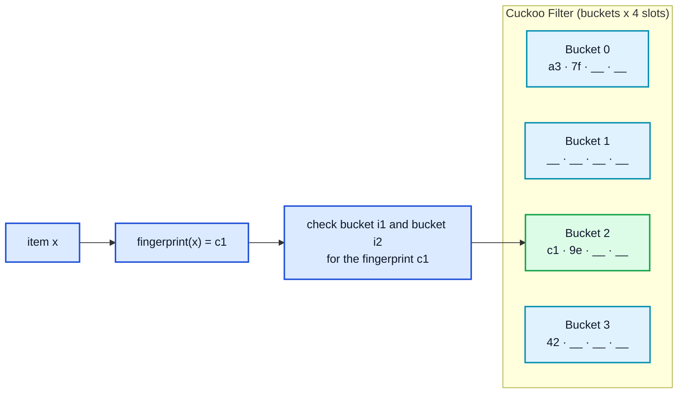
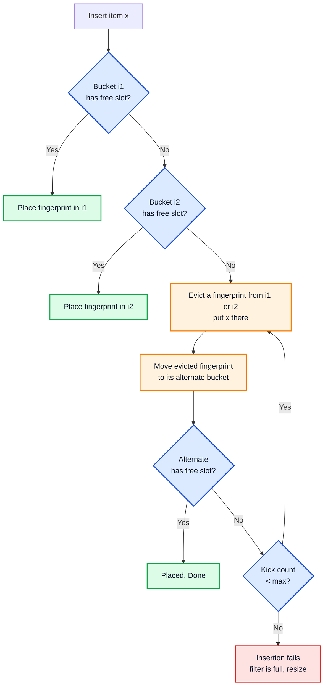
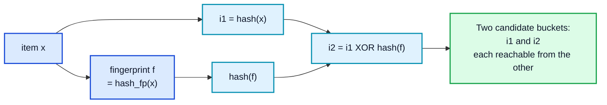
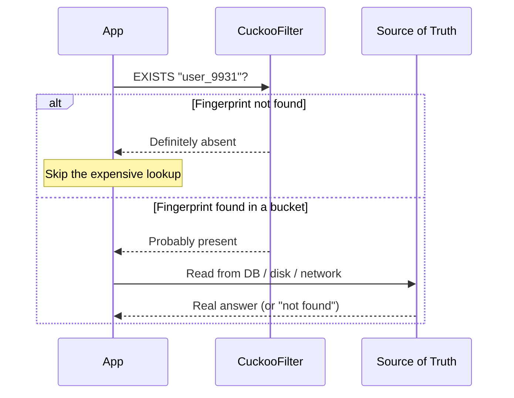

You have a Bloom filter guarding a huge dataset, and it works beautifully until the day someone asks a simple question: "can we remove an item?" The honest answer is no. A standard [Bloom filter](/data-structures/bloom-filter/){:target="_blank" rel="noopener"} can add and test, but it cannot delete, because flipping one bit back to 0 might erase the trace of some other item that shares it.

For years the workaround was the counting Bloom filter, which swaps single bits for small counters and pays for it with three to four times the memory. That is a steep price just to gain deletion. In 2014 a group of researchers at Carnegie Mellon proposed something better, a structure that supports deletion, runs faster on lookups, and still uses less memory than a space-optimized Bloom filter for low false positive rates. They called it the **cuckoo filter**.

This post explains what a cuckoo filter is, how **cuckoo hashing** and **fingerprints** make it work, how it compares to the Bloom filter, and where it shows up in real systems like [Redis](https://redis.io/docs/latest/develop/data-types/probabilistic/cuckoo-filter/){:target="_blank" rel="noopener"} and modern databases. If probabilistic data structures are new to you, the [Bloom filter guide](/data-structures/bloom-filter/){:target="_blank" rel="noopener"} is the best warm-up.



## <i class="fas fa-question-circle"></i> What a Cuckoo Filter Actually Is

A cuckoo filter is a probabilistic data structure that answers one question: **"is this item in the set?"** The answer is one of two kinds:

- **Definitely NO** - the item was never added.
- **Probably YES** - the item is likely present, with a small, tunable chance of being wrong.

That matches the Bloom filter's contract exactly: no false negatives, some false positives. What changes is what lives inside. Instead of one flat bit array, a cuckoo filter is a compact hash table split into **buckets**, and each bucket holds a few slots. Every slot stores a **fingerprint**, which is just a short hash of an item, often one byte.



The filter never stores the items themselves. It only keeps their fingerprints. That is the same idea behind the [Bloom filter](/data-structures/bloom-filter/){:target="_blank" rel="noopener"} and other members of the probabilistic family like [HyperLogLog](/data-structures/hyperloglog/){:target="_blank" rel="noopener"} and the [count-min sketch](/data-structures/count-min-sketch/){:target="_blank" rel="noopener"}: give up storing the raw data, keep just enough of a summary to answer one narrow question cheaply.

The cuckoo filter was introduced in the 2014 paper [Cuckoo Filter: Practically Better Than Bloom](https://www.cs.cmu.edu/~binfan/papers/conext14_cuckoofilter.pdf){:target="_blank" rel="noopener"} by Bin Fan, David Andersen, Michael Kaminsky, and Michael Mitzenmacher. The title is a claim, and most of this post is about why it holds up.

## <i class="fas fa-egg"></i> Where the Name Comes From: Cuckoo Hashing

The "cuckoo" in cuckoo filter comes from [cuckoo hashing](/glossary/cuckoo-hashing/){:target="_blank" rel="noopener"}, a hashing scheme named after the cuckoo bird, which pushes other eggs out of a nest to make room for its own. Cuckoo hashing does the same thing with entries in a hash table.

The core idea is simple. Every item gets **two possible buckets** instead of one, chosen by two hash functions. When you insert an item:

1. If either candidate bucket has a free slot, drop it in. Done.
2. If both are full, pick one, kick out the item sitting there, and put your new item in its place.
3. The evicted item is not lost. It has its own alternate bucket, so move it there.
4. If that alternate is also full, it kicks out yet another item, and the chain continues until everyone finds a home or you hit a retry limit.

This eviction chain is what lets cuckoo hashing pack tables very densely, often above 95% occupancy, while keeping lookups to a fixed cost: you only ever check two buckets. Compare that to how a plain hash table handles [hash collisions](/data-structures/hashtable-collisions/){:target="_blank" rel="noopener"} with long probe sequences or chains, and the appeal is clear.





There is a catch that the cuckoo filter has to solve. Classic cuckoo hashing relocates items, and to move an evicted item to its alternate bucket you normally need the item itself to rehash it. But a cuckoo filter deliberately throws the items away and keeps only fingerprints. So how can it move a fingerprint when it no longer has the original key? That is the clever part, and it deserves its own section.

## <i class="fas fa-key"></i> Partial-Key Cuckoo Hashing

The solution is called **partial-key cuckoo hashing**, and it is the single idea that makes the cuckoo filter possible. Instead of picking the two buckets from the item directly, the filter derives the second bucket from the first bucket and the fingerprint.

Here is the recipe for an item `x` with fingerprint `f`:

```
i1 = hash(x)
i2 = i1 XOR hash(f)
```

The trick lives in that XOR. Because XOR is its own inverse, the relationship works in both directions:

```
i2 = i1 XOR hash(f)
i1 = i2 XOR hash(f)
```

So if you are holding a fingerprint sitting in some bucket `i`, you can compute its other candidate bucket as `i XOR hash(f)`, without ever knowing what item produced that fingerprint. That is exactly what the eviction chain needs. When the filter kicks a fingerprint out of a bucket, it can find where to relocate it using only the fingerprint and the current bucket index.



One practical note from the original paper: because the alternate bucket is derived by XORing with `hash(f)`, the number of buckets should be a power of two so the XOR stays inside the table's range. If you want a non-power-of-two capacity you need a slightly different alternate-bucket formula, but power-of-two sizing is the standard and simplest choice.

This is also why the fingerprint cannot be too tiny. `hash(f)` has to spread fingerprints across the whole table, and the fingerprint size directly sets the false positive rate. We will get to that math shortly.

## <i class="fas fa-plus-circle"></i> Adding, Looking Up, and Deleting

With cuckoo hashing and partial keys in place, the three operations are short.

### Insert

To add item `x`:

1. Compute fingerprint `f` and the two candidate buckets `i1` and `i2`.
2. If `i1` or `i2` has a free slot, store `f` there and stop.
3. Otherwise pick one of the two buckets, evict a random fingerprint, put `f` in its place, and relocate the evicted fingerprint to its alternate bucket.
4. Keep relocating along the chain until a slot opens up, or until you hit the maximum number of kicks (commonly 500), at which point the insert fails and the filter is considered full.

### Lookup

To test item `x`:

1. Compute fingerprint `f` and both candidate buckets `i1` and `i2`.
2. Read both buckets. If `f` matches any slot in either bucket, return "probably present."
3. If it matches nothing, return "definitely absent."

A lookup reads exactly two buckets. If a bucket fits in a cache line, that is two memory accesses no matter how big the filter is. This locality is a big reason cuckoo filters keep low, steady lookup latency even at 95% load, while a Bloom filter scatters its reads across the whole bit array.

### Delete

To remove item `x`:

1. Compute fingerprint `f` and both candidate buckets.
2. If `f` is found in either bucket, remove one copy of it. Done.

No counters. No tombstones. No rebuild. That is the headline feature, and it falls out naturally because a fingerprint is a self-contained unit you can pluck out of a slot.





The deletion feature comes with one firm rule: **only delete items you actually inserted**. Because two different items can share a fingerprint in the same bucket, removing a fingerprint that was never yours can silently delete another item's entry and turn a future lookup for that item into a false negative. Bloom filters have no false negatives by design; a misused cuckoo filter can create them. Treat delete as a promise that the item was added earlier.

## <i class="fas fa-calculator"></i> The Math: Fingerprint Size and False Positives

The false positive rate of a cuckoo filter is set by two knobs: the fingerprint size in bits, `f`, and the bucket size, `b` (slots per bucket). A false positive happens when the fingerprint you are looking up collides with a different item's fingerprint sitting in one of the two buckets you read.

For a bucket size `b` and fingerprint length `f` bits, the upper bound on the false positive rate is approximately:

```
epsilon ≈ 2b / 2^f
```

The intuition: a lookup compares against at most `2b` slots (two buckets), and each stored fingerprint matches a random query fingerprint with probability `1 / 2^f`. To hit a target rate `epsilon`, you size the fingerprint as:

```
f ≈ ceil( log2( 2b / epsilon ) )
```

That gives a practical way to reason about memory. With a bucket size of 4, which is the sweet spot the paper recommends, the fingerprint sizes look like this:

| Target false positive rate | Fingerprint bits (b = 4) | Bits per item (at ~95% load) |
|---|---|---|
| 3% | ~8 | ~8.4 |
| 1% | ~10 | ~10.5 |
| 0.1% | ~13 | ~13.7 |
| 0.01% | ~17 | ~17.9 |

Bucket size matters too. A bucket size of 4 is the usual choice because it hits high load factors, around 95%, while keeping the fingerprint small. Very small buckets (b = 1) act like plain cuckoo hashing and only reach about 50% occupancy before inserts start failing; bigger buckets pack tighter but need a larger fingerprint to hold the false positive rate steady, since each lookup now compares against more slots.

The rule of thumb from the paper: for false positive rates below roughly 3%, a cuckoo filter with `b = 4` uses less space than a space-optimized Bloom filter targeting the same rate. Above 3%, the Bloom filter wins on space. Most real systems care about low false positive rates, which is why the cuckoo filter is interesting.

## <i class="fas fa-balance-scale"></i> Cuckoo Filter vs Bloom Filter

Here is the comparison most people come for.

| Aspect | Bloom Filter | Cuckoo Filter |
|---|---|---|
| Stores | Bits in one flat array | Fingerprints in bucketed hash table |
| Deletion | Not supported (standard) | Supported natively |
| Lookup cost | k scattered bit reads | 2 bucket reads (2 cache lines) |
| False negatives | Never | Never (if used correctly) |
| Space at low FP rate (< 3%) | Higher | Lower |
| Space at high FP rate (> 3%) | Lower | Higher |
| Insert can fail | No, just gets less accurate | Yes, near ~95% load |
| Counting variant needed for delete | Yes (3-4x memory) | No |
| Implementation | Very simple | Moderate (cuckoo hashing + eviction) |
| Duplicate limit | Unlimited adds | Same item limited to 2b copies |

The story in one paragraph: the [Bloom filter](/data-structures/bloom-filter/){:target="_blank" rel="noopener"} is simpler, never fails to insert, and wins on memory when you can tolerate a high false positive rate. The cuckoo filter supports deletion, reads only two buckets so it is faster and more cache-friendly, and wins on memory at the low false positive rates most production systems want. The price is a more involved implementation and the possibility that an insert fails once the table is nearly full.

There is also a subtle limit on duplicates. Because an item only has two buckets, each with `b` slots, you can only insert the exact same item `2b` times before both buckets fill with its fingerprint and the next insert fails. With `b = 4` that means eight copies. In practice you rarely insert the identical item that many times, but it is a real edge to remember, especially for a [counting](/data-structures/count-min-sketch/){:target="_blank" rel="noopener"}-style use where the same key repeats a lot.

## <i class="fas fa-code"></i> A Simple Cuckoo Filter in Python

Here is a compact, readable implementation. It is meant to teach the mechanics, not to be the fastest possible version.

```python
import random
import hashlib

class CuckooFilter:
    def __init__(self, num_buckets=1024, bucket_size=4,
                 fingerprint_bits=8, max_kicks=500):
        # num_buckets should be a power of two for the XOR trick to stay in range
        self.num_buckets = num_buckets
        self.bucket_size = bucket_size
        self.fingerprint_mask = (1 << fingerprint_bits) - 1
        self.max_kicks = max_kicks
        self.buckets = [[] for _ in range(num_buckets)]

    def _hash(self, data):
        return int(hashlib.md5(data).hexdigest(), 16)

    def _fingerprint(self, item):
        h = self._hash(str(item).encode())
        # non-zero fingerprint; 0 is reserved for "empty"
        fp = (h & self.fingerprint_mask) or 1
        return fp

    def _index(self, item):
        return self._hash(str(item).encode()) % self.num_buckets

    def _alt_index(self, index, fingerprint):
        # partial-key cuckoo hashing: i2 = i1 XOR hash(fingerprint)
        h = self._hash(str(fingerprint).encode())
        return (index ^ h) % self.num_buckets

    def insert(self, item):
        fp = self._fingerprint(item)
        i1 = self._index(item)
        i2 = self._alt_index(i1, fp)

        for i in (i1, i2):
            if len(self.buckets[i]) < self.bucket_size:
                self.buckets[i].append(fp)
                return True

        # both buckets full: start kicking
        i = random.choice((i1, i2))
        for _ in range(self.max_kicks):
            slot = random.randrange(self.bucket_size)
            fp, self.buckets[i][slot] = self.buckets[i][slot], fp
            i = self._alt_index(i, fp)
            if len(self.buckets[i]) < self.bucket_size:
                self.buckets[i].append(fp)
                return True

        # filter is effectively full
        return False

    def contains(self, item):
        fp = self._fingerprint(item)
        i1 = self._index(item)
        i2 = self._alt_index(i1, fp)
        return fp in self.buckets[i1] or fp in self.buckets[i2]

    def delete(self, item):
        fp = self._fingerprint(item)
        i1 = self._index(item)
        i2 = self._alt_index(i1, fp)
        for i in (i1, i2):
            if fp in self.buckets[i]:
                self.buckets[i].remove(fp)
                return True
        return False


# Usage
cf = CuckooFilter()
cf.insert("user_alice")
cf.insert("user_bob")

print(cf.contains("user_alice"))  # True
print(cf.contains("user_carol"))  # False (or rarely a false positive)

cf.delete("user_alice")
print(cf.contains("user_alice"))  # False
```

For production, do not roll your own. Use a battle-tested library:

- **Redis**: the [RedisBloom](https://redis.io/docs/latest/develop/data-types/probabilistic/cuckoo-filter/){:target="_blank" rel="noopener"} module (`CF.RESERVE`, `CF.ADD`, `CF.EXISTS`, `CF.DEL`).
- **C++**: the authors' [reference implementation](https://github.com/efficient/cuckoofilter){:target="_blank" rel="noopener"}.
- **Go**: `seiflotfy/cuckoofilter`.
- **Python**: `cuckoopy` or `scalable-cuckoo-filter`.

## <i class="fas fa-server"></i> Where Cuckoo Filters Are Used

Cuckoo filters fit anywhere a Bloom filter fits, plus the cases where the set changes over time.

### Databases and storage engines

Log-structured stores built on the [LSM tree](/glossary/lsm-tree/){:target="_blank" rel="noopener"} use membership filters to skip disk reads for keys that are not in a given file. A [Bloom filter](/data-structures/bloom-filter/){:target="_blank" rel="noopener"} is the classic choice, but a cuckoo filter is attractive when entries need to be removed as data is deleted or compacted, and its two-bucket lookup keeps read latency tight. The same idea helps a [database index](/glossary/database-index/){:target="_blank" rel="noopener"} avoid touching blocks that cannot contain a key.

### Caching and CDNs

A [cache](/caching-strategies-explained/){:target="_blank" rel="noopener"} or [CDN](/cdn-system-design/){:target="_blank" rel="noopener"} can use a membership filter to decide whether an object is worth caching or already tracked, and because cached content expires, deletion matters. A cuckoo filter lets the edge node forget objects it has evicted, which a plain Bloom filter cannot do without a full rebuild.

### Deduplication and networking

[Data deduplication](/glossary/data-deduplication/){:target="_blank" rel="noopener"} systems test whether a chunk fingerprint has been seen before, and as old data is purged those fingerprints must be removed. Network devices use approximate membership to track flows, block lists, and forwarding state, where entries come and go constantly. Deletion turns a rebuild-heavy job into a cheap in-place update.

### Real-time analytics and streaming

Streaming pipelines lean on probabilistic structures to stay within memory: [HyperLogLog](/data-structures/hyperloglog/){:target="_blank" rel="noopener"} for counting unique values, the [count-min sketch](/data-structures/count-min-sketch/){:target="_blank" rel="noopener"} for frequencies, and cuckoo or Bloom filters for membership. Sliding-window deduplication of events over a stream is a natural fit, since old events need to age out.

## <i class="fas fa-exclamation-triangle"></i> Trade-offs and Common Mistakes

The cuckoo filter is not a free upgrade. Keep these in mind.

### Inserts can fail near full

Once the table passes roughly 95% load, the eviction chain may fail to find a slot and the insert is rejected. Treat a failed insert as a signal to rebuild into a larger filter, or use a **scalable cuckoo filter** that chains additional filters when one fills, the same pattern scalable Bloom filters use. Do not ignore the failure and assume the item was added.

### Only delete what you inserted

This is worth repeating because it is the one way to break the "no false negatives" guarantee. Deleting a fingerprint you never added can remove a colliding item's entry. If your code path might delete arbitrary items, either track membership elsewhere or do not delete.

### Pick the bucket size deliberately

Bucket size 4 is the default for a reason: it balances load factor and fingerprint length. Do not reach for very large buckets to squeeze in more items, because you then need a longer fingerprint to hold the false positive rate, which eats the memory you were trying to save.

### It is still a pre-filter, not a source of truth

Like every probabilistic filter, a "yes" is only "probably." Always back it with a real store for the cases that matter. The filter's job is to make the common "definitely not here" answer cheap, not to be the final authority.

## <i class="fas fa-flag-checkered"></i> Wrapping Up

The cuckoo filter takes the Bloom filter's best idea, storing a tiny summary instead of the data, and fixes its biggest limitation. By keeping short fingerprints in a bucketed table and using partial-key cuckoo hashing to relocate them, it gains native deletion, faster two-bucket lookups, and lower memory than a space-optimized Bloom filter for the low false positive rates real systems care about.

The catch is honest: inserts can fail as the table fills, you must only delete items you added, and the implementation is a step more involved than a bit array. But when your set changes over time and you want a low false positive rate, the cuckoo filter is usually the better tool. If your set only ever grows and you want the simplest thing that works, the Bloom filter is still hard to beat. As with most data structure choices, the right answer falls out of how your data actually behaves.

---

**Related posts:**

- [How Bloom Filters Work](/data-structures/bloom-filter/){:target="_blank" rel="noopener"} - The structure the cuckoo filter improves on, and the best starting point
- [Count-Min Sketch Explained](/data-structures/count-min-sketch/){:target="_blank" rel="noopener"} - Probabilistic frequency counting from the same family
- [HyperLogLog Explained](/data-structures/hyperloglog/){:target="_blank" rel="noopener"} - Estimate unique counts in tiny memory
- [Skip List Data Structure](/data-structures/skip-list/){:target="_blank" rel="noopener"} - Another structure that trades strict rules for randomness
- [Hash Table Collisions Explained](/data-structures/hashtable-collisions/){:target="_blank" rel="noopener"} - How ordinary hash tables handle collisions, for contrast with cuckoo hashing
- [Database Indexing Explained](/database-indexing-explained/){:target="_blank" rel="noopener"} - Where membership filters help skip unnecessary reads
- [Caching Strategies Explained](/caching-strategies-explained/){:target="_blank" rel="noopener"} - A natural home for membership filters that need deletion

*Further reading: the original [Cuckoo Filter: Practically Better Than Bloom](https://www.cs.cmu.edu/~binfan/papers/conext14_cuckoofilter.pdf){:target="_blank" rel="noopener"} paper by Fan, Andersen, Kaminsky, and Mitzenmacher, the [cuckoo hashing overview](https://en.wikipedia.org/wiki/Cuckoo_hashing){:target="_blank" rel="noopener"} (Pagh and Rodler's scheme), the authors' [reference implementation](https://github.com/efficient/cuckoofilter){:target="_blank" rel="noopener"}, and the [RedisBloom cuckoo filter docs](https://redis.io/docs/latest/develop/data-types/probabilistic/cuckoo-filter/){:target="_blank" rel="noopener"}.*
