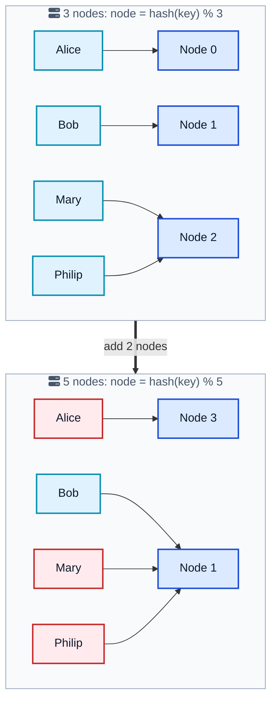
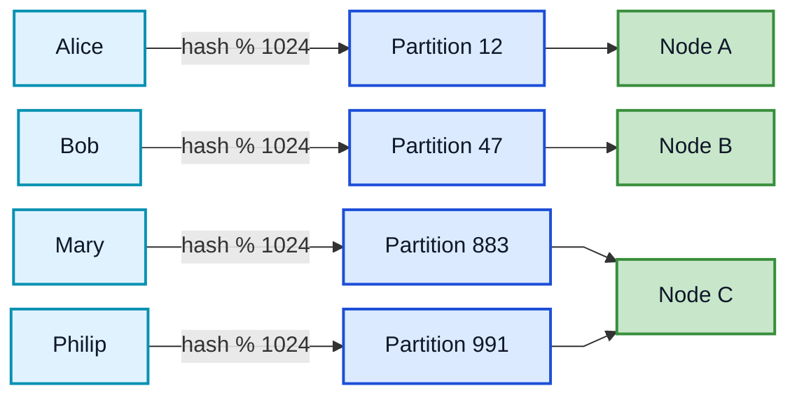
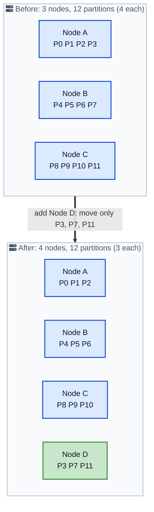

Adding a server to a cluster should be boring. You slot in the new machine, it takes a share of the load, and life goes on. For a lot of naive data systems it is anything but boring, because the simple trick everyone reaches for first, `hash(key) % numberOfNodes`, has a nasty surprise built in: the moment the node count changes, almost every key wants to live on a different machine. Adding one node can trigger a shuffle of nearly all your data across the network.

The **Fixed Partitions** pattern is the fix, and it is one of the quietest, most important ideas behind every system that scales storage horizontally. The trick is to stop mapping keys straight to nodes. Instead you insert a stable layer in the middle: a fixed number of logical partitions that never changes. Keys map to partitions, and partitions map to nodes. When the cluster grows, you move whole partitions around, but no key ever gets rehashed.

This post walks through why the modulo approach breaks, how the fixed-partition layer works, what happens during a rebalance, how it compares to [consistent hashing](/consistent-hashing-explained/){:target="_blank" rel="noopener"}, how to pick the partition count, and how Kafka, Redis Cluster, Cassandra, and Akka all rely on it.



## <i class="fas fa-exclamation-triangle"></i> The Problem: Modulo Hashing Breaks on Resize

Say you are building a distributed key-value store, which is a good stand-in for most storage systems. You need to spread keys across a set of nodes with two goals:

- **Even distribution.** No single node should get a wildly larger share than the others.
- **Cheap lookup.** A client should know which node holds a key without asking every node.

The obvious answer is to hash the key and take it modulo the number of nodes. With three nodes, `node = hash(key) % 3`. It is fast, it needs no lookup table, and it spreads keys fairly evenly. Here is how a handful of keys land on a three-node cluster.

| Key | hash(key) % 3 | Node |
|---|---|---|
| Alice | 0 | Node 0 |
| Bob | 1 | Node 1 |
| Mary | 2 | Node 2 |
| Philip | 2 | Node 2 |

Now the cluster gets busy and you add two more nodes, going from three to five. The formula is now `hash(key) % 5`, and the same keys land somewhere completely different.

| Key | hash(key) % 5 | Node |
|---|---|---|
| Alice | 3 | Node 3 |
| Bob | 1 | Node 1 |
| Mary | 1 | Node 1 |
| Philip | 1 | Node 1 |

Look at what happened. Three of the four keys moved. Only Bob stayed put, and that was luck. The node count is baked right into the formula, so changing it changes the answer for almost every key. On a real cluster with terabytes of data, this means adding a single node triggers a mass migration where most of your data crosses the network to a new home.





This is the core tension. Modulo hashing satisfies both original goals, even distribution and cheap lookup, but it fails a third goal you did not write down until it bit you: **stability under change**. A scaling strategy that has to move most of the data every time you scale is not really a scaling strategy.

## <i class="fas fa-layer-group"></i> The Solution: A Fixed Layer of Logical Partitions

The fix is a classic move in computer science: add a level of indirection. Instead of mapping keys directly to nodes, you map them to a fixed number of **logical partitions**, and then separately map partitions to nodes.

> Keep the number of partitions fixed to keep the mapping of data to partition unchanged when the size of a cluster changes.

You launch the cluster with a preconfigured partition count, say 1024, and that number **never changes for the life of the cluster**. Because it is constant, the key-to-partition math, `partition = hash(key) % 1024`, always gives the same answer for the same key, no matter how many nodes you have. The only thing that changes when the cluster resizes is the second mapping: which node currently owns which partition.



The two mappings have very different lifetimes, and that is the whole idea:

- **Key to partition** uses `hash(key) % partitionCount`. The count is fixed, so this mapping is permanent. A key belongs to the same partition forever.
- **Partition to node** is an explicit assignment table. This is the flexible part. When nodes come and go, you edit this table, not the keys.

Because there are far more partitions than nodes, each node owns many partitions. A 1024-partition cluster running on 4 nodes gives each node about 256 partitions. Add a fifth node and you simply hand it roughly 205 partitions taken from the existing four. Only those partitions move. The 80 percent of data that was not in a moved partition stays exactly where it is.

## <i class="fas fa-route"></i> How a Key Finds Its Node

Locating a key is now a two-step lookup, and both steps are cheap.

1. Compute the partition: `partition = hash(key) % partitionCount`. Pure math, no network call.
2. Look up which node owns that partition in the assignment table.

The assignment table is small, one row per partition, so it fits comfortably in memory and is easy to cache on every client. That table is the single source of truth for ownership, and it usually lives in a [consistent core](/distributed-systems/consistent-core/){:target="_blank" rel="noopener"} such as ZooKeeper or etcd so that every node and client sees the same view.

```python
class PartitionedCluster:
    def __init__(self, partition_count):
        self.partition_count = partition_count      # fixed forever, e.g. 1024
        self.partition_to_node = {}                  # e.g. {0: "A", 1: "B", ...}

    def partition_for(self, key):
        # stable: same key always lands in the same partition
        return hash(key) % self.partition_count

    def node_for(self, key):
        partition = self.partition_for(key)
        return self.partition_to_node[partition]     # only this table changes on resize

    def reassign(self, partition, new_node):
        # rebalancing edits the table, it does not touch keys
        self.partition_to_node[partition] = new_node
```

Notice that `partition_for` never changes its behavior, while `reassign` is the only thing that runs during a rebalance. Keys are untouched. This clean split between a permanent hash and a mutable assignment table is the heart of the pattern.

## <i class="fas fa-sync-alt"></i> Rebalancing: Move Partitions, Not Keys

Rebalancing is where the payoff shows up. When a node joins, leaves, or dies, the cluster wants partitions spread evenly again. With fixed partitions, rebalancing is a matter of reassigning some partitions and copying just their data, not rehashing the whole keyspace.

Here is what happens when a fourth node joins a three-node, twelve-partition cluster.





Only three partitions moved, one donated by each existing node, and the new node picked them up. Every other partition, and every key inside it, stayed exactly where it was. Compare that to modulo hashing, where adding the same node would have reshuffled the majority of keys. That is the difference between a five-minute rolling operation and an all-night data migration.

The mechanics of a safe partition move look like this:

1. The coordinator (or controller) decides partition `P7` should move from Node B to the new Node D.
2. Node D starts copying `P7`'s data from Node B while Node B still serves reads and writes for it.
3. Once D has caught up, ownership flips in the assignment table, ideally guarded by a [fencing token](/glossary/fencing-token/){:target="_blank" rel="noopener"} or version number so a stale node cannot keep serving the partition.
4. Clients refresh their cached assignment table and start routing `P7`'s traffic to Node D.

Because ownership changes are recorded in one authoritative place, the cluster avoids the [split-brain](/glossary/split-brain/){:target="_blank" rel="noopener"} nightmare where two nodes both think they own a partition. This is exactly why systems store the partition map in a consensus-backed store built on a [replicated log](/distributed-systems/replicated-log/){:target="_blank" rel="noopener"}.

## <i class="fas fa-code-branch"></i> Fixed Partitions vs Consistent Hashing

If you have read about [consistent hashing](/consistent-hashing-explained/){:target="_blank" rel="noopener"}, this all sounds familiar, because both patterns solve the same problem: keep data movement small when the cluster changes size. They just take different routes to get there.

| Aspect | Fixed Partitions | Consistent Hashing |
|---|---|---|
| Core idea | A fixed count of explicit logical partitions | Nodes and keys placed on a hash ring |
| Key location | `hash(key) % partitionCount`, then a table lookup | First node clockwise on the ring |
| Ownership record | Explicit partition-to-node table | Ring positions, often with virtual nodes |
| On node change | Move a few whole partitions | Keys in the affected arc move |
| Balance control | Number of partitions per node | Number of virtual nodes per server |
| Reasoning | Very explicit, easy to inspect and rebalance | Elegant, but arcs can be uneven without vnodes |
| Used by | Kafka, Redis Cluster, Akka, Hazelcast, Ignite | DynamoDB, Cassandra, Memcached clients, many CDNs |

The practical difference is how ownership is expressed. Fixed Partitions keeps an explicit table you can read, audit, and rebalance deliberately, which makes it easy to reason about and to move a specific partition to a specific node. Consistent hashing avoids maintaining a large table by deriving ownership from positions on a ring, using virtual nodes to smooth out the distribution. Interestingly, you can think of fixed partitions as consistent hashing where the "virtual nodes" are made concrete and given stable numbers. Many real systems blur the line: Cassandra's vnodes are essentially a large, fixed set of token ranges, which is fixed partitioning wearing a ring.

## <i class="fas fa-calculator"></i> How Many Partitions Should You Pick?

This is the one decision that really matters, because it is the hardest to change later. The partition count is a long-term commitment, so size it for the cluster you might have in a few years, not the one you have today.

Two forces pull in opposite directions:

- **Too few partitions** and you cannot spread load well. If you have 8 partitions and want 12 nodes, four nodes sit idle with no partition to own. The partition count caps how far you can scale out.
- **Too many partitions** and per-partition overhead adds up: metadata in the coordination service, open files, network connections, replication streams, and memory for each partition. Millions of partitions can overwhelm the control plane.

A good rule of thumb is to make the partition count comfortably larger than your maximum expected node count, so each node holds several partitions and there is always room to give new nodes work. Real systems bake in sensible defaults:

- **Redis Cluster** fixes the count at **16384 hash slots**, forever, for every cluster. Keys map to slots with `CRC16(key) % 16384`, and slots are assigned to nodes.
- **Kafka** topics are created with a chosen partition count (often tens to low hundreds). You can increase it later, but doing so breaks per-key ordering, which is why teams try to get it right at creation.
- **Akka Cluster Sharding** recommends a number of shards roughly ten times the maximum node count, for the same balance reasons.

The lesson across all of them is the same: choose once, choose generously, and treat the number as fixed.

## <i class="fas fa-server"></i> The Pattern in Real Systems

Once you can name Fixed Partitions, you spot it in almost every horizontally scaled data system.

### Apache Kafka

A Kafka topic is split into a fixed number of [partitions](/distributed-systems/how-kafka-works/){:target="_blank" rel="noopener"} chosen at creation. A record's key decides its partition via `hash(key) % partitionCount`, and partitions are assigned to brokers. Adding brokers rebalances whole partitions across them without changing which partition a key belongs to. This is why Kafka can grow a cluster while preserving per-key ordering, and it is also why increasing partition count later is discouraged: it changes the key-to-partition mapping and breaks that ordering.

### Redis Cluster

[Redis Cluster](https://redis.io/docs/latest/operate/oss_and_stack/reference/cluster-spec/){:target="_blank" rel="noopener"} is the textbook case. It defines exactly **16384 hash slots** and never changes that number. Each master node owns a contiguous range of slots. Resharding means moving slots (and their keys) from one node to another while the slot count stays fixed. Clients cache the slot-to-node map and get redirected with `MOVED` or `ASK` responses when a slot has migrated.

### Cassandra and DynamoDB

Both lean toward the consistent-hashing end of the spectrum, but the fixed-partition idea is still present. Cassandra splits the token ring into many virtual nodes (a large, effectively fixed set of token ranges) so that adding a node steals small ranges from many existing nodes rather than reshuffling everything. Amazon DynamoDB partitions data by the partition key and transparently splits partitions as data and traffic grow, keeping the key-to-partition mapping stable for clients.

### Akka, Hazelcast, and Ignite

Actor and in-memory data grid frameworks use the pattern directly. [Akka Cluster Sharding](https://doc.akka.io/docs/akka/current/typed/cluster-sharding.html){:target="_blank" rel="noopener"} maps entities to a fixed number of shards, then distributes shards across the cluster. Hazelcast defaults to **271 partitions** and Apache Ignite to **1024** by default, both fixed at startup, with backups of each partition placed on other nodes for fault tolerance.

| System | Fixed unit | Typical count | Key to unit mapping |
|---|---|---|---|
| Kafka | Topic partition | Tens to hundreds | `hash(key) % partitions` |
| Redis Cluster | Hash slot | 16384 (fixed) | `CRC16(key) % 16384` |
| Hazelcast | Partition | 271 (default) | `hash(key) % 271` |
| Apache Ignite | Partition | 1024 (default) | affinity function |
| Akka | Shard | ~10x node count | `hash(entityId) % shards` |

## <i class="fas fa-balance-scale"></i> Trade-offs and When to Be Careful

Fixed Partitions is close to a free win for horizontal scaling, but it is not without edges.

**What you gain:**

- **Cheap resizing.** Adding or removing nodes moves only a fraction of the data, so scaling is a routine operation instead of a scary migration.
- **Stable, cacheable lookups.** The key-to-partition math never changes, and the small assignment table caches well on every client.
- **Explicit control.** You can see exactly which node owns which partition and move specific partitions deliberately.

**What it costs:**

- **The count is a one-way door.** Pick too low and you cap scale; pick too high and you drown the control plane. Changing it later triggers the very reshuffle you were avoiding.
- **You need a coordination service.** The assignment table has to live somewhere strongly consistent, which means running or depending on a [consistent core](/distributed-systems/consistent-core/){:target="_blank" rel="noopener"} like ZooKeeper or etcd.
- **A bad key still bites.** Fixed partitions spread keys, but if one key or key range is far hotter than the rest, its partition becomes a [hot partition](/glossary/sharding/){:target="_blank" rel="noopener"} no matter how many partitions you have. Partition-key design matters as much as the pattern.
- **Rebalancing is not instant.** Moving a partition means copying its data over the network while keeping it available, which takes time and bandwidth for large partitions.

## <i class="fas fa-exclamation-triangle"></i> Mistakes Teams Make

### Using raw modulo hashing in the first place

The most common one. A quick prototype maps keys to nodes with `hash(key) % nodeCount`, it works fine in the demo, and then the first time the cluster scales in production it triggers a full data reshuffle. If your data is partitioned across nodes, reach for fixed partitions or consistent hashing from day one.

### Setting the partition count too low

Teams often pick a partition count close to the current node count, "we have 4 nodes, let's use 8 partitions." Then growth stalls at 8 nodes because there are no spare partitions to hand out. Size the count for years of growth, not this quarter.

### Setting the partition count absurdly high

The opposite error. Someone picks a million partitions "to be safe," and the coordination service chokes on the metadata, or each node ends up managing tens of thousands of tiny partitions with real per-partition overhead. Pick generously, not infinitely.

### Choosing a skewed partition key

Fixed partitions balance the number of keys, not the traffic. If you key by something low-cardinality or bursty, like a single popular tenant or the current calendar day, one partition gets hammered while the rest idle. A high-cardinality, evenly accessed key is what actually spreads load.

### Letting clients act on a stale partition map

If a partition has moved but a client still routes to the old owner, you get errors or, worse, writes to the wrong node. Systems handle this with redirect responses (Redis `MOVED`/`ASK`) or version-checked assignments and [fencing tokens](/glossary/fencing-token/){:target="_blank" rel="noopener"}. Do not assume every client instantly sees a rebalance.

## <i class="fas fa-tasks"></i> Key Takeaways for Developers

1. **Never map keys straight to nodes.** `hash(key) % nodeCount` remaps almost everything the moment the node count changes. That is not a scaling strategy.
2. **Add a fixed middle layer.** Keys map to a fixed number of logical partitions; partitions map to nodes. Only the second mapping changes on a resize.
3. **The partition count is permanent.** The stability of the key-to-partition hash is the entire benefit, so treat the count as a long-term, hard-to-change decision.
4. **Rebalancing moves partitions, not keys.** Adding a node hands it a few whole partitions; everything else stays put.
5. **Store the map in a consistent core.** ZooKeeper, etcd, or a Raft controller keeps every client and node agreeing on who owns what.
6. **Size the count for future growth.** High enough that every node gets partitions and new nodes have work, low enough that the control plane stays healthy.
7. **You already use it.** Kafka, Redis Cluster, Cassandra, Akka, Hazelcast, and Ignite all scale on top of fixed partitions.

## <i class="fas fa-flag-checkered"></i> Wrapping Up

Fixed Partitions is a small idea with an outsized payoff. By refusing to bake the node count into how keys are located, and inserting a stable layer of logical partitions instead, you turn cluster resizing from a full-data migration into a quick move of a few partitions. The keys never rehash; only the partition-to-node table changes.

The wisdom is all in the details: pick the partition count generously and once, keep the assignment table in a strongly consistent store, guard ownership handoffs against stale nodes, and remember that a skewed key can still create a hot partition no matter how clever the pattern. Get those right and you have the same foundation that lets Kafka, Redis, and Cassandra grow from three nodes to three hundred without anyone losing a night's sleep over a data shuffle.

---

**Related posts:**

- [Consistent Hashing Explained](/consistent-hashing-explained/){:target="_blank" rel="noopener"} - The other main answer to the resize problem, using a ring instead of a fixed table
- [How Kafka Works](/distributed-systems/how-kafka-works/){:target="_blank" rel="noopener"} - Topic partitions are fixed partitions in production
- [Consistent Core Pattern](/distributed-systems/consistent-core/){:target="_blank" rel="noopener"} - Where the partition-to-node assignment table lives
- [Replicated Log](/distributed-systems/replicated-log/){:target="_blank" rel="noopener"} - The consensus-backed log that records ownership changes safely
- [Leader and Followers Pattern](/distributed-systems/leader-follower/){:target="_blank" rel="noopener"} - How each partition's replicas stay in sync

*Further reading: Unmesh Joshi's [Fixed Partitions chapter](https://martinfowler.com/articles/patterns-of-distributed-systems/fixed-partitions.html){:target="_blank" rel="noopener"} in Patterns of Distributed Systems; the [Redis Cluster specification](https://redis.io/docs/latest/operate/oss_and_stack/reference/cluster-spec/){:target="_blank" rel="noopener"}; the [Akka Cluster Sharding docs](https://doc.akka.io/docs/akka/current/typed/cluster-sharding.html){:target="_blank" rel="noopener"}; and the original [Consistent Hashing paper](https://www.cs.princeton.edu/courses/archive/fall09/cos518/papers/chash.pdf){:target="_blank" rel="noopener"} by Karger et al.*
