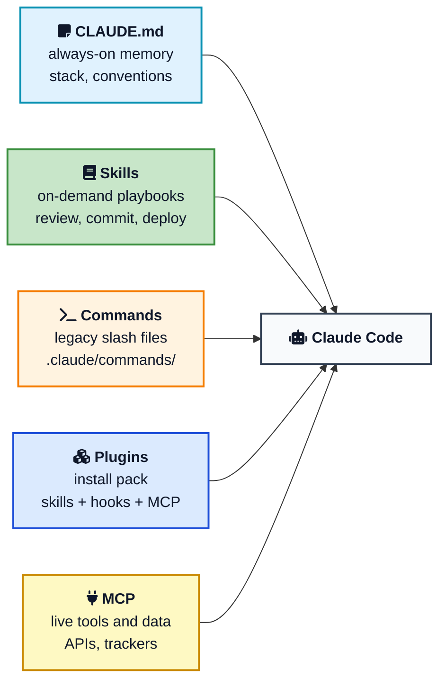
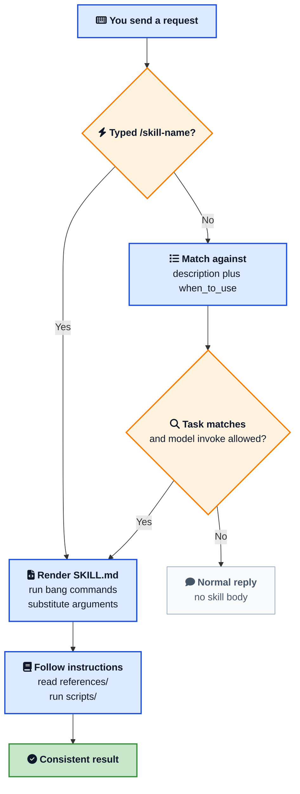

You told Claude Code how your team reviews a pull request. Next session it forgot. You pasted the same deploy checklist. Then you stuffed the checklist into `CLAUDE.md`, and now every tiny question pays for a runbook it does not need.

**Claude Code skills** fix that split. A skill is a folder with a `SKILL.md` file that teaches Claude one job. Claude keeps a short description in context and loads the full playbook only when the job matches, or when you type `/skill-name`. Standing rules stay in `CLAUDE.md`. Procedures live in skills.

This is a hands-on guide to **Claude Code skills**: where files go, how slash commands work, how skills differ from `CLAUDE.md` and plugins, how to inject a live git diff, and how to keep a skill from deploying production because a description happened to match. The `SKILL.md` format is the same [Agent Skills](/glossary/agent-skills/){:target="_blank" rel="noopener"} standard used in [Cursor](/how-to-create-and-use-skills-in-cursor/){:target="_blank" rel="noopener"}. The rest of this post is what Claude Code does on top of that standard.



## <i class="fas fa-question-circle"></i> What Claude Code Skills Actually Are

A Claude Code skill is a portable, version-controlled package that teaches the agent a domain-specific task. Anthropic introduced the idea in its [Agent Skills announcement](https://www.anthropic.com/news/skills){:target="_blank" rel="noopener"} and documented the Claude Code behavior in [Extend Claude with skills](https://code.claude.com/docs/en/skills.md){:target="_blank" rel="noopener"}.

Four properties matter in practice:

- **On demand.** Unlike `CLAUDE.md`, the body is not in every turn. That is [progressive disclosure](/glossary/progressive-disclosure/){:target="_blank" rel="noopener"}: metadata for routing, full text only when chosen.
- **A command.** The folder name is what you type after `/`. `.claude/skills/summarize-changes/SKILL.md` becomes `/summarize-changes`.
- **Actionable.** A skill can run scripts, pull a live diff with a bang command, and pre-approve tools for that turn.
- **Shareable.** Commit `.claude/skills/` and the next clone gets the same reviews and the same release steps.

Claude Code also ships bundled skills such as `/code-review`, `/debug`, `/doctor`, `/run`, and `/verify`. A project skill with the same name overrides the bundled one. The bundled alias may still point at Anthropic's version, so `/review` might not run your `/code-review` replacement. Check `/skills` if the command you typed did not do what you expected.

## <i class="fas fa-folder-open"></i> Where Claude Code Skills Live

Where you put the folder decides who gets the skill.

| Location | Path | Who it applies to |
|---|---|---|
| Project | `.claude/skills/<name>/SKILL.md` | This repo, shared through Git |
| Personal | `~/.claude/skills/<name>/SKILL.md` | Every project on your machine |
| Plugin | `skills/<name>/SKILL.md` inside the plugin | Wherever the plugin is enabled |
| Enterprise | Managed settings `.claude/skills/` | Everyone the policy covers |
| Nested package | `apps/web/.claude/skills/<name>/SKILL.md` | When Claude works in that tree |

If a skill encodes how *this* codebase ships, commit it under `.claude/skills/`. If it encodes how *you* like commit messages everywhere, use `~/.claude/skills/`.

Name clashes are easy to get wrong. Across levels, **enterprise overrides personal, and personal overrides project**. A `deploy` skill in your home directory wins over the one in the repo. Plugin skills are namespaced as `/plugin-name:skill-name`, so they sit beside a project skill of the same short name. Skills in `.claude/skills/` also beat a leftover file in `.claude/commands/` when both share a name.

Monorepos can nest skills. After Claude reads a file under `apps/web/`, skills in `apps/web/.claude/skills/` show up. A clash with the root skill gets a qualified name such as `/apps/web:deploy`. Typing `/deploy` still runs the root skill; Claude Code then tells the model about the nested variant so work inside that package can pick it up.

Cowork and cloud sessions skip `~/.claude/skills/` on your laptop. Enable the skill on claude.ai, or commit it to `.claude/skills/`, or ship it in a plugin listed in the repo's `.claude/settings.json`. For how Cowork and Claude Code split knowledge work versus code, see the [Claude Cowork guide](/claude-cowork-guide/){:target="_blank" rel="noopener"}.

Edits to `SKILL.md` under the personal or project folders usually apply in the current session. Create a brand new `skills` directory that did not exist at startup, and restart so Claude Code can watch it.

## <i class="fas fa-file-code"></i> Your First Claude Code Skill

Create a personal skill that summarizes uncommitted work and flags risk. This is the smallest useful pattern, including the Claude Code trick of inlining the real diff.

```bash
mkdir -p ~/.claude/skills/summarize-changes
```

Write `~/.claude/skills/summarize-changes/SKILL.md`:

````markdown
---
description: Summarizes uncommitted changes and flags anything risky. Use when the user asks what changed, wants a commit message, or asks to review their diff.
---

## Current changes

!`git diff HEAD`

## Instructions

Summarize the changes above in two or three bullet points, then list any risks you notice such as missing error handling, hardcoded values, or tests that need updating. If the diff is empty, say there are no uncommitted changes.
````

The bang-command line is **dynamic context injection**. Claude Code runs `git diff HEAD` and replaces that line with stdout before the model sees the skill. Claude is not guessing from open buffers. It is reading the working tree.

Open a repo, dirty a file, run `claude`, then try either:

```text
What did I change?
```

or:

```text
/summarize-changes
```

You should get a short summary plus risks. Confirm discovery with `/skills`.

Custom commands merged into skills. A file at `.claude/commands/deploy.md` still creates `/deploy`. A skill at `.claude/skills/deploy/SKILL.md` creates the same command and can carry a `scripts/` folder, invocation flags, and supporting docs. Prefer skills for anything new.



## <i class="fas fa-balance-scale"></i> CLAUDE.md vs Skills vs Commands vs Plugins vs MCP

People dump everything into `CLAUDE.md` because it works. It also makes every session more expensive and more noisy. Split by job.



- **[CLAUDE.md](https://code.claude.com/docs/en/memory){:target="_blank" rel="noopener"}** is session memory. Load it for facts that should never be forgotten: language, test command, directories that are off limits. Official docs treat it as always-on context.
- **Skills** are procedures. PR review, changelog, staging deploy. They load when the description matches or when you slash them.
- **Commands** are the older slash-file layout. Same idea, fewer features. New work should be a skill.
- **Plugins** distribute a bundle. `/plugin` installs skills plus optional subagents, hooks, and MCP servers from a marketplace.
- **[MCP](/model-context-protocol-mcp-explained/){:target="_blank" rel="noopener"}** is how Claude talks to live systems. A skill can tell Claude *how* to investigate an incident. MCP is what lets it query the tracker or the metrics API.

A useful pair: MCP gives access to GitHub, a skill says exactly how this team reviews a pull request with `gh`. The tool and the playbook are different layers, the same split as [prompt engineering](/prompt-engineering-basics/){:target="_blank" rel="noopener"} versus [context engineering](/context-engineering/){:target="_blank" rel="noopener"}. One is how you ask. The other is what sits in the window.

If you already use Cursor, map `CLAUDE.md` to Rules and Claude Code skills to Cursor Skills. The [Cursor skills guide](/how-to-create-and-use-skills-in-cursor/){:target="_blank" rel="noopener"} walks the shared `SKILL.md` fields. This post stays on Claude Code behavior.

## <i class="fas fa-project-diagram"></i> How a Claude Code Skill Gets Loaded



Two-stage load is the whole point. Descriptions stay cheap. The body, plus any `!` command output, enters the conversation as one message and stays there for later turns. Tool grants from `allowed-tools` do **not** stay: they last for the invoking turn, then your next message clears them. If a deploy skill should keep working across a few back-and-forths, say so in the instructions, or invoke it again.

After compaction, Claude Code tries to re-attach recent skills, truncated, so the playbook is not wiped. If behavior drifts after a long session, type `/skill-name` again.



## <i class="fas fa-tasks"></i> Frontmatter That Matters in Claude Code

Claude Code reads YAML only when the file starts with `---` on line one. `description` is the field that actually routes. `name` on a personal or project skill is a display label; **the command still comes from the directory**. On a plugin skill, `name` is the last segment of `/plugin:name`.

| Field | Typical use |
|---|---|
| `description` | What it does and when to fire. Put trigger phrases first. Listings truncate around 1,536 characters combined with `when_to_use`. |
| `when_to_use` | Extra trigger examples. Same cap as description. |
| `disable-model-invocation` | `true` means only you can slash it. Use for deploy, page, drop-table. |
| `user-invocable` | `false` hides it from `/` and lets Claude load background knowledge on its own. |
| `allowed-tools` | Pre-approve tools for the invoking turn, for example `Bash(git status *)`. |
| `disallowed-tools` | Remove tools for that turn, such as hiding `AskUserQuestion` in a loop. |
| `paths` | Globs so auto-invoke happens only near matching files. |
| `context: fork` | Run in a subagent. Pair with `agent` and `background`. |
| `argument-hint` | Autocomplete hint such as `[environment]`. |
| `arguments` | Named `$issue` / `$branch` placeholders. |
| `model` / `effort` | Override model or effort for the invoking turn. |
| `hooks` | Register hooks when the skill runs, for the rest of the session. |

The open spec, and the Skills API / claude.ai upload path, only allow `name`, `description`, `license`, `compatibility`, `metadata`, and `allowed-tools`. Extra keys such as `argument-hint` fail packaging with an unexpected-key error. Keep Claude Code-only fields in repo skills. Keep uploaded skills on the six spec fields.

Write descriptions in the third person, with both *what* and *when*:

```yaml
# Weak: never triggers
description: Helps with pull requests.

# Strong: what plus the words people type
description: Review a GitHub pull request against team standards.
  Use when the user asks to review a PR, examine a diff, or
  mentions code review.
```

`disable-model-invocation: true` is the safety valve. Claude cannot "notice the build looks ready" and ship production. If it tries, Claude Code blocks the shortcut and tells it not to recreate the steps some other way. You still type `/deploy`.

```markdown
---
description: Deploy the current build to production. Manual only.
disable-model-invocation: true
allowed-tools: Bash(git status *) Bash(git diff *)
---

# Production deploy

1. Confirm branch is main and CI is green.
2. Run ${CLAUDE_PROJECT_DIR}/scripts/deploy.sh production.
3. Probe /health and expect HTTP 200.
4. On failure, run ${CLAUDE_PROJECT_DIR}/scripts/rollback.sh.
```

`${CLAUDE_PROJECT_DIR}` and `${CLAUDE_SKILL_DIR}` expand in the body and in `allowed-tools` Bash rules, so a bundled script can run without a permission prompt when the allow rule matches the exact command. `${CLAUDE_PLUGIN_ROOT}` exists only inside plugin skills.

For anything that can send a message, drop a database, or touch prod, combine `disable-model-invocation` with a human at the slash command. Skills are still instructions in the context window, so treat untrusted skills the way you treat untrusted [prompt injection](/prompt-injection-explained/){:target="_blank" rel="noopener"} surfaces: read them before you run them.

## <i class="fas fa-bolt"></i> Dynamic Context, Arguments, and Forked Skills

Bang commands are the feature you will miss if you only copy a Cursor `SKILL.md`. Claude Code runs them locally for project and personal skills. Synced claude.ai skills and some Cowork paths will not execute them the same way.

```markdown
---
description: Summarize the current GitHub pull request. Use when the
  user asks to review this PR, summarize PR comments, or mentions gh pr.
disable-model-invocation: true
argument-hint: "[pr-number]"
allowed-tools: Bash(gh *)
---

## Pull request context

- PR diff: !`gh pr diff`
- Comments: !`gh pr view --comments`
- Files: !`gh pr diff --name-only`

## Task

Review the diff above. Group findings as critical, suggestion, or nice to have.
If $ARGUMENTS is set, focus on that pull request number.
```

`$ARGUMENTS`, `$0`, and named `arguments:` entries substitute when you invoke `/pr-review 142`. Indexed placeholders that have no value stay as literal text. Named placeholders with no value become empty strings.

`context: fork` runs the skill in a subagent so a heavy review does not bloat the parent chat. Bundled `/code-review` uses this pattern on recent Claude Code versions. Set `background: false` if you want the parent turn to wait for the result.

Keep `SKILL.md` under about 500 lines. Point at `references/` for checklists and `scripts/` for anything fragile. The agent should run `scripts/validate.py`, not regenerate it from prose each time. That is the same token discipline as progressive disclosure: load the minimum, fetch the rest on demand.



## <i class="fas fa-cubes"></i> Plugins and Sharing Skills

Three ways to share, in the order most teams actually need:

1. **Git.** Commit `.claude/skills/`. Lowest ceremony. Best default.
2. **Plugin.** Add `skills/<name>/SKILL.md` next to `.claude-plugin/plugin.json`, optional `hooks/`, `.mcp.json`, and `agents/`. Install with `/plugin` from the official marketplace or `/plugin marketplace add owner/repo`.
3. **Managed settings.** Company-wide skills that override personal copies.

You can turn a skill folder into a tiny plugin by adding `.claude-plugin/plugin.json` so it can also ship hooks and MCP. In a project `.claude/skills/` that requires accepting workspace trust first.

Turn bundled skills off with `disableBundledSkills` if they fight your own `/code-review`. `/doctor` can stay available depending on version and overrides.

Trust the source. A skill with a wide `allowed-tools: Bash(*)` grant is executable policy, not documentation. Review repo skills the way you review a new CI script.

## <i class="fas fa-check-circle"></i> A Project Skill Worth Committing

Here is a repo skill that matches how many teams actually use Claude Code: review the current branch against a checklist file.

```text
.claude/skills/code-review/
├── SKILL.md
└── references/
    └── checklist.md
```

````markdown
---
description: Review code for quality, security, and maintainability against
  team standards. Use when reviewing a pull request, examining a diff, or when
  the user asks for a code review.
---

# Code review

## Context

- Diff vs main: !`git diff origin/main...HEAD`

## Steps

1. Read the diff above and state the intent in one sentence.
2. Walk [references/checklist.md](references/checklist.md).
3. Group feedback as Critical, Suggestion, or Nice to have. Explain why.

## Output

Do not nitpick formatting the linter already covers. Prefer findings that would
block merge or create an incident.
````

Commit that folder. Every teammate who runs Claude Code in the repo now has `/code-review` with the same bar. Override Anthropic's bundled skill on purpose, and remember `/review` may still be the bundled alias.

## <i class="fas fa-flag-checkered"></i> Wrapping Up

Claude Code skills turn the checklist you keep pasting into a file the agent can find. Put project playbooks in `.claude/skills/`, keep `CLAUDE.md` for facts, write a description that sounds like your teammates, slash the dangerous ones yourself, and use bang commands when the model needs the real diff rather than a guess.

Start with one workflow you explained twice this week. Make the folder, write twenty lines of `SKILL.md`, type `/your-skill`. Add the next skill when the friction shows up again. Because the format is just files, the same playbook can travel to Cursor and to anything else that speaks Agent Skills, while the Claude Code-only knobs stay in the repo that actually runs them.

---

**Related posts:**

- [Cursor Skills: How to Create and Use Agent Skills](/how-to-create-and-use-skills-in-cursor/){:target="_blank" rel="noopener"} - Same SKILL.md standard, Cursor directories and Rules instead of CLAUDE.md
- [How to Use Cursor](/how-to-use-cursor/){:target="_blank" rel="noopener"} - Skills as one piece of an AI editor workflow
- [Model Context Protocol (MCP) Explained](/model-context-protocol-mcp-explained/){:target="_blank" rel="noopener"} - Live tools that skills can orchestrate
- [Claude Cowork Guide](/claude-cowork-guide/){:target="_blank" rel="noopener"} - Where Cowork loads skills versus local Claude Code
- [Context Engineering](/context-engineering/){:target="_blank" rel="noopener"} - Why on-demand playbooks beat stuffing CLAUDE.md
- [Prompt Injection Explained](/prompt-injection-explained/){:target="_blank" rel="noopener"} - Why you review skills before they get allowed-tools
- [Building AI Agents](/building-ai-agents/){:target="_blank" rel="noopener"} - The loop the skills sit inside

*Further reading: Anthropic's [Claude Code skills docs](https://code.claude.com/docs/en/skills.md){:target="_blank" rel="noopener"}, [CLAUDE.md memory](https://code.claude.com/docs/en/memory){:target="_blank" rel="noopener"}, the [Agent Skills standard](https://agentskills.io/){:target="_blank" rel="noopener"}, and the [Agent Skills announcement](https://www.anthropic.com/news/skills){:target="_blank" rel="noopener"}.*
