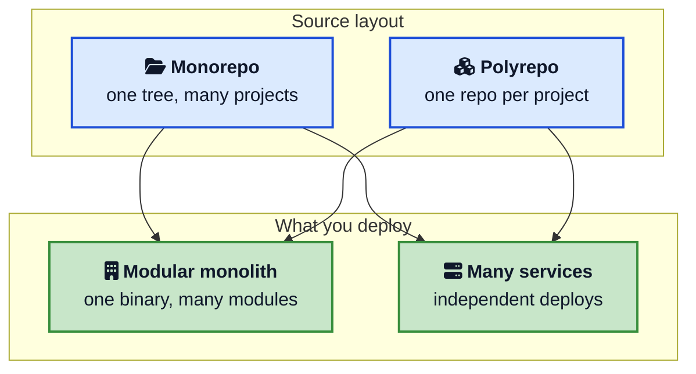
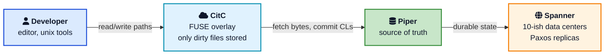
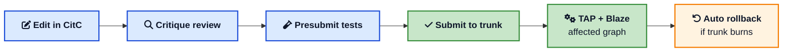
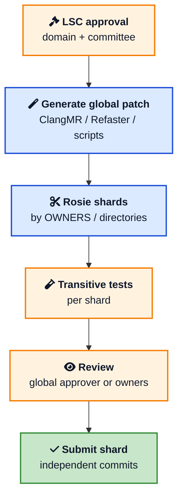
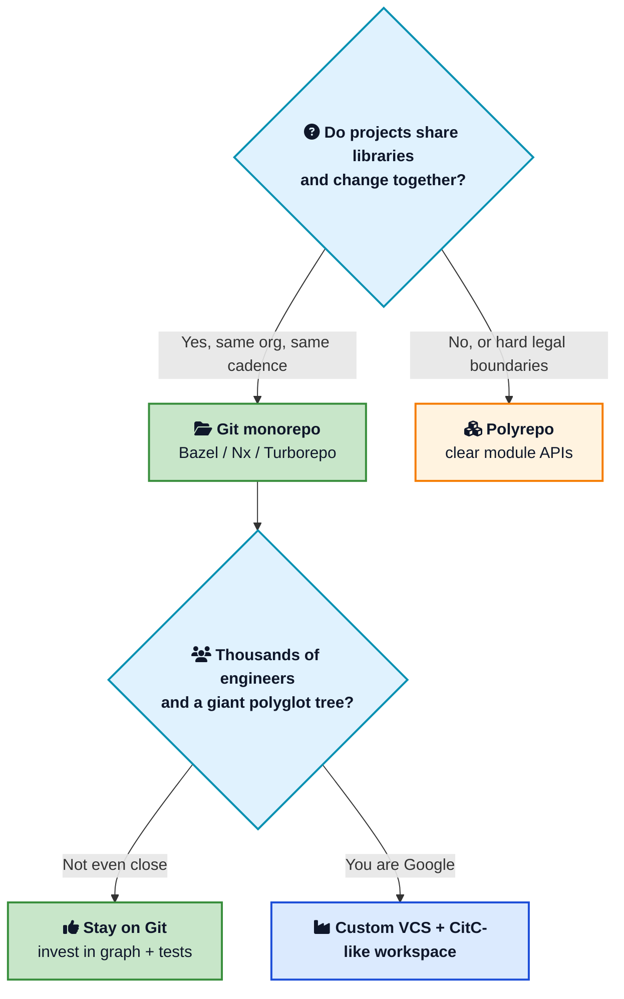

Many companies split code the way they split teams: one Git repository per service, with a package registry in the middle. Google went the other way. Its 2016 CACM paper reported that 95 percent of its software developers used **one tree** containing many projects and shared libraries. The repository is commonly called **google3**.

That scale sounds impractical until you see the machinery under it. Developers do not make a traditional full clone of google3. Google built a custom version control system, a cloud filesystem, a build tool, a code review stack, and a refactoring pipeline that can update an API across the tree. The [2016 CACM paper by Rachel Potvin and Josh Levenberg](https://cacm.acm.org/research/why-google-stores-billions-of-lines-of-code-in-a-single-repository/){:target="_blank" rel="noopener"} remains the most detailed public description. Its statistics are historical, so this post dates them rather than presenting them as current measurements.

This post is a working mental model for **how Google manages its codebase in one [monorepo](/glossary/monorepo/){:target="_blank" rel="noopener"}**: what lives in the tree, how Piper and CitC hide the size, why trunk-based development matters, how Bazel and TAP keep builds reliable, how Rosie handles large cleanups, and which ideas smaller engineering teams can apply. For the Git side of scaling large repositories, read [How GitHub Stores and Serves Git Repositories](/how-github-stores-and-serves-git-repositories/){:target="_blank" rel="noopener"}.



## <i class="fas fa-database"></i> How Big Is the Tree?

The public numbers come from **January 2015** and were published in CACM in 2016. They are a historical snapshot, not a 2026 census.

| Snapshot (Jan 2015) | Figure |
|---|---|
| Total files (including history, branches, deleted paths, docs, data) | about 1 billion |
| Unique source files | about 9 million |
| Lines of code | about 2 billion |
| History | about 35 million commits over 18 years |
| On-disk size | about 86 TB |
| Human commits on a typical workday | about 16,000 |
| Automated commits on a typical workday | about 24,000 |
| Peak read QPS to the repo | about 800,000 |
| Engineers using the tree | more than 25,000 |

Two details matter more than the round numbers. First, **most commits were automated**: formatters, generators, large-scale cleanups, and dependency updates. Second, **most read traffic came from machines**: the distributed build and test fleet, not people opening files in an editor.

Google adopted this structure in 1999 when it moved from CVS to Perforce and chose not to split the codebase into many depots. Perforce plus custom caches lasted more than ten years on one primary machine. Continued growth led Google to build Piper.

Android and Chrome are notable exceptions. The paper says they used **Git** outside google3 because external partners and open source contributors needed to collaborate. Android alone was divided into more than 800 repositories at the time.

## <i class="fas fa-sitemap"></i> A Monorepo Is Not a Monolith

Google's shared repository contains many projects that can be built and released independently, including [microservices](/glossary/microservices/){:target="_blank" rel="noopener"}. The shared tree lets those projects use a library at the same revision and allows a breaking library change to update its callers in the same logical migration.

A [modular monolith](/modular-monolith-architecture/){:target="_blank" rel="noopener"} is a different bet: one deployable with hard module boundaries. You can put a modular monolith in a monorepo. You can also put twenty services in twenty GitHub repos. Google's lesson is not "ship one binary." It is "do not pretend independently versioned libraries will stay compatible by email."



## <i class="fas fa-cloud"></i> Piper and CitC: Version Control as a Service

Git usually stores a repository as data that developers clone. Google stores google3 as a **distributed service**. This is the key distinction.

**Piper** is the service that holds the canonical history. The 2016 paper describes it as originally built on Bigtable and later implemented on [Spanner](/how-google-ads-scales-with-spanner/){:target="_blank" rel="noopener"}. At the time, Piper ran across **ten data centers**, using [Paxos](/distributed-systems/paxos/){:target="_blank" rel="noopener"} [consensus](/glossary/consensus/){:target="_blank" rel="noopener"} to keep replicas consistent. Caching and asynchronous work hid much of the network latency, but the cloud toolchain expected developers to be **online**. That is a different trade-off from Git's offline-first workflow.

Piper provides file-level access control. Most of the tree is readable by Google developers, while sensitive paths use stricter access control lists. Reads and writes are logged. If sensitive data is committed by mistake, Piper can purge the file, and administrators can check whether anyone accessed it.

**CitC** (Clients in the Cloud) is a Linux FUSE filesystem with a cloud backend. Developers see the entire tree as directories, but unmodified files are not copied to the workstation. Only changed files live in the workspace overlay. The paper reported that more than 80 percent of Piper users used CitC and that an average workspace held **fewer than ten modified files**. Snapshots of those writes lived in the cloud, so developers could switch machines, recover an earlier edit, or share uncommitted work for review.

That last point is easy to miss. Because modified files live in CitC, the **build system, test farm, CodeSearch, and Critique** can all see a changelist before it hits trunk. A developer can send a review and enable auto-commit; the system submits the change after approval and successful tests, even when the author is offline.

The paper also describes local Piper workspaces and limited Git interoperability. If you want a picture of how Git solves the related "do not download everything" problem with partial clone and sparse checkout, see [How Git Stores Data Internally](/how-git-stores-data-internally/){:target="_blank" rel="noopener"} and the GitHub scaling post above. CitC's model goes further: it presents the repository through a filesystem instead of a conventional clone.



Piper presents one logical tree even though its storage and replicas are distributed across many machines. The monorepo is logically centralized, not physically confined to one server.

## <i class="fas fa-code-branch"></i> Trunk-Based Development at Company Scale

Google's published workflow uses one mainline. People work at **head**. A changelist is reviewed, tested, and submitted, then becomes visible to other developers. Branching is uncommon, which avoids long-lived development branches drifting away from the mainline.

That is [trunk-based development](https://trunkbaseddevelopment.com/){:target="_blank" rel="noopener"} taken as far as it will go. It is the same direction [GitHub Flow](/git-flow-vs-github-flow/){:target="_blank" rel="noopener"} points, just with even shorter-lived local work and a much stronger test net. Unfinished product behavior is gated with [feature flags](/feature-flags-guide/){:target="_blank" rel="noopener"}, so trunk stays releasable even when a UI is half done.

Why be this strict? Because the benefits of a monorepo collapse if every team sits on a private fork of the world. You cannot do atomic API changes. You cannot run one compiler version. You cannot search "who calls this" and trust the answer. The CACM paper is explicit: **one serial history** is what makes the rest of the tooling possible.

The repository history also contains release branches, but daily development happens on the trunk.

## <i class="fas fa-project-diagram"></i> Why One Version of Everything Wins

If you have used Maven, npm, or pip for a few years, you already know the [diamond dependency](/glossary/diamond-dependency/){:target="_blank" rel="noopener"} problem. App P depends on libraries A and B. A needs C 1.4. B needs C 2.1. The build picks a version, vendors two copies, or explodes. Either way, types cannot cross the A/B boundary safely.

Google generally keeps **one version of each internal dependency** at head. Teams do not independently pin different versions of shared libraries such as Protocol Buffers, Guava, or Abseil. When the compiler team changes a default, the migration can update the toolchain and affected code together.

That is also the cost. An upgrade is a **company-wide migration**, not a PR in one repo. Google pays that cost on purpose, with tests and Rosie, because the alternative is a combinatorial explosion of version pairs that no one can test.

Atomic changes are the other half. In a polyrepo, renaming a function means: change the library, cut a release, bump dependents, hope CI order does not strand anyone on the old name. In google3, a well-structured change can update the definition and the call sites together. When the change is too big for one commit (merge conflicts, Piper limits, review load), it is still logically one migration, executed as shards.

Code sharing follows from visibility. Developers can search the tree, jump to definitions, and learn from patterns in another team's directory. OWNERS files still route reviews to people who know that code. Most code is visible, while sensitive algorithms and configuration can use tighter access controls.

## <i class="fas fa-hammer"></i> Blaze, Bazel, and Hermetic Builds

A monorepo without a real build graph quickly becomes slow and difficult to manage. Google's internal build system is **Blaze**. Its open source counterpart is **[Bazel](https://bazel.build/){:target="_blank" rel="noopener"}**.

Three properties matter:

1. **Declared dependencies.** BUILD files list sources, deps, and outputs. Hidden `#include` of a random header is a bug, not a feature. The graph is the API between teams.
2. **Hermetic builds.** The same inputs should produce the same outputs. Tools, flags, and files are part of the action key. That is what makes a remote cache safe.
3. **Incrementality.** A change rebuilds the targets that depend on it, not the universe. Remote execution spreads those actions across a farm.

That is why a 9-million-file tree does not imply a 9-million-file compile. You touch a utility, Blaze walks the reverse deps, and the cache returns everything else. This is also why Google can afford one version of a library: the test graph is known, so TAP can ask "what breaks if this header changes?"

Outside Google, Bazel offers the same core ideas for Git repositories and polyglot codebases. JavaScript-heavy teams may choose **Nx** or **Turborepo**, which add dependency-aware task scheduling and caching with less build-language setup. The important parts are an accurate graph and a trustworthy cache.

Enterprise DevOps conversations love to jump to Jenkins or GitHub Actions here. Those are **orchestrators**. They do not replace a dependency graph. Google's TAP is closer to a global continuous integration service that already knows Blaze targets than to a YAML file per repo.

## <i class="fas fa-clipboard-check"></i> Critique, CodeSearch, Tricorder, TAP

The CACM paper names the daily tools in one breath. They are not optional add-ons. They are how a tree this size stays readable.

**Critique** is code review. Every change to trunk goes through it. Reviewers come from OWNERS files. Comments, suggested edits, and "looks good to me" live on the changelist, not in a side channel.

**CodeSearch** is the index. Jump to definition, find references, blame, and even tiny edits (typo in a comment) without leaving the browser. Combined with CitC, a drive-by fix can auto-commit after review.

**Tricorder** is static analysis at review time. It is not a linter you run when you remember. Findings show up on the Critique thread, often with one-click fixes. That is how deprecations stick: a checker yells when someone adds a new call to the old API after Rosie spent a month deleting the last thousand.

**Presubmits** are project-specific gates: tests, allowed dependencies, style. Heterogeneous checks are a tax on large-scale changes, so Google keeps pushing teams toward shared defaults.

**TAP**, the Test Automation Platform, provides post-submit continuous integration for most of google3. Running the entire test corpus for every commit is impractical when commits arrive more than once a second. A 2017 paper on TAP described **milestone** batches cut about every 45 minutes at peak, **800,000 builds**, and **150 million test runs** per day across more than 13,000 projects. Its supporting tools identify culprit changes and can perform an **automatic rollback**. Flaky tests at that volume waste shared compute and delay migrations.

Releases themselves are a separate system (internally **Rapid**), not TAP. TAP says "head is healthy." Release automation says "this binary can go to prod."

## <i class="fas fa-truck"></i> Rosie and Large-Scale Changes

The unglamorous secret of google3 is janitorial work. Compiler upgrades, API replacements, clang-format, deleting a deprecated flag: each one can touch hundreds of thousands of files.

Google stopped pretending those land as one atomic commit. [Software Engineering at Google](https://abseil.io/resources/swe-book/html/ch22.html){:target="_blank" rel="noopener"} defines a **large-scale change (LSC)** as a logically related set of edits that cannot practically submit as one unit. Merge conflicts, Piper limits, and review time all get worse as the patch grows.

**Rosie** is the platform for that. An author generates the full transformation with compiler-based tools (ClangMR, Refaster, Kythe-backed rewrites) or even a carefully reviewed regex. Rosie **shards** the patch along project and OWNERS boundaries, then runs each shard through test, mail, review, and submit on its own. Global approvers often review mechanical shards so every team is not asked to re-learn the same five-line pattern.

The social deal is as important as the bot. Product teams do not get an unfunded mandate to "please migrate by Q4." Infrastructure teams, who already know the old API, do the edits. Local OWNERS still see the change. They rarely hold a veto over an approved cleanup. Haunted directories with no tests are the real blocker, which is why Google treats missing tests as a company risk, not a local style choice.



## <i class="fas fa-exclamation-triangle"></i> Trade-offs Google Identified

The CACM paper also describes the costs of this model.

**Tooling cost.** Piper, CitC, Blaze, TAP, Rosie, Kythe, Critique: this is a product org inside the company. A 50-person startup cannot staff it.

**Fragility at head.** One bad commit can theoretically break downstream teams you have never met. The mitigation is tests, not isolation. When tests lag, pain is global.

**Codebase complexity.** Easy sharing means easy tight coupling. Visibility without module rules becomes a ball of mud. Google fights this with language visibility, BUILD deps, and review, not with separate repos.

**Online-only workflow.** CitC assumes network. That is a cultural and technical constraint.

**Binary size and dependencies.** Because anything can depend on anything that is visible, dependency graphs can bloat. Build hygiene is a continuous project.

**Not Git.** Piper cannot use the full ecosystem of Git-based tools. The paper describes only limited Git interoperability, while Android and Chrome use Git outside google3 for external collaboration.

## <i class="fas fa-balance-scale"></i> Monorepo vs Polyrepo: What to Copy

Here is the honest comparison for a team that does not own Spanner.

| Question | Google-style monorepo | Polyrepo (typical GitHub) |
|---|---|---|
| Cross-project API change | One CL, or Rosie shards | Many PRs, version bumps, coordination |
| Library versions | One at head | Many, diamond dependencies common |
| Clone / sync | CitC overlay, no full clone | `git clone`, partial clone if you are careful |
| Build | Blaze graph + remote cache | Per-repo CI, easy to forget dependents |
| Access control | Path ACLs + OWNERS | Repo permissions, simple and coarse |
| Open source / vendors | Needs Git interoperability or separate repositories | Natural |
| Staffing | Dedicated developer infrastructure | Mostly GitHub Actions or GitLab CI |

Copy these ideas even if you stay on Git:

- **One version of internal libraries** when you can. A small private package registry with "only the latest" is closer to Google than five major versions in production.
- **A build graph that knows dependents.** Bazel, Nx, Gradle, or Pants. Do not rely on humans to remember who imports a package.
- **Short-lived branches and flags.** Trunk-based development scales down, while long-lived branch models add coordination. See [Git Flow vs GitHub Flow](/git-flow-vs-github-flow/){:target="_blank" rel="noopener"}.
- **Mechanical large changes.** Even a 200-file rename should be scripted, tested, and split by ownership, not hand-edited.
- **Static analysis in review**, not as a weekly cleanup ticket.

Do not copy these until the pain is real:

- A custom VCS.
- A global FUSE workspace.
- A company-wide TAP.
- Forcing unrelated products (your mobile SDK and your payroll app) into one repo just to say you have a monorepo.

A reasonable middle path for a web shop is a **Git monorepo** with workspaces, remote cache, and CI that runs affected targets only. When a piece must be open source or has a separate compliance boundary, give it its own repo and treat it like Google treats Chrome.

## <i class="fas fa-flag-checkered"></i> Wrapping Up

Google's monorepo is more than putting everything in one folder. It is a bet that **one shared snapshot is easier to manage than a web of independent versions**, provided the company invests in storage, workspaces, build graphs, tests, and automated maintenance.

In Google's published design, Piper and Spanner keep the tree consistent across data centers. CitC avoids a full local copy. Trunk-based development keeps engineers on one current revision. Blaze identifies what a change affects, while Critique, Tricorder, TAP, and Rosie support review, testing, and large-scale maintenance. Android and Chrome show why a different layout can be better when external contributors need standard Git workflows.

If you take one thing into your next design review, take this: **pick a source layout that matches how your code changes**, then pay for the tooling that layout requires. A monorepo without a graph is a trap. A polyrepo without a version policy is a slower trap. Google paid the first bill at a scale most of us will never see, and published enough of the map that we do not have to guess.

---

**Related posts:**

- [How GitHub Stores and Serves Git Repositories](/how-github-stores-and-serves-git-repositories/){:target="_blank" rel="noopener"} - How Git scales huge trees without Piper
- [How Git Stores Data Internally](/how-git-stores-data-internally/){:target="_blank" rel="noopener"} - Why a full clone fights a billion-file repo
- [Git Flow vs GitHub Flow](/git-flow-vs-github-flow/){:target="_blank" rel="noopener"} - Trunk-based development compared with the branching models most teams use
- [Feature Flags Guide](/feature-flags-guide/){:target="_blank" rel="noopener"} - How unfinished work stays off the user while landing on trunk
- [How Google Ads Scales with Spanner](/how-google-ads-scales-with-spanner/){:target="_blank" rel="noopener"} - The database under Piper's replicas
- [Modular Monolith Architecture](/modular-monolith-architecture/){:target="_blank" rel="noopener"} - Runtime modularity, which is not the same as a monorepo
- [Paxos](/distributed-systems/paxos/){:target="_blank" rel="noopener"} - How Piper replicas agree on head
- [GitHub Actions: CI/CD Basics](/github-actions-basics-cicd-automation/){:target="_blank" rel="noopener"} - What TAP looks like when your CI is still YAML

*Further reading: [Why Google Stores Billions of Lines of Code in a Single Repository](https://cacm.acm.org/research/why-google-stores-billions-of-lines-of-code-in-a-single-repository/){:target="_blank" rel="noopener"} (Potvin and Levenberg), the [Google Research copy](https://research.google.com/pubs/pub45424.html){:target="_blank" rel="noopener"}, [Software Engineering at Google, Large-Scale Changes](https://abseil.io/resources/swe-book/html/ch22.html){:target="_blank" rel="noopener"}, the [Bazel](https://bazel.build/){:target="_blank" rel="noopener"} docs, and [Trunk Based Development](https://trunkbaseddevelopment.com/){:target="_blank" rel="noopener"}.*
