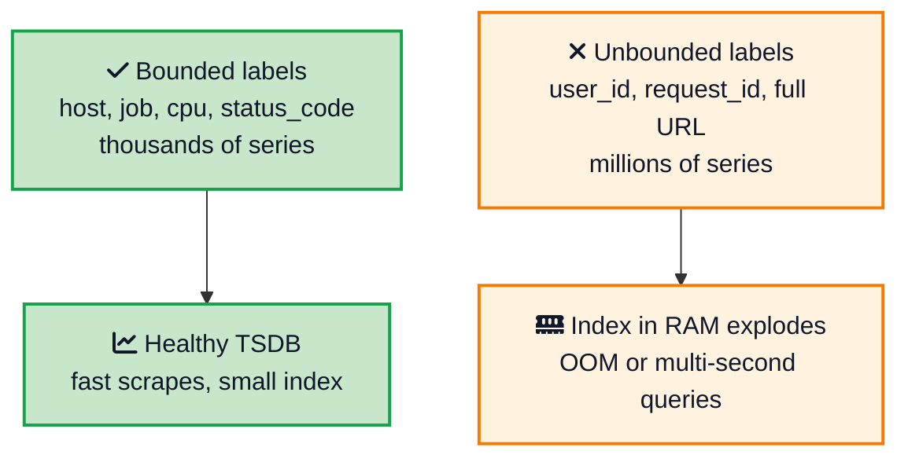
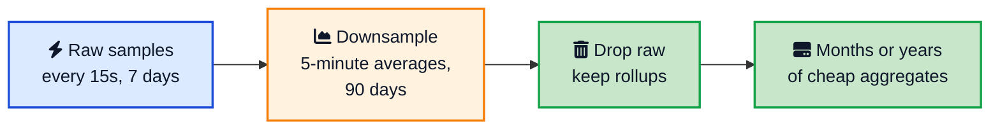

Your API is fine. PostgreSQL is not. The `metrics` table that started as a weekend experiment is now 40 GB, the index on `created_at` is bigger than the table, and `SELECT avg(cpu) WHERE time > now() - interval '1 hour'` takes twelve seconds. You did not pick the wrong query. You pointed a firehose of timestamps at a database that is built to update rows, not to swallow them.

A **time series database (TSDB)** exists for that shape of work. It stores measurements that always come with a time, compresses them hard, answers "what happened in this window" quickly, and throws away or rolls up old points so the disk does not grow forever. This post explains how that works, why cardinality will hurt you before write rate does, and how to choose between [InfluxDB](https://www.influxdata.com/){:target="_blank" rel="noopener"}, [TimescaleDB](https://www.timescale.com/){:target="_blank" rel="noopener"}, [Prometheus](https://prometheus.io/){:target="_blank" rel="noopener"}, and a [columnar database](/columnar-databases-explained/){:target="_blank" rel="noopener"} like ClickHouse.



## <i class="fas fa-question-circle"></i> What a Time Series Database Actually Is

A time series is a sequence of values ordered by time. Each point is small:

```
(timestamp, series identity, value)
```

The series identity is a name plus tags. A CPU metric looks like `cpu_usage{host="api-3", cpu="0"}`. An IoT sensor looks like `temperature{device="plant-14", room="cold-store"}`. The value is usually a number. Sometimes it is several fields at the same timestamp, like temperature and humidity together.

Two properties make this different from an orders table:

1. **You almost never update the past.** A sample that already landed stays put. New data is newer data.
2. **You almost always query a time range.** "Last five minutes", "yesterday", "this month". Point lookups by primary key are rare. Aggregations over a window are the default.

That is the whole job. A TSDB is a database whose storage engine, indexes, and query language are built around those two facts. It is not a general-purpose store with a timestamp column bolted on.

Time series data shows up in two flavors:

- **Regular metrics**, sampled on a clock: CPU every 15 seconds, a temperature probe every minute. Prometheus is built for this.
- **Irregular events**, which fire when something happens: a click, a trade, a sensor that only reports on change. InfluxDB and TimescaleDB handle both. You often roll events into regular buckets for dashboards.

## <i class="fas fa-database"></i> Why PostgreSQL Starts to Hurt

You can put timestamps in PostgreSQL. Plenty of teams do, and for a while it works. The pain is structural, not a missing index.

A row store like Postgres keeps whole rows together and maintains a [B-tree index](/database-indexing-explained/){:target="_blank" rel="noopener"} on the time column. Every insert updates that index. At a few thousand points per second the B-tree becomes a random-write machine: leaf pages split, the index bloats, and autovacuum never quite catches the heap. Time-range queries still work, but they read far more than the few columns you need, and last year's raw rows sit on disk because nothing is dropping them.

A TSDB flips those defaults:

| What you need | Postgres (row store) | Time series database |
|---|---|---|
| Writes | Inserts into a heap plus B-tree | Append to a log, then a time chunk |
| Layout | Whole rows together | Points grouped by series and time |
| Compression | Possible, not the default | First-class, often 1 to 2 bytes per sample |
| Old data | You write a job | Retention policy or chunk drop |
| Typical query | `WHERE id = ...` | `WHERE time BETWEEN ... AND ...` |

Postgres is still the right first stop. Partition the table by month, put a BRIN index on time, and you can go surprisingly far. The signal to move is when ingest, index bloat, or "we never read data older than 14 days" become the actual problem, not a slow report you could fix with a [columnar analytics store](/columnar-databases-explained/){:target="_blank" rel="noopener"}.

## <i class="fas fa-sitemap"></i> How a TSDB Stores Data

Under the hood most TSDBs look similar, even when the query language is different.

```mermaid
flowchart LR
    SRC["fa:fa-microchip Sensors, apps,<br/>and exporters"] --> IN["fa:fa-download Ingest<br/>push or pull"]
    IN --> WAL["fa:fa-stream Write-ahead log<br/>plus memtable"]
    WAL --> PART["fa:fa-layer-group Time partitions<br/>chunks or blocks"]
    PART --> COMP["fa:fa-compress Compressed<br/>columnar samples"]
    COMP --> Q["fa:fa-chart-line Time-range<br/>queries"]

    classDef src fill:#dbeafe,stroke:#1d4ed8,stroke-width:2px,color:#0f172a
    classDef in fill:#e0f2fe,stroke:#0891b2,stroke-width:2px,color:#0f172a
    classDef wal fill:#fff3e0,stroke:#f57c00,stroke-width:2px,color:#0f172a
    classDef part fill:#c8e6c9,stroke:#16a34a,stroke-width:2px,color:#0f172a

    class SRC src
    class IN in
    class WAL wal
    class PART,COMP,Q part
```





**Ingest** is either pull or push. Prometheus scrapes HTTP endpoints on a schedule. InfluxDB, TimescaleDB, and most IoT pipelines accept writes (line protocol, SQL inserts, or Kafka). The [OpenTelemetry Collector](/opentelemetry-production-guide/){:target="_blank" rel="noopener"} can feed either style.

**Durability** still starts with a [write-ahead log](/distributed-systems/write-ahead-log/){:target="_blank" rel="noopener"}. The newest block lives in memory. The WAL is what you replay after a crash, the same idea as any serious database.

**Time partitions** are the real trick. Prometheus groups samples into two-hour blocks, then compacts those into larger blocks up to 31 days. TimescaleDB splits a hypertable into chunks (often about a week). InfluxDB 3 writes columnar Parquet files keyed by time. A query for "the last hour" opens one or two chunks and ignores the rest. That is [sharding](/glossary/sharding/){:target="_blank" rel="noopener"} along time, and it is why range scans stay cheap as the dataset grows.

**Compression** is why a year of metrics fits on a laptop disk. Consecutive timestamps in one series are almost evenly spaced, so you store the first time and then small deltas. Values change slowly, so XOR or run-length encoding shrinks them. Facebook's [Gorilla paper](https://www.vldb.org/pvldb/vol8/p1816-teller.pdf){:target="_blank" rel="noopener"} showed you can land around 1.4 bytes per sample in memory. Prometheus quotes 1 to 2 bytes per sample on disk. TimescaleDB's columnstore compression on older chunks often claims 90%+ savings. A row of `(timestamptz, text, float8)` in Postgres is tens of bytes before indexes. That gap is the whole point of a TSDB.

Many TSDBs use an [LSM tree](/glossary/lsm-tree/){:target="_blank" rel="noopener"} or an LSM-like merge of immutable files (InfluxDB's older TSM engine, VictoriaMetrics parts, Prometheus block compaction). Writes stay sequential. Reads pay for that with bloom filters and compaction, which is a trade you want on a write-heavy stream.

A query then does three cheap things:

1. Pick the time chunks that overlap the range.
2. Use the inverted index (metric name plus tags) to pick series.
3. Scan only those compressed sample columns.

Compare that with `SELECT avg(cpu) FROM metrics WHERE created_at > now() - interval '1 hour'`, which in an unpartitioned Postgres table may still walk a huge B-tree and then heap-fetch rows.

TimescaleDB makes the same idea look like SQL:

```sql
CREATE TABLE sensor_readings (
  time        TIMESTAMPTZ NOT NULL,
  sensor_id   TEXT NOT NULL,
  temperature DOUBLE PRECISION,
  humidity    DOUBLE PRECISION
) WITH (
  timescaledb.hypertable,
  timescaledb.partition_column = 'time'
);

SELECT time_bucket('5 minutes', time) AS bucket,
       sensor_id,
       avg(temperature) AS avg_temp
FROM sensor_readings
WHERE time > NOW() - INTERVAL '1 hour'
GROUP BY bucket, sensor_id
ORDER BY bucket;
```

The table looks normal. Underneath, inserts land in the current chunk, old chunks compress, and `time_bucket` is the primitive you would otherwise write with `date_trunc` and a lot of care.

Prometheus says the same thing in PromQL:

```promql
avg by (sensor_id) (avg_over_time(temperature[5m]))
```

## <i class="fas fa-exclamation-triangle"></i> Cardinality: The Thing That Actually Kills You

Write rate is the number people quote. Cardinality is the number that takes the process down.

A **time series** is one unique combination of metric name and tags. These are two series, not one:

```
cpu_usage{host="api-3", cpu="0"}
cpu_usage{host="api-3", cpu="1"}
```

That is fine. A hundred hosts times 8 CPUs is 800 series. Each series has a small in-memory index entry and a compressed sample stream. TSDBs are built for hundreds of thousands, even millions, of series.

They are not built for this:

```
http_requests{path="/users/48291/orders/17", user_id="48291"}
```

Every URL and every user is a new series. One busy API can create tens of millions of series in an afternoon. The inverted index no longer fits in memory, scrapes get slow, and query latency falls off a cliff. This is a **cardinality explosion**. The [OpenTelemetry production guide](/opentelemetry-production-guide/){:target="_blank" rel="noopener"} calls out the same trap: putting `user.id` or a full URL on a metric label.



The rule is simple. Tags must have a known, small set of values: region, env, job, status code, device type. High-cardinality fields belong in logs or traces, or in a regular table you join later (TimescaleDB can do that join). They do not belong on the series key.

InfluxDB 3's rewrite on Apache Arrow and Parquet is partly a response to this: older TSM engines paid a heavy RAM tax per series. Prometheus still wants you to keep series counts honest. No engine makes `user_id` as a label a good idea.

## <i class="fas fa-trash-alt"></i> Retention, Downsampling, and TTL

Time series without a deletion story is a disk that only grows. TSDBs assume most raw samples have a short useful life.





Three knobs show up in every product, under different names:

- **Retention** is a [TTL](/glossary/ttl/){:target="_blank" rel="noopener"} on raw data. Prometheus defaults to 15 days (`--storage.tsdb.retention.time=15d`). TimescaleDB drops old chunks. InfluxDB has retention periods per bucket. Amazon Timestream moves hot data from memory to magnetic storage, then expires it.
- **Downsampling** (rollups, continuous aggregates, recording rules) replaces 15-second raw points with 5-minute averages. You keep the shape of the graph and throw away the noise. Prometheus recording rules, TimescaleDB continuous aggregates, and InfluxDB scheduled aggregations all do this.
- **Tiering** keeps yesterday fast and last year cheap. Timestream's memory vs magnetic stores, VictoriaMetrics' cold parts, and "remote write to object storage" (Mimir, Thanos) are the same idea.

If you skip this, you will pay for a warehouse of points nobody queries. Set retention on day one, even if the number is generous.

## <i class="fas fa-balance-scale"></i> InfluxDB vs TimescaleDB vs Prometheus

These three are the names you will actually choose between. A few others sit around them.

| | Prometheus | TimescaleDB | InfluxDB 3 |
|---|---|---|---|
| What it is | Local monitoring TSDB | Postgres extension | Purpose-built TSDB |
| Ingest | Pull (scrape) | SQL inserts / COPY | Push (line protocol, SQL) |
| Query | PromQL | SQL | SQL and InfluxQL |
| Joins to business data | No | Yes, normal Postgres | Limited |
| Clustering | Not built in | Postgres HA, then scale-out | Object storage / clustered editions |
| Default retention | 15 days | You configure chunk drop | Per-database policies |
| Best at | Kubernetes, cloud monitoring | Metrics plus relational context | IoT, events, high ingest |
| Awkward at | Years of history, events | Extreme ingest vs specialists | Teams that only know SQL and Postgres |

**Prometheus** is the cloud-native monitoring standard. You run it next to your cluster, it scrapes `/metrics`, Grafana talks PromQL, and alerting rules fire. The [local TSDB](https://prometheus.io/docs/prometheus/latest/storage/){:target="_blank" rel="noopener"} is a single node: durable enough for ops, not a clustered database. When you outgrow 15 days or one disk, you remote-write to [Grafana Mimir](https://grafana.com/oss/mimir/){:target="_blank" rel="noopener"}, Thanos, or [VictoriaMetrics](https://docs.victoriametrics.com/){:target="_blank" rel="noopener"}. VictoriaMetrics in particular is the usual "Prometheus, but cheaper to store and actually clustered" answer.

**TimescaleDB** is for teams who refuse to leave PostgreSQL. A hypertable auto-partitions by time. You keep ORMs, `psql`, logical replication, and joins from `sensor_readings` to a `devices` table. Compression and continuous aggregates give you TSDB behaviors without a new query language. The cost is that you still operate Postgres: vacuum, WAL, one primary writer on the classic path. If your question is "average temperature joined to the plant that owns this sensor," this is the comfortable choice. The company behind it now brands the cloud product as Tiger Cloud.

**InfluxDB** is the specialist. Version 3 is a rewrite in Rust on Apache Arrow, DataFusion, and Parquet, aimed at high cardinality and object storage. You push points (Telegraf, IoT gateways, apps), tag them, and query with SQL. It is a strong fit when ingest is the product: factories, fleets of devices, product analytics that look like metrics. The catch is three generations (1.x, 2.x with Flux, 3.x with SQL). New work should start on 3.

Around them:

- **ClickHouse** is the [columnar](/columnar-databases-explained/){:target="_blank" rel="noopener"} hammer for "billions of events, dashboards, GROUP BY." Many observability companies store logs and traces there. It is not PromQL and it is not a scrape target.
- **QuestDB** is a SQL TSDB focused on ingest speed, with `SAMPLE BY` for time buckets and the Postgres wire protocol.
- **Amazon Timestream** is the AWS managed option: serverless LiveAnalytics, or Timestream for InfluxDB if you want that engine as a database as a service. Useful when you already live in AWS IoT, Kinesis, and Grafana on Amazon.
- **Wide column stores** like Cassandra are still used as a homemade TSDB (partition by device, cluster by time). That works at huge write volume if you know the queries. You then rebuild compression, rollups, and a query language yourself. The [wide column stores guide](/wide-column-stores-explained/){:target="_blank" rel="noopener"} covers that model. Prefer a real TSDB unless you already run Cassandra for this access pattern.

## <i class="fas fa-bug"></i> Mistakes Teams Make

### Using unbounded labels

This is the outage that looks like "the metrics system is down." It is usually one new label. Ban `user_id`, `request_id`, emails, and raw URLs on metrics. Use route templates (`/users/:id`) and put the rest in logs.

### Treating Prometheus as a warehouse

Prometheus will keep data for 15 days unless you change it, and it will not replicate itself. Back it up with snapshots, or remote-write. Do not point finance at six months of PromQL history on a local SSD.

### Skipping retention

A TSDB without a TTL is a very expensive way to store noise. Decide what raw resolution you need (7 days? 30?) and what rollup you need after that. Then encode it in the database, not in a wiki.

### Updating the past

TSDBs assume append. Late data happens (a sensor with a bad clock, a batch upload). Occasional backfill is fine. A workload that rewrites yesterday all day is an OLTP workload wearing a timestamp. Use Postgres.

### Building a TSDB on Cassandra because writes are fast

A [wide column store](/wide-column-stores-explained/){:target="_blank" rel="noopener"} can ingest a firehose. You still have to invent compression, downsampling, PromQL or SQL, and Grafana. That is years of work that InfluxDB, TimescaleDB, and ClickHouse already did. Use Cassandra when the access pattern is already "partition by id, cluster by time" for application data, not because someone said "time series."

### Putting the app in the TSDB

User accounts, shopping carts, and permissions do not belong here. TSDBs are weak at updates, unique constraints across arbitrary columns, and multi-row transactions (except TimescaleDB, because it is still Postgres). Keep OLTP on a row store. If dashboards need both, TimescaleDB or a CDC pipe into ClickHouse is the usual split, the same instinct as [CQRS](/cqrs-pattern-guide/){:target="_blank" rel="noopener"}.

## <i class="fas fa-flag-checkered"></i> Wrapping Up

A time series database is a specialist for append-only, time-ordered data. It partitions on time, compresses each series down to a couple of bytes, and forgets or rolls up the past so the interesting window stays fast. That is why your Grafana board can scan an hour of CPU across a thousand pods in milliseconds, and why the same shape of query on an unpartitioned Postgres table feels stuck.

The product names are less important than the workload. Prometheus is how you monitor. TimescaleDB is how you keep SQL. InfluxDB is how you swallow a push firehose. ClickHouse is how you analyze events at warehouse scale. Amazon Timestream is how you buy that as a managed service on AWS. Start from the query you run ten times a day and the labels you are tempted to add. If those labels are unbounded, no TSDB will save you. If they are tight and the data is a clock plus a number, a time series database is the right tool, and PostgreSQL can stop pretending to be one.

---

**Related posts:**

- [Columnar Databases Explained](/columnar-databases-explained/){:target="_blank" rel="noopener"} - The storage layout ClickHouse uses when time series is really analytics
- [Wide Column Stores Explained](/wide-column-stores-explained/){:target="_blank" rel="noopener"} - Cassandra-style partitions, the homemade TSDB people reach for too early
- [How Databases Store Data Internally](/how-databases-store-data-internally/){:target="_blank" rel="noopener"} - Pages, WAL, and why row stores fight a metrics firehose
- [Database Indexing Explained](/database-indexing-explained/){:target="_blank" rel="noopener"} - B-tree vs BRIN, and how far Postgres can go before you need a TSDB
- [PostgreSQL vs MongoDB vs DynamoDB](/postgresql-vs-mongodb-vs-dynamodb/){:target="_blank" rel="noopener"} - Picking a general-purpose store when the data is not a time series
- [OpenTelemetry Production Setup](/opentelemetry-production-guide/){:target="_blank" rel="noopener"} - How metrics get into Prometheus without exploding cardinality
- [Vector Database Deep Dive](/vector-database-deep-dive/){:target="_blank" rel="noopener"} - Another specialized database, for a completely different query shape
- [Write-Ahead Log Explained](/distributed-systems/write-ahead-log/){:target="_blank" rel="noopener"} - The durability trick every TSDB still uses

*Further reading: InfluxData on [why time series matters](https://www.influxdata.com/time-series-database/){:target="_blank" rel="noopener"}, the [Prometheus storage docs](https://prometheus.io/docs/prometheus/latest/storage/){:target="_blank" rel="noopener"}, Tiger Data on [hypertables](https://docs.tigerdata.com/use-timescale/latest/hypertables){:target="_blank" rel="noopener"}, the [InfluxDB 3 docs](https://docs.influxdata.com/influxdb3/){:target="_blank" rel="noopener"}, Facebook's [Gorilla paper](https://www.vldb.org/pvldb/vol8/p1816-teller.pdf){:target="_blank" rel="noopener"}, and AWS on [Amazon Timestream](https://docs.aws.amazon.com/timestream/latest/developerguide/what-is-timestream.html){:target="_blank" rel="noopener"}.*
