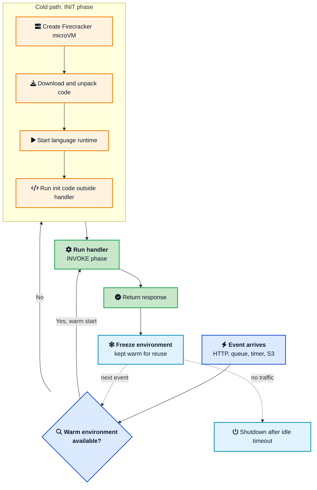
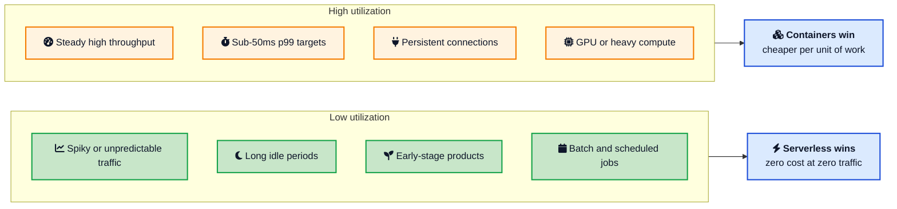
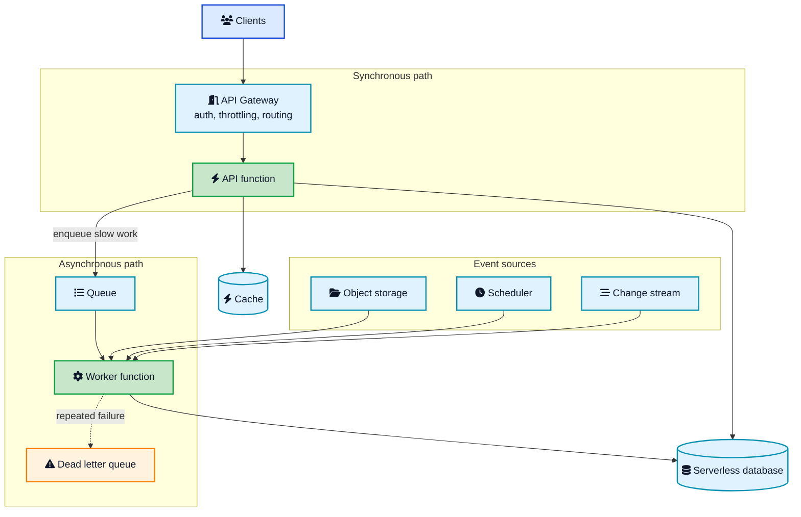

The first time I deployed a function and watched it handle a traffic spike without me touching a single config file, it felt like cheating. No instances to size, no autoscaling group to tune, no 3 a.m. page about a node running out of memory. Then the bill for a chatty background job arrived, a database fell over during a fan-out, and I learned that serverless does not remove operational problems. It moves them somewhere else and changes their shape.

That is the honest version of **serverless computing**, and it is the version this post is about. Not the marketing pitch, and not the backlash either. We will go through what serverless actually means, what happens inside the platform when your function runs, why cold starts exist and how to cut them, how the pricing genuinely works out against containers, the architecture patterns that hold up in production, and the specific workloads where reaching for serverless is a mistake.



## <i class="fas fa-question-circle"></i> What Serverless Actually Means

Serverless is a terrible name for a genuinely useful idea. There are servers. Plenty of them. What is gone is your relationship with them.

A serverless platform gives you four properties together:

- **No capacity management.** You do not pick instance types, set replica counts, or configure an autoscaler. You declare how much memory one execution gets and the platform handles the rest.
- **Scale to zero.** When nothing triggers your code, nothing runs, and nothing is billed. This is the property that changes the economics.
- **Per-use billing.** You pay for requests and for execution time measured in GB-seconds, not for a machine sitting there hoping to be useful.
- **Event-driven invocation.** Code runs in response to something: an HTTP request, a queue message, an object landing in a bucket, a schedule, a database change stream.

The most visible form is **Functions as a Service (FaaS)**: AWS Lambda, Azure Functions, Google Cloud Run functions, Cloudflare Workers, Vercel Functions. You ship a handler, you wire it to a trigger, the platform does the rest.

But serverless is broader than functions. A managed database that bills per request and scales to zero is serverless. So is an object store, a serverless message broker, or a managed search service. The pattern holds across the stack: **no capacity to manage, pay for what you use**. Most real architectures mix a few functions with a pile of serverless managed services, and the managed services usually do more of the heavy lifting than the functions do.

### Serverless is not the same as microservices

These two get conflated constantly, and it causes real design mistakes.

[Microservices](/glossary/microservices/){:target="_blank" rel="noopener"} is about **how you split a system**: independently deployable services with their own data and their own release cycle. Serverless is about **how units of work get executed and billed**. They are orthogonal. You can run microservices on Kubernetes. You can build a serverless monolith where one function handles every route through a normal web framework, which is a perfectly reasonable pattern often called the "lambdalith". And you can run a [modular monolith](/modular-monolith-architecture/){:target="_blank" rel="noopener"} with a handful of serverless functions bolted on for async work.

Choosing serverless does not commit you to a hundred tiny functions. That decision is separate, and splitting too early costs you the same way splitting microservices too early does.

## <i class="fas fa-cogs"></i> What Happens When Your Function Runs

This is the part most tutorials skip, and it is the part that explains every strange behavior you will hit later.

When you invoke a function, the platform needs an **execution environment**: an isolated sandbox with your code and a language runtime in it. Finding or building that environment is the whole story.

On AWS Lambda, each concurrent execution runs inside a [Firecracker](https://firecracker-microvm.github.io/){:target="_blank" rel="noopener"} microVM. Firecracker is a minimal virtual machine monitor built at AWS specifically for this job, stripped down to a virtio network device, a virtio block device, and a small Linux kernel. It gives you hardware-level isolation between tenants at something close to container startup speed. The [Firecracker NSDI paper](https://www.usenix.org/conference/nsdi20/presentation/agache){:target="_blank" rel="noopener"} is worth reading if you want the design details.

Here is the lifecycle, which AWS documents as [three phases](https://docs.aws.amazon.com/lambda/latest/dg/lambda-runtime-environment.html){:target="_blank" rel="noopener"}: Init, Invoke, and Shutdown.





Three details in that diagram matter more than the rest.

**Init code runs once per environment, not once per request.** Anything at module level, outside your handler, executes during the Init phase and then survives across every subsequent invocation in that environment. This is why you create database clients and load config at module scope: you pay for it once per environment instead of once per request. It is also why a stray `console.log` at module level appears far less often than you expect.

**The environment is frozen, not killed, between invocations.** After your handler returns, the platform suspends the whole sandbox. No timers fire. No background threads run. No `setInterval` ticks. If you kicked off an async operation and did not await it, it simply stops mid-flight and may resume, confusingly, during the next invocation. This freeze behavior has no equivalent in container land and it is the source of the weirdest serverless bugs.

**Deployments invalidate everything.** Every warm environment belongs to a specific function version. Ship a new version and all of them are gone, so your cold start rate spikes right after every deploy. If you are chasing a latency graph that gets worse after each release and then recovers, this is why.

### The other model: isolates instead of VMs

Cloudflare took a different path. Instead of a VM per execution, [Workers run your code in a V8 isolate](https://blog.cloudflare.com/cloud-computing-without-containers/){:target="_blank" rel="noopener"}, the same sandbox mechanism that keeps Chrome browser tabs apart. Hundreds of tenants share a single already-running process, and creating a new isolate takes well under a millisecond because there is no kernel to boot and no runtime to start. Deno Deploy and Fastly Compute use variations of the same idea.

The trade-off is real in both directions:

| | Firecracker microVM (Lambda) | V8 isolate (Workers) |
|---|---|---|
| Cold start | ~100 ms to over 1 s, or 3-8 ms with a snapshot | under 1 ms |
| Memory floor | ~64 MB per environment | ~3 MB per isolate |
| Languages | Anything: Java, Python, Go, Rust, .NET | JavaScript, TypeScript, WebAssembly |
| Isolation boundary | Hardware, via KVM | Software, inside one process |
| Max execution | Up to 15 minutes | Seconds of CPU time |
| Filesystem and syscalls | Full Linux environment | Heavily restricted |

Neither is strictly better. Isolates are the right answer for fast, stateless, latency-sensitive work at the edge. MicroVMs are the right answer when you need a real operating system, a language the isolate model does not support, or hardware-level isolation because you are handling regulated data. And snapshot restore has narrowed the gap enough that raw cold start numbers are no longer the deciding factor they were two years ago.

## <i class="fas fa-snowflake"></i> Cold Starts: The Real Numbers

**Cold start** is the most discussed and most exaggerated topic in serverless. Let us put actual numbers on it.

A cold start is the Init phase you saw above: build sandbox, download code, start runtime, run your init code. AWS's own analysis of production workloads puts cold starts at [under 1% of invocations](https://aws.amazon.com/blogs/compute/understanding-and-remediating-cold-starts-an-aws-lambda-perspective/){:target="_blank" rel="noopener"}, with durations ranging from under 100 ms to over a second. Development and test functions see far more of them than production functions, simply because they are invoked less often, which is exactly why the problem feels worse than it is when you are first evaluating serverless.

What actually drives the number:

- **Runtime.** Node.js, Python, and Go start fast. JVM and .NET functions with big dependency graphs are the slow end, sometimes by an order of magnitude.
- **Package size.** Every megabyte has to be pulled and unpacked into the sandbox. Bundling your whole `node_modules` with the AWS SDK you did not need is the most common self-inflicted wound.
- **Init code.** Opening connections, parsing large config, warming caches, and building heavyweight clients all happen before your handler and all count.
- **Memory setting.** CPU is allocated in proportion to memory on Lambda, so a 128 MB function initializes slower than a 1024 MB one. Bumping memory often makes functions both faster *and* cheaper, because duration drops more than the rate rises.

Since **1 August 2025**, AWS [bills the Init phase for every function configuration](https://aws.amazon.com/blogs/compute/aws-lambda-standardizes-billing-for-init-phase/){:target="_blank" rel="noopener"}, including on-demand ZIP functions on managed runtimes that previously got it free. Cold starts now cost money as well as latency. The practical impact on most bills is small, because the phase is rare, but it removes any excuse for a bloated init.

### Cutting cold starts, in order of effort

1. <i class="fas fa-compress-arrows-alt"></i> **Shrink the package.** Tree-shake, drop dev dependencies, use layers for shared code, and import individual SDK clients rather than the whole SDK. This is free and usually the biggest single win.
2. <i class="fas fa-hourglass-half"></i> **Make init lazy.** Create expensive clients on first use instead of at module load, so a function that only touches one of four downstream services does not pay to build all four.
3. <i class="fas fa-memory"></i> **Raise memory.** Try 512 MB, 1024 MB, and 1769 MB and measure. More CPU often means lower total cost.
4. <i class="fas fa-camera"></i> **Use snapshot restore.** [Lambda SnapStart](https://docs.aws.amazon.com/lambda/latest/dg/snapstart.html){:target="_blank" rel="noopener"} takes an encrypted snapshot of the initialized memory and disk, then restores from it instead of running Init. Available for Java, Python, and .NET, and it turns multi-second JVM cold starts into single-digit milliseconds. Watch out for anything cached in init that must be unique per environment, random seeds and connection state especially.
5. <i class="fas fa-fire"></i> **Provision concurrency.** Keep a pool of environments permanently warm. This works, and it is the right call for a latency-sensitive synchronous API, but it is a standing charge that the free tier does not cover. You have partly rebuilt an always-on fleet, so price it honestly.

One thing to skip: the old "ping your function every five minutes" warming hack. It keeps exactly one environment alive, does nothing for concurrent bursts, pollutes your metrics, and is strictly worse than provisioned concurrency.

## <i class="fas fa-dollar-sign"></i> How Serverless Pricing Really Works

The billing model is simple on the surface and surprising in practice.

[AWS Lambda charges](https://aws.amazon.com/lambda/pricing/){:target="_blank" rel="noopener"} two things: **$0.20 per million requests**, and **duration in GB-seconds** at $0.0000166667 per GB-second on x86, roughly 20% less on Arm (Graviton). The free tier covers one million requests and 400,000 GB-seconds a month, and unlike most free tiers it never expires.

Work a real example. A function with 1 GB of memory, 200 ms average duration, 10 million invocations a month:

```text
Requests:  10,000,000 x $0.0000002              = $2.00
Duration:  10,000,000 x 0.2s x 1GB              = 2,000,000 GB-s
           (2,000,000 - 400,000 free) x $0.0000166667 = $26.67
                                            Total ≈ $28.67/month
```

Thirty dollars to serve ten million requests, with nothing to patch and no capacity to plan. That is genuinely hard to beat.

Now change one variable. Keep the same function but make the traffic steady at 100 requests per second with 500 ms duration. That is about 259 million invocations and 130,000 GB-seconds per day, and you are suddenly looking at a few thousand dollars a month for work that two reserved container instances could do for a fraction of that. Same technology, opposite conclusion.

### The crossover point

The rule of thumb that keeps holding up in practice: **serverless is cheaper below roughly 60% sustained utilization, containers are cheaper above it.**



Two costs people routinely forget when they model this. First, **provisioned concurrency removes the main advantage**, because you are back to paying for idle capacity and the free tier does not apply. Second, **the surrounding services often cost more than the compute**: API Gateway, data transfer, CloudWatch Logs ingestion, and downstream calls regularly dwarf the Lambda line item. Cloud cost optimization on a serverless stack is usually about everything *except* the functions.

The cost that does not show up on any bill is engineering time. A team that would otherwise be running a Kubernetes cluster, doing node upgrades, and tuning an autoscaler is a real expense. For a small team, that saving frequently outweighs a higher compute line.

## <i class="fas fa-sitemap"></i> Serverless Architecture Patterns That Work

Enough theory. Here is the shape of a serverless application that survives production.





The important idea in that diagram is the **split between the synchronous and asynchronous paths**. Anything a user is waiting on goes down the short path: gateway, function, data store, response. Everything else, image processing, emails, report generation, third-party syncs, gets pushed onto a [queue](/role-of-queues-in-system-design/){:target="_blank" rel="noopener"} and handled by a worker function. This keeps user-facing latency small, gives slow work retries and a dead letter queue for free, and stops one flaky downstream service from taking your API down with it.

A few patterns worth knowing by name:

**Fan-out with a queue.** One event lands, a function splits it into many messages, and a worker function scales out to process them in parallel. Extremely powerful and extremely good at destroying whatever sits downstream, which is why reserved concurrency on the worker matters.

**Storage-triggered processing.** A file lands in a bucket, a function picks it up, transcodes or parses it, and writes the result elsewhere. This is the canonical serverless use case and it is still the one that fits best.

**Scheduled jobs.** Cron without a cron server. Perfect for cleanup, aggregation, and report generation, as long as each run finishes inside the timeout.

**Step-based workflows.** When work exceeds 15 minutes or needs retries, branching, and human approval, a state machine such as AWS Step Functions or Azure Durable Functions coordinates many short functions instead of one long one. This is also where the [saga pattern](/saga-pattern-distributed-transactions/){:target="_blank" rel="noopener"} lives in serverless systems: each step has a compensating action, because you have no distributed transaction to roll back.

**Idempotent handlers, always.** Every serverless event source in common use delivers at-least-once. Queues redeliver, retries fire, and the same event *will* arrive twice. An [idempotent receiver](/distributed-systems/idempotent-receiver/){:target="_blank" rel="noopener"} that records processed message IDs and short-circuits duplicates is not optional here, it is table stakes. This is the single most common correctness bug in serverless systems.

## <i class="fas fa-database"></i> The State Problem

Functions are stateless and frozen between invocations, and that collides with almost everything you know about connecting to a database.

### Connection exhaustion

A normal connection pool assumes a small, stable set of long-lived processes serves a lot of traffic. Serverless breaks that assumption completely. The process count is elastic and set by the platform, lifetimes are minutes, and the environment is frozen in between.

The result: **direct connections rise linearly with concurrency**. Five hundred concurrent functions, one connection each, and your Postgres instance with a 500 connection limit falls over. It is not a gradual degradation either. It is fine, fine, fine, and then the first real traffic spike takes the database down and everything that depends on it goes with it.

Worse, the freeze means idle timeouts and keepalives do not behave. No shutdown hook fires when an environment is reclaimed. A socket your pool believes is healthy may have been closed by the database or a NAT gateway minutes ago, and the pool had no running thread to notice.

Three fixes, in order of preference:

1. <i class="fas fa-exchange-alt"></i> **A transaction-mode proxy.** RDS Proxy, PgBouncer, or Supavisor sits between functions and the database and multiplexes many client connections onto a small backend pool. This decouples function concurrency from database connections entirely, which is the only fix that actually solves the problem rather than bounding it.
2. <i class="fas fa-compress"></i> **Reserved concurrency.** Cap how many copies of a function can run at once. This bounds the connection count without solving the coupling, but it is cheap and takes one line of config.
3. <i class="fas fa-cloud"></i> **An HTTP-native data store.** DynamoDB, Firestore, and the HTTP data APIs on modern serverless Postgres offerings have no persistent connection at all. Every request is an independent HTTP call, so the problem disappears at the root. It changes your data model, which is a real cost, but it is the most natural fit.

### Where the rest of your state goes

- **Session and user state** goes in a shared store, never in memory. An in-process cache in a function is per-environment, so your hit rate is unpredictable and invalidation is impossible.
- **Caching** still works, it just moves to a shared tier like Redis or Memcached in front of the database. The [caching strategies](/caching-strategies-explained/){:target="_blank" rel="noopener"} that apply to any distributed system apply here unchanged, and a [TTL](/glossary/ttl/){:target="_blank" rel="noopener"} on every entry matters more when you cannot reach in and flush a local cache.
- **Large files** never travel through the function. Issue a pre-signed URL and let the client upload or download directly from object storage, then react to the storage event.
- **Coordination** between functions goes through a queue, a state machine, or a conditional write in the database. There is no shared memory and no reliable in-process lock.

## <i class="fas fa-balance-scale"></i> When Not to Use Serverless

This section is the one worth reading twice, because the failure mode of serverless is not "it doesn't work", it is "it works beautifully in the demo and badly in production".

**Long-running jobs.** Lambda [caps execution at 15 minutes](https://docs.aws.amazon.com/lambda/latest/dg/configuration-timeout.html){:target="_blank" rel="noopener"}. A large data export, a video encode, or a full reindex does not fit. You can decompose it into steps, and sometimes you should, but if the job is naturally one long stream of work, run it in a container.

**Sustained high throughput.** Past the utilization crossover, you are paying a premium for elasticity you are not using. A service pinned at 80% CPU all day should not be a function.

**Tight tail latency.** If your SLA says p99 under 50 ms, cold starts and platform variance are a problem you will fight forever. Provisioned concurrency helps and costs you the main benefit.

**Persistent connections.** WebSockets, long-lived gRPC streams, and [server-sent events](/server-sent-events-explained/){:target="_blank" rel="noopener"} do not fit a model built around short invocations. Managed WebSocket gateways exist and work, but the connection lives in the gateway, not your function, and that indirection has real cost and complexity.

**Heavy compute and ML inference.** No GPUs on standard function platforms, plus cold starts that have to load model weights. Serverless around the model is great. Serverless as the model server usually is not.

**Very chatty internal services.** Function-to-function synchronous calls multiply cold starts, multiply cost, and multiply failure modes. If two functions always call each other, they probably want to be one function, or one service.

Most real systems land on both sides of this tree, and that is fine. A container fleet for the steady core, functions for the bursty edges and the glue. Treating it as an either-or decision for the entire architecture is the mistake.

## <i class="fas fa-search"></i> Observability and Debugging

Debugging serverless is harder than debugging a monolith, and pretending otherwise sets teams up for a bad first incident.

There is no process to SSH into, no long-lived log file, and no steady-state heap to inspect. A single user request may pass through a gateway, three functions, a queue, and two data stores, each emitting logs to a different place. If you do not build for this, your first production mystery will cost you a week.

What to set up before launch:

- **Distributed tracing, from day one.** [OpenTelemetry](/opentelemetry-production-guide/){:target="_blank" rel="noopener"} or the platform's native tracer, with trace context propagated through every async hop. Getting a trace ID across a queue boundary takes deliberate work: the message needs to carry it. Without that, [distributed tracing](/distributed-tracing-jaeger-vs-tempo-vs-zipkin/){:target="_blank" rel="noopener"} across the async paths simply does not exist.
- **Structured logs with a correlation ID.** JSON, one event per line, with a request or correlation ID stamped on everything. Grepping unstructured logs across a hundred function environments is not a thing you can do.
- **Alarms on the metrics that matter.** Errors, throttles, duration p99, concurrent executions against your quota, dead letter queue depth, and Init duration. That last one is your cold start canary.
- **Log cost control.** CloudWatch Logs ingestion on a chatty function at scale can genuinely cost more than the compute. Sample debug logs, set retention deliberately, and check the line item.

Locally, tools like AWS SAM CLI and LocalStack get you a reasonable inner loop, but they will never fully reproduce IAM, throttling, or concurrency behavior. Budget for a real deployed dev environment.

## <i class="fas fa-shield-alt"></i> Security in a Serverless World

The good news: the provider patches the OS, the runtime, and the hypervisor, which removes a large class of vulnerabilities you would otherwise own. Serverless security is genuinely better on the infrastructure layer.

The bad news: the attack surface moves to configuration and code, and it spreads out.

- **Over-permissive IAM is the top issue.** Every function should have its own role with the minimum permissions it needs. The tempting shortcut, one shared role with broad wildcards, means a single injection flaw in any function compromises everything. Per-function least privilege is tedious and it is the single highest-value thing you will do.
- **Dependencies are your responsibility.** The platform patches the runtime, not your `node_modules`. Serverless makes it easy to end up with dozens of independently versioned dependency trees, so automated scanning matters more, not less.
- **Every event is untrusted input.** Not just HTTP bodies. Queue messages, storage notifications, and database stream records are all attacker-influenceable in some architectures. Validate schemas at the boundary of every function.
- **Secrets belong in a secret manager.** Environment variables are visible to anyone with read access to the function config. Use Secrets Manager, Parameter Store, or Vault, cache the value in init, and rotate.
- **Denial of wallet is real.** Automatic scaling means an attacker cannot easily take you down, but they can run up an enormous bill. [Rate limiting](/dynamic-rate-limiter-system-design/){:target="_blank" rel="noopener"} at the gateway, reserved concurrency caps per function, and billing alarms are the defence. A [DDoS attack](/ddos-attack-and-protection/){:target="_blank" rel="noopener"} against a serverless endpoint targets your invoice rather than your uptime.

## <i class="fas fa-tools"></i> Tooling You Will Actually Use

Serverless applications are defined almost entirely in configuration, which makes infrastructure as code non-negotiable. Clicking through a console to create functions works for exactly one afternoon.

- **AWS SAM** is the lightest option if you are AWS-only. A short YAML template expands to CloudFormation, and `sam local` gives you a usable local invoke.
- **Serverless Framework** is the long-standing multi-cloud choice with a deep plugin ecosystem, useful if you are spread across providers.
- **AWS CDK / Pulumi** let you define infrastructure in TypeScript, Python, or Go. Worth it once your stack is large enough that YAML starts repeating itself.
- **Terraform / OpenTofu** is the right answer when serverless is one part of a larger estate that is already managed there.
- **SST** and **Wrangler** target the newer full-stack and edge-first workflows, with much faster iteration loops.

Whatever you pick, wire deployment into [CI/CD](/github-actions-basics-cicd-automation/){:target="_blank" rel="noopener"} early. Serverless deploys are fast and low-risk, which is exactly the situation where automation pays off immediately.

## <i class="fas fa-chart-line"></i> Where Serverless Stands in 2026

A few things have genuinely changed, and they are worth knowing before you form an opinion from a 2019 blog post.

**Cold starts are largely a solved problem when you care.** Snapshot restore brought microVM startup into the single-digit milliseconds, and isolate-based platforms never had the problem. It is no longer the reason to avoid serverless, it is a thing you configure.

**Serverless containers blurred the line.** AWS Fargate, Google Cloud Run, and Azure Container Apps let you deploy a normal container image with per-second billing and scale to zero, without the 15 minute limit or the packaging constraints. For many teams this is the sweet spot: the serverless operating model with the container programming model.

**The industry stopped treating it as all-or-nothing.** The loud "serverless for everything" phase and the equally loud backlash both burned out. What is left is boring and correct: use it where the workload fits, use containers where it does not, and expect most systems to contain both.

**AI shifted what functions are for.** Model inference itself mostly runs on dedicated GPU capacity. What serverless does in AI systems is orchestrate: routing requests, validating inputs, chaining calls, handling webhooks, running the workflow around the model. Functions became the glue rather than the engine, which is a role they are very good at.

**Managed services carry more weight than functions do.** The biggest operational wins in a modern serverless stack come from serverless databases, queues, and object stores, not from the compute. The function is often the smallest part of the architecture, and that is a sign you built it right.

## <i class="fas fa-flag-checkered"></i> Wrapping Up

Serverless is not magic and it is not a trap. It is a specific trade: you give up control over the runtime, accept a 15 minute ceiling and a cold start on a small slice of requests, and design around statelessness. In return you stop managing capacity entirely and pay nothing when nobody is using your system.

That trade is excellent for event-driven work, bursty traffic, background jobs, glue between managed services, and any product too young to know what its traffic looks like. It is a bad trade for steady high-throughput services, long jobs, persistent connections, and hard tail-latency targets, where a container fleet is simply the better tool.

If you take three things from this post, take these. Design every handler to be idempotent, because the same event will arrive twice. Put a proxy or an HTTP-native store between your functions and any connection-limited database, before the first real traffic spike rather than after. And measure your actual utilization before you argue about cost, because the whole economic case turns on that one number.

Serverless is a tool in the box, not the box. Use it where it fits, and be honest about where it does not.

---

**Related posts:**

- [How Meta Handles Millions of Serverless Function Calls Per Second](/meta-xfaas-serverless-at-scale/){:target="_blank" rel="noopener"} - What serverless looks like at a scale where the platform itself becomes the hard problem
- [Modular Monolith Architecture](/modular-monolith-architecture/){:target="_blank" rel="noopener"} - The alternative to splitting everything into functions on day one
- [Role of Queues in System Design](/role-of-queues-in-system-design/){:target="_blank" rel="noopener"} - The async backbone every serverless architecture depends on
- [Idempotent Receiver](/distributed-systems/idempotent-receiver/){:target="_blank" rel="noopener"} - How to handle the duplicate events your function will definitely receive
- [Caching Strategies Explained](/caching-strategies-explained/){:target="_blank" rel="noopener"} - Where your cache goes once there is no long-lived process to hold it
- [Kubernetes Architecture Explained](/devops/kubernetes-architecture/){:target="_blank" rel="noopener"} - The other side of the trade, for when containers are the right answer
- [OpenTelemetry Production Setup Guide](/opentelemetry-production-guide/){:target="_blank" rel="noopener"} - Tracing that survives async hops between functions
- [Saga Pattern for Distributed Transactions](/saga-pattern-distributed-transactions/){:target="_blank" rel="noopener"} - Coordinating multi-step workflows without distributed transactions

*Further reading: the AWS documentation on the [Lambda execution environment lifecycle](https://docs.aws.amazon.com/lambda/latest/dg/lambda-runtime-environment.html){:target="_blank" rel="noopener"}, the AWS Compute Blog on [understanding and remediating cold starts](https://aws.amazon.com/blogs/compute/understanding-and-remediating-cold-starts-an-aws-lambda-perspective/){:target="_blank" rel="noopener"} and [INIT phase billing](https://aws.amazon.com/blogs/compute/aws-lambda-standardizes-billing-for-init-phase/){:target="_blank" rel="noopener"}, the [Firecracker NSDI paper](https://www.usenix.org/conference/nsdi20/presentation/agache){:target="_blank" rel="noopener"}, and Cloudflare's [Cloud Computing without Containers](https://blog.cloudflare.com/cloud-computing-without-containers/){:target="_blank" rel="noopener"}.*
