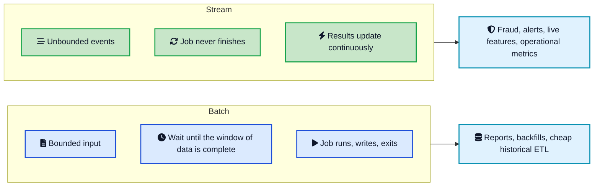
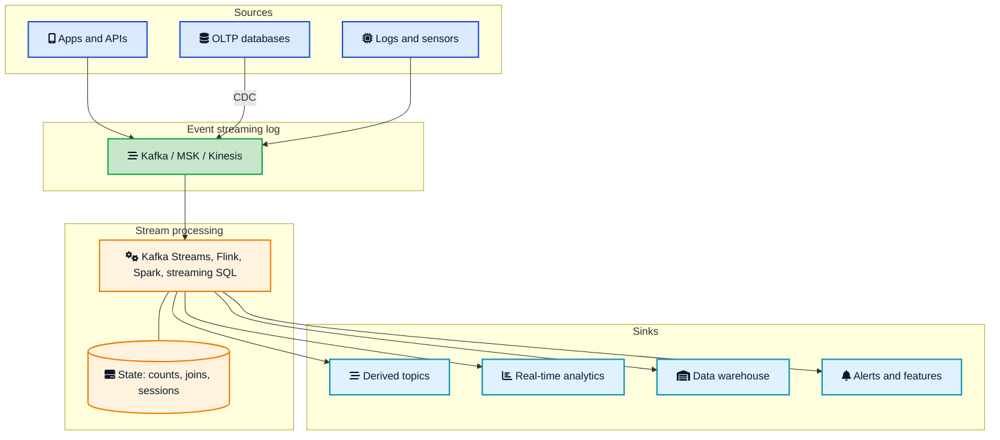
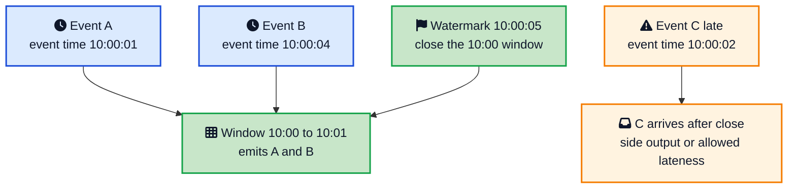
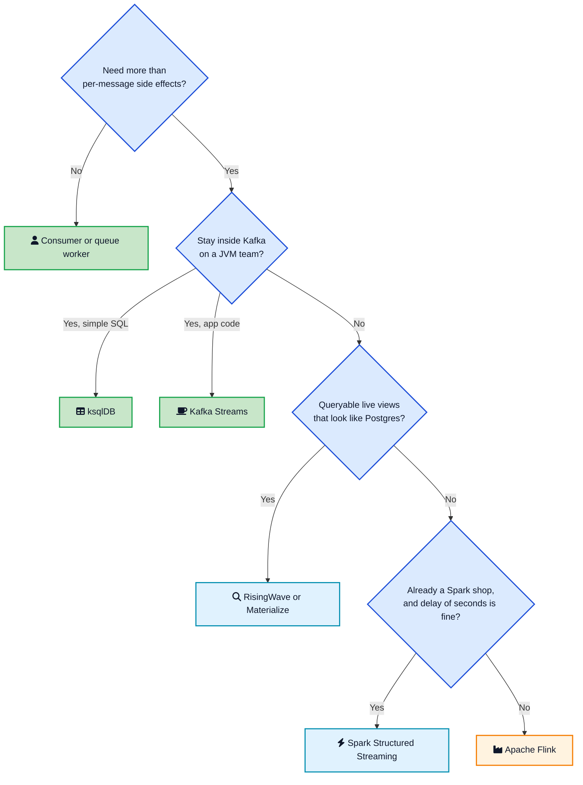

A fraud check that waits for tonight's warehouse load is not a fraud check. By the time the batch finishes, the card is charged, the goods have shipped, and you are writing a post-mortem instead of a decline.

That gap is what **stream processing** is for. You keep a job running all day. Events flow in from clicks, payments, sensors, or database changes. The job updates counts, joins, and alerts as each record arrives, with a lag of seconds rather than hours.

The hard part is not the `map` call. The hard part is time, state, and failure. Events arrive late and out of order. Windows never close unless you tell them to. A restart must not double-count a payment. This post is the version of stream processing you need in production: what it actually is, how a real-time data pipeline is layered, why event time beats the wall clock, how windows and watermarks work, what exactly-once really means, which engine to pick, and the mistakes that take these jobs down.



## <i class="fas fa-question-circle"></i> What Stream Processing Actually Is

Stream processing is a long-running computation over an **unbounded** sequence of events. Unbounded means you never get to the last row. There is always another click, another log line, another `OrderCreated`.

A batch job has a start and a finish. It reads a file, a partition of a table, or yesterday's dump, writes a result, and exits. A stream job is closer to a server. It starts, then it stays up, reading new records forever.

Three properties come with that:

- **Low latency.** Results update as events arrive, often in hundreds of milliseconds to a few seconds, not at the next cron tick.
- **Incremental work.** You do not re-scan the whole history for every new event. You update in-memory or on-disk state: a count, a last-seen timestamp, a join buffer.
- **Time as a first-class input.** Most useful questions are time scoped. Revenue in the last 5 minutes. Sessions that went quiet for 30 minutes. A login from a new country within 10 seconds of a password reset.

Kafka, Amazon Kinesis, and similar systems are **event streaming** logs. They store the events. Stream processing is the layer that *computes* on them. Mixing the two is how a team ends up running a Kafka cluster to do work a queue worker could have done, or writing a consumer loop that quietly becomes an unmaintainable stream processor.

If you want the log itself, start with [How Kafka Works](/distributed-systems/how-kafka-works/){:target="_blank" rel="noopener"}. If you only need to hand work to a worker and delete the message, you want a [message queue](/role-of-queues-in-system-design/){:target="_blank" rel="noopener"}, not a streaming engine.

## <i class="fas fa-layer-group"></i> Stream Processing vs Batch Processing

People frame this as a religious choice. It is a freshness choice.

**Batch processing** is cheaper, easier to retry, and easier to reason about. Spark, dbt, warehouse SQL, overnight ETL: all of these assume a bounded input. You can sort the whole dataset. You can wait for every late file. Cloud data warehouse compute is priced for this shape of work, and it is the right default for reports, backfills, and anything a human looks at the next morning.

**Stream processing** exists because some answers expire. Fraud, inventory, live dashboards, anomaly detection, personalization features, operational alerts. Waiting an hour is the bug.

Tyler Akidau's [Streaming 101](https://www.oreilly.com/radar/the-world-beyond-batch-streaming-101/){:target="_blank" rel="noopener"} put this cleanly years ago: the data is often the same, the difference is when you are willing to emit a result. Google's [Dataflow Model](https://research.google/pubs/the-dataflow-model-a-practical-approach-to-balancing-correctness-latency-and-cost-in-massive-scale-unbounded-out-of-order-data-processing/){:target="_blank" rel="noopener"} then showed that event time, watermarks, windows, and triggers are the vocabulary you need once you stop pretending the stream is a table that already arrived.

Modern engines blur the line on purpose. Flink and Spark Structured Streaming can run the same logic over a bounded file and an unbounded Kafka topic. That is useful for backfills. It does not make streaming free. You still pay for always-on compute, state storage, and an on-call rotation.

A useful rule: if the product owner is happy with a number that is 15 minutes stale, start with batch or a micro-batch. If they need "this payment, this second," you are in stream processing territory.

## <i class="fas fa-sitemap"></i> Anatomy of a Real-Time Data Pipeline

A production pipeline is four layers. Teams get into trouble when they buy one product and expect it to be all four.



**Sources.** User actions, service logs, IoT readings, and change data capture from Postgres or MySQL. CDC is how you turn row changes into a stream without dual writes. The reliable application-level version of that is the [transactional outbox](/transactional-outbox-pattern/){:target="_blank" rel="noopener"} with Debezium reading the [write-ahead log](/distributed-systems/write-ahead-log/){:target="_blank" rel="noopener"}.

**The log.** Almost always Kafka in 2026, or a Kafka-compatible broker, or a cloud native log such as Amazon Kinesis or Azure Event Hubs. This layer is [pub/sub](/glossary/pub-sub/){:target="_blank" rel="noopener"} with retention and replay. Multiple consumer groups can read the same events. That is why Kafka won as the enterprise data platform backbone: analytics, search, and product features all drink from one firehose.

**The processor.** This is the stream processing engine. Stateless jobs filter, map, and fan out. Stateful jobs keep keyed state: running totals, last known user profile, the contents of a window. State lives in memory, spills to RocksDB, and is checkpointed to object storage so a crash does not start from zero.

**Sinks.** Another Kafka topic, a [columnar](/columnar-databases-explained/){:target="_blank" rel="noopener"} store for real-time analytics, a warehouse for the rest of the company, Redis for features, PagerDuty for alerts. The processor should not also be your serving layer unless you picked a streaming database whose whole job is serving.

Managed options sit on this same diagram. Confluent Cloud, Amazon MSK, and Azure Event Hubs cover the log. Confluent Cloud Flink, Amazon Managed Service for Apache Flink, and Databricks cover compute. You still have four layers. Someone else runs two of them.

## <i class="fas fa-clock"></i> Event Time, Processing Time, and Watermarks

This is the concept that separates a toy consumer from a real stream processor.

**Processing time** is the clock on the machine running your operator. A 1-minute processing-time window is "whatever I saw during this minute of wall clock." It is simple. It also changes its answer if the consumer lags, if a partition is paused, or if you replay last Tuesday from Kafka. Replays become a different dataset because the wall clock moved.

**[Event time](/glossary/event-time/){:target="_blank" rel="noopener"}** is a timestamp carried on the record: `occurred_at`, `event_timestamp`, the phone's clock when the tap happened. A 1-minute event-time window is "events whose timestamps fall in that minute," no matter when they arrived. Replaying a topic produces the same windows. Late phones and delayed producers still land in the correct bucket, up to a point.

That point is the **watermark**.

A watermark is a statement flowing with the stream: "I believe there will be no more events with event time `<= T`." When an operator sees `Watermark(T)`, it can close windows that ended at or before `T` and emit their results. [Flink's time docs](https://nightlies.apache.org/flink/flink-docs-stable/docs/concepts/time/){:target="_blank" rel="noopener"} describe it as a trade between latency and completeness. A watermark of `event_time - 5 seconds` emits fast and will miss stragglers. A watermark of `event_time - 5 minutes` waits, then is more complete.



Late events are normal, not a bug. Networks stall. Mobile clients buffer. A producer retries. You pick a policy:

- Drop them.
- Send them to a side output topic for inspection.
- Allow lateness so the window can still update for a while after the watermark.

Do not confuse this watermark with Kafka's [high watermark](/distributed-systems/high-watermark/){:target="_blank" rel="noopener"}. Kafka's high watermark is the offset of the last fully replicated record in a partition. Stream processing watermarks are about event time. Same English word, two different machines.

Assign timestamps on the producer when you can. A server that stamps `now()` at ingest is processing time wearing an event-time field name.

## <i class="fas fa-th"></i> Windows: How You Aggregate an Infinite Stream

You cannot `COUNT(*)` a stream. It never ends. You count *inside a window*.

**Tumbling windows** sit next to each other and do not overlap. Every event belongs to exactly one window. "Count checkouts per minute" is a tumbling window. Simple, cheap, good for dashboards and billing buckets.

**Sliding windows** overlap. A 5-minute window that slides every 1 minute emits a new result each minute, each covering the last five. Good for "rate over the last N minutes" where you want a smooth curve. More state, more emissions.

**Session windows** close after a gap of inactivity. A user browses, goes quiet for 30 minutes, comes back: two sessions. You do not pick the boundaries up front. The data does. This is how product analytics talks about visits.

```mermaid
flowchart TB
    subgraph TUMBLE["Tumbling: 1 minute, no overlap"]
        T1["00:00 to 00:01"]
        T2["00:01 to 00:02"]
        T3["00:02 to 00:03"]
        T1 --- T2 --- T3
    end

    subgraph SLIDE["Sliding: 5 minute window, 1 minute slide"]
        S1["00:00 to 00:05"]
        S2["00:01 to 00:06"]
        S3["00:02 to 00:07"]
        S1 --- S2 --- S3
    end

    subgraph SESS["Session: gap of 30 minutes ends a session"]
        U1["Browse 10:02 to 10:18"]
        GAP["fa:fa-moon Quiet"]
        U2["Browse 10:55 to 11:04"]
        U1 --> GAP --> U2
    end

    classDef a fill:#dbeafe,stroke:#1d4ed8,stroke-width:2px,color:#0f172a
    classDef b fill:#c8e6c9,stroke:#16a34a,stroke-width:2px,color:#0f172a
    classDef c fill:#e0f2fe,stroke:#0891b2,stroke-width:2px,color:#0f172a
    classDef d fill:#fff3e0,stroke:#f57c00,stroke-width:2px,color:#0f172a

    class T1,T2,T3 a
    class S1,S2,S3 b
    class U1,U2 c
    class GAP d
```

Windows can also be count based (every 100 events) but time-based windows are what most product questions want, and they only make sense on event time.

Joins are windows in disguise. A stream-stream join without a time bound stores the world forever, waiting for a match that may never come. Always give the join an interval. Configure state [TTL](/glossary/ttl/){:target="_blank" rel="noopener"} as a backstop even when you think the window already expires keys.

## <i class="fas fa-hdd"></i> State, Checkpoints, and Exactly-Once

Stateless jobs are easy: read, transform, write. Restart anywhere. Scale by adding consumers.

The jobs people actually want are stateful. Fraud needs "how many cards has this device used in 10 minutes." A unique-user count needs HyperLogLog or a set. A join with a user table needs the latest profile per `user_id`. That state is the product.

Flink keeps it in heap for tiny jobs and in RocksDB for everything real. Kafka Streams does the same with changelog topics so state can rebuild from Kafka. Spark Structured Streaming checkpoints offsets and intermediate state to durable storage.

**Checkpointing** is a consistent snapshot of operator state plus input offsets. On failure the job rewinds to the last successful checkpoint and replays. Replay means **duplicates**, unless you planned for them.

Delivery words, without the marketing:

- **At-most-once:** skip on failure. You lose data. Almost nobody wants this for money or audit trails.
- **At-least-once:** replay on failure. You may process twice. This is the honest default of Kafka consumers, queues, and most sinks.
- **Exactly-once in the engine:** state restores so a count is not applied twice *inside the job*. Flink checkpoints and Kafka Streams `EXACTLY_ONCE_V2` aim here.
- **End-to-end exactly-once:** the sink commits with the checkpoint, typically Kafka transactions or a [two-phase commit](/distributed-systems/two-phase-commit/){:target="_blank" rel="noopener"} between the processor and the output. Downstream sees each record once. [Flink's Kafka exactly-once write-up](https://flink.apache.org/2018/02/28/an-overview-of-end-to-end-exactly-once-processing-in-apache-flink-with-apache-kafka-too/){:target="_blank" rel="noopener"} is still the clearest explanation of that protocol.

The catch: transactional sinks commit when the checkpoint completes, so consumers of the output topic see data in checkpoint-sized batches. You traded latency for uniqueness. For many sinks the better design is at-least-once plus an [idempotent receiver](/distributed-systems/idempotent-receiver/){:target="_blank" rel="noopener"}: a unique event id, a uniqueness constraint, a no-op on retry.

HTTP calls, emails, and payment APIs are never covered by a Flink checkpoint. If the side effect is not idempotent, exactly-once config on the job will not save you.

## <i class="fas fa-cogs"></i> Which Engine Should You Use

Pick by the shape of the job, not by a benchmark screenshot.



**A consumer.** One event in, one side effect out, no windows. This is still the right answer for "send this email" and "write this row." Pair it with a queue or a Kafka consumer group and move on.

**Kafka Streams.** A library inside your Java or Scala service. No separate cluster. State is backed by Kafka changelog topics. Perfect for Kafka-to-Kafka streaming ETL: enrich an order with a user table, filter, re-key, write a new topic. [Confluent's concepts guide](https://docs.confluent.io/platform/current/streams/concepts.html){:target="_blank" rel="noopener"} is the canonical map of streams versus tables. ksqlDB is the SQL version of the same idea.

**Apache Flink.** The default heavy engine in 2026 for event-time windows, large state, CEP, CDC, and jobs that read more than Kafka. SQL and the DataStream API share a runtime. You operate TaskManagers, checkpoint storage, and savepoints for upgrades. Use a managed Flink offering unless you already run this well.

**Spark Structured Streaming.** Micro-batches on the Spark engine you already have. Excellent when the team lives in Databricks and a few seconds of delay is fine. Weaker than Flink at fine-grained event-time and very large keyed state, stronger at unifying the lakehouse batch path with a streaming path.

**Streaming databases** (RisingWave, Materialize, ksqlDB to a degree). You declare a materialized view. The engine keeps it incrementally up to date and you query it like a table. This is the right shape when the product is "this dashboard or API must always reflect the latest events" rather than "write a derived topic."

Cloud logs without Kafka in the name still need a processor. Amazon Kinesis Data Streams plus Managed Flink, Azure Event Hubs plus Stream Analytics or Flink, Google Pub/Sub plus Dataflow. Same four layers, different logos.

For choosing the log itself, the [Kafka vs RabbitMQ vs SQS](/kafka-vs-rabbitmq-vs-sqs/){:target="_blank" rel="noopener"} post is the companion to this one.

## <i class="fas fa-industry"></i> What This Looks Like in Production

A concrete job, the kind that shows up in every commerce stack:

1. Orders land on `orders` from the checkout service (or from Debezium on the orders table).
2. A stream processor keys by `shop_id`, tumbling-window counts GMV per minute on event time with a 10 second watermark.
3. It joins each order with a compact `shops` table (Kafka changelog of shop status) and drops cancelled shops.
4. It writes `gmv_per_shop_1m` for dashboards and a separate `gmv_spike_alerts` topic when a shop exceeds a threshold.
5. A warehouse sink copies the same minute buckets for finance, who still want batch truth in the morning.

That is stream processing plus a batch path, not one or the other. Netflix, Uber, and LinkedIn all run this shape: Kafka as the hub, a processor for the low-latency path, a warehouse for the rest. The [role of queues](/role-of-queues-in-system-design/){:target="_blank" rel="noopener"} does not disappear. Task queues still send the email. The stream job decides *whether* the email should exist.

[CQRS](/cqrs-pattern-guide/){:target="_blank" rel="noopener"} projections are the same pattern with a different name: the write model emits events, the stream processor builds a read model.

Stock brokers pushing prices to millions of sockets are mostly fan-out, but the ticker plant that normalizes and filters the exchange feed is a stream processor. See [how stock brokers handle real-time price updates](/how-stock-brokers-handle-real-time-price-updates/){:target="_blank" rel="noopener"} for that path.

## <i class="fas fa-exclamation-triangle"></i> Production Failures You Can Avoid

These are not theoretical. They are the tickets that page you.

**Unbounded state.** A join without an interval, a session window with no gap, an aggregation keyed by a high-cardinality id with no TTL. RocksDB grows until checkpoints take minutes, then fail, then the job restarts into a larger and larger hole. Bound every stateful operator. Watch state size like you watch heap.

**Processing time used by accident.** The first dashboard looks right in staging because traffic is in order and nobody replays. Production has mobile lag and a three-hour replay after a bug, and the counts disagree with finance. Default to event time. Test by replaying a day of Kafka data and asserting the same windows.

**Ignoring backpressure.** If a sink is slow, a healthy engine slows the source. Fighting that with a bigger in-memory buffer just moves the crash. Persistent backpressure means the sink, the join, or a hot key is the problem. Hot keys (one `user_id` with 20 percent of events) need salting or a different model.

**Schema changes with no contract.** Someone removes a field. Every job that parsed it fails in a tight loop. Use a schema registry, default to backward-compatible adds, and put poison messages on a dead letter topic instead of stalling the partition.

**Lag as a vanity metric.** Consumer lag is how many offsets you are behind, not how late the business result is. A job can have near-zero lag and still emit windows 10 minutes late because the watermark is conservative. Alert on watermark delay, checkpoint duration, failed checkpoints, and sink errors, not only on lag.

**Exactly-once as a checkbox.** Turning on transactional Kafka sinks without measuring the commit interval surprises everyone when downstream "real time" is now your checkpoint interval. Measure. Often at-least-once plus idempotent writes is the better product.

**Streaming a problem that is batch.** If the only consumer is a daily email, you built an always-on cluster to replace a query. That bill shows up in cloud cost reviews, and nobody can explain it.

## <i class="fas fa-balance-scale"></i> When Stream Processing Is the Wrong Tool

Skip the streaming engine when:

- Freshness of minutes to hours is fine. Warehouse SQL and scheduled Spark are simpler.
- Volume is hundreds of events per minute and the work is "call this API." A queue worker is the whole architecture.
- You need request/reply. That is RPC, maybe with [RabbitMQ](/kafka-vs-rabbitmq-vs-sqs/){:target="_blank" rel="noopener"} for routing, not a topology of operators.
- The team cannot own a 24/7 job: schemas, lag, state, deploys with savepoints, and replay drills.
- The output is a human report. People do not stare at a 200 ms-fresh PDF.

Use the streaming engine when:

- A wrong answer 10 minutes later costs real money (fraud, inventory, ads bidding, trading features).
- Multiple teams need the same events transformed differently, and a derived topic is the API.
- You are building live product features: "users active now," "items viewed in this session," "anomaly versus the last hour."
- CDC from OLTP must fan out to search, cache, and analytics without polling the primary database.

Start smaller than your pride wants. Many good pipelines are Kafka Streams in the service that already owns the domain. Promote to Flink when state, time, or sources outgrow that.

## <i class="fas fa-flag-checkered"></i> Wrapping Up

Stream processing is how you compute on data that never stops arriving. The log (usually Kafka) remembers the events. The processor turns them into windows, joins, and alerts. Event time and watermarks make those windows correct when the world is late and messy. Checkpoints make crashes boring. Exactly-once is a protocol with costs, not a slogan.

If you take three things, take these. Put a timestamp on the event when it happens, and window on that. Bound every piece of state. Treat a streaming job like a production service with lag, watermarks, checkpoints, and schemas on the dashboard before you celebrate the first correct count in staging.

Batch is still the right tool for most data in the company. Streaming is the right tool for the slice where waiting is the bug.

---

**Related posts:**

- [How Kafka Works](/distributed-systems/how-kafka-works/){:target="_blank" rel="noopener"} - The log that most stream processors read from and write back to
- [Kafka vs RabbitMQ vs SQS](/kafka-vs-rabbitmq-vs-sqs/){:target="_blank" rel="noopener"} - When you need a streaming log versus a work queue
- [Role of Queues in System Design](/role-of-queues-in-system-design/){:target="_blank" rel="noopener"} - Decoupling and backpressure before you add a processing topology
- [Write-Ahead Log](/distributed-systems/write-ahead-log/){:target="_blank" rel="noopener"} - Why Kafka partitions look like a distributed WAL
- [Transactional Outbox Pattern](/transactional-outbox-pattern/){:target="_blank" rel="noopener"} - How database changes become a reliable event stream
- [Idempotent Receiver](/distributed-systems/idempotent-receiver/){:target="_blank" rel="noopener"} - How at-least-once delivery becomes safe at the sink
- [CQRS Pattern Guide](/cqrs-pattern-guide/){:target="_blank" rel="noopener"} - Read models are often just stream processors with a friendlier name
- [Columnar Databases Explained](/columnar-databases-explained/){:target="_blank" rel="noopener"} - Where streaming aggregations often land for real-time analytics
- [High Watermark](/distributed-systems/high-watermark/){:target="_blank" rel="noopener"} - Kafka's watermark, which is not the event-time watermark in this post

*Further reading: Tyler Akidau's [Streaming 101](https://www.oreilly.com/radar/the-world-beyond-batch-streaming-101/){:target="_blank" rel="noopener"} and the [Dataflow Model paper](https://research.google/pubs/the-dataflow-model-a-practical-approach-to-balancing-correctness-latency-and-cost-in-massive-scale-unbounded-out-of-order-data-processing/){:target="_blank" rel="noopener"}, Flink docs on [timely stream processing](https://nightlies.apache.org/flink/flink-docs-stable/docs/concepts/time/){:target="_blank" rel="noopener"} and [applications](https://flink.apache.org/what-is-flink/flink-applications/){:target="_blank" rel="noopener"}, Confluent's [Kafka Streams concepts](https://docs.confluent.io/platform/current/streams/concepts.html){:target="_blank" rel="noopener"}, the Flink blog on [exactly-once with Kafka](https://flink.apache.org/2018/02/28/an-overview-of-end-to-end-exactly-once-processing-in-apache-flink-with-apache-kafka-too/){:target="_blank" rel="noopener"}, the [Apache Kafka documentation](https://kafka.apache.org/documentation/){:target="_blank" rel="noopener"}, and the [Spark Structured Streaming guide](https://spark.apache.org/docs/latest/structured-streaming-programming-guide.html){:target="_blank" rel="noopener"}.*
