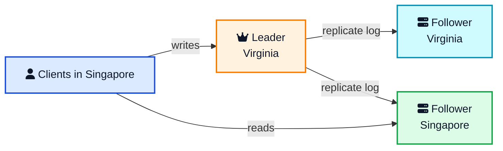
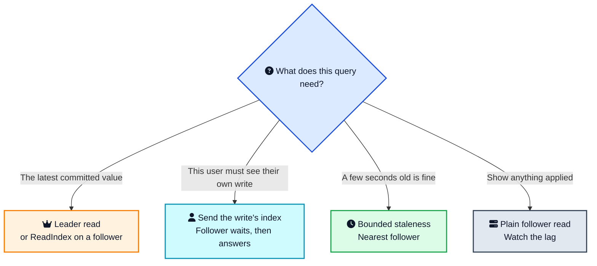
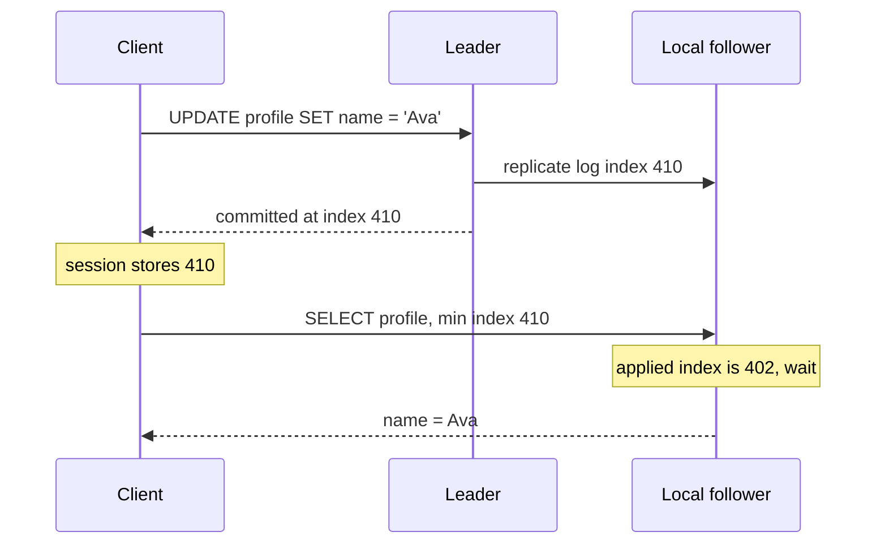

A product page is read hundreds of times for every time someone edits it. If every one of those reads goes to the leader, the leader spends its life answering queries that any copy could have answered, and a user in Singapore waits on a round trip to Virginia for a page that barely changes.

That is the Follower Reads pattern. Writes still go to one [leader](/distributed-systems/leader-follower/){:target="_blank" rel="noopener"}. Reads go to a follower, often the closest one. You get more read throughput and lower latency. You also get a new question you have to answer on purpose: how old is this copy allowed to be?



## <i class="fas fa-question-circle"></i> The Problem: Every Read Hits the Leader

In the [Leader and Followers](/distributed-systems/leader-follower/){:target="_blank" rel="noopener"} pattern, one node orders every change and copies that order to the rest through a [replicated log](/distributed-systems/replicated-log/){:target="_blank" rel="noopener"}. That solves consistency. It creates a traffic problem.

Two kinds of pain show up in production:

1. **The leader runs out of CPU.** Reads and writes share one process. A dashboard, a search box, or a feed can drown the node that is also trying to commit writes.
2. **The leader is far away.** In a multi region cluster the leader lives in one region. Every read from the other regions pays the full cross region round trip, even when a local replica already has the row.

Followers are already there. They received the log so they can take over if the leader dies. Leaving them idle between failovers is a waste. Follower reads put that copy to work.





The green box is the win: the read never leaves the region. The orange box is still the only place a write is allowed to land. Replication flows one way, from leader to followers. If you draw an arrow the other way for a write, you have left the pattern.

## <i class="fas fa-book-reader"></i> What Follower Reads Are

Follower Reads states that write requests go to the leader to keep a single order, and read only requests can go to the nearest follower.

That is the whole pattern. The interesting part is everything you have to get right so that "read from a copy" does not turn into "read a lie."

A follower read has four moving pieces:

1. **A replica that can apply the log.** It might be a PostgreSQL hot standby, a MongoDB secondary, a Kafka follower, a CockroachDB replica, or a TiKV peer. The name on the box changes. The job does not.
2. **A router.** Something picks which replica answers this query: the driver, a proxy, or the database gateway. "Nearest" is a choice, not an accident.
3. **A freshness rule.** The newest point the follower is allowed to show. That might be "whatever you have," "nothing older than 5 seconds," or "at least the write this client just did."
4. **A cutoff for uncommitted data.** The follower must not serve log entries that are still in flight. That cutoff is the [high watermark](/distributed-systems/high-watermark/){:target="_blank" rel="noopener"}.

Miss any one of these and you get a familiar outage. The router sends reads to a replica that is hours behind. Or the follower serves an entry the leader had not committed, the leader dies, and the entry vanishes while the user is staring at it.

## <i class="fas fa-clock"></i> The Catch: The Follower Is Behind

Replication is not instant. The leader appends a write and ships it to followers. With quorum replication it waits until a majority has stored the entry before it tells the client the write succeeded. A follower that was not in that majority, or one that has stored the entry but not applied it yet, can still be behind when the client's next request arrives.

That gap is **replication lag**. It is usually milliseconds. During a bulk load, a network blip, or a follower that is busy with a huge query, it can jump to seconds. Your read path has to have a plan for both.

There is a worse bug than lag. If a follower serves an entry the leader has not yet committed, a failover can erase it. The client saw a row that the cluster then forgot. The high watermark exists to stop that. Followers only serve entries at or below the commit index the leader has announced. Anything above that line is invisible, even if the bytes are already on disk.

So a plain follower read is always a read of the past, even when the past is 2 milliseconds ago. [Linearizability](/glossary/linearizability/){:target="_blank" rel="noopener"}, the guarantee that a read sees the latest completed write, is what you give up when you skip the leader. You can buy it back, and later in this post you will see how a follower checks the leader's commit index first to do exactly that, but it is not what you get by default. [Eventual consistency](/glossary/eventual-consistency/){:target="_blank" rel="noopener"} is the floor: if writes stop, every follower catches up. Production systems usually want something in between those two, not the floor and not the ceiling.

## <i class="fas fa-sliders-h"></i> Four Ways to Read From a Follower

You do not pick one mode for the whole database. You pick it per query. A product page and a balance check do not want the same answer.

| Mode | What the client is promised | What it costs | Where you see it |
|---|---|---|---|
| Plain stale | Whatever this follower has applied | Lowest latency, lag is unbounded unless you add a cutoff | PostgreSQL hot standby, MongoDB `secondary`, etcd serializable read |
| Bounded or exact staleness | Data no older than T, or exactly as of time T | A small, known age. No round trip to the leader if a nearby replica has already caught up past T | CockroachDB `AS OF SYSTEM TIME`, Spanner timestamp bounds |
| Read your writes | This client sees its own latest write. Other clients may still be behind | The follower waits, or the read is redirected, until it passes the client's token | MongoDB causal sessions, an app that waits on a PostgreSQL replay LSN |
| Fresh follower read | The same commit the leader would show | An extra round trip so the follower learns the latest commit index, then a local data read | TiDB follower read, Raft ReadIndex |





Read the diagram from the top every time you add a query. The mistake is picking the bottom box because it is fast, then using it for a check that cannot be wrong. Remaining stock, an account balance, "is this username taken," and "who is the leader" belong in the top box.

## <i class="fas fa-project-diagram"></i> How a Safe Follower Read Works

Three designs cover almost every system. One avoids the leader by reading the past. One waits until the follower has caught up to a client's own write. One asks the leader for the latest commit index, then reads the bytes locally.

### Reading the past: closed timestamps

CockroachDB, and Spanner before it, let a follower answer alone when the read is aimed at a timestamp that is already "closed."

The leader of a range (CockroachDB calls it the leaseholder) moves a marker called the **closed timestamp**. The promise is simple: no new write will be assigned a timestamp at or below that marker. The leader tells followers as the marker moves forward. A follower that has applied every write up to the marker can answer "what did this row look like at time T?" from its own disk, as long as T is at or below the marker.

Ask for `now()` and T is still open, so the follower cannot promise it has every write. Ask for a time a few seconds ago and the marker has usually passed it, so the local replica answers. The age of that answer is the price of not calling the leader.

CockroachDB wraps this in SQL. `follower_read_timestamp()` returns a timestamp far enough in the past that a local replica can usually serve it. The docs say to keep that at least **4.2 seconds** behind the present if you want the read to stay local instead of bouncing to the leaseholder.

```sql
SELECT * FROM products
AS OF SYSTEM TIME follower_read_timestamp()
WHERE sku = 'widget';
```

`with_max_staleness('10s')` is the bounded version. CockroachDB picks the newest timestamp a nearby replica can serve inside that window. It is picky: one statement, one row, and an index that covers the query. A `LIMIT 1` scan that might touch many rows is rejected. Exact staleness is the one you use when the read spans a transaction or more than one row.

```sql
BEGIN;
SET TRANSACTION AS OF SYSTEM TIME follower_read_timestamp();
SELECT * FROM products WHERE sku = 'widget';
SELECT * FROM inventory WHERE sku = 'widget';
COMMIT;
```

Those two statements share one timestamp, so they see one snapshot. You cannot mix this with writes in the same transaction. Follower reads are read only.

There is a second CockroachDB feature that sounds the same and is not. A **global table** can serve low latency reads from every region without a stale timestamp, because writes wait until every region has the data. You pay on the write, not on the read. If writes are rare and reads are everywhere, that trade can be the right one. If writes are common, the stale follower read is usually cheaper.

The clock underneath the timestamp is a [hybrid logical clock](/distributed-systems/hybrid-clock/){:target="_blank" rel="noopener"}. You do not have to read that post to use follower reads. You do need healthy clocks. If a node's clock is far off, the closed timestamp cannot move cleanly and local reads stop being local.

### Waiting for your own write

The second design keeps the read fresh for one client. The client remembers how far the log had gone when its write committed. The next read carries that point. The follower serves the read only after its applied index has caught up.





The wait is the feature. Without it, the same user refreshes and sees the old name, then files a bug saying the save button is broken. With it, a follower that is a few milliseconds behind pauses briefly and then answers. If it is seconds behind, a good router gives up and sends that one read to the leader rather than making the user stare at a spinner.

MongoDB does this with causally consistent sessions. The driver tracks cluster time. A secondary blocks until it has applied that time. That timestamp is a hybrid logical clock. The lesson here is the token: a read your writes guarantee is a number the client carries, not a hope that the replica is fast today.

On PostgreSQL the same number is a WAL position:

```sql
-- primary, after the write commits
SELECT pg_current_wal_lsn();

-- standby, before serving this user's next read
SELECT pg_last_wal_replay_lsn();
```

The application waits until the standby's replay LSN is at least the LSN the primary returned. Then it runs the `SELECT`. That is follower reads with a session token, built from two functions instead of a database feature.

### Fresh data, local bytes: ReadIndex

Sometimes you want the latest value and you still do not want the leader to read the pages. Raft's answer is **ReadIndex**. The follower asks the leader for the current commit index. The leader confirms it is still the leader, usually by hearing back from a majority, replies with the index, and the follower waits until it has applied that index. Then the follower reads its own state machine.

The data comes from the follower. The freshness check still touches the leader, so you pay a round trip. This helps when the payload is large: a big scan, a report, a cross zone transfer of rows. It does little for a point read of one integer, because the extra round trip costs as much as just asking the leader.

TiDB's follower read is this design. `tidb_replica_read = 'closest-adaptive'` keeps small queries on the leader and sends large ones to a replica in the same zone. That split is the practical version of the rule above.

## <i class="fas fa-random"></i> Three Bugs Stale Reads Cause

Chapter 5 of [Designing Data-Intensive Applications](https://dataintensive.net/){:target="_blank" rel="noopener"} names three ways a lagging replica embarrasses you. They are worth memorizing, because each one needs a different fix.

**Read your writes.** You change your display name, the write hits the leader, and the next page load hits a follower that does not have it yet. You see the old name and assume the save failed. Fix: carry the write's index or timestamp, as in the sequence above. Routing this user to the leader for a few seconds after a write also works, and it is what a lot of application code does when the database has no session token.

**Monotonic reads.** You see the new name. You refresh. The load balancer picks a slower follower, and the old name is back. Time moved backwards for one user. Fix: pin the session to one replica, or remember the newest timestamp this client has already observed and refuse an older snapshot. Pinning alone does not give you read your writes. A pinned replica can still be behind the write you just did.

**Consistent prefix.** You see a comment before the post it replies to, because the comment and the post landed on different followers at different times. Fix: read both from the same replica, or read both at one snapshot timestamp. The CockroachDB transaction above pins both statements to a single `AS OF SYSTEM TIME`, so they share one snapshot. Two separate stale reads do not.

If you only remember one rule, make it this: staleness is fine when the user cannot tell, and it is a bug when the user just wrote the value they are now reading.

## <i class="fas fa-map-marker-alt"></i> Send the Read to the Nearest Follower

A fresh follower on another continent is still a slow read. Locality is half the pattern.

The router needs a notion of "close":

- **Zone or rack.** Kafka can fetch from the closest in sync replica so a consumer does not pull bytes across regions. The follower still only serves up to the high watermark, so you do not read uncommitted records. The setting lives in the [replica placement design](https://kafka.apache.org/documentation/#design_replicaplacement){:target="_blank" rel="noopener"}.
- **Latency window.** MongoDB's `nearest` read preference picks a member whose ping is within `localThresholdMS` of the fastest member. It does not prefer the primary. Pair it with `maxStalenessSeconds` if you want the driver to skip a secondary that has fallen too far behind.
- **Zone labels.** TiDB matches the `zone` label on the gateway and the replica, and prefers a local peer when you set `closest-replicas` or `closest-adaptive`.
- **Gateway to closest replica.** CockroachDB's SQL gateway forwards a sufficiently old read to the nearest replica that holds the range, follower or leaseholder.

"Nearest" without a staleness cap is how you end up reading a replica that was partitioned an hour ago and is still accepting connections. Pair it with a max age. Kafka's version of that cap is membership in the in sync replica set, plus the high watermark.

Tags help when nearest is the wrong question. A reporting job should hit a secondary tagged `usage=analytics`, even if a hotter secondary is closer. MongoDB tag sets and PostgreSQL connection strings that point at a dedicated standby are the same idea: not every follower is for every reader.

## <i class="fas fa-database"></i> How Real Systems Expose the Knob

The pattern is one idea. The product names are a pile of settings. This is the map.

### PostgreSQL, RDS, and Aurora

A PostgreSQL standby with `hot_standby = on` accepts queries while it replays the WAL. That is a plain stale follower read. Streaming replication is asynchronous unless you set `synchronous_standby_names`, so lag is whatever the network and the standby's disk are doing right now.

An **AWS RDS read replica** is this design as a managed service. You point reporting and product reads at the replica endpoint and keep writes on the primary. Lag can stretch into seconds under a heavy write burst. Treat it as eventual unless your application waits on the replay LSN.

**Amazon Aurora** is the exception people mix up with RDS. Aurora replicas share the cluster storage volume. They do not copy a second full dataset over the network. AWS documents replica lag as usually much less than 100 milliseconds after the writer commits, and it grows when the write rate spikes. You scale reads by connecting to the **reader endpoint**, which spreads connections across Aurora replicas. Up to 15 readers can sit in the cluster, including in other Availability Zones, and those same readers are the failover targets. Lag under 100 milliseconds is still lag. A read your writes bug can still happen inside that window. It is just a shorter window than a typical RDS replica.

Standby queries can also fight replay. A long `SELECT` on a hot standby either delays WAL replay on that standby or gets cancelled so replay can catch up, and `max_standby_streaming_delay` decides how long the standby waits before it cancels the query. Turning on `hot_standby_feedback` protects those queries instead, by telling the primary to hold off vacuuming rows the standby is still reading. The vacuum side of that fight is covered in [PostgreSQL MVCC and autovacuum](/postgresql-mvcc-autovacuum/){:target="_blank" rel="noopener"}. Teams running PostgreSQL very hot, including the layout in [how OpenAI scales PostgreSQL](/how-openai-scales-postgresql/){:target="_blank" rel="noopener"}, use replicas for exactly this read split.

### MongoDB and MongoDB Atlas

MongoDB calls the choice a **read preference**: `primary`, `primaryPreferred`, `secondary`, `secondaryPreferred`, or `nearest`. Anything except `primary` may return stale data, because secondaries apply the oplog asynchronously. Atlas uses the same replica set rules. The managed part does not remove the lag.

```javascript
db.products.find({ sku: "widget" }).readPref("nearest")
```

Transactions that read must use `primary`. Every statement in the transaction runs on the primary, so a secondary read preference is rejected.

For "the user must see their write," turn on a causally consistent session and use majority write concern plus majority read concern. The [causal consistency docs](https://www.mongodb.com/docs/manual/core/causal-consistency-read-write-concerns/){:target="_blank" rel="noopener"} spell out the guarantee: it holds on secondaries, not only on the primary. That is read your writes without pinning every session to the primary.

### CockroachDB and Spanner

Spanner is where the stale read was designed as a product feature. A strong read contacts the leader. An exact staleness read or a max staleness (bounded) read can be served by a replica that is up to date as of the chosen timestamp. The [timestamp bounds](https://docs.cloud.google.com/spanner/docs/timestamp-bounds){:target="_blank" rel="noopener"} page is the short version.

CockroachDB follows that split, with the SQL shown earlier. Two operational checks are worth knowing:

- `EXPLAIN ANALYZE` prints `used follower read` when the local replica actually served it. If that line is missing, you are paying leader latency and calling it a follower read.
- The metric `follower_reads.success_count` tells you whether the cluster is doing this in volume, or whether one test query worked once.

Exact staleness can still block on a long running write that left an intent at an old timestamp. CockroachDB's docs suggest running those reads in a `HIGH` priority transaction so they are less likely to sit in a wait queue. If your follower reads suddenly get slow, look for a transaction that has been open for a long time before you look at the network.

### TiDB

TiDB does not hand you a stale snapshot for its main follower read feature. It hands you ReadIndex plus a placement policy:

```sql
SET SESSION tidb_replica_read = 'closest-adaptive';
```

`closest-replicas` always prefers the same zone. `closest-adaptive` does that only when the optimizer thinks the read is large enough to pay for the ReadIndex round trip. `follower` and `leader-and-follower` still exist, and current docs point people at the closest variants when the goal is less cross zone traffic.

The cost shows up as CPU on TiKV, not only as latency. Every follower read does a ReadIndex, even if the scan returns one row. That is why the adaptive mode leaves small queries on the leader. Measure read traffic by zone before and after you flip the session variable. If cross zone bytes did not drop, the policy is not matching labels and you are still reading the leader.

### Kafka

Kafka consumers historically fetched only from the partition leader. Follower fetch lets a consumer in the same rack read from a local in sync replica instead. The follower will not serve past the high watermark, so the consumer still sees only committed records. Produce requests stay on the leader. This is a throughput and bandwidth feature. It is not a way to get a newer record than the leader has committed.

### etcd

etcd's default read is linearizable. The member you talk to may have to confirm with the leader, and you pay for that. Set the read consistency to **serializable** and the member can answer from its local applied state without that round trip. The [API guarantees](https://etcd.io/docs/latest/learning/api_guarantees/){:target="_blank" rel="noopener"} say this plainly: serializable reads can be stale, and that is the point.

Do not use the cheap mode for data that elects a leader or grants a lock. A stale view of "who owns this shard" is how you get two writers. The [consistent core](/distributed-systems/consistent-core/){:target="_blank" rel="noopener"} post walks through that failure. Serializable reads belong on values where a slightly older version is still a correct version.

## <i class="fas fa-balance-scale"></i> When to Use Follower Reads

Use them when the read is allowed to be a little old, or when the payload is large enough that serving it locally is worth a freshness check:

- Product pages, user profiles, timelines, and search results.
- Dashboards and reports that already say "as of a few seconds ago."
- Multi region deployments where the reader is not in the leader's region.
- Read heavy keys that would pin one leader core at 100 percent while followers sit idle.
- Large scans you would rather not pull across a zone, even if a ReadIndex round trip is required.

Keep the read on the leader when the result decides a write:

- Balances, inventory counts, and seat maps at the moment of purchase.
- Uniqueness checks.
- Anything inside a read write transaction that must see its own earlier statements. CockroachDB will not even let you combine follower reads with writes in one transaction.
- Metadata about leadership, leases, and membership.

A useful default: after a user writes, send that user's next few reads to the leader or attach a session token. Send everyone else's reads to a local follower. Most of the traffic is "everyone else."

Disaster recovery pulls the other way, and you should notice the tension. The replica you read from is often the replica you will promote when the primary dies. Async replication makes follower reads cheap and makes your recovery point worse, because the promoted replica may be missing the last seconds of writes. Synchronous replication makes the standby closer to the primary, which makes follower reads fresher, and it makes every commit wait on that standby. Pick the lag with both jobs in mind. A replica tuned only for cheap reads can be a poor failover target.

## <i class="fas fa-exclamation-triangle"></i> What Goes Wrong in Production

**Lag with no alarm.** The follower is up, so health checks pass, and it is 40 seconds behind. Users see old prices. Alert on replication lag itself, not only on "is the process alive." Put a ceiling in the client (`maxStalenessSeconds`, a max LSN gap, `with_max_staleness`) so a stuck follower is skipped instead of trusted.

**Serving past the high watermark.** This one loses data from the user's point of view. They saw a write, failover happens, the write was never committed, and it is gone. Followers must learn the commit index from the leader and hide anything above it.

**A partitioned follower that keeps serving.** Bounded staleness systems will keep answering at the last closed timestamp even when the follower cannot reach the leader. That is good for availability and bad if you thought "follower" meant "pretty fresh." The age only grows. If your product cannot show data from ten minutes ago, fail the read when the closed timestamp is too old.

**Clock skew.** Timestamp based follower reads depend on a bound between clocks. A node with a broken clock either stops serving local reads or, worse, serves a time it should not. Monitor the offset, and treat a node that drifts past the cluster's configured maximum as a node that needs fixing, not as a node that needs a wider window.

**Read your writes tested only on one node.** The bug hides when the developer laptop hits one database. It shows up when the pool has five replicas and the read after `POST` lands on a different one. Integration tests should write on the primary and immediately read with the same session against a replica.

**Using follower reads to dodge a missing index.** A slow query on the leader is usually still a slow query on the follower. You moved the pain and added lag. Fix the query, then decide if the read belongs off the leader.

## <i class="fas fa-flag-checkered"></i> Wrapping Up

Follower reads are how a leader and followers cluster survives its own success. The leader stays the only writer. The copies you already pay for start answering queries. Users in other regions stop waiting on a continent they do not live in.

The work is in the promise you attach to each read. Latest, read your writes, bounded staleness, or plain stale. Those are different products wearing one pattern name. Pick per query, carry a token when the user just wrote, and never let a follower serve past the high watermark.

Do that and the leader stops being a single crowded door. It goes back to the job it was elected for: deciding the order of writes, and letting everyone else read the result.

---

**Related posts:**

- [Leader and Followers Pattern](/distributed-systems/leader-follower/){:target="_blank" rel="noopener"} - The replication setup follower reads depend on
- [High Watermark](/distributed-systems/high-watermark/){:target="_blank" rel="noopener"} - The commit index a follower must not read past
- [Hybrid Logical Clock](/distributed-systems/hybrid-clock/){:target="_blank" rel="noopener"} - The timestamp CockroachDB and MongoDB use to order stale reads
- [Replicated Log](/distributed-systems/replicated-log/){:target="_blank" rel="noopener"} - The log followers apply before they can serve a read
- [Consistent Core](/distributed-systems/consistent-core/){:target="_blank" rel="noopener"} - Why metadata reads should stay linearizable
- [How OpenAI Scales PostgreSQL](/how-openai-scales-postgresql/){:target="_blank" rel="noopener"} - Read replicas as the practical version of this pattern
- [PostgreSQL MVCC and Autovacuum](/postgresql-mvcc-autovacuum/){:target="_blank" rel="noopener"} - How long queries on a standby push back on the primary

*Further reading: Unmesh Joshi's [Follower Reads chapter](https://martinfowler.com/articles/patterns-of-distributed-systems/follower-reads.html){:target="_blank" rel="noopener"} in Patterns of Distributed Systems; Chapter 5 of Martin Kleppmann's [Designing Data-Intensive Applications](https://dataintensive.net/){:target="_blank" rel="noopener"}; the [CockroachDB follower reads docs](https://www.cockroachlabs.com/docs/stable/follower-reads.html){:target="_blank" rel="noopener"}; [Spanner timestamp bounds](https://docs.cloud.google.com/spanner/docs/timestamp-bounds){:target="_blank" rel="noopener"}; [TiDB follower read](https://docs.pingcap.com/tidb/stable/follower-read/){:target="_blank" rel="noopener"}; [MongoDB read preference](https://www.mongodb.com/docs/manual/core/read-preference/){:target="_blank" rel="noopener"}; [PostgreSQL hot standby](https://www.postgresql.org/docs/current/hot-standby.html){:target="_blank" rel="noopener"}; and the [Raft paper](https://raft.github.io/raft.pdf){:target="_blank" rel="noopener"} for ReadIndex.*
