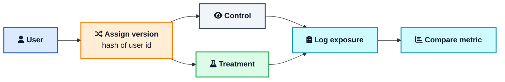
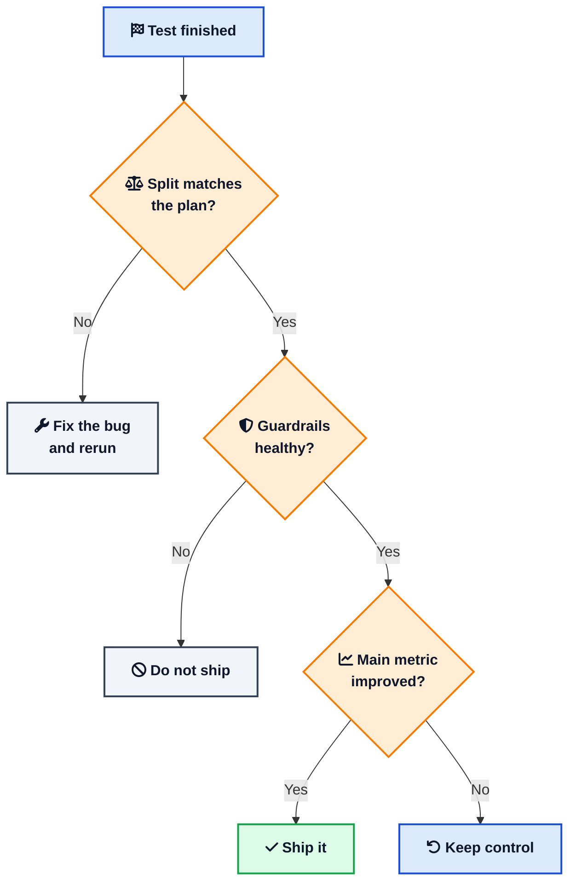

You shipped a new checkout and signups went up. Was it the new checkout, or just a good week? A/B testing answers that. Half your users see the old version, half see the new one, and you compare the results.

This post shows how to build the split, how many users you need, and the mistakes that create fake winners. If you already use [feature flags](/feature-flags-guide/){:target="_blank" rel="noopener"}, you are halfway there.



## <i class="fas fa-flask"></i> What A/B Testing Is

An A/B test splits users into two groups at random:

- **Control** sees what you ship today.
- **Treatment** sees the change.

At the end you compare one metric, like checkout completion or signups per visitor.

The random split is what makes it work. Users who arrive on Thursday behave differently from users who arrive on Sunday. If you only compare before and after, that difference mixes in with your change. With a random split, both groups get the same mix of days, campaigns, and holidays, so the only real difference is your change.

Randomize by **user**, not by page view. If you randomize page views, the same person can see both versions, and the groups blur together.

## <i class="fas fa-toggle-on"></i> A/B Test, Feature Flag, or Canary?

These get mixed up, but they answer different questions.

- **Feature flag:** "Can I ship this code turned off, and turn it on later?"
- **Canary release:** "Did this deploy break anything for a small set of users?"
- **A/B test:** "Is this version better on a metric we care about?"

A flag is often how you deliver the split, and Martin Fowler's [feature toggles article](https://martinfowler.com/articles/feature-toggles.html){:target="_blank" rel="noopener"} lists experiment toggles as one type. The test is the measuring part on top.

## <i class="fas fa-random"></i> How a Test Works

The path is short. A user arrives, gets a version, sees it, and you log that they saw it. Later a job compares the two groups.





Two rules keep this honest:

1. **Keep each user in the same group.** If a user sees the old page today and the new page tomorrow, you cannot tell what caused what.
2. **Log an exposure only when the user reaches the changed code.** If you count everyone who logs in, but only some ever see the new checkout, the extra users hide the real effect.

## <i class="fas fa-user-lock"></i> Assigning Users in Code

The simple way is a hash. Combine the experiment name and the user id, hash them, and use the result to pick a group. Every server gets the same answer, so you do not need to store anything.

```python
import hashlib

def assign(user_id: str, experiment: str) -> str:
    digest = hashlib.sha256(f"{experiment}:{user_id}".encode()).digest()
    bucket = int.from_bytes(digest[:4], "big") % 100
    return "control" if bucket < 50 else "treatment"
```

Then log the exposure right where the change appears:

```python
variant = assign(user_id, "checkout_v2")
log_exposure(user_id, "checkout_v2", variant)

if variant == "treatment":
    return render_new_checkout()
return render_current_checkout()
```

Do not use Python's built-in `hash()`. It changes between processes, so users would flip groups after a restart.

## <i class="fas fa-bullseye"></i> Pick Your Metric First

Decide what you are measuring before the first user is assigned. If you look at twenty charts after the test, one of them will have moved by luck, and it is easy to pretend that was the goal all along.

Use two kinds of metrics:

- **One main metric** that decides the result, such as checkout completion or signup rate.
- **A few guardrail metrics** that catch harm, such as error rate, page speed, or refunds.

The main metric picks the winner. Guardrails can veto it. A button that lifts conversion by 3% but doubles payment errors is not a win.

## <i class="fas fa-calculator"></i> How Many Users You Need

Three ideas matter here, and all are simple.

**[P-value](/glossary/p-value/){:target="_blank" rel="noopener"}** tells you how easily luck alone could have produced your result. Here is an example.

You test a new checkout with 10,000 visitors on each version:

| Version | Visitors | Purchases | Rate |
| --- | --- | --- | --- |
| Control (old checkout) | 10,000 | 1,000 | 10% |
| Treatment (new checkout) | 10,000 | 1,100 | 11% |

Treatment is ahead by one point. But is the new checkout better, or did it just get slightly luckier visitors? To find out, imagine both checkouts are exactly the same and you ran this test many times. Sometimes one side would still come out ahead by chance. The p-value counts how often it would be ahead by one point or more.

Here the p-value is about 0.02. That means if the two checkouts were identical, luck would produce a gap this big only about 2 times in 100. That is rare, so luck is a weak explanation and the new checkout probably helped.

Now keep the same rates but use only 5,000 visitors on each side (500 vs 550 purchases). The gap is still 10% vs 11%, but the p-value jumps to about 0.10. Luck could produce that about 10 times in 100, so you cannot rule it out. Same gap, less data, weaker proof.

One common mistake is to read a p-value of 0.02 as "98% sure the new checkout works." It does not say that. It only says how unlikely your data would be if the checkout made no difference.

**[Statistical significance](/glossary/statistical-significance/){:target="_blank" rel="noopener"}** is the pass mark you set for the p-value before the test. Most teams use 0.05, which means a result passes when the p-value is below 5%. A tiny lift can still pass on a huge sample while being too small to matter, so always look at the size of the lift too.

**[Minimum detectable effect](/glossary/minimum-detectable-effect/){:target="_blank" rel="noopener"}** is the smallest improvement you care about finding. The smaller it is, the more users you need.

This table uses 95% confidence and 80% power, which are the common defaults. You can run your own numbers in [Evan Miller's calculator](https://www.evanmiller.org/ab-testing/sample-size.html){:target="_blank" rel="noopener"}.

| Current rate | Improvement to detect | Users per version |
| --- | --- | --- |
| 10% | to 11% | about 14,800 |
| 5% | to 5.5% | about 31,300 |
| 2% | to 2.2% | about 80,700 |

Lower rates and smaller improvements need far more traffic. If you cannot reach the number in a couple of weeks, test a bigger change or a metric that happens more often.

Also run the test for at least one full week, so weekday and weekend behavior are both included.

## <i class="fas fa-bug"></i> Mistakes That Create Fake Winners

Check these before you trust a result.

**1. Sample ratio mismatch.** [Sample ratio mismatch](/glossary/sample-ratio-mismatch/){:target="_blank" rel="noopener"} means the groups are not the size you planned. On a 50/50 test of 100,000 users, 50,200 vs 49,800 is normal noise. 51,000 vs 49,000 is not. It means assignment or logging has a bug, such as a version that crashes before the exposure is logged or bots landing on one path. Microsoft's paper on [diagnosing sample ratio mismatch](https://www.kdd.org/kdd2019/accepted-papers/view/diagnosing-sample-ratio-mismatch-in-a-b-testing){:target="_blank" rel="noopener"} is the standard reference. If the split is off, throw the result away, fix the bug, and rerun.

**2. Peeking.** If you check the dashboard every day and stop the first time it looks good, you give luck many chances to fool you. The paper [Peeking at A/B Tests](https://arxiv.org/abs/1704.02693){:target="_blank" rel="noopener"} shows this can push the false positive rate well above the 5% you planned for. Either wait for the planned sample size, or use a tool with sequential testing, which is built for repeated checks.

**3. Slicing after the fact.** Split the result by country, device, and browser after the test and one slice will look like a winner. You went looking for it. If you care about a segment, decide that before the test starts.

The order matters. Check the split first, then guardrails, and read the main metric last.



## <i class="fas fa-cogs"></i> Tools

Assigning users is a few lines of code. Trusting the result takes exposure logs, metric definitions, a split check, and a stats engine. Most teams use a tool for that part.

- [Optimizely](https://www.optimizely.com/){:target="_blank" rel="noopener"}: full experimentation platform, popular for conversion rate optimization.
- [Statsig](https://docs.statsig.com/){:target="_blank" rel="noopener"}: product experiments with [sequential testing](https://docs.statsig.com/stats-engine/sequential-testing){:target="_blank" rel="noopener"}.
- [GrowthBook](https://www.growthbook.io/){:target="_blank" rel="noopener"}: open source and works with your own data warehouse.
- [LaunchDarkly](https://launchdarkly.com/){:target="_blank" rel="noopener"}: feature flag management with experiments built in.
- [Eppo](https://www.geteppo.com/){:target="_blank" rel="noopener"}: experiments that run on your warehouse data.

Google Optimize shut down in September 2023, and comparing two date ranges in Google Analytics is not an A/B test. When the test ends, delete the losing code path and the flag so they do not pile up.

## <i class="fas fa-ban"></i> When to Skip a Test

A/B testing is not always the right tool.

- **You do not have enough traffic.** Small sites often cannot detect small lifts. Ship the clear improvement or talk to users.
- **It is a bug fix or a security patch.** You will ship it anyway, so there is nothing to decide.
- **The groups affect each other.** In social feeds and marketplaces, treatment users can change what control users see, which blurs the result.

A good test has a decision attached: "If treatment wins and guardrails hold, we ship it. If not, we keep control." If you would ship it either way, skip the test.

## <i class="fas fa-flag-checkered"></i> Wrapping Up

A/B testing is a little statistics and a lot of careful engineering. Hash a stable user id. Log exposure where the change appears. Pick one main metric and a few guardrails. Size the test up front, run full weeks, check the split, and do not stop early because the chart looks good.

A flat result is still a result. It means you avoided maintaining a change that did not pay off. For the deeper theory, the book [Trustworthy Online Controlled Experiments](https://experimentguide.com/){:target="_blank" rel="noopener"} is the best next step.

---

**Related posts:**

- [Feature Flags and Feature Toggles](/feature-flags-guide/){:target="_blank" rel="noopener"} - Ship code turned off, ramp it up, and remove the flag when the test is over
- [Git Flow vs GitHub Flow](/git-flow-vs-github-flow/){:target="_blank" rel="noopener"} - Branching strategies that pair well with flags and frequent deploys
- [Distributed Tracing: Jaeger vs Tempo vs Zipkin](/distributed-tracing-jaeger-vs-tempo-vs-zipkin/){:target="_blank" rel="noopener"} - Track down an error or latency spike that only shows up in one version

*Further reading: [Trustworthy Online Controlled Experiments](https://experimentguide.com/){:target="_blank" rel="noopener"} by Kohavi, Tang, and Xu, [Evan Miller's sample size calculator](https://www.evanmiller.org/ab-testing/sample-size.html){:target="_blank" rel="noopener"}, Microsoft's [sample ratio mismatch paper](https://www.kdd.org/kdd2019/accepted-papers/view/diagnosing-sample-ratio-mismatch-in-a-b-testing){:target="_blank" rel="noopener"}, [Peeking at A/B Tests](https://arxiv.org/abs/1704.02693){:target="_blank" rel="noopener"}, and [Feature Toggles](https://martinfowler.com/articles/feature-toggles.html){:target="_blank" rel="noopener"} on Martin Fowler's site.*
