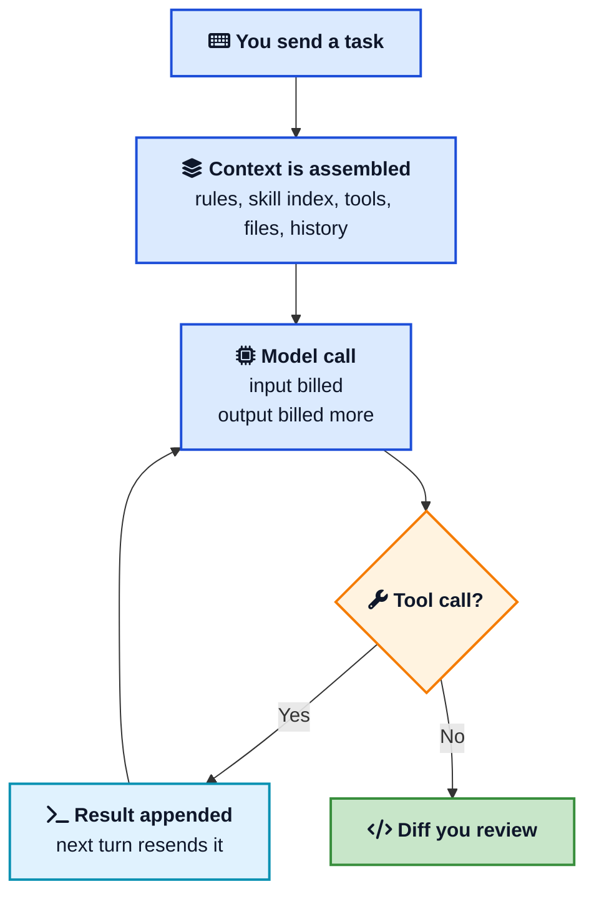
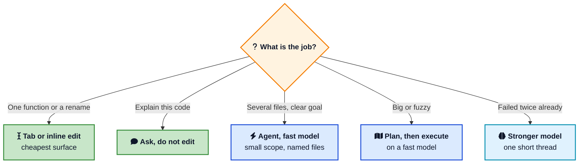

A $20 coding plan used to mean a $20 month. In 2026 the subscription is the cover charge. Chat, code review, and agent runs draw tokens, and tokens draw the real bill. One afternoon of a frontier model looping on a large repo can spend a month of included usage.

The same three levers show up in Cursor, GitHub Copilot, and Claude Code: which surface you use, which model you pick, and how much text you resend on every turn. This post is the practical version of that, with October 2026 prices and the habits that move them. If you want the editor workflow first, start with [how to use Cursor](/how-to-use-cursor/){:target="_blank" rel="noopener"} and [getting the most out of AI coding assistants](/ai-coding-assistants-guide/){:target="_blank" rel="noopener"}.



## <i class="fas fa-coins"></i> Where the Bill Actually Comes From

Vendors bill three kinds of tokens.

- **Input tokens** are everything you send: the system prompt, rules, tool definitions, the files you attached, and the earlier turns of the chat.
- **Output tokens** are what the model writes back. On current Claude prices this is several times the input rate. Sonnet 5.5 is $2 per million input tokens and $10 per million output tokens. Opus 5.5 is $4 and $20.
- **Cached tokens** are a repeated prefix the provider already processed. A cache read is much cheaper than a fresh input. On Sonnet 5.5 a cache read is $0.20 per million tokens, which is 10% of the input price. On Opus 5.5 it is also $0.20, which is 5% of that model's input price.

Prices below are list prices from [Anthropic](https://platform.claude.com/docs/en/about-claude/pricing){:target="_blank" rel="noopener"}, [Cursor](https://cursor.com/docs/models-and-pricing){:target="_blank" rel="noopener"}, and [GitHub](https://docs.github.com/en/copilot/concepts/billing/usage-based-billing-for-individuals){:target="_blank" rel="noopener"} as of early October 2026. They move. The ratios are the part that stays useful: output costs more than input, and a cache hit costs a fraction of a fresh read.

Here is one turn on Claude Sonnet 5.5 with 40,000 input tokens and 2,000 output tokens.

| | Fresh input | With a 30,000 token cache hit |
|---|---|---|
| Input | 40,000 × $2 / 1M = $0.08 | 30,000 × $0.20 / 1M + 10,000 × $2 / 1M = $0.026 |
| Output | 2,000 × $10 / 1M = $0.02 | $0.02 |
| **One turn** | **$0.10** | **$0.046** |

If every turn stayed that size, twenty turns would be about $2.00 fresh, or about $0.92 with the prefix cached. Real threads grow, so later turns cost more than the first. The same uncached turn on Claude Fable 5.1, at $10 input and $50 output per million, is about $0.50. Thirty of those is $15, which is the entire monthly AI credit allotment on Copilot Pro (1,500 credits at $0.01 each).

The trap is that an agent does not send 40,000 tokens once. Each tool call appends a result, and the next call resends the thread. Turn 15 is carrying turns 1 through 14. That is why a "quick look at the repo" becomes the line item, and why [how an LLM generates text](/how-llms-generate-text/){:target="_blank" rel="noopener"} matters to your invoice: you pay for every token the model reads and every token it writes.



## <i class="fas fa-mouse-pointer"></i> Use the Cheap Surface First

The model picker is the second decision. The first is whether you need an agent at all.

**Tab and inline edit** handle a function, a rename, a test, a comment. Copilot does not bill completions or next-edit suggestions in AI credits on paid plans. Cursor includes unlimited Tab on Pro and above. This is the work you should refuse to "agent."

**Ask or Chat** is for questions. "Where is checkout validated?" should not open files and run the test suite. You pay for the answer, then you stop.

**Agent** is for a change that crosses files, or a chore you would otherwise do by hand for twenty minutes. It can read, edit, and run commands. Every one of those steps is another billed turn.

**Plan first** when the task is fuzzy. In Cursor, Plan Mode writes the steps before it edits. In Claude Code, a plan pass on a cheaper setting (the `opusplan` option runs a stronger model while planning and Sonnet while executing) keeps the expensive model off the typing. You catch a wrong approach in a short plan instead of in a 12-file diff you then pay to revert.



A useful rule: if you can name the file, do not ask the agent to find the repo.

## <i class="fas fa-balance-scale"></i> Match the Model to the Job

Frontier models are better at long, messy work. They are also the reason a normal Tuesday costs as much as a conference ticket. Keep a ladder and climb it on purpose.

| Job | Model habit |
|---|---|
| Completions, one-file edits, tests, renames | Tab, or the fast model already included in your plan |
| Multi-file change with a clear spec | Fast agent model. Cursor's own models, Copilot auto, Claude Sonnet |
| Hard bug, security-sensitive change, large refactor | Stronger model, one thread, after the fast model has failed twice |
| Overnight agent, CI bot, "try everything" | Spend cap, or do not run it |

Cursor splits usage into two pools. The **Cursor Models** pool covers first-party models such as Grok and Composer, which are priced for interactive coding (Grok 4.7 launched at $2 per million input tokens and $6 per million output tokens). The **Other Models** pool is third-party models at the provider's API price. On the individual plans, included Other Models usage is $20 on Pro ($20/month), $70 on Pro+ ($60/month), and $400 on Ultra ($200/month). The Start plan in India (₹649/month) covers the Cursor Models pool and does not include the third-party pool.

Auto is not one price. Cursor's help docs price **Auto Cost** at a flat $1.25 per million input tokens, $6 per million output tokens, and $0.25 per million cache reads. **Balance** and **Intelligence** bill at whatever model the router picked. A route to Opus or Fable spends the third-party pool many times faster than Cost mode. On Teams and Enterprise, third-party requests also add a [Cursor Token Rate](https://cursor.com/help/models-and-usage/token-rate){:target="_blank" rel="noopener"} of $0.25 per million tokens, including cached tokens. Auto Cost and first-party models are exempt. Leave the picker on Cost unless the task has earned a named model.

Copilot's sticker prices did not jump when billing changed in June 2026. Pro is still $10, Pro+ is $39, Max is $100. What changed is the meter. Included usage is AI credits, and extra usage is the same credits at $0.01. Completions stay unlimited on paid plans. The agent does not.

Claude Code on a Pro or Max subscription shares that plan's limits with the rest of Claude. The API has no ceiling: you pay the table, and a forgotten loop keeps going. For a person coding every day, the subscription is the safer default. For a script in CI, an API key with a hard budget is the safer default. Do not point the editor at an uncapped key and leave an agent running over lunch.

One upgrade surprise from Anthropic's own pricing notes: Claude 4.7 and later models use a tokenizer that produces roughly 30% more tokens for the same text. A lower per-token price can still cost more if the new model chops your prompt into more pieces. Compare a real session, not the sticker.

## <i class="fas fa-file-code"></i> Context Is the Line Item You Control

You cannot set the provider's price. You can set how many tokens you hand over.

**Rules and CLAUDE.md should be short.** They ride along on every turn. A 2,000-line style guide in an always-on file is a tax on "rename this variable." Put standing facts there: language, test command, folders that are off limits. Put procedures in skills.

**Skills are the cheap way to keep playbooks.** [Agent skills](/how-to-create-and-use-skills-in-cursor/){:target="_blank" rel="noopener"} load a name and a short description up front, then the full `SKILL.md` only when the task matches. That is [progressive disclosure](/glossary/progressive-disclosure/){:target="_blank" rel="noopener"}: the index is cheap, the body is on demand. The same layout works in [Claude Code](/how-to-create-and-use-skills-in-claude-code/){:target="_blank" rel="noopener"}. A skill that pastes a novel into every session has missed the point.

**MCP servers are tools, and tool definitions are tokens.** Each connected server adds its tool list to the request. Five servers you never call are a standing fee. Turn on the one you need for this task. The [MCP guide](/model-context-protocol-mcp-explained/){:target="_blank" rel="noopener"} covers what those servers are for. Cost is the reason to be picky about which ones stay enabled.

**Name the files.** `@file` in Cursor, or an explicit path in Claude Code, beats "look around." Ignore generated junk: `node_modules`, lockfiles, build output, vendored code. If the index is full of noise, every search result you attach is noise you pay for.

**Ask for a patch.** Output is the expensive side. "Change the null check in `parseUser`" writes a few lines. "Rewrite this file in a cleaner style" writes the whole file, then the next turn reads that whole file back. Same bugfix, very different invoice.

**Start a new chat when the task changes.** A long thread feels convenient. It is also a growing prompt. Dead ends, failed commands, and abandoned approaches are resent until you compact or start fresh. Keep a thread for one task. [Context engineering](/context-engineering/){:target="_blank" rel="noopener"} is this decision at product scale: what sits in the window, and what stays out.



## <i class="fas fa-database"></i> Make Prompt Caching Hit

[Prompt caching](/glossary/prompt-caching/){:target="_blank" rel="noopener"} is how a repeated prefix gets cheap. The provider stores the leading part of the request. The next call pays a discounted read instead of the full input price, and only the new tail (your latest message, the new tool result) is processed at the normal rate.

Claude's multipliers, from the pricing page:

| Cache operation | Price vs base input | How long it lasts |
|---|---|---|
| 5-minute cache write | 1.25× | 5 minutes |
| 1-hour cache write | 2× | 1 hour |
| Cache read | 0.1× on most models, 0.05× on Opus 5.5, 0.025× on Fable 5.1 | Same window as the write |

A 5-minute cache pays for itself on the next read (you paid 1.25× to write, then 0.1× to read). A 1-hour cache costs more to write, so it pays off when you actually pause and come back. Claude Code manages this for you. On a Claude subscription it asks for the longer cache on the main conversation. On an API key it defaults to five minutes unless you set `promptCacheTtl` to `1h` (Claude Code v2.1.242 or later). Leaving caching on is the right default. `DISABLE_PROMPT_CACHING` is how you make every turn full price.

Caching only works when the prefix is stable.

- Put standing instructions at the **front**. Put the question, the diff, and the tool output at the **end**.
- Editing the top of `CLAUDE.md` or a Cursor rule changes the prefix, so the next turn is a cache miss. Batch those edits. Do not tweak the preamble between every prompt.
- Switching models mid conversation starts a new cache. Claude's `opusplan` setting does this on purpose when you leave plan mode. That is fine once. Flipping between three models while you retry the same bug throws the discount away each time.
- A gap longer than the cache window is a miss. If you leave a session idle past the TTL, the next message pays to write the prefix again.

Cursor's Auto Cost cache read at $0.25 per million tokens is the same idea: the second turn of a stable thread should cost less than the first. If your usage page shows almost no cached tokens, the prefix is changing every call. Look at rules, tool lists, and model switches before you look at the plan price.

## <i class="fas fa-bolt"></i> Habits That Stop a Runaway Agent

These are the moves that show up in real invoices, in order of how often they matter.

1. **Cap the spend.** Cursor on-demand usage, Copilot's additional usage budget, and an Anthropic workspace limit should be numbers you chose. "Unlimited until I notice" is how a loop becomes a support ticket.
2. **Two failures, then escalate.** If Sonnet or Composer is wrong twice on the same task, switch models and tighten the prompt. If you open Opus first, you never learn whether the cheap model was enough.
3. **One task per thread.** New bug, new chat. The old transcript is not free context. It is input.
4. **Scripts for chores you repeat.** A skill that runs `scripts/migrate.sh` sends the script's output, not a freshly generated migration every time. The [Cursor skills guide](/how-to-create-and-use-skills-in-cursor/){:target="_blank" rel="noopener"} shows the layout.
5. **Local models for the boring 40%.** Commit messages, fixtures, and "turn this JSON into types" run fine on a model you already downloaded. [Running LLMs locally](/running-llms-locally/){:target="_blank" rel="noopener"} is the setup. Keep the hosted frontier model for the work where being wrong is expensive.
6. **Read the diff before the next prompt.** A follow-up that says "undo all of that" is a second job at the same rate. The review you skip is not free.
7. **Watch long context.** Some Cursor first-party models bill a multiple of the standard rate past 256k tokens. A large window still charges you for every token you attach.

If you are building your own assistant, the same levers are in [building your first LLM application](/building-your-first-llm-application/){:target="_blank" rel="noopener"}: smaller models, a max output length, and a summary of old turns in place of the raw transcript.

## <i class="fas fa-clipboard-list"></i> A 15 Minute Weekly Check

Once a week, open the usage page and answer four questions.

- **Which model spent the money?** If one frontier model is most of the chart, it is pinned in the picker. Move the default back to Auto Cost, Copilot auto, or Sonnet.
- **Which surface spent it?** Agent and code review should be lumpy. A flat daily burn usually means chatty threads or a bot.
- **Are cache reads a real share of input?** A near-zero cache rate means the prefix is unstable.
- **Did on-demand turn itself into a second subscription?** If yes, lower the cap before you lower the model.

Cursor can break a request into system prompt, rules, skills, and tool definitions. That view is worth more than a monthly total, because the total does not tell you what to delete. Copilot's usage dashboard and Claude's session cost do the same job: find the one pattern, change that pattern, check again next week.

## <i class="fas fa-exclamation-triangle"></i> When Spending More Is the Cheaper Move

A wrong patch in auth, payments, or a migration can cost more than a year of Sonnet. Use the stronger model there, on a short thread, with the files named and the tests in the prompt.

Also spend when the cheap model has already failed twice. The third retry on a model that cannot see the bug is the expensive kind of thrift. One clean Opus pass is cheaper than four Sonnet passes and an hour of your afternoon.

Do not save money by skipping review. The token discount is wasted if you merge the diff unread and spend the next day debugging it. The [prompt engineering basics](/prompt-engineering-basics/){:target="_blank" rel="noopener"} still apply: a specific task, the real constraints, and a check you can run.

## <i class="fas fa-check-circle"></i> Wrapping Up

AI assisted coding got cheap at the sticker and metered at the token. The people with calm bills are not on a secret plan. They use Tab for small edits, a fast model for almost everything else, and a frontier model when the fast one has already failed. They keep rules short, skills on demand, and tool lists thin. They let prompt caching see a stable prefix, and they look at the usage page before the invoice does.

Pick one change this week. The highest leverage is usually the model pinned in the picker, or a rules file that is longer than the task.



---

**Related posts:**

- [How to Use Cursor](/how-to-use-cursor/) covers Tab, Agent, Plan Mode, and Rules, which is the workflow these cost habits sit on.
- [Context Engineering](/context-engineering/) is the broader version of "what goes in the window."
- [Cursor Skills](/how-to-create-and-use-skills-in-cursor/) and [Claude Code Skills](/how-to-create-and-use-skills-in-claude-code/) show how to keep playbooks out of every request.
- [Model Context Protocol (MCP)](/model-context-protocol-mcp-explained/) explains the tool servers that quietly add tokens.
- [How LLMs Generate Text](/how-llms-generate-text/) is why output tokens cost more than input.
- [Running LLMs Locally](/running-llms-locally/) is the zero-API option for chores you repeat all day.
- [Getting the Most Out of AI Coding Assistants](/ai-coding-assistants-guide/) is the quality side of the same workflow.

*Further reading:*

- [Cursor models and pricing](https://cursor.com/docs/models-and-pricing){:target="_blank" rel="noopener"} and the [pricing help page](https://cursor.com/help/account-and-billing/pricing){:target="_blank" rel="noopener"} for Auto Cost versus routed models.
- [GitHub Copilot usage-based billing](https://docs.github.com/en/copilot/concepts/billing/usage-based-billing-for-individuals){:target="_blank" rel="noopener"} and [model rates](https://docs.github.com/en/copilot/reference/copilot-billing/models-and-pricing){:target="_blank" rel="noopener"}.
- [Anthropic API pricing](https://platform.claude.com/docs/en/about-claude/pricing){:target="_blank" rel="noopener"} and [prompt caching in Claude Code](https://code.claude.com/docs/en/prompt-caching){:target="_blank" rel="noopener"}.
