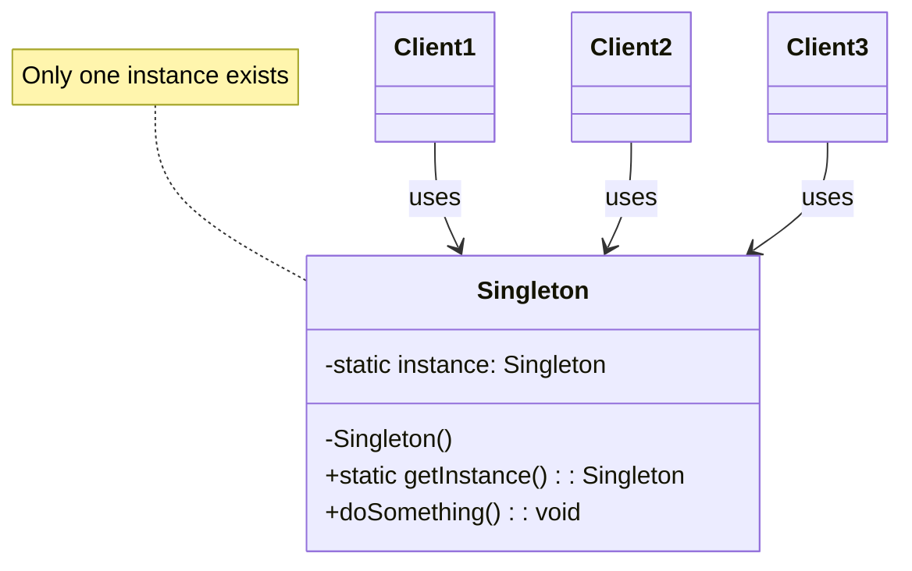
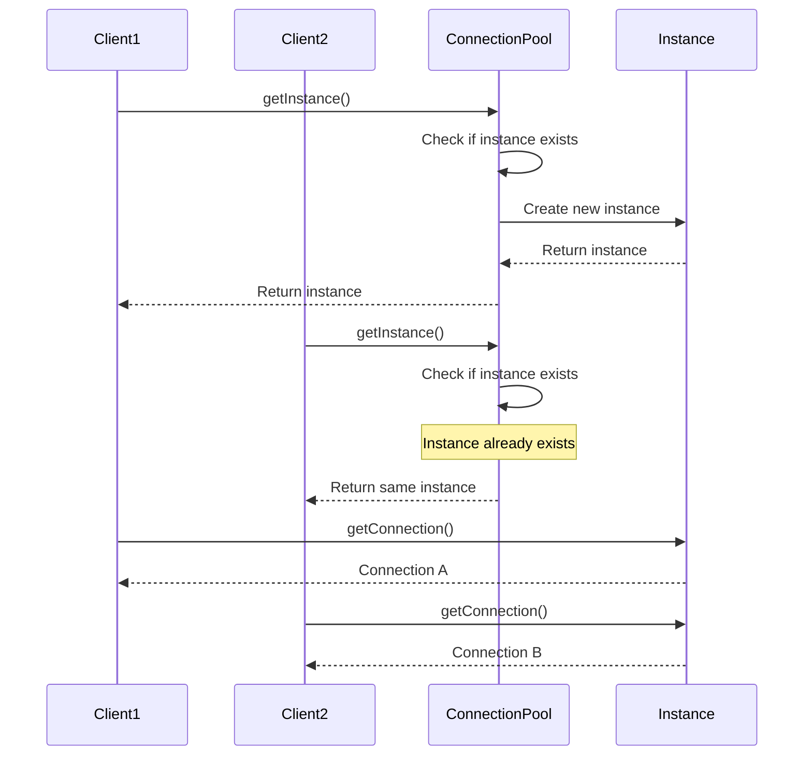

You have a database connection pool. Every part of your application needs access to it. Creating new connections is expensive. You need exactly one pool, shared everywhere.

This is what the Singleton pattern solves.

## What is the Singleton Pattern?

Singleton is a creational pattern that restricts a class to a single instance. It provides a global access point to that instance. The class itself controls instantiation, ensuring no one else can create additional instances.



The key elements:
- **Private constructor** prevents direct instantiation
- **Static instance** holds the single object
- **Public static method** returns the instance

## When to Use Singleton

| Use Singleton When | Avoid Singleton When |
|-------------------|---------------------|
| Managing shared resources like connection pools | You need multiple instances in tests |
| Configuration settings accessed everywhere | The class has mutable state that varies per context |
| Logging systems | You want loose coupling between components |
| Caches and registries | Dependency injection is available |
| Hardware interface access | The singleton becomes a god object |

The clearest signal is when creating multiple instances would cause problems. Two connection pools fighting for the same connections. Two configuration managers with different settings. Two loggers writing to the same file.

## Implementation

Let's build a database connection pool as a singleton.

### Basic Implementation (Not Thread-Safe)

```java
public class ConnectionPool {
    private static ConnectionPool instance;
    private List<Connection> connections;
    
    private ConnectionPool() {
        // Private constructor prevents instantiation
        connections = new ArrayList<>();
        initializePool();
    }
    
    public static ConnectionPool getInstance() {
        if (instance == null) {
            instance = new ConnectionPool();
        }
        return instance;
    }
    
    private void initializePool() {
        for (int i = 0; i < 10; i++) {
            connections.add(createConnection());
        }
    }
    
    public Connection getConnection() {
        // Return available connection from pool
        return connections.stream()
            .filter(Connection::isAvailable)
            .findFirst()
            .orElseThrow(() -> new RuntimeException("No connections available"));
    }
}
```

This works in single-threaded applications. But in multi-threaded environments, two threads could both see `instance == null` and create two instances.

### Thread-Safe with Double-Checked Locking

```java
public class ConnectionPool {
    private static volatile ConnectionPool instance;
    private List<Connection> connections;
    
    private ConnectionPool() {
        connections = new ArrayList<>();
        initializePool();
    }
    
    public static ConnectionPool getInstance() {
        if (instance == null) {                    // First check (no locking)
            synchronized (ConnectionPool.class) {
                if (instance == null) {            // Second check (with lock)
                    instance = new ConnectionPool();
                }
            }
        }
        return instance;
    }
    
    private void initializePool() {
        for (int i = 0; i < 10; i++) {
            connections.add(createConnection());
        }
    }
    
    public Connection getConnection() {
        return connections.stream()
            .filter(Connection::isAvailable)
            .findFirst()
            .orElseThrow(() -> new RuntimeException("No connections available"));
    }
}
```

The `volatile` keyword ensures the instance is fully constructed before it becomes visible to other threads. The double-check avoids synchronization overhead after initialization.

### Bill Pugh Singleton (Recommended)

```java
public class ConnectionPool {
    private List<Connection> connections;
    
    private ConnectionPool() {
        connections = new ArrayList<>();
        initializePool();
    }
    
    // Static inner class is not loaded until getInstance() is called
    private static class Holder {
        private static final ConnectionPool INSTANCE = new ConnectionPool();
    }
    
    public static ConnectionPool getInstance() {
        return Holder.INSTANCE;
    }
    
    private void initializePool() {
        for (int i = 0; i < 10; i++) {
            connections.add(createConnection());
        }
    }
    
    public Connection getConnection() {
        return connections.stream()
            .filter(Connection::isAvailable)
            .findFirst()
            .orElseThrow(() -> new RuntimeException("No connections available"));
    }
}
```

This leverages the JVM's class loading mechanism. The inner class is loaded only when `getInstance()` is first called, providing lazy initialization and thread safety without explicit synchronization.

### Enum Singleton (Simplest)

```java
public enum ConnectionPool {
    INSTANCE;
    
    private List<Connection> connections;
    
    ConnectionPool() {
        connections = new ArrayList<>();
        initializePool();
    }
    
    private void initializePool() {
        for (int i = 0; i < 10; i++) {
            connections.add(createConnection());
        }
    }
    
    public Connection getConnection() {
        return connections.stream()
            .filter(Connection::isAvailable)
            .findFirst()
            .orElseThrow(() -> new RuntimeException("No connections available"));
    }
}

// Usage
Connection conn = ConnectionPool.INSTANCE.getConnection();
```

Enums are inherently singleton. The JVM guarantees only one instance exists. It also handles serialization correctly, which other approaches struggle with.

## How It Works

Here's what happens when multiple clients request the singleton:



Both clients receive the same `ConnectionPool` instance. They share the pool but get different connections from it.

## Common Mistakes

### 1. Forgetting Thread Safety

The basic lazy initialization breaks in multi-threaded environments. Always use one of the thread-safe approaches.

```java
// Wrong - race condition possible
public static Singleton getInstance() {
    if (instance == null) {
        instance = new Singleton();  // Two threads could both enter here
    }
    return instance;
}
```

### 2. Breaking Singleton with Reflection

Java reflection can call private constructors:

```java
Constructor<Singleton> constructor = Singleton.class.getDeclaredConstructor();
constructor.setAccessible(true);
Singleton second = constructor.newInstance();  // Creates second instance!
```

Protect against this by throwing an exception in the constructor if an instance exists:

```java
private Singleton() {
    if (instance != null) {
        throw new RuntimeException("Use getInstance() method");
    }
}
```

Enum singletons are immune to this attack.

### 3. Serialization Breaking Singleton

When you deserialize a singleton, Java creates a new instance:

```java
// After serialization and deserialization
singleton1 == singleton2  // false!
```

Fix it by implementing `readResolve()`:

```java
protected Object readResolve() {
    return getInstance();
}
```

Again, enum singletons handle this automatically.

### 4. Making Everything a Singleton

Not every shared object needs to be a singleton. Overusing singletons creates hidden dependencies, makes testing difficult, and turns your codebase into spaghetti.

Ask yourself: does creating multiple instances actually cause problems? If not, consider passing dependencies explicitly.

## Singleton vs Alternatives

**Singleton vs Static Class**: Static classes can't implement interfaces, can't be lazy-loaded, and can't use inheritance. Singleton is more flexible.

**Singleton vs Dependency Injection**: DI frameworks like Spring manage instance lifecycle for you. A bean with `@Scope("singleton")` achieves the same result but is easier to test because you can inject mocks.

**Singleton vs Monostate**: Monostate has all static data but non-static methods. Multiple instances exist but share state. It's less common but can be useful when you want singleton behavior without the `getInstance()` call.

## Real-World Examples

**Java Runtime**: `Runtime.getRuntime()` returns the singleton JVM runtime.

**Spring Framework**: Default bean scope is singleton. Every `@Service`, `@Repository`, and `@Component` is a singleton unless you specify otherwise.

**Loggers**: SLF4J's `LoggerFactory.getLogger()` returns cached logger instances per class.

**Desktop Applications**: Preferences or settings managers are typically singletons.

## Related Patterns

**[Factory Method](/factory-method-design-pattern/)** can return a singleton instance. Many factories are themselves singletons that control object creation.

**[Abstract Factory](/abstract-factory-design-pattern/)** is often implemented as a singleton when you need one factory for the entire application.

**[Flyweight](/flyweight-design-pattern/)** shares intrinsic state between objects. Singleton shares the entire object. Flyweight is like having multiple singletons distinguished by a key.

## Wrapping Up

Singleton guarantees a single instance with global access. Use it for shared resources like connection pools, configuration, and logging. Prefer the Bill Pugh holder pattern or enum implementation for thread safety.

But be careful. Singleton introduces global state. It makes testing harder. It hides dependencies. Modern applications often use dependency injection frameworks instead, which provide singleton scope with better testability.

When you do need a singleton, make sure it's for a truly shared resource where multiple instances would cause real problems, not just convenience.

---

**Further Reading:**

- [Effective Java - Item 3: Enforce the singleton property](https://www.oreilly.com/library/view/effective-java/9780134686097/) by Joshua Bloch
- [Why Singletons are Controversial](https://stackoverflow.com/questions/137975/what-is-so-bad-about-singletons) on Stack Overflow

