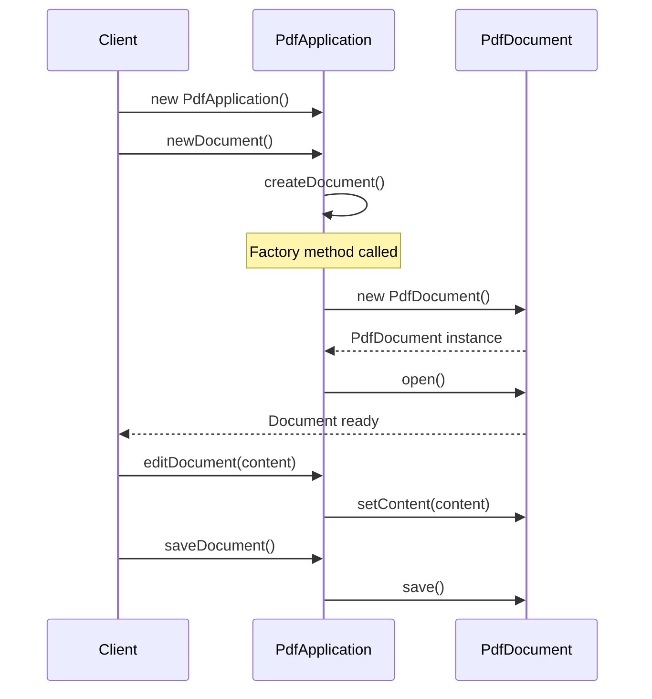

You're building a notification system. Today you send emails. Tomorrow you'll add SMS. Next month, push notifications. Each notification type has different creation logic, but the code that sends notifications shouldn't care about these details.

This is where Factory Method shines.

## What is the Factory Method Pattern?

Factory Method defines an interface for creating objects, but lets subclasses decide which class to instantiate. Instead of calling a constructor directly, you call a factory method that handles the creation.


The key insight: the `Creator` class doesn't know which concrete product it will create. Each subclass implements `createProduct()` to return the appropriate type.

## When to Use Factory Method

| Use Factory Method When | Skip Factory Method When |
|------------------------|-------------------------|
| You don't know exact types of objects beforehand | Object creation is simple and won't change |
| You want to provide extension points for frameworks | Only one concrete class will ever exist |
| Creation logic is complex and should be encapsulated | You're adding unnecessary abstraction |
| You need to decouple client code from concrete classes | Direct instantiation is clear and maintainable |

Factory Method is foundational to frameworks. Spring, Hibernate, and most Java frameworks use factories extensively to let you plug in your own implementations.

## Simple Factory vs Factory Method

Before diving into Factory Method, let's clarify a common confusion.

**Simple Factory** (not a GoF pattern) uses a single class with conditional logic:

```java
public class NotificationFactory {
    public static Notification create(String type) {
        switch (type) {
            case "email": return new EmailNotification();
            case "sms": return new SmsNotification();
            case "push": return new PushNotification();
            default: throw new IllegalArgumentException("Unknown type: " + type);
        }
    }
}
```

This works for simple cases but violates Open/Closed principle. Adding a new type requires modifying the factory.

**Factory Method** uses inheritance. Each creator subclass handles its own product:

```java
public abstract class NotificationService {
    // Factory method - subclasses implement this
    protected abstract Notification createNotification();
    
    public void send(String message) {
        Notification notification = createNotification();
        notification.setMessage(message);
        notification.send();
    }
}

public class EmailService extends NotificationService {
    @Override
    protected Notification createNotification() {
        return new EmailNotification();
    }
}

public class SmsService extends NotificationService {
    @Override
    protected Notification createNotification() {
        return new SmsNotification();
    }
}
```

Adding a new notification type means creating a new subclass. No existing code changes.

## Implementation

Let's build a document processing system where different document types require different parsers.

### Step 1: Define the Product Interface

```java
public interface Document {
    void open();
    void save();
    String getContent();
    void setContent(String content);
}
```

### Step 2: Create Concrete Products

```java
public class PdfDocument implements Document {
    private String content;
    private PdfRenderer renderer;
    
    public PdfDocument() {
        this.renderer = new PdfRenderer();
    }
    
    @Override
    public void open() {
        System.out.println("Opening PDF document");
        renderer.initialize();
    }
    
    @Override
    public void save() {
        System.out.println("Saving PDF with compression");
        renderer.compress(content);
    }
    
    @Override
    public String getContent() {
        return content;
    }
    
    @Override
    public void setContent(String content) {
        this.content = content;
    }
}

public class WordDocument implements Document {
    private String content;
    
    @Override
    public void open() {
        System.out.println("Opening Word document");
    }
    
    @Override
    public void save() {
        System.out.println("Saving Word document in .docx format");
    }
    
    @Override
    public String getContent() {
        return content;
    }
    
    @Override
    public void setContent(String content) {
        this.content = content;
    }
}

public class SpreadsheetDocument implements Document {
    private String content;
    private CellEngine cellEngine;
    
    public SpreadsheetDocument() {
        this.cellEngine = new CellEngine();
    }
    
    @Override
    public void open() {
        System.out.println("Opening spreadsheet");
        cellEngine.initializeGrid();
    }
    
    @Override
    public void save() {
        System.out.println("Saving spreadsheet with formulas");
        cellEngine.evaluateFormulas();
    }
    
    @Override
    public String getContent() {
        return content;
    }
    
    @Override
    public void setContent(String content) {
        this.content = content;
    }
}
```

### Step 3: Define the Creator with Factory Method

```java
public abstract class Application {
    private Document document;
    
    // Factory method - subclasses decide what document to create
    protected abstract Document createDocument();
    
    public void newDocument() {
        this.document = createDocument();
        document.open();
    }
    
    public void editDocument(String content) {
        if (document == null) {
            throw new IllegalStateException("No document open");
        }
        document.setContent(content);
    }
    
    public void saveDocument() {
        if (document == null) {
            throw new IllegalStateException("No document open");
        }
        document.save();
    }
    
    public Document getDocument() {
        return document;
    }
}
```

### Step 4: Implement Concrete Creators

```java
public class PdfApplication extends Application {
    @Override
    protected Document createDocument() {
        return new PdfDocument();
    }
}

public class WordApplication extends Application {
    @Override
    protected Document createDocument() {
        return new WordDocument();
    }
}

public class SpreadsheetApplication extends Application {
    @Override
    protected Document createDocument() {
        return new SpreadsheetDocument();
    }
}
```

### Step 5: Use the Factory

```java
public class Main {
    public static void main(String[] args) {
        // User chose to work with PDFs
        Application app = new PdfApplication();
        
        app.newDocument();
        app.editDocument("Important report content");
        app.saveDocument();
        
        // Later, same workflow but for spreadsheets
        Application spreadsheetApp = new SpreadsheetApplication();
        spreadsheetApp.newDocument();
        spreadsheetApp.editDocument("Q1,Q2,Q3,Q4\n100,200,300,400");
        spreadsheetApp.saveDocument();
    }
}
```

Output:
```
Opening PDF document
Saving PDF with compression
Opening spreadsheet
Saving spreadsheet with formulas
```

## How It Works

Here's the sequence when creating and using a document:



The client works with the abstract `Application` class. It doesn't know or care whether it's dealing with PDFs, Word docs, or spreadsheets. The factory method handles the creation details.

## Parameterized Factory Method

Sometimes you want the factory method to accept parameters:

```java
public abstract class LoggerFactory {
    protected abstract Logger createLogger(LogLevel level);
    
    public Logger getLogger(LogLevel level) {
        Logger logger = createLogger(level);
        logger.setTimestampFormat("yyyy-MM-dd HH:mm:ss");
        return logger;
    }
}

public class FileLoggerFactory extends LoggerFactory {
    private String logDirectory;
    
    public FileLoggerFactory(String logDirectory) {
        this.logDirectory = logDirectory;
    }
    
    @Override
    protected Logger createLogger(LogLevel level) {
        String filename = logDirectory + "/" + level.name().toLowerCase() + ".log";
        return new FileLogger(filename, level);
    }
}

public class ConsoleLoggerFactory extends LoggerFactory {
    @Override
    protected Logger createLogger(LogLevel level) {
        return new ConsoleLogger(level);
    }
}
```

## Common Mistakes

### 1. Overusing Factory Method

Not every object needs a factory. If you have a simple class with no variations:

```java
// Overkill
UserFactory factory = new UserFactory();
User user = factory.createUser();

// Just do this
User user = new User();
```

Factory Method adds complexity. Use it when that complexity pays off.

### 2. Confusing with Abstract Factory

Factory Method uses inheritance to delegate creation to subclasses. Abstract Factory uses composition, providing an interface for creating families of related objects. If you need multiple related products, consider [Abstract Factory](/design-patterns/abstract-factory/).

### 3. Putting Too Much Logic in Factory

The factory method should create the object. Configuration and complex setup might belong elsewhere:

```java
// Too much responsibility
@Override
protected Document createDocument() {
    Document doc = new PdfDocument();
    doc.setAuthor(getCurrentUser());
    doc.setCreatedDate(new Date());
    doc.loadTemplate("default-template");
    doc.applyStyles(getStyleSheet());
    return doc;
}

// Better - factory creates, caller configures
@Override
protected Document createDocument() {
    return new PdfDocument();
}

// Configuration happens in the template method
public void newDocument() {
    Document doc = createDocument();
    configureDocument(doc);  // Separate method for setup
    doc.open();
}
```

## Real-World Examples

**Java Collections**: `iterator()` is a factory method. Each collection returns its own iterator type:

```java
List<String> list = new ArrayList<>();
Iterator<String> iter = list.iterator();  // Returns ArrayList's iterator
```

**JDBC**: `DriverManager.getConnection()` returns a database-specific connection.

**Spring Framework**: `BeanFactory` is a factory. Each bean definition can use a factory method:

```xml
<bean id="myService" class="ServiceFactory" factory-method="createService"/>
```

**SLF4J Logging**: `LoggerFactory.getLogger()` returns the appropriate logger implementation based on the bound logging framework.

## Related Patterns

**[Abstract Factory](/design-patterns/abstract-factory/)** is a set of Factory Methods. When you need to create families of related objects, Abstract Factory groups multiple factory methods together.

**[Template Method](/design-patterns/template-method/)** often calls factory methods. The template defines the skeleton, factory method provides the specific objects.

**[Prototype](/design-patterns/prototype/)** is an alternative to Factory Method. Instead of subclassing creators, you create new objects by cloning a prototype.

**[Singleton](/design-patterns/singleton/)** factories are common. A single factory instance serves the entire application.

## Wrapping Up

Factory Method decouples object creation from the code that uses objects. It's foundational to frameworks and plugin architectures.

The pattern works through inheritance. The base class defines when to create objects (in a template method). Subclasses define what to create (by implementing the factory method).

Use Factory Method when you need flexibility in object creation without exposing creation logic to clients. Skip it when direct instantiation is simple and unlikely to change.

---

**Further Reading:**

- [Head First Design Patterns](https://www.oreilly.com/library/view/head-first-design/0596007124/) - Chapter 4
- [Effective Java - Item 1: Consider static factory methods](https://www.oreilly.com/library/view/effective-java/9780134686097/) by Joshua Bloch

