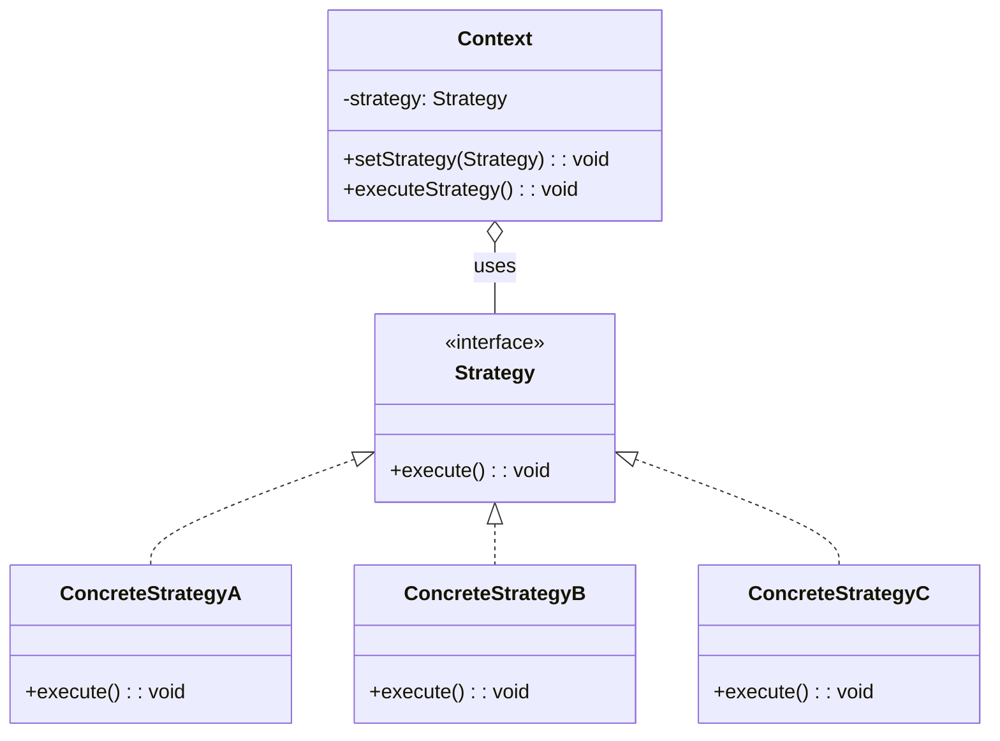
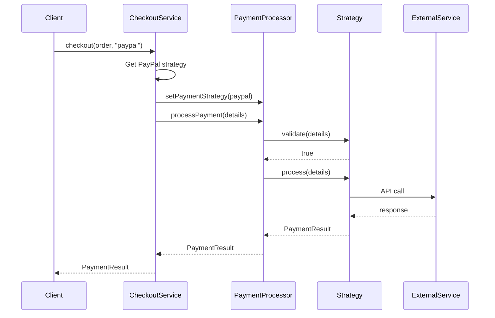

You're building a payment system. Credit cards need fraud checks. PayPal requires API authentication. Crypto payments involve blockchain verification. Bank transfers have different validation rules.

You could write a giant if-else chain. Or you could use Strategy.

## What is the Strategy Pattern?

Strategy defines a family of algorithms, encapsulates each one, and makes them interchangeable. The client code works with a strategy interface. The actual algorithm can be swapped at runtime without changing the client.



The key insight: the Context doesn't know which algorithm it's using. It just knows the Strategy interface. You can add new strategies without touching existing code.

## When to Use Strategy

| Use Strategy When | Avoid Strategy When |
|------------------|---------------------|
| You have multiple algorithms for the same task | Only one algorithm exists and won't change |
| Algorithms should be interchangeable at runtime | The algorithm is simple and inline |
| You want to isolate algorithm-specific code | Adding abstraction would complicate things |
| Conditional statements select between algorithms | Strategies would be nearly identical |

If you see code like `if (type == "A") doA() else if (type == "B") doB()` where each branch has substantial logic, that's a strategy waiting to emerge.

## Implementation

Let's build a payment processing system with multiple payment methods.

### Step 1: Define the Strategy Interface

```java
public interface PaymentStrategy {
    boolean validate(PaymentDetails details);
    PaymentResult process(PaymentDetails details);
    String getPaymentMethodName();
}
```

### Step 2: Implement Concrete Strategies

```java
public class CreditCardStrategy implements PaymentStrategy {
    private final FraudDetectionService fraudService;
    private final PaymentGateway gateway;
    
    public CreditCardStrategy(FraudDetectionService fraudService, PaymentGateway gateway) {
        this.fraudService = fraudService;
        this.gateway = gateway;
    }
    
    @Override
    public boolean validate(PaymentDetails details) {
        // Card-specific validation
        if (!isValidCardNumber(details.getCardNumber())) {
            return false;
        }
        if (!isValidExpiry(details.getExpiry())) {
            return false;
        }
        // Check CVV
        return details.getCvv() != null && details.getCvv().length() == 3;
    }
    
    @Override
    public PaymentResult process(PaymentDetails details) {
        // Fraud check first
        if (fraudService.isSuspicious(details)) {
            return PaymentResult.declined("Fraud check failed");
        }
        
        // Process through gateway
        GatewayResponse response = gateway.charge(
            details.getCardNumber(),
            details.getAmount(),
            details.getCurrency()
        );
        
        return response.isSuccess() 
            ? PaymentResult.success(response.getTransactionId())
            : PaymentResult.declined(response.getErrorMessage());
    }
    
    @Override
    public String getPaymentMethodName() {
        return "Credit Card";
    }
    
    private boolean isValidCardNumber(String number) {
        // Luhn algorithm check
        return number != null && number.matches("\\d{16}");
    }
    
    private boolean isValidExpiry(String expiry) {
        // MM/YY format, not expired
        return expiry != null && expiry.matches("\\d{2}/\\d{2}");
    }
}

public class PayPalStrategy implements PaymentStrategy {
    private final PayPalClient paypalClient;
    
    public PayPalStrategy(PayPalClient paypalClient) {
        this.paypalClient = paypalClient;
    }
    
    @Override
    public boolean validate(PaymentDetails details) {
        // PayPal needs email
        return details.getEmail() != null && details.getEmail().contains("@");
    }
    
    @Override
    public PaymentResult process(PaymentDetails details) {
        // Create PayPal payment
        PayPalPayment payment = paypalClient.createPayment(
            details.getAmount(),
            details.getCurrency(),
            details.getEmail()
        );
        
        // Execute payment
        PayPalResponse response = paypalClient.executePayment(payment.getId());
        
        return response.getState().equals("approved")
            ? PaymentResult.success(response.getTransactionId())
            : PaymentResult.declined("PayPal payment not approved");
    }
    
    @Override
    public String getPaymentMethodName() {
        return "PayPal";
    }
}

public class CryptoStrategy implements PaymentStrategy {
    private final BlockchainService blockchain;
    private final ExchangeRateService exchangeService;
    
    public CryptoStrategy(BlockchainService blockchain, ExchangeRateService exchangeService) {
        this.blockchain = blockchain;
        this.exchangeService = exchangeService;
    }
    
    @Override
    public boolean validate(PaymentDetails details) {
        // Validate wallet address format
        String wallet = details.getCryptoWallet();
        return wallet != null && blockchain.isValidAddress(wallet);
    }
    
    @Override
    public PaymentResult process(PaymentDetails details) {
        // Convert amount to crypto
        BigDecimal cryptoAmount = exchangeService.convert(
            details.getAmount(),
            details.getCurrency(),
            details.getCryptoType()
        );
        
        // Create and broadcast transaction
        Transaction tx = blockchain.createTransaction(
            details.getCryptoWallet(),
            cryptoAmount
        );
        
        String txHash = blockchain.broadcast(tx);
        
        // Wait for confirmation
        boolean confirmed = blockchain.waitForConfirmation(txHash, 3);
        
        return confirmed
            ? PaymentResult.success(txHash)
            : PaymentResult.pending("Awaiting blockchain confirmation");
    }
    
    @Override
    public String getPaymentMethodName() {
        return "Cryptocurrency";
    }
}
```

### Step 3: Create the Context

```java
public class PaymentProcessor {
    private PaymentStrategy strategy;
    private final PaymentLogger logger;
    
    public PaymentProcessor(PaymentLogger logger) {
        this.logger = logger;
    }
    
    public void setPaymentStrategy(PaymentStrategy strategy) {
        this.strategy = strategy;
        logger.log("Payment method set to: " + strategy.getPaymentMethodName());
    }
    
    public PaymentResult processPayment(PaymentDetails details) {
        if (strategy == null) {
            throw new IllegalStateException("Payment strategy not set");
        }
        
        logger.log("Processing " + strategy.getPaymentMethodName() + " payment");
        
        // Validate first
        if (!strategy.validate(details)) {
            logger.log("Validation failed");
            return PaymentResult.invalid("Payment details validation failed");
        }
        
        // Process payment
        PaymentResult result = strategy.process(details);
        
        logger.log("Payment result: " + result.getStatus());
        return result;
    }
}
```

### Step 4: Use the Pattern

```java
public class CheckoutService {
    private final PaymentProcessor processor;
    private final Map<String, PaymentStrategy> strategies;
    
    public CheckoutService(PaymentProcessor processor, 
                          CreditCardStrategy creditCard,
                          PayPalStrategy paypal,
                          CryptoStrategy crypto) {
        this.processor = processor;
        this.strategies = Map.of(
            "credit_card", creditCard,
            "paypal", paypal,
            "crypto", crypto
        );
    }
    
    public PaymentResult checkout(Order order, String paymentMethod) {
        PaymentStrategy strategy = strategies.get(paymentMethod);
        if (strategy == null) {
            throw new IllegalArgumentException("Unknown payment method: " + paymentMethod);
        }
        
        processor.setPaymentStrategy(strategy);
        
        PaymentDetails details = order.getPaymentDetails();
        return processor.processPayment(details);
    }
}

// Usage
CheckoutService checkout = new CheckoutService(processor, creditCard, paypal, crypto);

// User chose credit card
PaymentResult result = checkout.checkout(order, "credit_card");

// Same order, different method
PaymentResult result2 = checkout.checkout(order, "paypal");
```

## How It Works

Here's the flow when processing a payment:



The `PaymentProcessor` doesn't know which payment method it's handling. It just calls the strategy interface methods.

## Strategy with Lambda (Java 8+)

For simple strategies, you can use lambdas:

```java
@FunctionalInterface
public interface SortStrategy<T> {
    void sort(List<T> items);
}

public class Sorter<T> {
    private SortStrategy<T> strategy;
    
    public void setStrategy(SortStrategy<T> strategy) {
        this.strategy = strategy;
    }
    
    public void sort(List<T> items) {
        strategy.sort(items);
    }
}

// Usage with lambdas
Sorter<Integer> sorter = new Sorter<>();

// Quick sort strategy
sorter.setStrategy(items -> {
    Collections.sort(items);
});

// Reverse sort strategy
sorter.setStrategy(items -> {
    Collections.sort(items, Collections.reverseOrder());
});

// Custom comparator strategy
sorter.setStrategy(items -> {
    items.sort((a, b) -> Integer.compare(Math.abs(a), Math.abs(b)));
});
```

## Common Mistakes

### 1. Creating Strategy Objects Every Time

```java
// Wasteful - creates new object for each payment
public PaymentResult process(String method, PaymentDetails details) {
    PaymentStrategy strategy;
    if (method.equals("credit_card")) {
        strategy = new CreditCardStrategy(fraudService, gateway);  // New instance
    }
    // ...
}

// Better - reuse strategy instances
private final Map<String, PaymentStrategy> strategies;

public PaymentResult process(String method, PaymentDetails details) {
    PaymentStrategy strategy = strategies.get(method);
    // ...
}
```

Strategies are typically stateless. Create them once and reuse.

### 2. Strategy with Too Much Context Knowledge

Strategies should be independent. If a strategy needs the entire context object:

```java
// Tight coupling
public class CreditCardStrategy implements PaymentStrategy {
    @Override
    public void process(PaymentProcessor processor) {
        processor.doThis();
        processor.doThat();  // Strategy knows too much about context
    }
}

// Better - pass only what's needed
public class CreditCardStrategy implements PaymentStrategy {
    @Override
    public PaymentResult process(PaymentDetails details) {
        // Works only with payment details
    }
}
```

### 3. Confusing Strategy with State

Strategy switches algorithms externally. State changes behavior based on internal conditions. If your "strategies" need to transition to each other automatically, you might want [State pattern](/design-patterns/state/) instead.

```java
// This looks like Strategy but acts like State
if (currentState == PENDING) {
    setStrategy(new PendingStrategy());
} else if (currentState == APPROVED) {
    setStrategy(new ApprovedStrategy());
}

// If state transitions are driven by internal logic, use State pattern instead
```

## Real-World Examples

**Java Comparator**: `Collections.sort(list, comparator)` - the comparator is a sorting strategy.

**Spring Security**: `AuthenticationProvider` implementations are strategies for different authentication methods.

**Compression Libraries**: `GZIPOutputStream`, `ZipOutputStream` - different compression strategies.

**Validation Frameworks**: Bean Validation allows custom validators as strategies.

## Related Patterns

**[State Pattern](/design-patterns/state/)** looks similar but changes behavior based on internal state. If the object decides when to switch, use State. If the client decides, use Strategy.

**[Template Method](/design-patterns/template-method/)** uses inheritance to vary parts of an algorithm. Strategy uses composition. Template Method is simpler but less flexible.

**[Decorator](/design-patterns/decorator/)** can wrap strategies to add behavior. For example, a logging decorator around any payment strategy.

**[Factory Method](/design-patterns/factory-method/)** often creates strategy objects. The factory encapsulates the logic of which strategy to use.

## Wrapping Up

Strategy encapsulates algorithms behind a common interface. The client picks which algorithm to use; the algorithm does its work without knowing about alternatives.

It's composition over inheritance. Instead of subclassing to vary behavior, you compose objects with interchangeable parts.

Use Strategy when you have a family of related algorithms and need to switch between them. The pattern keeps each algorithm isolated, testable, and open for extension.

---

**Further Reading:**

- [Head First Design Patterns](https://www.oreilly.com/library/view/head-first-design/0596007124/) - Chapter 1
- [Replace Conditional with Polymorphism](https://refactoring.com/catalog/replaceConditionalWithPolymorphism.html) - Martin Fowler

