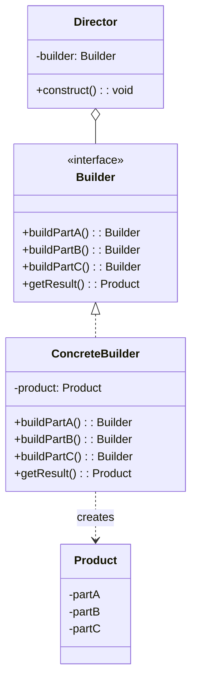
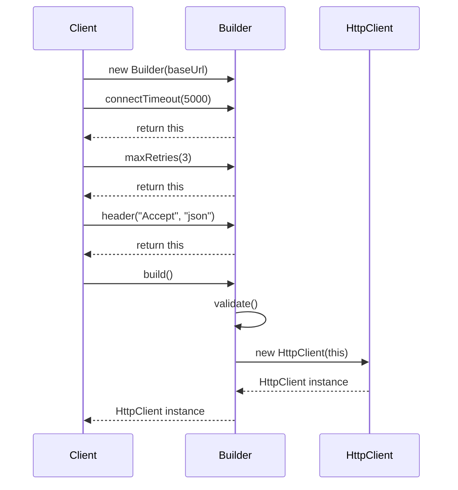

You're building an HTTP request object. It needs URL, method, headers, body, timeout, retry policy, authentication, and maybe ten more options. Most are optional.

Do you create a constructor with 15 parameters? Nobody can remember the order. Do you create 50 constructor overloads? That's the telescoping constructor anti-pattern.

Builder solves this elegantly.

## What is the Builder Pattern?

Builder separates the construction of a complex object from its representation. It constructs the object step by step, and you only use the steps you need.



In practice, modern Java often simplifies this. The Director is optional, and the Builder is often a static inner class.

## When to Use Builder

| Use Builder When | Skip Builder When |
|-----------------|-------------------|
| Constructor would have 5+ parameters | Object has few, simple parameters |
| Many parameters are optional | All parameters are required |
| You want immutable objects | Mutable objects are fine |
| Object creation has multiple steps | Single-step creation works |
| You want readable, self-documenting code | Simplicity is more important |

The clearest signal: you're tempted to write multiple constructors or a constructor with nullable parameters.

## Implementation

Let's build an HTTP client configuration with many optional settings.

### The Traditional Approach (Don't Do This)

```java
// Telescoping constructor anti-pattern
public class HttpClient {
    public HttpClient(String baseUrl) { ... }
    public HttpClient(String baseUrl, int timeout) { ... }
    public HttpClient(String baseUrl, int timeout, int retries) { ... }
    public HttpClient(String baseUrl, int timeout, int retries, boolean followRedirects) { ... }
    // This gets out of hand quickly
}

// Or constructor with many parameters - hard to read
HttpClient client = new HttpClient(
    "https://api.example.com",
    30000,
    3,
    true,
    null,
    null,
    "Bearer token123",
    true,
    false,
    null
);  // What do all these mean?
```

### The Builder Approach

```java
public class HttpClient {
    private final String baseUrl;
    private final int connectTimeout;
    private final int readTimeout;
    private final int maxRetries;
    private final boolean followRedirects;
    private final Map<String, String> defaultHeaders;
    private final Authenticator authenticator;
    private final ProxyConfig proxy;
    private final boolean enableLogging;
    private final SSLContext sslContext;
    
    // Private constructor - only Builder can create instances
    private HttpClient(Builder builder) {
        this.baseUrl = builder.baseUrl;
        this.connectTimeout = builder.connectTimeout;
        this.readTimeout = builder.readTimeout;
        this.maxRetries = builder.maxRetries;
        this.followRedirects = builder.followRedirects;
        this.defaultHeaders = Map.copyOf(builder.defaultHeaders);
        this.authenticator = builder.authenticator;
        this.proxy = builder.proxy;
        this.enableLogging = builder.enableLogging;
        this.sslContext = builder.sslContext;
    }
    
    // Getters only - object is immutable
    public String getBaseUrl() { return baseUrl; }
    public int getConnectTimeout() { return connectTimeout; }
    // ... other getters
    
    // Static method to get builder
    public static Builder builder(String baseUrl) {
        return new Builder(baseUrl);
    }
    
    public static class Builder {
        // Required parameter
        private final String baseUrl;
        
        // Optional parameters with defaults
        private int connectTimeout = 10000;
        private int readTimeout = 30000;
        private int maxRetries = 3;
        private boolean followRedirects = true;
        private Map<String, String> defaultHeaders = new HashMap<>();
        private Authenticator authenticator = null;
        private ProxyConfig proxy = null;
        private boolean enableLogging = false;
        private SSLContext sslContext = null;
        
        public Builder(String baseUrl) {
            if (baseUrl == null || baseUrl.isEmpty()) {
                throw new IllegalArgumentException("Base URL is required");
            }
            this.baseUrl = baseUrl;
        }
        
        public Builder connectTimeout(int millis) {
            this.connectTimeout = millis;
            return this;
        }
        
        public Builder readTimeout(int millis) {
            this.readTimeout = millis;
            return this;
        }
        
        public Builder maxRetries(int retries) {
            this.maxRetries = retries;
            return this;
        }
        
        public Builder followRedirects(boolean follow) {
            this.followRedirects = follow;
            return this;
        }
        
        public Builder header(String name, String value) {
            this.defaultHeaders.put(name, value);
            return this;
        }
        
        public Builder authenticator(Authenticator auth) {
            this.authenticator = auth;
            return this;
        }
        
        public Builder proxy(String host, int port) {
            this.proxy = new ProxyConfig(host, port);
            return this;
        }
        
        public Builder enableLogging() {
            this.enableLogging = true;
            return this;
        }
        
        public Builder sslContext(SSLContext context) {
            this.sslContext = context;
            return this;
        }
        
        public HttpClient build() {
            // Validation before building
            if (maxRetries < 0) {
                throw new IllegalStateException("Max retries cannot be negative");
            }
            return new HttpClient(this);
        }
    }
}
```

### Usage

```java
// Simple case - just required parameter
HttpClient simpleClient = HttpClient.builder("https://api.example.com")
    .build();

// Full configuration - readable and self-documenting
HttpClient client = HttpClient.builder("https://api.example.com")
    .connectTimeout(5000)
    .readTimeout(30000)
    .maxRetries(3)
    .followRedirects(true)
    .header("User-Agent", "MyApp/1.0")
    .header("Accept", "application/json")
    .authenticator(new BearerTokenAuth("secret-token"))
    .proxy("proxy.company.com", 8080)
    .enableLogging()
    .build();

// You know exactly what each setting does
```

## How It Works



Each method returns `this`, enabling method chaining. The `build()` method validates and creates the final immutable object.

## Builder with Director

Sometimes you have standard configurations. A Director encapsulates common build sequences:

```java
public class HttpClientDirector {
    
    public HttpClient createProductionClient(String baseUrl, String apiKey) {
        return HttpClient.builder(baseUrl)
            .connectTimeout(5000)
            .readTimeout(30000)
            .maxRetries(3)
            .followRedirects(true)
            .header("X-API-Key", apiKey)
            .sslContext(loadProductionCerts())
            .build();
    }
    
    public HttpClient createDevelopmentClient(String baseUrl) {
        return HttpClient.builder(baseUrl)
            .connectTimeout(30000)  // Longer timeout for debugging
            .readTimeout(60000)
            .maxRetries(0)  // Fail fast
            .enableLogging()
            .build();
    }
    
    public HttpClient createTestClient(String baseUrl) {
        return HttpClient.builder(baseUrl)
            .connectTimeout(100)
            .readTimeout(100)
            .maxRetries(0)
            .build();
    }
}

// Usage
HttpClientDirector director = new HttpClientDirector();
HttpClient prodClient = director.createProductionClient("https://api.prod.com", "key123");
HttpClient devClient = director.createDevelopmentClient("http://localhost:8080");
```

## Building Immutable Objects

Builder works naturally with immutable objects:

```java
public final class User {
    private final String id;
    private final String name;
    private final String email;
    private final List<String> roles;
    private final Instant createdAt;
    
    private User(Builder builder) {
        this.id = builder.id;
        this.name = builder.name;
        this.email = builder.email;
        this.roles = List.copyOf(builder.roles);  // Defensive copy
        this.createdAt = builder.createdAt;
    }
    
    // No setters - only getters
    public String getId() { return id; }
    public String getName() { return name; }
    public String getEmail() { return email; }
    public List<String> getRoles() { return roles; }  // Already immutable
    public Instant getCreatedAt() { return createdAt; }
    
    public static Builder builder() {
        return new Builder();
    }
    
    // Create modified copy
    public Builder toBuilder() {
        return new Builder()
            .id(this.id)
            .name(this.name)
            .email(this.email)
            .roles(this.roles)
            .createdAt(this.createdAt);
    }
    
    public static class Builder {
        private String id;
        private String name;
        private String email;
        private List<String> roles = new ArrayList<>();
        private Instant createdAt = Instant.now();
        
        public Builder id(String id) {
            this.id = id;
            return this;
        }
        
        public Builder name(String name) {
            this.name = name;
            return this;
        }
        
        public Builder email(String email) {
            this.email = email;
            return this;
        }
        
        public Builder roles(List<String> roles) {
            this.roles = new ArrayList<>(roles);
            return this;
        }
        
        public Builder addRole(String role) {
            this.roles.add(role);
            return this;
        }
        
        public Builder createdAt(Instant createdAt) {
            this.createdAt = createdAt;
            return this;
        }
        
        public User build() {
            Objects.requireNonNull(id, "ID is required");
            Objects.requireNonNull(name, "Name is required");
            return new User(this);
        }
    }
}

// Create user
User user = User.builder()
    .id("user-123")
    .name("John Doe")
    .email("john@example.com")
    .addRole("USER")
    .addRole("ADMIN")
    .build();

// Create modified copy
User updatedUser = user.toBuilder()
    .email("newemail@example.com")
    .build();
```

## Lombok @Builder

If you use Lombok, you get Builder for free:

```java
@Builder
@Getter
public class HttpRequest {
    private final String url;
    private final String method;
    @Builder.Default
    private final int timeout = 30000;
    @Singular
    private final Map<String, String> headers;
    private final String body;
}

// Usage
HttpRequest request = HttpRequest.builder()
    .url("https://api.example.com/users")
    .method("POST")
    .header("Content-Type", "application/json")
    .header("Accept", "application/json")
    .body("{\"name\": \"John\"}")
    .build();
```

Lombok generates the Builder class, all the setter methods, and the build method.

## Common Mistakes

### 1. Mutable Builder Reuse

Once you call `build()`, don't reuse the builder:

```java
// Dangerous - builder state leaks between objects
HttpClient.Builder builder = HttpClient.builder("https://api.com");
HttpClient client1 = builder.maxRetries(3).build();
HttpClient client2 = builder.maxRetries(5).build();  // client1's retries might change!

// Safe - fresh builder each time
HttpClient client1 = HttpClient.builder("https://api.com").maxRetries(3).build();
HttpClient client2 = HttpClient.builder("https://api.com").maxRetries(5).build();
```

### 2. Forgetting Validation

Validate in `build()`, not in the constructor:

```java
public HttpClient build() {
    // Validate here
    if (connectTimeout <= 0) {
        throw new IllegalStateException("Connect timeout must be positive");
    }
    if (readTimeout < connectTimeout) {
        throw new IllegalStateException("Read timeout should be >= connect timeout");
    }
    return new HttpClient(this);
}
```

### 3. Breaking Immutability

When building immutable objects, make defensive copies:

```java
// Wrong - mutable list leaks in
private HttpClient(Builder builder) {
    this.headers = builder.headers;  // Same reference!
}

// Right - defensive copy
private HttpClient(Builder builder) {
    this.headers = Map.copyOf(builder.headers);  // Immutable copy
}
```

## Real-World Examples

**StringBuilder**: The classic Java builder for strings.

**Stream.Builder**: Build streams piece by piece.

**OkHttp**: `Request.Builder` and `OkHttpClient.Builder` for HTTP configuration.

**Protocol Buffers**: Generated builders for all message types.

**JPA Criteria API**: `CriteriaBuilder` for constructing queries.

## Related Patterns

**[Abstract Factory](/design-patterns/abstract-factory/)** creates families of related objects. Builder constructs one complex object step by step. Factories can return Builders.

**[Prototype](/design-patterns/prototype/)** creates new objects by copying existing ones. Builder's `toBuilder()` method is similar, creating a copy you can modify.

**[Composite](/design-patterns/composite/)** structures are often built using Builder, especially when the structure is complex.

## Wrapping Up

Builder separates complex object construction from representation. It shines when objects have many optional parameters, when you want immutable objects, or when creation involves multiple steps.

The fluent interface pattern (returning `this`) makes Builder code readable and self-documenting. Each method name describes what's being configured.

Use Builder when constructors get unwieldy. Skip it when objects are simple. Libraries like Lombok can generate builders automatically, reducing boilerplate.

---

**Further Reading:**

- [Effective Java - Item 2: Consider a builder when faced with many constructor parameters](https://www.oreilly.com/library/view/effective-java/9780134686097/) by Joshua Bloch
- [Lombok @Builder Documentation](https://projectlombok.org/features/Builder)

