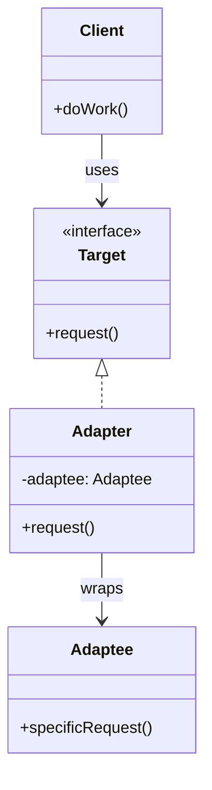
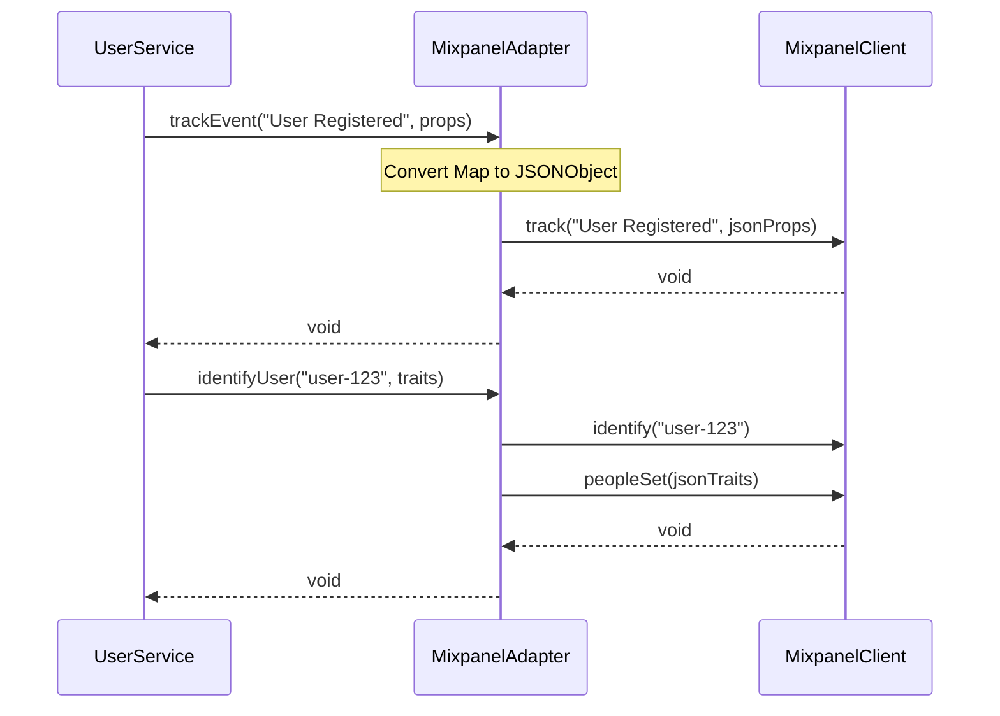

You're integrating a new payment gateway. Your code expects a `PaymentProcessor` interface. The vendor's SDK has a completely different API structure. You can't modify the SDK, and you don't want to rewrite your code.

This is where Adapter shines.

## What is the Adapter Pattern?

Adapter converts the interface of a class into another interface that clients expect. It lets classes work together that couldn't otherwise because of incompatible interfaces.

Think of a power adapter. Your laptop has a US plug. The outlet is European. The adapter sits in between, converting one interface to another.



The Client works with the Target interface. The Adapter implements Target and wraps the Adaptee, translating calls.

## When to Use Adapter

| Use Adapter When | Skip Adapter When |
|-----------------|-------------------|
| Integrating third-party libraries with different APIs | You control both interfaces and can modify them |
| Working with legacy systems you can't modify | A simple method call change would suffice |
| Creating reusable components for various interfaces | The interface mismatch is trivial |
| You want to isolate your code from external changes | Adding indirection isn't worth the benefit |

Adapter is reactive. You use it when interfaces don't match. Bridge is proactive, you use it when designing upfront.

## Implementation

Let's integrate multiple analytics providers, each with a different API.

### The Target Interface (What Your Code Expects)

```java
public interface AnalyticsService {
    void trackEvent(String eventName, Map<String, Object> properties);
    void identifyUser(String userId, Map<String, Object> traits);
    void trackPageView(String pageName);
}
```

### Third-Party Libraries (What You Actually Have)

```java
// Google Analytics has a completely different API
public class GoogleAnalytics {
    public void send(HitBuilder hit) {
        // Google's implementation
    }
    
    public void setUserId(String id) {
        // ...
    }
}

// Mixpanel has its own approach
public class MixpanelClient {
    public void track(String event, JSONObject props) {
        // Mixpanel's implementation
    }
    
    public void identify(String distinctId) {
        // ...
    }
    
    public void peopleSet(JSONObject properties) {
        // ...
    }
}

// Amplitude is different again
public class AmplitudeClient {
    public void logEvent(String eventType, JSONObject eventProperties) {
        // Amplitude's implementation
    }
    
    public void setUserId(String userId) {
        // ...
    }
    
    public void setUserProperties(JSONObject properties) {
        // ...
    }
}
```

### The Adapters

```java
public class GoogleAnalyticsAdapter implements AnalyticsService {
    private final GoogleAnalytics ga;
    
    public GoogleAnalyticsAdapter(GoogleAnalytics ga) {
        this.ga = ga;
    }
    
    @Override
    public void trackEvent(String eventName, Map<String, Object> properties) {
        HitBuilder hit = new HitBuilder.EventBuilder()
            .setCategory(properties.getOrDefault("category", "default").toString())
            .setAction(eventName)
            .setLabel(properties.getOrDefault("label", "").toString());
        
        if (properties.containsKey("value")) {
            hit.setValue(((Number) properties.get("value")).longValue());
        }
        
        ga.send(hit.build());
    }
    
    @Override
    public void identifyUser(String userId, Map<String, Object> traits) {
        ga.setUserId(userId);
        // GA doesn't support traits the same way, but we can send as custom dimensions
        for (Map.Entry<String, Object> trait : traits.entrySet()) {
            ga.setCustomDimension(trait.getKey(), trait.getValue().toString());
        }
    }
    
    @Override
    public void trackPageView(String pageName) {
        HitBuilder hit = new HitBuilder.ScreenViewBuilder()
            .setScreenName(pageName)
            .build();
        ga.send(hit);
    }
}

public class MixpanelAdapter implements AnalyticsService {
    private final MixpanelClient mixpanel;
    
    public MixpanelAdapter(MixpanelClient mixpanel) {
        this.mixpanel = mixpanel;
    }
    
    @Override
    public void trackEvent(String eventName, Map<String, Object> properties) {
        JSONObject props = new JSONObject(properties);
        mixpanel.track(eventName, props);
    }
    
    @Override
    public void identifyUser(String userId, Map<String, Object> traits) {
        mixpanel.identify(userId);
        mixpanel.peopleSet(new JSONObject(traits));
    }
    
    @Override
    public void trackPageView(String pageName) {
        JSONObject props = new JSONObject();
        props.put("page", pageName);
        mixpanel.track("Page View", props);
    }
}

public class AmplitudeAdapter implements AnalyticsService {
    private final AmplitudeClient amplitude;
    
    public AmplitudeAdapter(AmplitudeClient amplitude) {
        this.amplitude = amplitude;
    }
    
    @Override
    public void trackEvent(String eventName, Map<String, Object> properties) {
        JSONObject props = new JSONObject(properties);
        amplitude.logEvent(eventName, props);
    }
    
    @Override
    public void identifyUser(String userId, Map<String, Object> traits) {
        amplitude.setUserId(userId);
        amplitude.setUserProperties(new JSONObject(traits));
    }
    
    @Override
    public void trackPageView(String pageName) {
        JSONObject props = new JSONObject();
        props.put("page_name", pageName);
        amplitude.logEvent("Page Viewed", props);
    }
}
```

### Usage

```java
public class UserService {
    private final AnalyticsService analytics;
    
    public UserService(AnalyticsService analytics) {
        this.analytics = analytics;
    }
    
    public void registerUser(User user) {
        // Business logic
        userRepository.save(user);
        
        // Analytics - works with any provider
        analytics.identifyUser(user.getId(), Map.of(
            "name", user.getName(),
            "email", user.getEmail(),
            "plan", user.getPlan()
        ));
        
        analytics.trackEvent("User Registered", Map.of(
            "source", user.getRegistrationSource(),
            "plan", user.getPlan()
        ));
    }
}

// Configuration - swap providers without changing UserService
AnalyticsService analytics = new MixpanelAdapter(new MixpanelClient("api-key"));
// or
AnalyticsService analytics = new AmplitudeAdapter(new AmplitudeClient("api-key"));
// or
AnalyticsService analytics = new GoogleAnalyticsAdapter(new GoogleAnalytics("tracking-id"));

UserService userService = new UserService(analytics);
```

## How It Works



The client calls the Target interface. The Adapter translates these calls to the Adaptee's specific API.

## Object Adapter vs Class Adapter

There are two variations:

### Object Adapter (Composition)

The example above uses object adapter. The adapter holds a reference to the adaptee and delegates calls.

```java
public class MixpanelAdapter implements AnalyticsService {
    private final MixpanelClient mixpanel;  // Composition
    
    public MixpanelAdapter(MixpanelClient mixpanel) {
        this.mixpanel = mixpanel;
    }
    
    @Override
    public void trackEvent(String eventName, Map<String, Object> properties) {
        mixpanel.track(eventName, new JSONObject(properties));
    }
}
```

### Class Adapter (Inheritance)

Class adapter extends the adaptee and implements the target. Less common in Java because it requires multiple inheritance.

```java
public class MixpanelAdapter extends MixpanelClient implements AnalyticsService {
    
    @Override
    public void trackEvent(String eventName, Map<String, Object> properties) {
        // Can call inherited methods directly
        this.track(eventName, new JSONObject(properties));
    }
}
```

Object adapter is more flexible. It can adapt multiple adaptees and works with any subclass of the adaptee.

## Two-Way Adapter

Sometimes you need translation in both directions:

```java
public interface ModernPaymentGateway {
    PaymentResult charge(PaymentRequest request);
    RefundResult refund(String transactionId, Money amount);
}

public interface LegacyPaymentSystem {
    int processPayment(String cardNumber, double amount, String currency);
    boolean reverseTransaction(int transactionId);
}

public class TwoWayPaymentAdapter implements ModernPaymentGateway, LegacyPaymentSystem {
    private final LegacyPaymentProcessor legacyProcessor;
    private final Map<String, Integer> transactionMapping = new ConcurrentHashMap<>();
    
    public TwoWayPaymentAdapter(LegacyPaymentProcessor legacyProcessor) {
        this.legacyProcessor = legacyProcessor;
    }
    
    // Modern interface calls
    @Override
    public PaymentResult charge(PaymentRequest request) {
        int legacyTxId = legacyProcessor.processPayment(
            request.getCardNumber(),
            request.getAmount().doubleValue(),
            request.getCurrency().getCode()
        );
        
        String modernTxId = UUID.randomUUID().toString();
        transactionMapping.put(modernTxId, legacyTxId);
        
        return new PaymentResult(modernTxId, PaymentStatus.SUCCESS);
    }
    
    @Override
    public RefundResult refund(String transactionId, Money amount) {
        Integer legacyId = transactionMapping.get(transactionId);
        boolean success = legacyProcessor.reverseTransaction(legacyId);
        return new RefundResult(success ? RefundStatus.COMPLETED : RefundStatus.FAILED);
    }
    
    // Legacy interface calls (for old code still using legacy interface)
    @Override
    public int processPayment(String cardNumber, double amount, String currency) {
        return legacyProcessor.processPayment(cardNumber, amount, currency);
    }
    
    @Override
    public boolean reverseTransaction(int transactionId) {
        return legacyProcessor.reverseTransaction(transactionId);
    }
}
```

## Common Mistakes

### 1. Adapter Doing Too Much

An adapter should translate, not add business logic:

```java
// Wrong - adapter has business logic
public class PaymentAdapter implements PaymentService {
    @Override
    public Result pay(Amount amount) {
        if (amount.getValue() > 10000) {
            requireApproval();  // This is business logic, not adaptation
        }
        return gateway.charge(convertAmount(amount));
    }
}

// Right - adapter only translates
public class PaymentAdapter implements PaymentService {
    @Override
    public Result pay(Amount amount) {
        return convertResult(gateway.charge(convertAmount(amount)));
    }
}
```

### 2. Not Handling All Interface Methods

If the adaptee doesn't support something the target requires:

```java
public class LimitedStorageAdapter implements CloudStorage {
    private final LocalFileSystem fs;
    
    @Override
    public void uploadFile(String path, byte[] content) {
        fs.write(path, content);
    }
    
    @Override
    public void setAccessPolicy(String path, AccessPolicy policy) {
        // Local filesystem doesn't have access policies
        throw new UnsupportedOperationException("Access policies not supported");
        // Or log a warning and no-op
        // Or provide a reasonable default behavior
    }
}
```

Be explicit about limitations.

### 3. Leaking Adaptee Details

The adapter should hide the adaptee completely:

```java
// Wrong - exposes adaptee
public class StorageAdapter implements CloudStorage {
    public AmazonS3 getS3Client() {  // Leaks implementation
        return this.s3Client;
    }
}

// Right - adapter is opaque
public class StorageAdapter implements CloudStorage {
    private final AmazonS3 s3Client;  // Private, not exposed
    // Only implements CloudStorage methods
}
```

## Real-World Examples

**JDBC**: Each database vendor provides a JDBC driver that adapts their native protocol to the JDBC interface.

**SLF4J**: Adapts various logging frameworks (Log4j, Logback, java.util.logging) to a common interface.

**Spring MVC**: `HandlerAdapter` adapts different handler types to the `DispatcherServlet`.

**Collections**: `Arrays.asList()` adapts an array to the `List` interface.

## Related Patterns

**[Bridge](/design-patterns/bridge/)** separates abstraction from implementation by design. Adapter makes incompatible things work together after the fact.

**[Decorator](/design-patterns/decorator/)** keeps the same interface but adds behavior. Adapter changes the interface.

**[Proxy](/design-patterns/proxy/)** provides the same interface but controls access. Adapter provides a different interface.

**[Facade](/design-patterns/facade/)** defines a new, simpler interface for a complex subsystem. Adapter wraps a single object to make it compatible.

## Wrapping Up

Adapter lets you integrate incompatible interfaces without modifying existing code. It wraps an object with a different interface inside an adapter that implements what your code expects.

Use Adapter for third-party library integration, legacy system connectivity, and isolating your code from external API changes. Prefer object adapter over class adapter for flexibility.

Keep adapters thin. They should translate, not add logic. If you're adding significant behavior, you might need a Decorator instead.

---

**Further Reading:**

- [Head First Design Patterns](https://www.oreilly.com/library/view/head-first-design/0596007124/) - Chapter 7
- [Object Adapter vs Class Adapter](https://stackoverflow.com/questions/9978477/difference-between-object-adapter-pattern-and-class-adapter-pattern) on Stack Overflow

