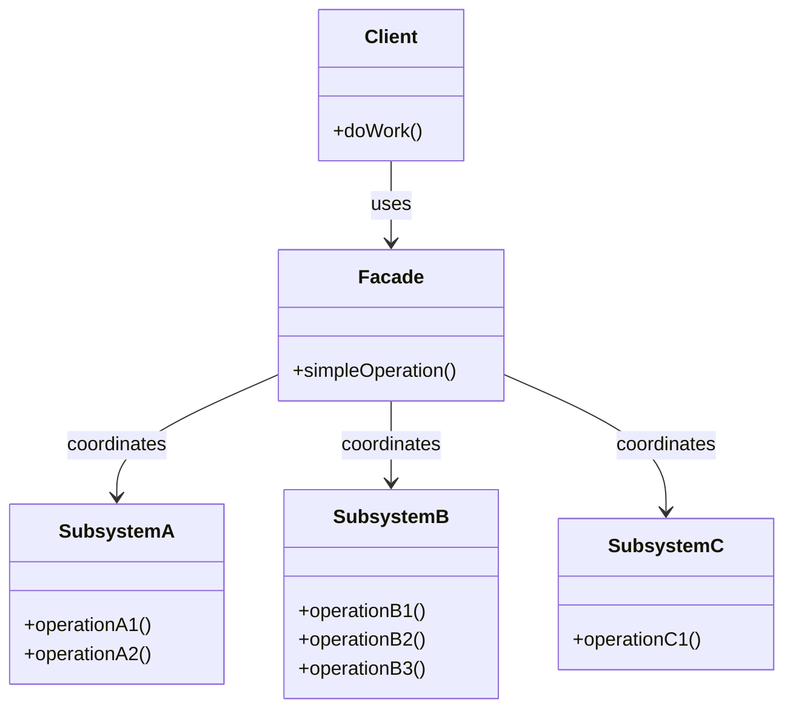
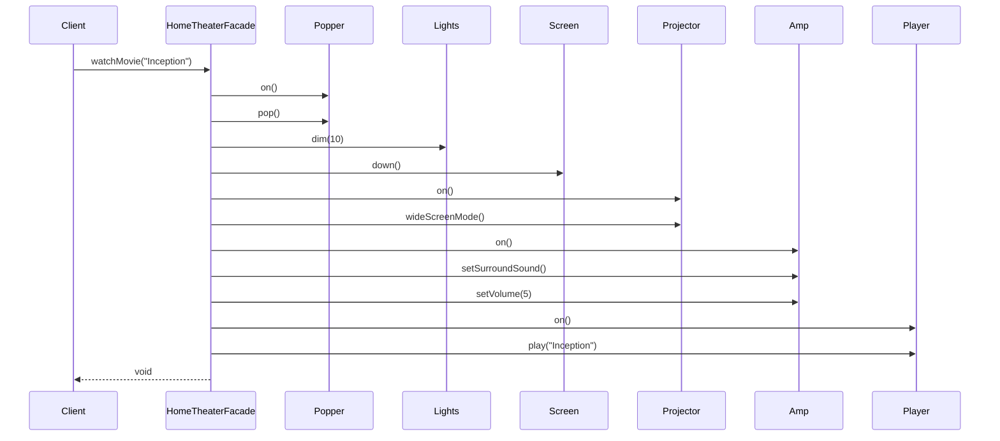

You're integrating a video processing library. It has 47 classes for encoding, decoding, formats, codecs, filters, metadata, and streaming. Your application just needs to convert videos between formats.

Do you expose all 47 classes to your code? Or do you create a simple `VideoConverter` that handles the common case?

That's the Facade pattern.

## What is the Facade Pattern?

Facade provides a simplified interface to a complex subsystem. It doesn't replace the subsystem; it wraps it with a friendlier API for common use cases.



The client calls the Facade. The Facade orchestrates the subsystem components. The complexity is hidden, not eliminated.

## When to Use Facade

| Use Facade When | Skip Facade When |
|----------------|------------------|
| Subsystem is complex with many interdependent classes | Subsystem is already simple |
| Most clients need only common functionality | Clients need full subsystem flexibility |
| You want to layer your architecture | You're adding unnecessary indirection |
| You're wrapping a third-party library | Direct API usage is clear enough |

Facade is about convenience, not control. It makes common cases easy while still allowing direct subsystem access for advanced needs.

## Implementation

Let's create a facade for a home theater system with multiple components.

### The Complex Subsystem

```java
public class Amplifier {
    private String description;
    private Tuner tuner;
    private StreamingPlayer player;
    
    public void on() { System.out.println(description + " on"); }
    public void off() { System.out.println(description + " off"); }
    public void setStreamingPlayer(StreamingPlayer player) { this.player = player; }
    public void setSurroundSound() { System.out.println(description + " surround sound on"); }
    public void setVolume(int level) { System.out.println(description + " volume set to " + level); }
}

public class Tuner {
    private String description;
    private Amplifier amplifier;
    private double frequency;
    
    public void on() { System.out.println(description + " on"); }
    public void off() { System.out.println(description + " off"); }
    public void setFrequency(double frequency) { 
        this.frequency = frequency;
        System.out.println(description + " frequency set to " + frequency);
    }
}

public class StreamingPlayer {
    private String description;
    private Amplifier amplifier;
    private String movie;
    
    public void on() { System.out.println(description + " on"); }
    public void off() { System.out.println(description + " off"); }
    public void play(String movie) { 
        this.movie = movie;
        System.out.println(description + " playing \"" + movie + "\""); 
    }
    public void stop() { System.out.println(description + " stopped"); }
    public void pause() { System.out.println(description + " paused"); }
}

public class Projector {
    private String description;
    private StreamingPlayer player;
    
    public void on() { System.out.println(description + " on"); }
    public void off() { System.out.println(description + " off"); }
    public void wideScreenMode() { System.out.println(description + " in widescreen mode"); }
    public void tvMode() { System.out.println(description + " in TV mode"); }
}

public class Screen {
    private String description;
    
    public void up() { System.out.println(description + " going up"); }
    public void down() { System.out.println(description + " going down"); }
}

public class TheaterLights {
    private String description;
    
    public void on() { System.out.println(description + " on"); }
    public void off() { System.out.println(description + " off"); }
    public void dim(int level) { System.out.println(description + " dimmed to " + level + "%"); }
}

public class PopcornPopper {
    private String description;
    
    public void on() { System.out.println(description + " on"); }
    public void off() { System.out.println(description + " off"); }
    public void pop() { System.out.println(description + " popping popcorn!"); }
}
```

Without a facade, watching a movie requires:

```java
// All this just to watch a movie!
popper.on();
popper.pop();
lights.dim(10);
screen.down();
projector.on();
projector.wideScreenMode();
amp.on();
amp.setStreamingPlayer(player);
amp.setSurroundSound();
amp.setVolume(5);
player.on();
player.play("Inception");
```

### The Facade

```java
public class HomeTheaterFacade {
    private final Amplifier amp;
    private final Tuner tuner;
    private final StreamingPlayer player;
    private final Projector projector;
    private final Screen screen;
    private final TheaterLights lights;
    private final PopcornPopper popper;
    
    public HomeTheaterFacade(
            Amplifier amp,
            Tuner tuner,
            StreamingPlayer player,
            Projector projector,
            Screen screen,
            TheaterLights lights,
            PopcornPopper popper) {
        this.amp = amp;
        this.tuner = tuner;
        this.player = player;
        this.projector = projector;
        this.screen = screen;
        this.lights = lights;
        this.popper = popper;
    }
    
    public void watchMovie(String movie) {
        System.out.println("Get ready to watch a movie...");
        
        popper.on();
        popper.pop();
        lights.dim(10);
        screen.down();
        projector.on();
        projector.wideScreenMode();
        amp.on();
        amp.setStreamingPlayer(player);
        amp.setSurroundSound();
        amp.setVolume(5);
        player.on();
        player.play(movie);
    }
    
    public void endMovie() {
        System.out.println("Shutting movie theater down...");
        
        popper.off();
        lights.on();
        screen.up();
        projector.off();
        amp.off();
        player.stop();
        player.off();
    }
    
    public void listenToRadio(double frequency) {
        System.out.println("Tuning in the radio...");
        
        tuner.on();
        tuner.setFrequency(frequency);
        amp.on();
        amp.setVolume(5);
    }
    
    public void endRadio() {
        System.out.println("Shutting down the radio...");
        
        tuner.off();
        amp.off();
    }
}
```

### Usage

```java
// Create the components
Amplifier amp = new Amplifier("Top-O-Line Amplifier");
Tuner tuner = new Tuner("Top-O-Line AM/FM Tuner");
StreamingPlayer player = new StreamingPlayer("Top-O-Line Streaming Player");
Projector projector = new Projector("Top-O-Line Projector");
Screen screen = new Screen("Theater Screen");
TheaterLights lights = new TheaterLights("Theater Ceiling Lights");
PopcornPopper popper = new PopcornPopper("Popcorn Popper");

// Create the facade
HomeTheaterFacade homeTheater = new HomeTheaterFacade(
    amp, tuner, player, projector, screen, lights, popper
);

// Simple usage
homeTheater.watchMovie("Inception");

// ... enjoy the movie ...

homeTheater.endMovie();
```

## How It Works



The client makes one call. The facade orchestrates all the subsystem interactions.

## Facade for Third-Party Libraries

A common use case is wrapping complex third-party APIs:

```java
// Complex AWS SDK usage
public class S3Facade {
    private final AmazonS3 s3Client;
    private final String bucketName;
    
    public S3Facade(String region, String bucketName) {
        this.s3Client = AmazonS3ClientBuilder.standard()
            .withRegion(region)
            .withCredentials(new DefaultAWSCredentialsProviderChain())
            .build();
        this.bucketName = bucketName;
    }
    
    public void uploadFile(String key, Path filePath) {
        try {
            PutObjectRequest request = PutObjectRequest.builder()
                .bucket(bucketName)
                .key(key)
                .build();
            
            s3Client.putObject(request, RequestBody.fromFile(filePath));
        } catch (S3Exception e) {
            throw new StorageException("Failed to upload " + key, e);
        }
    }
    
    public byte[] downloadFile(String key) {
        try {
            GetObjectRequest request = GetObjectRequest.builder()
                .bucket(bucketName)
                .key(key)
                .build();
            
            ResponseBytes<GetObjectResponse> response = 
                s3Client.getObjectAsBytes(request);
            return response.asByteArray();
        } catch (NoSuchKeyException e) {
            throw new FileNotFoundException(key);
        } catch (S3Exception e) {
            throw new StorageException("Failed to download " + key, e);
        }
    }
    
    public void deleteFile(String key) {
        try {
            DeleteObjectRequest request = DeleteObjectRequest.builder()
                .bucket(bucketName)
                .key(key)
                .build();
            
            s3Client.deleteObject(request);
        } catch (S3Exception e) {
            throw new StorageException("Failed to delete " + key, e);
        }
    }
    
    public List<String> listFiles(String prefix) {
        try {
            ListObjectsV2Request request = ListObjectsV2Request.builder()
                .bucket(bucketName)
                .prefix(prefix)
                .build();
            
            return s3Client.listObjectsV2(request)
                .contents()
                .stream()
                .map(S3Object::key)
                .collect(Collectors.toList());
        } catch (S3Exception e) {
            throw new StorageException("Failed to list files", e);
        }
    }
}

// Usage - simple and focused
S3Facade storage = new S3Facade("us-east-1", "my-bucket");
storage.uploadFile("documents/report.pdf", Paths.get("/tmp/report.pdf"));
byte[] content = storage.downloadFile("documents/report.pdf");
```

## Multiple Facades

Large systems can have multiple facades for different use cases:

```java
// Facade for order management
public class OrderFacade {
    public Order createOrder(Customer customer, List<OrderItem> items) { ... }
    public void cancelOrder(String orderId) { ... }
    public OrderStatus getStatus(String orderId) { ... }
}

// Facade for inventory management
public class InventoryFacade {
    public int checkStock(String productId) { ... }
    public void reserveStock(String productId, int quantity) { ... }
    public void releaseStock(String productId, int quantity) { ... }
}

// Facade for reporting
public class ReportingFacade {
    public SalesReport getDailySales(LocalDate date) { ... }
    public InventoryReport getStockLevels() { ... }
    public CustomerReport getTopCustomers(int limit) { ... }
}
```

Each facade focuses on a specific domain, keeping interfaces cohesive.

## Common Mistakes

### 1. Facade Becoming a God Object

If your facade has 50 methods, it's doing too much:

```java
// Too big - should be split
public class EverythingFacade {
    public void createUser() { ... }
    public void processPayment() { ... }
    public void sendEmail() { ... }
    public void generateReport() { ... }
    public void updateInventory() { ... }
    // ... 45 more methods
}

// Better - multiple focused facades
public class UserFacade { ... }
public class PaymentFacade { ... }
public class NotificationFacade { ... }
```

### 2. Hiding Too Much

Facade should simplify, not restrict. Clients should still be able to access subsystem components when needed:

```java
public class HomeTheaterFacade {
    private final Amplifier amp;
    
    // Simple operations
    public void watchMovie(String movie) { ... }
    
    // Allow direct access for power users
    public Amplifier getAmplifier() {
        return amp;
    }
}

// Power user can fine-tune
homeTheater.getAmplifier().setVolume(11);
```

### 3. Adding Business Logic to Facade

Facade should delegate, not implement business rules:

```java
// Wrong - business logic in facade
public class OrderFacade {
    public void placeOrder(Order order) {
        if (order.getTotal() > 1000) {
            order.applyDiscount(0.1);  // Business rule doesn't belong here
        }
        // ...
    }
}

// Right - facade delegates to domain objects
public class OrderFacade {
    public void placeOrder(Order order) {
        pricingService.applyDiscounts(order);  // Delegate to appropriate service
        orderService.save(order);
        notificationService.sendConfirmation(order);
    }
}
```

## Real-World Examples

**JDBC**: `DriverManager` is a facade for database connections. You don't deal with socket management, protocol handling, or connection pooling directly.

**SLF4J**: Provides a simple logging facade over various logging implementations.

**Spring JDBC Template**: Simplifies JDBC operations, hiding connection management, statement creation, and exception handling.

**Java NIO Channels**: `Files` class is a facade over the complex NIO channel API.

## Related Patterns

**[Adapter](/design-patterns/adapter/)** changes one interface to another. Facade creates a new, simpler interface for a subsystem.

**[Mediator](/design-patterns/mediator/)** centralizes communication between objects. Facade provides a simple interface but doesn't add communication logic.

**[Singleton](/design-patterns/singleton/)** is often used with Facade. A single facade instance serves the entire application.

**Abstract Factory** can work behind a facade. The facade uses the factory to create subsystem components.

## Wrapping Up

Facade wraps a complex subsystem with a simpler interface. It doesn't hide the subsystem completely; it provides a convenient shortcut for common operations.

Use Facade when subsystems are complex, when you want to decouple clients from implementation details, or when wrapping third-party libraries. Keep facades focused; split large facades into smaller, domain-specific ones.

Remember: Facade is about convenience, not control. It makes easy things easy while keeping hard things possible.

---

**Further Reading:**

- [Head First Design Patterns](https://www.oreilly.com/library/view/head-first-design/0596007124/) - Chapter 7
- [Principle of Least Knowledge](https://en.wikipedia.org/wiki/Law_of_Demeter) (Law of Demeter)

