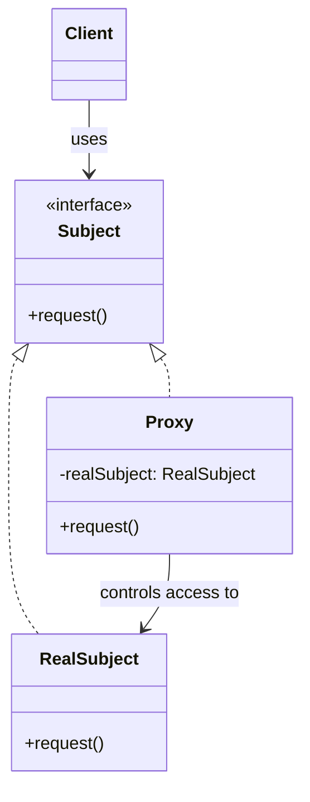
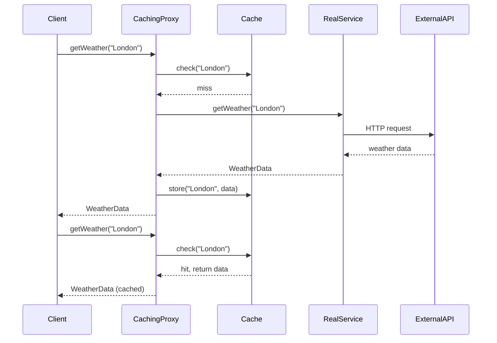

You have a high-resolution image gallery. Loading all images at startup takes 30 seconds. Users might only view a few images. Loading everything upfront wastes time and memory.

What if images loaded only when displayed? That's what a proxy does.

## What is the Proxy Pattern?

Proxy provides a placeholder for another object. It controls access to the original, adding behavior like lazy loading, access control, or logging without changing the original's interface.



The client works with the Subject interface. It doesn't know if it's talking to the real object or a proxy.

## Types of Proxy

| Type | Purpose | Example |
|------|---------|---------|
| Virtual Proxy | Lazy loading | Defer image loading until display |
| Protection Proxy | Access control | Check permissions before operations |
| Remote Proxy | Network abstraction | Represent remote service locally |
| Caching Proxy | Performance | Cache expensive operation results |
| Logging Proxy | Monitoring | Record method calls and timing |

## When to Use Proxy

| Use Proxy When | Skip Proxy When |
|---------------|-----------------|
| Object initialization is expensive | Objects are lightweight |
| You need access control | Everyone should have full access |
| You want to add logging or caching | Direct access is fine |
| Working with remote services | All objects are local |

## Implementation

### Virtual Proxy: Lazy Loading

```java
public interface Image {
    void display();
    int getWidth();
    int getHeight();
}

public class HighResolutionImage implements Image {
    private final String filename;
    private byte[] imageData;
    
    public HighResolutionImage(String filename) {
        this.filename = filename;
        loadFromDisk();  // Expensive operation
    }
    
    private void loadFromDisk() {
        System.out.println("Loading high-resolution image: " + filename);
        // Simulate loading large file
        try {
            Thread.sleep(2000);  // 2 seconds to load
        } catch (InterruptedException e) {
            Thread.currentThread().interrupt();
        }
        this.imageData = new byte[50_000_000];  // 50MB image
        System.out.println("Finished loading: " + filename);
    }
    
    @Override
    public void display() {
        System.out.println("Displaying: " + filename);
    }
    
    @Override
    public int getWidth() { return 4096; }
    
    @Override
    public int getHeight() { return 3072; }
}

public class ImageProxy implements Image {
    private final String filename;
    private HighResolutionImage realImage;
    
    public ImageProxy(String filename) {
        this.filename = filename;
        // Don't load the real image yet
    }
    
    @Override
    public void display() {
        // Load only when actually needed
        if (realImage == null) {
            realImage = new HighResolutionImage(filename);
        }
        realImage.display();
    }
    
    @Override
    public int getWidth() {
        // Can return cached metadata without loading full image
        return 4096;
    }
    
    @Override
    public int getHeight() {
        return 3072;
    }
}
```

Usage:

```java
// Gallery with 100 images
List<Image> gallery = new ArrayList<>();
for (int i = 1; i <= 100; i++) {
    gallery.add(new ImageProxy("photo_" + i + ".jpg"));  // Instant
}
// No images loaded yet!

// User views first image
gallery.get(0).display();  // Now it loads

// Only loaded images the user actually viewed
```

### Protection Proxy: Access Control

```java
public interface Document {
    String getContent();
    void setContent(String content);
    void delete();
}

public class SensitiveDocument implements Document {
    private String content;
    private final String documentId;
    
    public SensitiveDocument(String documentId, String content) {
        this.documentId = documentId;
        this.content = content;
    }
    
    @Override
    public String getContent() { return content; }
    
    @Override
    public void setContent(String content) { this.content = content; }
    
    @Override
    public void delete() {
        this.content = null;
        System.out.println("Document " + documentId + " deleted");
    }
}

public class ProtectedDocumentProxy implements Document {
    private final SensitiveDocument document;
    private final User currentUser;
    private final AccessControlService accessControl;
    
    public ProtectedDocumentProxy(SensitiveDocument document, 
                                   User currentUser,
                                   AccessControlService accessControl) {
        this.document = document;
        this.currentUser = currentUser;
        this.accessControl = accessControl;
    }
    
    @Override
    public String getContent() {
        if (!accessControl.canRead(currentUser, document)) {
            throw new AccessDeniedException("User cannot read this document");
        }
        logAccess("READ");
        return document.getContent();
    }
    
    @Override
    public void setContent(String content) {
        if (!accessControl.canWrite(currentUser, document)) {
            throw new AccessDeniedException("User cannot modify this document");
        }
        logAccess("WRITE");
        document.setContent(content);
    }
    
    @Override
    public void delete() {
        if (!accessControl.canDelete(currentUser, document)) {
            throw new AccessDeniedException("User cannot delete this document");
        }
        logAccess("DELETE");
        document.delete();
    }
    
    private void logAccess(String operation) {
        System.out.println("User " + currentUser.getId() + 
                          " performed " + operation + 
                          " on document " + document.getId());
    }
}
```

### Caching Proxy

```java
public interface WeatherService {
    WeatherData getWeather(String city);
}

public class ExternalWeatherService implements WeatherService {
    @Override
    public WeatherData getWeather(String city) {
        System.out.println("Calling external weather API for: " + city);
        // Expensive API call
        return callExternalApi(city);
    }
    
    private WeatherData callExternalApi(String city) {
        // Simulate API call
        try {
            Thread.sleep(1000);
        } catch (InterruptedException e) {
            Thread.currentThread().interrupt();
        }
        return new WeatherData(city, 22.5, "Sunny");
    }
}

public class CachingWeatherProxy implements WeatherService {
    private final WeatherService realService;
    private final Map<String, CacheEntry> cache = new ConcurrentHashMap<>();
    private final Duration cacheDuration;
    
    public CachingWeatherProxy(WeatherService realService, Duration cacheDuration) {
        this.realService = realService;
        this.cacheDuration = cacheDuration;
    }
    
    @Override
    public WeatherData getWeather(String city) {
        CacheEntry entry = cache.get(city);
        
        if (entry != null && !entry.isExpired()) {
            System.out.println("Cache hit for: " + city);
            return entry.getData();
        }
        
        System.out.println("Cache miss for: " + city);
        WeatherData data = realService.getWeather(city);
        cache.put(city, new CacheEntry(data, Instant.now().plus(cacheDuration)));
        return data;
    }
    
    private class CacheEntry {
        private final WeatherData data;
        private final Instant expiresAt;
        
        CacheEntry(WeatherData data, Instant expiresAt) {
            this.data = data;
            this.expiresAt = expiresAt;
        }
        
        boolean isExpired() {
            return Instant.now().isAfter(expiresAt);
        }
        
        WeatherData getData() { return data; }
    }
}

// Usage
WeatherService weather = new CachingWeatherProxy(
    new ExternalWeatherService(),
    Duration.ofMinutes(15)
);

weather.getWeather("London");  // API call
weather.getWeather("London");  // Cache hit
weather.getWeather("Paris");   // API call
weather.getWeather("London");  // Cache hit
```

### Logging Proxy

```java
public class LoggingProxy implements UserService {
    private final UserService realService;
    private final Logger logger;
    
    public LoggingProxy(UserService realService, Logger logger) {
        this.realService = realService;
        this.logger = logger;
    }
    
    @Override
    public User findById(String id) {
        long startTime = System.currentTimeMillis();
        
        try {
            User result = realService.findById(id);
            logSuccess("findById", startTime, Map.of("id", id));
            return result;
        } catch (Exception e) {
            logError("findById", startTime, Map.of("id", id), e);
            throw e;
        }
    }
    
    @Override
    public User save(User user) {
        long startTime = System.currentTimeMillis();
        
        try {
            User result = realService.save(user);
            logSuccess("save", startTime, Map.of("userId", user.getId()));
            return result;
        } catch (Exception e) {
            logError("save", startTime, Map.of("userId", user.getId()), e);
            throw e;
        }
    }
    
    private void logSuccess(String method, long startTime, Map<String, Object> params) {
        long duration = System.currentTimeMillis() - startTime;
        logger.info("Method {} completed in {}ms. Params: {}", method, duration, params);
    }
    
    private void logError(String method, long startTime, Map<String, Object> params, Exception e) {
        long duration = System.currentTimeMillis() - startTime;
        logger.error("Method {} failed after {}ms. Params: {}. Error: {}", 
                    method, duration, params, e.getMessage());
    }
}
```

## Java Dynamic Proxy

Java's built-in `Proxy` class creates proxies at runtime:

```java
public class LoggingHandler implements InvocationHandler {
    private final Object target;
    
    public LoggingHandler(Object target) {
        this.target = target;
    }
    
    @Override
    public Object invoke(Object proxy, Method method, Object[] args) throws Throwable {
        System.out.println("Calling: " + method.getName());
        long start = System.currentTimeMillis();
        
        try {
            Object result = method.invoke(target, args);
            System.out.println("Completed in " + (System.currentTimeMillis() - start) + "ms");
            return result;
        } catch (InvocationTargetException e) {
            System.out.println("Failed with: " + e.getCause().getMessage());
            throw e.getCause();
        }
    }
    
    @SuppressWarnings("unchecked")
    public static <T> T createProxy(T target, Class<T> interfaceType) {
        return (T) Proxy.newProxyInstance(
            interfaceType.getClassLoader(),
            new Class<?>[]{ interfaceType },
            new LoggingHandler(target)
        );
    }
}

// Usage
UserService realService = new UserServiceImpl();
UserService proxiedService = LoggingHandler.createProxy(realService, UserService.class);

proxiedService.findById("123");
// Output:
// Calling: findById
// Completed in 15ms
```

## How It Works



## Common Mistakes

### 1. Proxy Interface Mismatch

The proxy must implement the same interface as the real subject:

```java
// Wrong - different interface
public class BadProxy {  // Doesn't implement Image
    public void show() { ... }  // Different method name
}

// Right - same interface
public class GoodProxy implements Image {
    @Override
    public void display() { ... }
}
```

### 2. Forgetting Thread Safety

Caching proxies need synchronization:

```java
// Thread-unsafe
public WeatherData getWeather(String city) {
    if (!cache.containsKey(city)) {  // Two threads could pass this check
        cache.put(city, realService.getWeather(city));  // Duplicate calls
    }
    return cache.get(city);
}

// Thread-safe
public WeatherData getWeather(String city) {
    return cache.computeIfAbsent(city, k -> realService.getWeather(k));
}
```

### 3. Breaking the Abstraction

Don't expose that it's a proxy:

```java
// Wrong - leaks implementation
public class ImageProxy implements Image {
    public boolean isLoaded() { ... }  // Exposes proxy nature
    public HighResolutionImage getRealImage() { ... }  // Leaks real subject
}

// Right - transparent proxy
public class ImageProxy implements Image {
    // Only interface methods, nothing proxy-specific
}
```

## Real-World Examples

**Hibernate Lazy Loading**: Entity relationships use proxies. Associated objects load only when accessed.

**Spring AOP**: Creates proxies to add cross-cutting concerns like transactions, security, and logging.

**Java RMI**: Remote proxies represent objects on different machines.

**CDI/EJB Proxies**: Container-managed beans are wrapped in proxies for lifecycle management.

## Related Patterns

**[Adapter](/design-patterns/adapter/)** changes the interface. Proxy keeps the same interface but controls access.

**[Decorator](/design-patterns/decorator/)** adds behavior but doesn't control lifecycle. Proxy often creates or manages the real subject.

**[Facade](/design-patterns/facade/)** provides a different, simpler interface. Proxy provides the same interface.

## Wrapping Up

Proxy controls access to objects without clients knowing. It's the same interface as the real object, with added behavior like lazy loading, access control, caching, or logging.

Virtual proxies defer expensive operations. Protection proxies enforce security. Caching proxies improve performance. Logging proxies add observability.

The key is transparency. Clients shouldn't care whether they're using a proxy or the real thing.

---

**Further Reading:**

- [Java Dynamic Proxy Documentation](https://docs.oracle.com/javase/8/docs/api/java/lang/reflect/Proxy.html)
- [Spring AOP Proxies](https://docs.spring.io/spring-framework/docs/current/reference/html/core.html#aop)

