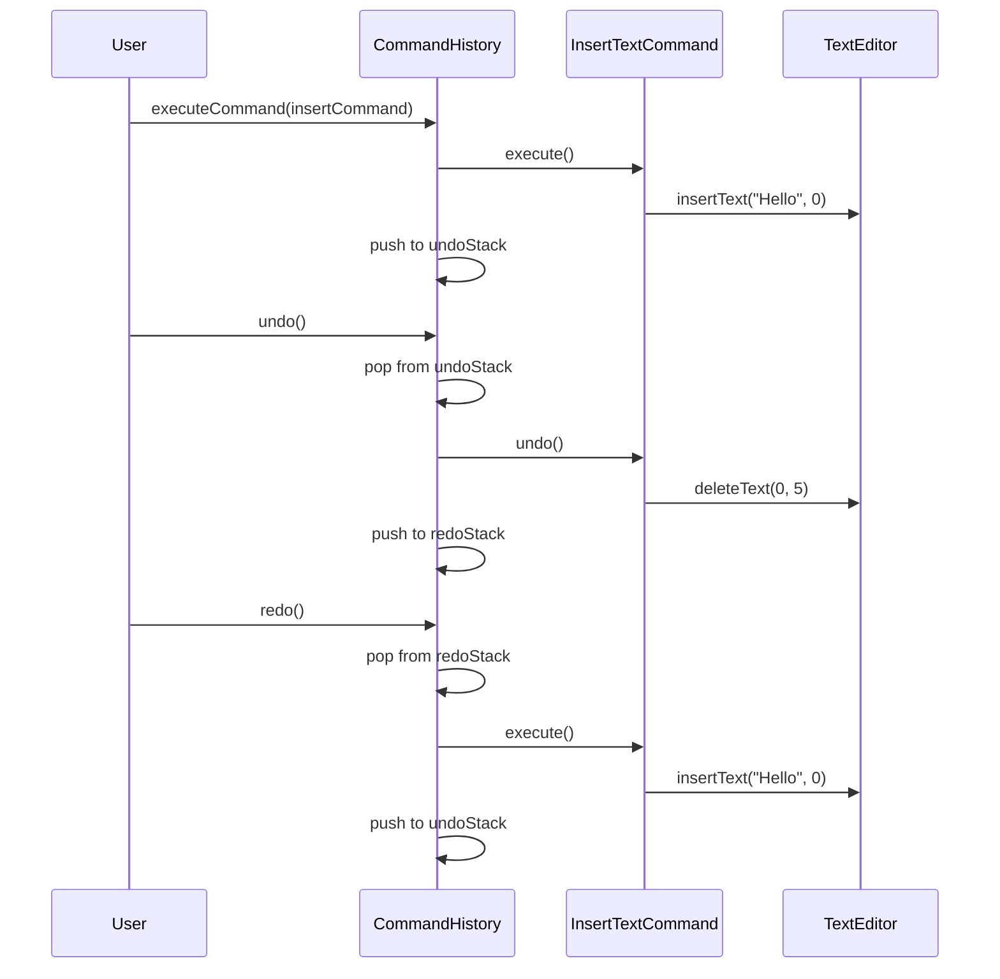

You're building a text editor. Users type, delete, format text, and expect to undo any action. Some actions should be batched. All actions should be logged for recovery.

How do you structure this? You turn each action into an object.

## What is the Command Pattern?

Command encapsulates a request as an object. This lets you parameterize objects with operations, queue requests, log them, and support undo.


Button holds a Command. When clicked, it runs SaveCmd which calls Editor.save(). Commands are first-class objects you can store, queue, and reverse.

## When to Use Command

| Use Command When | Skip Command When |
|-----------------|-------------------|
| You need undo/redo functionality | Operations are simple and one-way |
| Operations should be queued | Everything executes immediately |
| You want to log operations for audit or replay | Logging isn't needed |
| You need transactional behavior | Operations are atomic and isolated |

Command shines when you need to decouple "when" and "how" an operation executes from "what" the operation is.

## Implementation

### Basic Text Editor with Undo/Redo

```java
public interface Command {
    void execute();
    void undo();
    String getDescription();
}

public class TextEditor {
    private StringBuilder content = new StringBuilder();
    private int cursorPosition = 0;
    
    public void insertText(String text, int position) {
        content.insert(position, text);
        cursorPosition = position + text.length();
    }
    
    public void deleteText(int start, int length) {
        content.delete(start, start + length);
        cursorPosition = start;
    }
    
    public String getContent() {
        return content.toString();
    }
    
    public int getCursorPosition() {
        return cursorPosition;
    }
}

public class InsertTextCommand implements Command {
    private final TextEditor editor;
    private final String text;
    private final int position;
    
    public InsertTextCommand(TextEditor editor, String text, int position) {
        this.editor = editor;
        this.text = text;
        this.position = position;
    }
    
    @Override
    public void execute() {
        editor.insertText(text, position);
    }
    
    @Override
    public void undo() {
        editor.deleteText(position, text.length());
    }
    
    @Override
    public String getDescription() {
        return "Insert '" + text + "' at position " + position;
    }
}

public class DeleteTextCommand implements Command {
    private final TextEditor editor;
    private final int position;
    private final int length;
    private String deletedText;  // Store for undo
    
    public DeleteTextCommand(TextEditor editor, int position, int length) {
        this.editor = editor;
        this.position = position;
        this.length = length;
    }
    
    @Override
    public void execute() {
        // Save text before deleting
        deletedText = editor.getContent().substring(position, position + length);
        editor.deleteText(position, length);
    }
    
    @Override
    public void undo() {
        editor.insertText(deletedText, position);
    }
    
    @Override
    public String getDescription() {
        return "Delete " + length + " characters at position " + position;
    }
}
```

### Command History Manager

```java
public class CommandHistory {
    private final Deque<Command> undoStack = new ArrayDeque<>();
    private final Deque<Command> redoStack = new ArrayDeque<>();
    private final int maxHistorySize;
    
    public CommandHistory(int maxHistorySize) {
        this.maxHistorySize = maxHistorySize;
    }
    
    public void executeCommand(Command command) {
        command.execute();
        undoStack.push(command);
        redoStack.clear();  // Clear redo stack on new command
        
        // Limit history size
        while (undoStack.size() > maxHistorySize) {
            undoStack.removeLast();
        }
    }
    
    public boolean canUndo() {
        return !undoStack.isEmpty();
    }
    
    public boolean canRedo() {
        return !redoStack.isEmpty();
    }
    
    public void undo() {
        if (canUndo()) {
            Command command = undoStack.pop();
            command.undo();
            redoStack.push(command);
        }
    }
    
    public void redo() {
        if (canRedo()) {
            Command command = redoStack.pop();
            command.execute();
            undoStack.push(command);
        }
    }
    
    public List<String> getUndoHistory() {
        return undoStack.stream()
            .map(Command::getDescription)
            .collect(Collectors.toList());
    }
}
```

### Usage

```java
TextEditor editor = new TextEditor();
CommandHistory history = new CommandHistory(100);

// Type some text
history.executeCommand(new InsertTextCommand(editor, "Hello", 0));
history.executeCommand(new InsertTextCommand(editor, " World", 5));
System.out.println(editor.getContent());  // "Hello World"

// Delete a word
history.executeCommand(new DeleteTextCommand(editor, 6, 5));
System.out.println(editor.getContent());  // "Hello "

// Undo the delete
history.undo();
System.out.println(editor.getContent());  // "Hello World"

// Undo the second insert
history.undo();
System.out.println(editor.getContent());  // "Hello"

// Redo
history.redo();
System.out.println(editor.getContent());  // "Hello World"
```

## Command Queue

Commands can be queued for later execution:

```java
public class TaskQueue {
    private final BlockingQueue<Command> queue = new LinkedBlockingQueue<>();
    private final ExecutorService executor;
    private volatile boolean running = true;
    
    public TaskQueue(int workerCount) {
        this.executor = Executors.newFixedThreadPool(workerCount);
        startWorkers(workerCount);
    }
    
    private void startWorkers(int count) {
        for (int i = 0; i < count; i++) {
            executor.submit(() -> {
                while (running) {
                    try {
                        Command command = queue.poll(100, TimeUnit.MILLISECONDS);
                        if (command != null) {
                            command.execute();
                        }
                    } catch (InterruptedException e) {
                        Thread.currentThread().interrupt();
                        break;
                    }
                }
            });
        }
    }
    
    public void submit(Command command) {
        queue.offer(command);
    }
    
    public void shutdown() {
        running = false;
        executor.shutdown();
    }
}

// Usage
TaskQueue queue = new TaskQueue(4);

queue.submit(new SendEmailCommand(email));
queue.submit(new ProcessPaymentCommand(payment));
queue.submit(new GenerateReportCommand(reportParams));
```

## Macro Commands (Composite Command)

Combine multiple commands into one:

```java
public class MacroCommand implements Command {
    private final List<Command> commands;
    private final String description;
    
    public MacroCommand(String description, Command... commands) {
        this.description = description;
        this.commands = Arrays.asList(commands);
    }
    
    @Override
    public void execute() {
        for (Command command : commands) {
            command.execute();
        }
    }
    
    @Override
    public void undo() {
        // Undo in reverse order
        ListIterator<Command> iterator = commands.listIterator(commands.size());
        while (iterator.hasPrevious()) {
            iterator.previous().undo();
        }
    }
    
    @Override
    public String getDescription() {
        return description;
    }
}

// Usage - one undo reverts all
Command formatDocument = new MacroCommand("Format Document",
    new SetFontCommand(editor, "Arial", 12),
    new SetMarginsCommand(editor, 1, 1, 1, 1),
    new AddHeaderCommand(editor, "Document Title"),
    new AddFooterCommand(editor, "Page {page}")
);

history.executeCommand(formatDocument);
// One undo reverts all formatting
history.undo();
```

## Transaction Pattern with Commands

```java
public class TransactionalCommandExecutor {
    private final List<Command> executedCommands = new ArrayList<>();
    
    public void execute(Command command) {
        try {
            command.execute();
            executedCommands.add(command);
        } catch (Exception e) {
            rollback();
            throw new TransactionException("Command failed, rolled back", e);
        }
    }
    
    public void commit() {
        executedCommands.clear();
    }
    
    public void rollback() {
        // Undo all commands in reverse order
        ListIterator<Command> iterator = 
            executedCommands.listIterator(executedCommands.size());
        
        while (iterator.hasPrevious()) {
            Command command = iterator.previous();
            try {
                command.undo();
            } catch (Exception e) {
                // Log but continue rollback
                System.err.println("Failed to undo: " + command.getDescription());
            }
        }
        executedCommands.clear();
    }
}

// Usage
TransactionalCommandExecutor tx = new TransactionalCommandExecutor();

try {
    tx.execute(new DebitAccountCommand(fromAccount, amount));
    tx.execute(new CreditAccountCommand(toAccount, amount));
    tx.execute(new RecordTransactionCommand(txId, fromAccount, toAccount, amount));
    tx.commit();
} catch (Exception e) {
    // All commands are automatically rolled back
    System.err.println("Transfer failed: " + e.getMessage());
}
```

## How It Works



## Common Mistakes

### 1. Not Storing Enough State for Undo

```java
// Wrong - can't undo without knowing what was deleted
public class BadDeleteCommand implements Command {
    @Override
    public void execute() {
        editor.deleteSelection();  // What was deleted?
    }
    
    @Override
    public void undo() {
        // Can't undo - we don't know what was deleted!
    }
}

// Right - capture state before modification
public class GoodDeleteCommand implements Command {
    private String deletedContent;
    private int position;
    
    @Override
    public void execute() {
        deletedContent = editor.getSelection();
        position = editor.getSelectionStart();
        editor.deleteSelection();
    }
    
    @Override
    public void undo() {
        editor.insertText(deletedContent, position);
    }
}
```

### 2. Commands with Side Effects

Commands should be isolated. External side effects make undo problematic:

```java
// Problematic - email can't be unsent
public class SendEmailCommand implements Command {
    @Override
    public void execute() {
        emailService.send(email);  // Can't undo!
    }
    
    @Override
    public void undo() {
        // Too late, email is sent
    }
}

// Better - separate queueing from sending
public class QueueEmailCommand implements Command {
    @Override
    public void execute() {
        emailQueue.add(email);  // Just queued, not sent
    }
    
    @Override
    public void undo() {
        emailQueue.remove(email);  // Can remove from queue
    }
}
```

### 3. Tight Coupling to Receiver

Commands should receive the receiver, not create it:

```java
// Wrong - command creates receiver
public class BadCommand implements Command {
    public void execute() {
        TextEditor editor = new TextEditor();  // Wrong!
        editor.doSomething();
    }
}

// Right - receiver is injected
public class GoodCommand implements Command {
    private final TextEditor editor;
    
    public GoodCommand(TextEditor editor) {
        this.editor = editor;
    }
}
```

## Real-World Examples

**Java Swing Actions**: `Action` interface represents commands for menu items and buttons.

**Spring Batch**: Job steps are commands that can be restarted and tracked.

**Git**: Each commit is like a command that can be reverted.

**Database Migrations**: Each migration is a command with up/down operations.

## Related Patterns

**[Memento](/design-patterns/memento/)** can store state for complex undo operations. Command uses Memento to save state before modifications.

**[Composite](/design-patterns/composite/)** enables macro commands. A composite command contains and executes multiple commands.

**[Prototype](/design-patterns/prototype/)** can clone commands for reuse or history.

**[Chain of Responsibility](/design-patterns/chain-of-responsibility/)** can process commands through a chain of handlers.

## Wrapping Up

Command turns operations into objects. This enables queuing, logging, undo/redo, and transactional behavior.

Store enough state to reverse the operation. Keep commands focused on single operations. Use composite commands for macros.

The pattern shines in GUIs, job schedulers, and anywhere you need to track, queue, or reverse operations.

---

**Further Reading:**

- [Head First Design Patterns](https://www.oreilly.com/library/view/head-first-design/0596007124/) - Chapter 6
- [Event Sourcing](https://martinfowler.com/eaaDev/EventSourcing.html) - Related pattern by Martin Fowler

