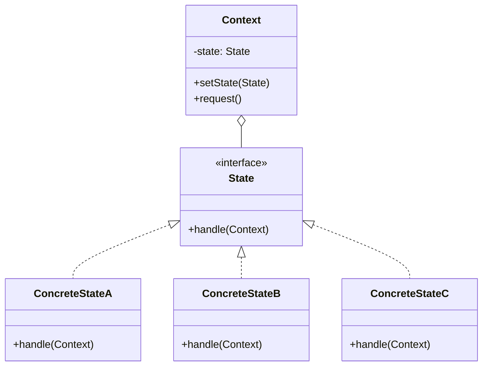
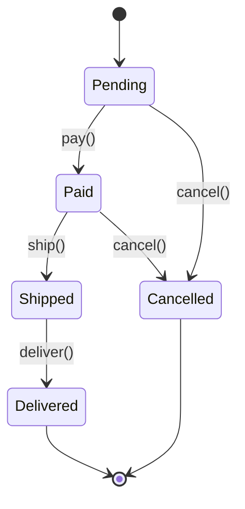

You're building an order processing system. Orders can be Pending, Paid, Shipped, Delivered, or Cancelled. Each state has different rules: you can cancel a Pending order, but not a Shipped one. You can ship a Paid order, but not a Pending one.

You could write a giant switch statement. Or you could let each state handle its own behavior.

## What is the State Pattern?

State allows an object to alter its behavior when its internal state changes. The object appears to change its class. Each state is a separate class that implements state-specific behavior.



The Context holds a reference to the current State. When you call a method on the Context, it delegates to the current State object. State objects can change the Context's state.

## When to Use State

| Use State When | Skip State When |
|---------------|-----------------|
| Object behavior varies significantly by state | Behavior is the same regardless of state |
| State transitions are complex | States are simple or few |
| You have large conditional blocks checking state | Conditions are simple |
| States should be extensible | All states are known and fixed |

State replaces complex conditionals with polymorphism. Each state class handles its own logic.

## Implementation

### Order Processing System

```java
public interface OrderState {
    void pay(OrderContext order);
    void ship(OrderContext order);
    void deliver(OrderContext order);
    void cancel(OrderContext order);
    String getStatus();
}

public class OrderContext {
    private OrderState state;
    private final String orderId;
    private final List<String> history = new ArrayList<>();
    
    public OrderContext(String orderId) {
        this.orderId = orderId;
        this.state = new PendingState();
        logTransition("Order created");
    }
    
    public void setState(OrderState state) {
        this.state = state;
        logTransition("State changed to: " + state.getStatus());
    }
    
    public void pay() {
        state.pay(this);
    }
    
    public void ship() {
        state.ship(this);
    }
    
    public void deliver() {
        state.deliver(this);
    }
    
    public void cancel() {
        state.cancel(this);
    }
    
    public String getStatus() {
        return state.getStatus();
    }
    
    private void logTransition(String message) {
        history.add(LocalDateTime.now() + ": " + message);
    }
    
    public List<String> getHistory() {
        return Collections.unmodifiableList(history);
    }
}
```

### State Implementations

```java
public class PendingState implements OrderState {
    
    @Override
    public void pay(OrderContext order) {
        System.out.println("Payment received. Order is now paid.");
        order.setState(new PaidState());
    }
    
    @Override
    public void ship(OrderContext order) {
        System.out.println("Cannot ship. Order is not paid yet.");
    }
    
    @Override
    public void deliver(OrderContext order) {
        System.out.println("Cannot deliver. Order is not shipped yet.");
    }
    
    @Override
    public void cancel(OrderContext order) {
        System.out.println("Order cancelled.");
        order.setState(new CancelledState());
    }
    
    @Override
    public String getStatus() {
        return "PENDING";
    }
}

public class PaidState implements OrderState {
    
    @Override
    public void pay(OrderContext order) {
        System.out.println("Order is already paid.");
    }
    
    @Override
    public void ship(OrderContext order) {
        System.out.println("Order shipped.");
        order.setState(new ShippedState());
    }
    
    @Override
    public void deliver(OrderContext order) {
        System.out.println("Cannot deliver. Order is not shipped yet.");
    }
    
    @Override
    public void cancel(OrderContext order) {
        System.out.println("Refund initiated. Order cancelled.");
        order.setState(new CancelledState());
    }
    
    @Override
    public String getStatus() {
        return "PAID";
    }
}

public class ShippedState implements OrderState {
    
    @Override
    public void pay(OrderContext order) {
        System.out.println("Order is already paid.");
    }
    
    @Override
    public void ship(OrderContext order) {
        System.out.println("Order is already shipped.");
    }
    
    @Override
    public void deliver(OrderContext order) {
        System.out.println("Order delivered successfully.");
        order.setState(new DeliveredState());
    }
    
    @Override
    public void cancel(OrderContext order) {
        System.out.println("Cannot cancel. Order is already shipped.");
    }
    
    @Override
    public String getStatus() {
        return "SHIPPED";
    }
}

public class DeliveredState implements OrderState {
    
    @Override
    public void pay(OrderContext order) {
        System.out.println("Order is already paid and delivered.");
    }
    
    @Override
    public void ship(OrderContext order) {
        System.out.println("Order is already delivered.");
    }
    
    @Override
    public void deliver(OrderContext order) {
        System.out.println("Order is already delivered.");
    }
    
    @Override
    public void cancel(OrderContext order) {
        System.out.println("Cannot cancel. Order is already delivered. Please initiate return.");
    }
    
    @Override
    public String getStatus() {
        return "DELIVERED";
    }
}

public class CancelledState implements OrderState {
    
    @Override
    public void pay(OrderContext order) {
        System.out.println("Cannot pay. Order is cancelled.");
    }
    
    @Override
    public void ship(OrderContext order) {
        System.out.println("Cannot ship. Order is cancelled.");
    }
    
    @Override
    public void deliver(OrderContext order) {
        System.out.println("Cannot deliver. Order is cancelled.");
    }
    
    @Override
    public void cancel(OrderContext order) {
        System.out.println("Order is already cancelled.");
    }
    
    @Override
    public String getStatus() {
        return "CANCELLED";
    }
}
```

### Usage

```java
OrderContext order = new OrderContext("ORD-12345");

System.out.println("Status: " + order.getStatus());  // PENDING

order.ship();    // Cannot ship. Order is not paid yet.
order.pay();     // Payment received. Order is now paid.
System.out.println("Status: " + order.getStatus());  // PAID

order.ship();    // Order shipped.
System.out.println("Status: " + order.getStatus());  // SHIPPED

order.cancel();  // Cannot cancel. Order is already shipped.
order.deliver(); // Order delivered successfully.
System.out.println("Status: " + order.getStatus());  // DELIVERED
```

## State Diagram



## State Machine with Guards

Add conditions to transitions:

```java
public interface DocumentState {
    void submit(DocumentContext doc);
    void approve(DocumentContext doc, User approver);
    void reject(DocumentContext doc, String reason);
    void publish(DocumentContext doc);
    String getStatus();
}

public class DraftState implements DocumentState {
    
    @Override
    public void submit(DocumentContext doc) {
        if (doc.getContent().isEmpty()) {
            System.out.println("Cannot submit empty document");
            return;
        }
        System.out.println("Document submitted for review");
        doc.setState(new PendingReviewState());
    }
    
    @Override
    public void approve(DocumentContext doc, User approver) {
        System.out.println("Cannot approve. Document not submitted yet.");
    }
    
    @Override
    public void reject(DocumentContext doc, String reason) {
        System.out.println("Cannot reject. Document not submitted yet.");
    }
    
    @Override
    public void publish(DocumentContext doc) {
        System.out.println("Cannot publish. Document not approved yet.");
    }
    
    @Override
    public String getStatus() {
        return "DRAFT";
    }
}

public class PendingReviewState implements DocumentState {
    
    @Override
    public void submit(DocumentContext doc) {
        System.out.println("Document already submitted for review.");
    }
    
    @Override
    public void approve(DocumentContext doc, User approver) {
        if (!approver.hasRole("REVIEWER")) {
            System.out.println("User is not authorized to approve.");
            return;
        }
        
        doc.setApprover(approver);
        System.out.println("Document approved by " + approver.getName());
        doc.setState(new ApprovedState());
    }
    
    @Override
    public void reject(DocumentContext doc, String reason) {
        doc.setRejectionReason(reason);
        System.out.println("Document rejected: " + reason);
        doc.setState(new DraftState());  // Back to draft for revision
    }
    
    @Override
    public void publish(DocumentContext doc) {
        System.out.println("Cannot publish. Document not approved yet.");
    }
    
    @Override
    public String getStatus() {
        return "PENDING_REVIEW";
    }
}
```

## State vs Strategy

This is a common confusion. Here's the difference:

```java
// STRATEGY - client picks the algorithm
public class PaymentService {
    private PaymentStrategy strategy;
    
    public void setStrategy(PaymentStrategy strategy) {
        this.strategy = strategy;  // Client decides
    }
    
    public void pay(Money amount) {
        strategy.pay(amount);
    }
}

// Client controls which strategy to use
paymentService.setStrategy(new CreditCardStrategy());
paymentService.pay(money);

// STATE - object changes its own behavior
public class TrafficLight {
    private TrafficLightState state;
    
    public TrafficLight() {
        this.state = new RedState();  // Initial state
    }
    
    public void next() {
        state.next(this);  // State decides what comes next
    }
}

// State transitions are internal
trafficLight.next();  // Red -> Green
trafficLight.next();  // Green -> Yellow
trafficLight.next();  // Yellow -> Red
```

With Strategy, the client picks. With State, the object transitions itself.

## Shared State Objects

If states are stateless, you can share instances:

```java
public class TrafficLightStates {
    public static final TrafficLightState RED = new RedState();
    public static final TrafficLightState YELLOW = new YellowState();
    public static final TrafficLightState GREEN = new GreenState();
}

public class RedState implements TrafficLightState {
    @Override
    public void next(TrafficLight light) {
        light.setState(TrafficLightStates.GREEN);
    }
    
    @Override
    public String getColor() {
        return "RED";
    }
}
```

This works when states don't hold context-specific data.

## Common Mistakes

### 1. Giant State Interface

Don't force all states to implement irrelevant methods:

```java
// Bad - every state must implement everything
public interface State {
    void methodForStateA();
    void methodForStateB();
    void methodForStateC();
    // States end up with many no-op implementations
}

// Better - use abstract base class with default behavior
public abstract class AbstractState implements State {
    @Override
    public void methodForStateA(Context ctx) {
        throw new IllegalStateException("Operation not allowed in " + getStatus());
    }
    // Other methods with sensible defaults
}
```

### 2. States Knowing Too Much

States should know about transitions, not business logic:

```java
// Bad - business logic in state
public class PaidState implements OrderState {
    @Override
    public void ship(OrderContext order) {
        if (inventory.check(order.getItems())) {  // Wrong place
            warehouse.reserve(order.getItems());   // Wrong place
            shipping.schedule(order);              // Wrong place
            order.setState(new ShippedState());
        }
    }
}

// Better - state handles transition, context handles business logic
public class PaidState implements OrderState {
    @Override
    public void ship(OrderContext order) {
        if (order.canShip()) {  // Context knows the rules
            order.processShipment();  // Context handles business logic
            order.setState(new ShippedState());
        }
    }
}
```

### 3. Forgetting Terminal States

Terminal states should be explicit:

```java
public class DeliveredState implements OrderState {
    @Override
    public void pay(OrderContext order) {
        // Don't silently ignore
        throw new IllegalStateException("Order is complete - no further actions");
    }
}
```

## Real-World Examples

**TCP Connection**: States like LISTEN, SYN_SENT, ESTABLISHED, CLOSE_WAIT.

**Media Player**: States like Playing, Paused, Stopped.

**Vending Machine**: States like Idle, HasMoney, Dispensing.

**Game Character**: States like Idle, Walking, Running, Jumping, Attacking.

## Related Patterns

**[Strategy](/design-patterns/strategy/)** is similar but externally controlled. State transitions internally.

**[Flyweight](/design-patterns/flyweight/)** can share stateless State objects.

**[Singleton](/design-patterns/singleton/)** is often used for shared state instances.

**State machines** often use State pattern internally.

## Wrapping Up

State pattern lets objects change behavior based on internal state. Each state is a class with its own implementation of state-specific behavior.

Use State when behavior varies significantly by state and transitions are complex. It replaces sprawling switch statements with clean, polymorphic code.

Remember: State controls its own transitions. The client doesn't pick states, the object moves through them based on operations and rules.

---

**Further Reading:**

- [Head First Design Patterns](https://www.oreilly.com/library/view/head-first-design/0596007124/) - Chapter 10
- [Finite State Machines](https://en.wikipedia.org/wiki/Finite-state_machine) on Wikipedia

