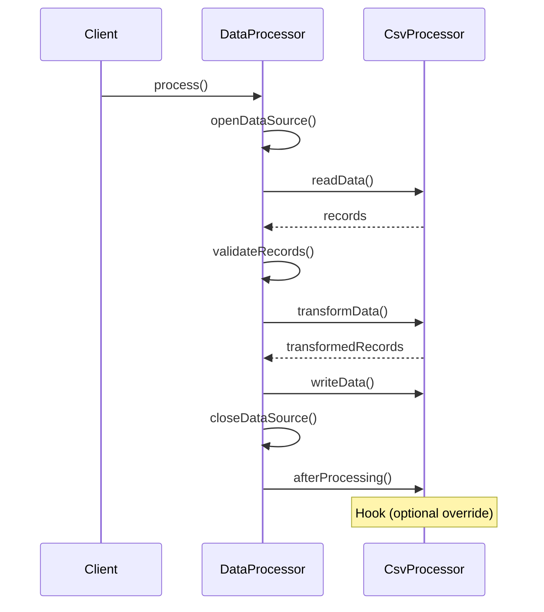

You're building a data processing framework. Every processor reads data, transforms it, and writes output. The read/write steps are always the same. Only the transformation logic varies.

Do you copy the boilerplate to each processor? Or do you define the skeleton once and let each processor fill in the blanks?

## What is the Template Method Pattern?

Template Method defines the skeleton of an algorithm in a base class. Subclasses override specific steps without changing the structure. The base class controls the flow; subclasses provide implementations.


Base.run() calls doA() and doB(). ImplX and ImplY provide their own implementations. The algorithm structure stays fixed.

## When to Use Template Method

| Use Template Method When | Skip Template Method When |
|-------------------------|--------------------------|
| Algorithm structure is fixed | Algorithm structure varies |
| Only certain steps need customization | Everything might change |
| You're building a framework | You need runtime flexibility |
| Inheritance makes sense | Composition is better |

Template Method is about controlled extension. You decide what can be customized and what stays fixed.

## Implementation

### Data Processing Framework

```java
public abstract class DataProcessor {
    
    // Template method - defines the algorithm skeleton
    public final void process() {
        openDataSource();
        
        List<Record> records = readData();
        validateRecords(records);
        
        List<Record> transformed = transformData(records);
        
        writeData(transformed);
        closeDataSource();
        
        // Hook - optional step
        afterProcessing();
    }
    
    // Common implementation - same for all processors
    private void openDataSource() {
        System.out.println("Opening data source connection...");
    }
    
    private void closeDataSource() {
        System.out.println("Closing data source connection...");
    }
    
    private void validateRecords(List<Record> records) {
        System.out.println("Validating " + records.size() + " records...");
        records.removeIf(r -> !r.isValid());
    }
    
    // Abstract methods - subclasses must implement
    protected abstract List<Record> readData();
    protected abstract List<Record> transformData(List<Record> records);
    protected abstract void writeData(List<Record> records);
    
    // Hook method - optional override
    protected void afterProcessing() {
        // Default: do nothing
    }
}
```

### Concrete Implementations

```java
public class CsvProcessor extends DataProcessor {
    private final String inputFile;
    private final String outputFile;
    
    public CsvProcessor(String inputFile, String outputFile) {
        this.inputFile = inputFile;
        this.outputFile = outputFile;
    }
    
    @Override
    protected List<Record> readData() {
        System.out.println("Reading CSV from: " + inputFile);
        return CsvReader.read(inputFile);
    }
    
    @Override
    protected List<Record> transformData(List<Record> records) {
        System.out.println("Transforming CSV data...");
        return records.stream()
            .map(this::normalizeFields)
            .collect(Collectors.toList());
    }
    
    @Override
    protected void writeData(List<Record> records) {
        System.out.println("Writing CSV to: " + outputFile);
        CsvWriter.write(outputFile, records);
    }
    
    private Record normalizeFields(Record record) {
        // CSV-specific transformation
        return record.toUpperCase();
    }
}

public class JsonProcessor extends DataProcessor {
    private final String apiUrl;
    private final String outputPath;
    
    public JsonProcessor(String apiUrl, String outputPath) {
        this.apiUrl = apiUrl;
        this.outputPath = outputPath;
    }
    
    @Override
    protected List<Record> readData() {
        System.out.println("Fetching JSON from API: " + apiUrl);
        return JsonFetcher.fetch(apiUrl);
    }
    
    @Override
    protected List<Record> transformData(List<Record> records) {
        System.out.println("Transforming JSON data...");
        return records.stream()
            .map(this::flattenNested)
            .filter(r -> r.hasRequiredFields())
            .collect(Collectors.toList());
    }
    
    @Override
    protected void writeData(List<Record> records) {
        System.out.println("Writing JSON to: " + outputPath);
        JsonWriter.write(outputPath, records);
    }
    
    @Override
    protected void afterProcessing() {
        // Override hook to add custom behavior
        System.out.println("Sending completion notification...");
        NotificationService.notify("JSON processing complete");
    }
    
    private Record flattenNested(Record record) {
        // JSON-specific transformation
        return record.flatten();
    }
}

public class DatabaseProcessor extends DataProcessor {
    private final String sourceQuery;
    private final String targetTable;
    
    public DatabaseProcessor(String sourceQuery, String targetTable) {
        this.sourceQuery = sourceQuery;
        this.targetTable = targetTable;
    }
    
    @Override
    protected List<Record> readData() {
        System.out.println("Executing query: " + sourceQuery);
        return Database.query(sourceQuery);
    }
    
    @Override
    protected List<Record> transformData(List<Record> records) {
        System.out.println("Transforming database records...");
        return records.stream()
            .map(this::enrichWithMetadata)
            .collect(Collectors.toList());
    }
    
    @Override
    protected void writeData(List<Record> records) {
        System.out.println("Inserting into table: " + targetTable);
        Database.batchInsert(targetTable, records);
    }
    
    private Record enrichWithMetadata(Record record) {
        record.put("processed_at", Instant.now());
        record.put("processor", "DatabaseProcessor");
        return record;
    }
}
```

### Usage

```java
// Process CSV file
DataProcessor csvProcessor = new CsvProcessor("input.csv", "output.csv");
csvProcessor.process();

// Process JSON API
DataProcessor jsonProcessor = new JsonProcessor("https://api.example.com/data", "output.json");
jsonProcessor.process();

// Process database
DataProcessor dbProcessor = new DatabaseProcessor(
    "SELECT * FROM source_table WHERE status = 'pending'",
    "processed_table"
);
dbProcessor.process();
```

## How It Works



The template method orchestrates. Subclasses provide specific implementations.

## Hook Methods

Hooks provide optional extension points:

```java
public abstract class Game {
    
    public final void play() {
        initialize();
        
        // Hook - can subclasses have custom start logic?
        if (wantsCustomStart()) {
            customStart();
        } else {
            defaultStart();
        }
        
        while (!isGameOver()) {
            takeTurn();
        }
        
        announceWinner();
        
        // Hook - cleanup is optional
        cleanup();
    }
    
    protected abstract void initialize();
    protected abstract boolean isGameOver();
    protected abstract void takeTurn();
    protected abstract void announceWinner();
    
    // Hook methods with default behavior
    protected boolean wantsCustomStart() {
        return false;  // Default: use standard start
    }
    
    protected void customStart() {
        // Default: nothing
    }
    
    protected void defaultStart() {
        System.out.println("Game started!");
    }
    
    protected void cleanup() {
        // Default: nothing to clean up
    }
}

public class ChessGame extends Game {
    
    @Override
    protected void initialize() {
        setupBoard();
        assignColors();
    }
    
    @Override
    protected boolean wantsCustomStart() {
        return true;  // Override hook
    }
    
    @Override
    protected void customStart() {
        System.out.println("White moves first...");
        startTimer();
    }
    
    @Override
    protected void cleanup() {
        saveGameHistory();
        stopTimer();
    }
    
    // ... other required methods
}
```

## Template Method in Testing

Common pattern for test setup:

```java
public abstract class IntegrationTest {
    
    protected Database db;
    protected HttpClient client;
    
    @BeforeEach
    public final void setUp() {
        // Fixed setup sequence
        startTestContainers();
        db = createDatabase();
        migrateSchema();
        client = createHttpClient();
        
        // Hook for subclass-specific setup
        beforeEach();
    }
    
    @AfterEach
    public final void tearDown() {
        // Hook for subclass-specific cleanup
        afterEach();
        
        // Fixed cleanup sequence
        cleanDatabase();
        stopTestContainers();
    }
    
    // Hooks for subclasses
    protected void beforeEach() { }
    protected void afterEach() { }
    
    // Subclasses can override for custom database
    protected Database createDatabase() {
        return new PostgresDatabase();
    }
}

public class UserServiceTest extends IntegrationTest {
    
    private UserService userService;
    
    @Override
    protected void beforeEach() {
        userService = new UserService(db);
        seedTestUsers();
    }
    
    @Override
    protected void afterEach() {
        // Custom cleanup
        userService.clearCache();
    }
    
    @Test
    void shouldFindUserById() {
        User user = userService.findById("test-user-1");
        assertNotNull(user);
    }
}
```

## Template Method vs Strategy

```java
// TEMPLATE METHOD - inheritance
public abstract class OrderProcessor {
    public final void process(Order order) {
        validate(order);
        calculateTotal(order);  // Subclass implements
        applyDiscounts(order);  // Subclass implements
        charge(order);
        sendConfirmation(order);
    }
    
    protected abstract void calculateTotal(Order order);
    protected abstract void applyDiscounts(Order order);
}

// STRATEGY - composition
public class OrderProcessor {
    private final PricingStrategy pricing;
    private final DiscountStrategy discounts;
    
    public OrderProcessor(PricingStrategy pricing, DiscountStrategy discounts) {
        this.pricing = pricing;
        this.discounts = discounts;
    }
    
    public void process(Order order) {
        validate(order);
        pricing.calculate(order);      // Injected strategy
        discounts.apply(order);        // Injected strategy
        charge(order);
        sendConfirmation(order);
    }
}
```

Template Method is simpler but less flexible. Strategy allows runtime changes and better testing.

## Common Mistakes

### 1. Making Template Method Non-Final

Subclasses shouldn't override the template method:

```java
// Wrong - subclass can break the algorithm
public void process() { ... }

// Right - subclass cannot change the skeleton
public final void process() { ... }
```

### 2. Too Many Abstract Methods

Keep the extension points minimal:

```java
// Too many - subclass must implement everything
public abstract class Processor {
    protected abstract void step1();
    protected abstract void step2();
    protected abstract void step3();
    protected abstract void step4();
    protected abstract void step5();
    // Subclass is basically writing everything
}

// Better - fewer customization points with sensible defaults
public abstract class Processor {
    protected abstract void transform(Data data);  // One required
    protected void beforeTransform() { }           // Optional hook
    protected void afterTransform() { }            // Optional hook
}
```

### 3. Calling Super Methods Wrong

Make the contract clear:

```java
// Confusing - must caller call super?
public class Child extends Parent {
    @Override
    protected void doWork() {
        super.doWork();  // Required? Optional?
        // Child-specific work
    }
}

// Clear - template method handles sequence
public abstract class Parent {
    public final void work() {
        beforeWork();   // Parent's code
        doWork();       // Child implements
        afterWork();    // Parent's code
    }
    
    protected abstract void doWork();
}
```

## Real-World Examples

**Java I/O Streams**: `InputStream.read(byte[])` uses template method that calls `read()`.

**JUnit**: `@BeforeEach`, `@Test`, `@AfterEach` lifecycle is a template method.

**Servlet**: `HttpServlet.service()` calls `doGet()`, `doPost()`, etc.

**Spring**: `AbstractController`, `JdbcTemplate`, and many framework classes.

## Related Patterns

**[Strategy](/design-patterns/strategy/)** is the composition-based alternative. More flexible, less coupled.

**[Factory Method](/design-patterns/factory-method/)** is often used within template methods to create objects.

**Hook methods** are a form of the Hollywood Principle: "Don't call us, we'll call you."

## Wrapping Up

Template Method defines algorithm structure in a base class, letting subclasses customize specific steps. It's perfect for frameworks where you want controlled extension.

Use final for the template method. Provide hooks for optional customization. Keep abstract methods minimal.

When you need runtime flexibility or better testability, consider Strategy instead. Template Method trades flexibility for simplicity.

---

**Further Reading:**

- [Head First Design Patterns](https://www.oreilly.com/library/view/head-first-design/0596007124/) - Chapter 8
- [Hollywood Principle](https://en.wikipedia.org/wiki/Hollywood_principle) on Wikipedia

