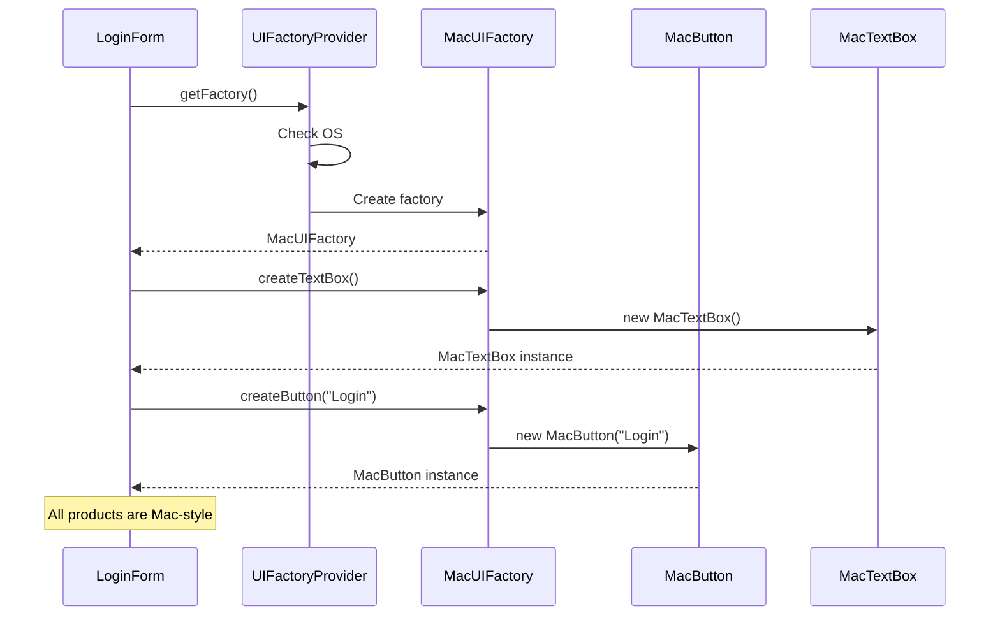

You're building a cross-platform UI library. On Windows, buttons and text boxes look one way. On macOS, they look different. On Linux, different again. Every component in a platform must match the others.

You can't mix a Windows button with a macOS text box. They need to come from the same family.

## What is the Abstract Factory Pattern?

Abstract Factory provides an interface for creating families of related objects. Each concrete factory produces objects that work together. The client uses the factory interface without knowing which concrete factory it's using.


The key: WinFactory creates WinButton and WinTextBox (they go together). MacFactory creates MacButton and MacTextBox (they go together). You never mix products from different factories.

## When to Use Abstract Factory

| Use Abstract Factory When | Skip Abstract Factory When |
|--------------------------|---------------------------|
| You need families of related objects | Objects don't need to be consistent |
| Products in a family must work together | Products are independent |
| You want to enforce consistency | Only one product type exists |
| Switching families should be easy | Factory Method is sufficient |

The pattern shines when product compatibility matters. Wrong combinations should be impossible.

## Implementation

### Cross-Platform UI Toolkit

```java
// Product interfaces
public interface Button {
    void render();
    void onClick(Runnable handler);
}

public interface TextBox {
    void render();
    String getText();
    void setText(String text);
}

public interface Checkbox {
    void render();
    boolean isChecked();
    void setChecked(boolean checked);
}

// Abstract Factory
public interface UIFactory {
    Button createButton(String label);
    TextBox createTextBox();
    Checkbox createCheckbox(String label);
}
```

### Windows Implementation

```java
public class WindowsButton implements Button {
    private final String label;
    private Runnable clickHandler;
    
    public WindowsButton(String label) {
        this.label = label;
    }
    
    @Override
    public void render() {
        System.out.println("[====== " + label + " ======]");  // Windows style
    }
    
    @Override
    public void onClick(Runnable handler) {
        this.clickHandler = handler;
    }
}

public class WindowsTextBox implements TextBox {
    private String text = "";
    
    @Override
    public void render() {
        System.out.println("|__" + text + "__|");  // Windows style border
    }
    
    @Override
    public String getText() { return text; }
    
    @Override
    public void setText(String text) { this.text = text; }
}

public class WindowsCheckbox implements Checkbox {
    private final String label;
    private boolean checked;
    
    public WindowsCheckbox(String label) {
        this.label = label;
    }
    
    @Override
    public void render() {
        String box = checked ? "[X]" : "[ ]";
        System.out.println(box + " " + label);
    }
    
    @Override
    public boolean isChecked() { return checked; }
    
    @Override
    public void setChecked(boolean checked) { this.checked = checked; }
}

public class WindowsUIFactory implements UIFactory {
    @Override
    public Button createButton(String label) {
        return new WindowsButton(label);
    }
    
    @Override
    public TextBox createTextBox() {
        return new WindowsTextBox();
    }
    
    @Override
    public Checkbox createCheckbox(String label) {
        return new WindowsCheckbox(label);
    }
}
```

### macOS Implementation

```java
public class MacButton implements Button {
    private final String label;
    private Runnable clickHandler;
    
    public MacButton(String label) {
        this.label = label;
    }
    
    @Override
    public void render() {
        System.out.println("( " + label + " )");  // Rounded Mac style
    }
    
    @Override
    public void onClick(Runnable handler) {
        this.clickHandler = handler;
    }
}

public class MacTextBox implements TextBox {
    private String text = "";
    
    @Override
    public void render() {
        System.out.println("⌈ " + text + " ⌉");  // Mac style
    }
    
    @Override
    public String getText() { return text; }
    
    @Override
    public void setText(String text) { this.text = text; }
}

public class MacCheckbox implements Checkbox {
    private final String label;
    private boolean checked;
    
    public MacCheckbox(String label) {
        this.label = label;
    }
    
    @Override
    public void render() {
        String box = checked ? "●" : "○";
        System.out.println(box + " " + label);  // Mac-style circles
    }
    
    @Override
    public boolean isChecked() { return checked; }
    
    @Override
    public void setChecked(boolean checked) { this.checked = checked; }
}

public class MacUIFactory implements UIFactory {
    @Override
    public Button createButton(String label) {
        return new MacButton(label);
    }
    
    @Override
    public TextBox createTextBox() {
        return new MacTextBox();
    }
    
    @Override
    public Checkbox createCheckbox(String label) {
        return new MacCheckbox(label);
    }
}
```

### Factory Provider

```java
public class UIFactoryProvider {
    
    public static UIFactory getFactory() {
        String os = System.getProperty("os.name").toLowerCase();
        
        if (os.contains("win")) {
            return new WindowsUIFactory();
        } else if (os.contains("mac")) {
            return new MacUIFactory();
        } else {
            return new LinuxUIFactory();  // Default
        }
    }
    
    public static UIFactory getFactory(String platform) {
        switch (platform.toLowerCase()) {
            case "windows": return new WindowsUIFactory();
            case "mac": return new MacUIFactory();
            case "linux": return new LinuxUIFactory();
            default: throw new IllegalArgumentException("Unknown platform: " + platform);
        }
    }
}
```

### Usage

```java
public class LoginForm {
    private final Button loginButton;
    private final Button cancelButton;
    private final TextBox usernameField;
    private final TextBox passwordField;
    private final Checkbox rememberMe;
    
    public LoginForm(UIFactory factory) {
        // All components from the same factory = consistent look
        this.usernameField = factory.createTextBox();
        this.passwordField = factory.createTextBox();
        this.loginButton = factory.createButton("Login");
        this.cancelButton = factory.createButton("Cancel");
        this.rememberMe = factory.createCheckbox("Remember me");
        
        loginButton.onClick(this::handleLogin);
        cancelButton.onClick(this::handleCancel);
    }
    
    public void render() {
        System.out.println("Username:");
        usernameField.render();
        System.out.println("Password:");
        passwordField.render();
        rememberMe.render();
        loginButton.render();
        cancelButton.render();
    }
    
    private void handleLogin() { /* ... */ }
    private void handleCancel() { /* ... */ }
}

// Usage
UIFactory factory = UIFactoryProvider.getFactory();
LoginForm loginForm = new LoginForm(factory);
loginForm.render();

// On Windows:
// Username:
// |__|
// Password:
// |__|
// [ ] Remember me
// [====== Login ======]
// [====== Cancel ======]

// On Mac:
// Username:
// ⌈  ⌉
// Password:
// ⌈  ⌉
// ○ Remember me
// ( Login )
// ( Cancel )
```

## How It Works



## Database Provider Example

Another common use case: database-agnostic code.

```java
public interface DatabaseFactory {
    Connection createConnection(String connectionString);
    QueryBuilder createQueryBuilder();
    MigrationRunner createMigrationRunner();
}

public class PostgresFactory implements DatabaseFactory {
    @Override
    public Connection createConnection(String connectionString) {
        return new PostgresConnection(connectionString);
    }
    
    @Override
    public QueryBuilder createQueryBuilder() {
        return new PostgresQueryBuilder();  // Handles Postgres-specific SQL
    }
    
    @Override
    public MigrationRunner createMigrationRunner() {
        return new PostgresMigrationRunner();
    }
}

public class MySqlFactory implements DatabaseFactory {
    @Override
    public Connection createConnection(String connectionString) {
        return new MySqlConnection(connectionString);
    }
    
    @Override
    public QueryBuilder createQueryBuilder() {
        return new MySqlQueryBuilder();  // Handles MySQL-specific SQL
    }
    
    @Override
    public MigrationRunner createMigrationRunner() {
        return new MySqlMigrationRunner();
    }
}

// Application code works with any database
public class UserRepository {
    private final Connection connection;
    private final QueryBuilder queryBuilder;
    
    public UserRepository(DatabaseFactory factory, String connString) {
        this.connection = factory.createConnection(connString);
        this.queryBuilder = factory.createQueryBuilder();
    }
    
    public User findById(String id) {
        String query = queryBuilder
            .select("*")
            .from("users")
            .where("id", id)
            .build();
        
        return connection.querySingle(query, User.class);
    }
}
```

## Abstract Factory vs Factory Method

```java
// FACTORY METHOD - one product, inheritance
public abstract class Dialog {
    public abstract Button createButton();  // Factory method
    
    public void render() {
        Button button = createButton();
        button.render();
    }
}

public class WindowsDialog extends Dialog {
    @Override
    public Button createButton() {
        return new WindowsButton();
    }
}

// ABSTRACT FACTORY - family of products, composition
public interface UIFactory {
    Button createButton();
    TextBox createTextBox();
    Checkbox createCheckbox();
}

public class Application {
    private final UIFactory factory;  // Injected
    
    public Application(UIFactory factory) {
        this.factory = factory;
    }
}
```

Factory Method: one product, subclass decides.
Abstract Factory: multiple products, entire family together.

## Common Mistakes

### 1. Adding Products to All Factories

Adding a new product type requires changing all factory implementations:

```java
// Adding Slider to UI means updating WindowsFactory, MacFactory, LinuxFactory...
public interface UIFactory {
    Button createButton();
    TextBox createTextBox();
    Slider createSlider();  // New - must implement everywhere
}
```

This is a known trade-off. Abstract Factory makes adding new families easy but adding new products hard.

### 2. Factory Creating Unrelated Products

Products should form a cohesive family:

```java
// Bad - unrelated products
public interface StrangeFactory {
    Button createButton();
    HttpClient createHttpClient();  // What does this have to do with buttons?
    EmailService createEmailService();  // Not a family
}

// Good - cohesive family
public interface UIFactory {
    Button createButton();
    TextBox createTextBox();
    Checkbox createCheckbox();
    // All UI components
}
```

### 3. Exposing Concrete Types

Clients should work with interfaces only:

```java
// Wrong - exposes concrete type
WindowsButton button = (WindowsButton) factory.createButton();
button.setWindowsSpecificProperty(value);

// Right - works with interface
Button button = factory.createButton();
button.render();
```

## Real-World Examples

**Java AWT/Swing**: `Toolkit` is an abstract factory for GUI components.

**JDBC**: `DriverManager` returns database-specific connections.

**Document Builders**: XML parsers use `DocumentBuilderFactory`.

**Spring**: `BeanFactory` is an abstract factory for beans.

## Related Patterns

**[Factory Method](/design-patterns/factory-method/)** is a simpler version for single products. Abstract Factory often contains multiple factory methods.

**[Singleton](/design-patterns/singleton/)** is often used for factories. One factory instance per family.

**[Builder](/design-patterns/builder/)** can work with Abstract Factory to construct complex products step by step.

**[Prototype](/design-patterns/prototype/)** is an alternative. Instead of factories, you clone configured prototypes.

## Wrapping Up

Abstract Factory creates families of related objects. All products from one factory work together consistently. Switching families means switching factories.

Use it when products must be compatible, when consistency matters, and when you want to isolate product creation from usage.

The trade-off: adding new product types is hard because all factories must implement them. But adding new families is easy; just create a new factory.

---

**Further Reading:**

- [Head First Design Patterns](https://www.oreilly.com/library/view/head-first-design/0596007124/) - Chapter 4
- [Factory Patterns Comparison](https://stackoverflow.com/questions/5739611/what-are-the-differences-between-abstract-factory-and-factory-design-patterns) on Stack Overflow

