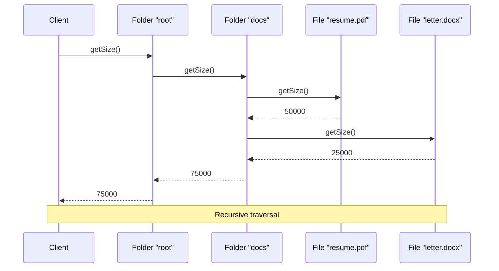

You're building a file system browser. Folders contain files and other folders. When you calculate folder size, you sum up file sizes and recursively add subfolder sizes. Delete a folder and you delete everything inside.

The client shouldn't care whether it's dealing with a file or a folder. Both respond to the same operations.

## What is the Composite Pattern?

Composite lets you treat individual objects and compositions of objects uniformly. Both leaf objects and composite containers implement the same interface. The client doesn't know if it's working with a single item or a tree.


The Composite holds children that are also Components. This creates recursive tree structures where operations propagate through the hierarchy.

## When to Use Composite

| Use Composite When | Skip Composite When |
|-------------------|---------------------|
| You have tree-like structures | Structure is flat |
| Clients should treat parts and wholes the same | Leaves and containers are fundamentally different |
| You need recursive operations | Recursion isn't needed |
| Hierarchies vary in depth | Fixed, shallow structure |

Composite is about structure, not behavior. It creates part-whole hierarchies where leaves and branches share a common interface.

## Implementation

### File System Example

```java
public interface FileSystemNode {
    String getName();
    long getSize();
    void delete();
    void display(String indent);
}

public class File implements FileSystemNode {
    private final String name;
    private final long size;
    
    public File(String name, long size) {
        this.name = name;
        this.size = size;
    }
    
    @Override
    public String getName() {
        return name;
    }
    
    @Override
    public long getSize() {
        return size;
    }
    
    @Override
    public void delete() {
        System.out.println("Deleting file: " + name);
    }
    
    @Override
    public void display(String indent) {
        System.out.println(indent + "📄 " + name + " (" + size + " bytes)");
    }
}

public class Folder implements FileSystemNode {
    private final String name;
    private final List<FileSystemNode> children = new ArrayList<>();
    
    public Folder(String name) {
        this.name = name;
    }
    
    public void add(FileSystemNode node) {
        children.add(node);
    }
    
    public void remove(FileSystemNode node) {
        children.remove(node);
    }
    
    public List<FileSystemNode> getChildren() {
        return Collections.unmodifiableList(children);
    }
    
    @Override
    public String getName() {
        return name;
    }
    
    @Override
    public long getSize() {
        // Recursive - sum all children
        return children.stream()
            .mapToLong(FileSystemNode::getSize)
            .sum();
    }
    
    @Override
    public void delete() {
        // Recursive - delete all children first
        for (FileSystemNode child : new ArrayList<>(children)) {
            child.delete();
        }
        System.out.println("Deleting folder: " + name);
        children.clear();
    }
    
    @Override
    public void display(String indent) {
        System.out.println(indent + "📁 " + name + " (" + getSize() + " bytes)");
        for (FileSystemNode child : children) {
            child.display(indent + "  ");
        }
    }
}
```

### Usage

```java
// Build file system structure
Folder root = new Folder("root");

Folder documents = new Folder("documents");
documents.add(new File("resume.pdf", 50000));
documents.add(new File("cover_letter.docx", 25000));

Folder photos = new Folder("photos");
photos.add(new File("vacation.jpg", 2500000));
photos.add(new File("family.png", 3200000));

Folder work = new Folder("work");
work.add(new File("project.xlsx", 150000));

photos.add(work);  // Nested folder

root.add(documents);
root.add(photos);
root.add(new File("readme.txt", 1000));

// Display entire tree
root.display("");
// Output:
// 📁 root (5926000 bytes)
//   📁 documents (75000 bytes)
//     📄 resume.pdf (50000 bytes)
//     📄 cover_letter.docx (25000 bytes)
//   📁 photos (5850000 bytes)
//     📄 vacation.jpg (2500000 bytes)
//     📄 family.png (3200000 bytes)
//     📁 work (150000 bytes)
//       📄 project.xlsx (150000 bytes)
//   📄 readme.txt (1000 bytes)

// Uniform treatment
System.out.println("Total size: " + root.getSize());  // Works on any node
System.out.println("Documents size: " + documents.getSize());
System.out.println("Single file size: " + documents.getChildren().get(0).getSize());
```

## UI Component Example

```java
public interface UIComponent {
    void render();
    int getWidth();
    int getHeight();
}

public class Button implements UIComponent {
    private final String label;
    private final int width;
    private final int height;
    
    public Button(String label, int width, int height) {
        this.label = label;
        this.width = width;
        this.height = height;
    }
    
    @Override
    public void render() {
        System.out.println("Button[" + label + "]");
    }
    
    @Override
    public int getWidth() { return width; }
    
    @Override
    public int getHeight() { return height; }
}

public class TextField implements UIComponent {
    private final int width;
    private final int height;
    
    public TextField(int width, int height) {
        this.width = width;
        this.height = height;
    }
    
    @Override
    public void render() {
        System.out.println("TextField[" + width + "x" + height + "]");
    }
    
    @Override
    public int getWidth() { return width; }
    
    @Override
    public int getHeight() { return height; }
}

public class Panel implements UIComponent {
    private final List<UIComponent> children = new ArrayList<>();
    private final String name;
    
    public Panel(String name) {
        this.name = name;
    }
    
    public void add(UIComponent component) {
        children.add(component);
    }
    
    @Override
    public void render() {
        System.out.println("Panel[" + name + "] {");
        for (UIComponent child : children) {
            System.out.print("  ");
            child.render();
        }
        System.out.println("}");
    }
    
    @Override
    public int getWidth() {
        return children.stream()
            .mapToInt(UIComponent::getWidth)
            .max()
            .orElse(0);
    }
    
    @Override
    public int getHeight() {
        return children.stream()
            .mapToInt(UIComponent::getHeight)
            .sum();
    }
}

// Usage
Panel form = new Panel("LoginForm");
form.add(new TextField(200, 30));
form.add(new TextField(200, 30));
form.add(new Button("Submit", 100, 40));

Panel sidebar = new Panel("Sidebar");
sidebar.add(new Button("Home", 80, 30));
sidebar.add(new Button("Settings", 80, 30));

Panel mainPanel = new Panel("Main");
mainPanel.add(sidebar);
mainPanel.add(form);

mainPanel.render();
```

## How It Works



## Organization Hierarchy Example

```java
public interface Employee {
    String getName();
    double getSalary();
    void printHierarchy(String indent);
}

public class Developer implements Employee {
    private final String name;
    private final double salary;
    
    public Developer(String name, double salary) {
        this.name = name;
        this.salary = salary;
    }
    
    @Override
    public String getName() { return name; }
    
    @Override
    public double getSalary() { return salary; }
    
    @Override
    public void printHierarchy(String indent) {
        System.out.println(indent + "👤 " + name + " (Developer) - $" + salary);
    }
}

public class Manager implements Employee {
    private final String name;
    private final double salary;
    private final List<Employee> subordinates = new ArrayList<>();
    
    public Manager(String name, double salary) {
        this.name = name;
        this.salary = salary;
    }
    
    public void addSubordinate(Employee employee) {
        subordinates.add(employee);
    }
    
    @Override
    public String getName() { return name; }
    
    @Override
    public double getSalary() {
        // Total cost includes all subordinates
        return salary + subordinates.stream()
            .mapToDouble(Employee::getSalary)
            .sum();
    }
    
    @Override
    public void printHierarchy(String indent) {
        System.out.println(indent + "👔 " + name + " (Manager) - $" + salary);
        for (Employee sub : subordinates) {
            sub.printHierarchy(indent + "  ");
        }
    }
}

// Build organization
Manager ceo = new Manager("Alice", 200000);

Manager engineering = new Manager("Bob", 150000);
engineering.addSubordinate(new Developer("Charlie", 100000));
engineering.addSubordinate(new Developer("Diana", 95000));

Manager marketing = new Manager("Eve", 140000);
marketing.addSubordinate(new Developer("Frank", 90000));

ceo.addSubordinate(engineering);
ceo.addSubordinate(marketing);

ceo.printHierarchy("");
System.out.println("Total salary cost: $" + ceo.getSalary());
```

## Common Mistakes

### 1. Type Checking in Client Code

The point of Composite is uniform treatment:

```java
// Wrong - defeats the purpose
for (FileSystemNode node : folder.getChildren()) {
    if (node instanceof File) {
        System.out.println("File: " + node.getName());
    } else if (node instanceof Folder) {
        System.out.println("Folder: " + node.getName());
    }
}

// Right - uniform treatment
for (FileSystemNode node : folder.getChildren()) {
    node.display("");  // Both files and folders respond
}
```

### 2. Leaf Methods on Component Interface

Don't force leaves to implement meaningless methods:

```java
// Awkward - leaves must implement container methods
public interface Component {
    void operation();
    void add(Component c);      // Meaningless for leaves
    void remove(Component c);   // Meaningless for leaves
    List<Component> getChildren(); // Meaningless for leaves
}

public class Leaf implements Component {
    @Override
    public void add(Component c) {
        throw new UnsupportedOperationException();
    }
    // ...
}

// Better - separate interface for containers
public interface Component {
    void operation();
}

public interface Container extends Component {
    void add(Component c);
    void remove(Component c);
    List<Component> getChildren();
}
```

### 3. Circular References

Avoid adding a node to its own descendant:

```java
Folder a = new Folder("a");
Folder b = new Folder("b");
a.add(b);
b.add(a);  // Circular! getSize() will infinite loop
```

Add validation in the add method:

```java
public void add(FileSystemNode node) {
    if (this.isDescendantOf(node)) {
        throw new IllegalArgumentException("Circular reference");
    }
    children.add(node);
}
```

## Real-World Examples

**Java Swing**: `JComponent` and `Container`. Every component can contain other components.

**DOM**: Elements contain other elements. `getElementsByTagName` works on any element.

**File Systems**: Directories contain files and directories. `du -sh` sums sizes recursively.

**React Components**: Components can contain other components. Props and rendering propagate down.

## Related Patterns

**[Iterator](/design-patterns/iterator/)** traverses composite structures without exposing internals.

**[Visitor](/design-patterns/visitor/)** adds operations to composite structures without modifying them.

**[Builder](/design-patterns/builder/)** can construct complex composite structures step by step.

**[Decorator](/design-patterns/decorator/)** uses similar recursive composition but for adding behavior, not structure.

## Wrapping Up

Composite creates tree structures where clients treat leaves and containers uniformly. Operations on composites propagate recursively to children.

Use it for file systems, UI trees, organizational hierarchies, and any part-whole relationship. Keep the component interface focused on common operations.

The pattern trades type safety for flexibility. Clients don't know if they're handling one item or a thousand. That's the power and the responsibility.

---

**Further Reading:**

- [Head First Design Patterns](https://www.oreilly.com/library/view/head-first-design/0596007124/) - Chapter 9
- [Recursive Data Structures](https://en.wikipedia.org/wiki/Recursive_data_type) on Wikipedia

