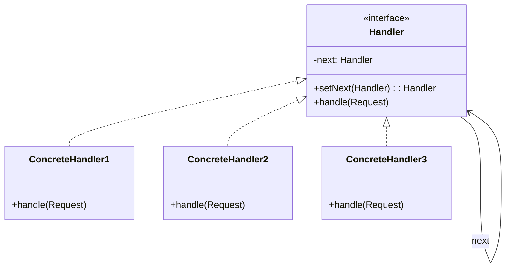
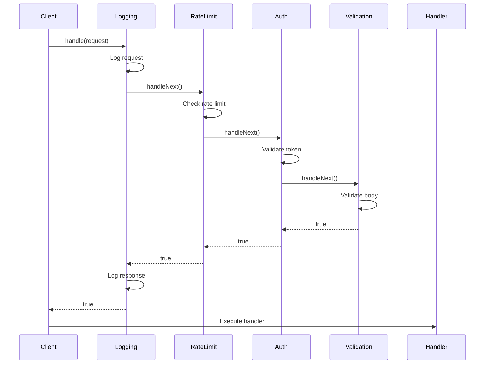

You're building an HTTP server. Requests need authentication, logging, rate limiting, and validation before reaching your handlers. Each middleware should be independent and reorderable.

Chain of Responsibility lets you build processing pipelines where each step can handle, modify, or reject requests.

## What is the Chain of Responsibility Pattern?

Chain of Responsibility passes requests along a chain of handlers. Each handler decides whether to process the request or pass it to the next handler. The request travels until a handler deals with it.



The client sends to the first handler. Each handler either handles the request, passes it on, or does both.

## When to Use Chain of Responsibility

| Use Chain When | Skip Chain When |
|----------------|-----------------|
| Multiple handlers might process a request | Handler is known and fixed |
| Handler set should be dynamic | Static dispatch is sufficient |
| You want decoupled request processing | Tight coupling is acceptable |
| Building middleware pipelines | Simple if-else works |

Chain of Responsibility is about flexible, configurable processing pipelines.

## Implementation

### HTTP Middleware Pipeline

```java
public interface Middleware {
    Middleware setNext(Middleware next);
    boolean handle(HttpRequest request, HttpResponse response);
}

public abstract class BaseMiddleware implements Middleware {
    protected Middleware next;
    
    @Override
    public Middleware setNext(Middleware next) {
        this.next = next;
        return next;  // Enables chaining: a.setNext(b).setNext(c)
    }
    
    protected boolean handleNext(HttpRequest request, HttpResponse response) {
        if (next == null) {
            return true;  // End of chain, request is valid
        }
        return next.handle(request, response);
    }
}

public class AuthenticationMiddleware extends BaseMiddleware {
    private final TokenValidator tokenValidator;
    
    public AuthenticationMiddleware(TokenValidator tokenValidator) {
        this.tokenValidator = tokenValidator;
    }
    
    @Override
    public boolean handle(HttpRequest request, HttpResponse response) {
        String token = request.getHeader("Authorization");
        
        if (token == null || token.isEmpty()) {
            response.setStatus(401);
            response.setBody("Missing authentication token");
            return false;  // Stop chain
        }
        
        if (!tokenValidator.isValid(token)) {
            response.setStatus(401);
            response.setBody("Invalid token");
            return false;  // Stop chain
        }
        
        // Add user info to request context
        User user = tokenValidator.getUser(token);
        request.setAttribute("user", user);
        
        return handleNext(request, response);  // Continue chain
    }
}

public class RateLimitMiddleware extends BaseMiddleware {
    private final RateLimiter rateLimiter;
    
    public RateLimitMiddleware(RateLimiter rateLimiter) {
        this.rateLimiter = rateLimiter;
    }
    
    @Override
    public boolean handle(HttpRequest request, HttpResponse response) {
        String clientIp = request.getRemoteAddr();
        
        if (!rateLimiter.tryAcquire(clientIp)) {
            response.setStatus(429);
            response.setBody("Too many requests");
            return false;  // Stop chain
        }
        
        return handleNext(request, response);
    }
}

public class LoggingMiddleware extends BaseMiddleware {
    private final Logger logger;
    
    public LoggingMiddleware(Logger logger) {
        this.logger = logger;
    }
    
    @Override
    public boolean handle(HttpRequest request, HttpResponse response) {
        long startTime = System.currentTimeMillis();
        
        logger.info("Request: {} {}", request.getMethod(), request.getPath());
        
        boolean result = handleNext(request, response);
        
        long duration = System.currentTimeMillis() - startTime;
        logger.info("Response: {} in {}ms", response.getStatus(), duration);
        
        return result;
    }
}

public class ValidationMiddleware extends BaseMiddleware {
    private final Map<String, Validator> validators;
    
    public ValidationMiddleware(Map<String, Validator> validators) {
        this.validators = validators;
    }
    
    @Override
    public boolean handle(HttpRequest request, HttpResponse response) {
        String path = request.getPath();
        Validator validator = validators.get(path);
        
        if (validator != null) {
            ValidationResult result = validator.validate(request);
            if (!result.isValid()) {
                response.setStatus(400);
                response.setBody(result.getErrors());
                return false;
            }
        }
        
        return handleNext(request, response);
    }
}
```

### Building the Chain

```java
public class MiddlewareChainBuilder {
    private final List<Middleware> middlewares = new ArrayList<>();
    
    public MiddlewareChainBuilder add(Middleware middleware) {
        middlewares.add(middleware);
        return this;
    }
    
    public Middleware build() {
        if (middlewares.isEmpty()) {
            throw new IllegalStateException("No middlewares configured");
        }
        
        Middleware first = middlewares.get(0);
        Middleware current = first;
        
        for (int i = 1; i < middlewares.size(); i++) {
            current = current.setNext(middlewares.get(i));
        }
        
        return first;
    }
}

// Usage
Middleware pipeline = new MiddlewareChainBuilder()
    .add(new LoggingMiddleware(logger))
    .add(new RateLimitMiddleware(rateLimiter))
    .add(new AuthenticationMiddleware(tokenValidator))
    .add(new ValidationMiddleware(validators))
    .build();

// Process request
HttpRequest request = new HttpRequest("POST", "/api/orders", body);
HttpResponse response = new HttpResponse();

if (pipeline.handle(request, response)) {
    // All middleware passed, execute actual handler
    orderController.createOrder(request, response);
}
```

## How It Works



## Support Ticket Escalation Example

```java
public abstract class SupportHandler {
    protected SupportHandler next;
    protected String name;
    protected int maxPriority;
    
    public SupportHandler(String name, int maxPriority) {
        this.name = name;
        this.maxPriority = maxPriority;
    }
    
    public SupportHandler setNext(SupportHandler next) {
        this.next = next;
        return next;
    }
    
    public void handleTicket(SupportTicket ticket) {
        if (canHandle(ticket)) {
            processTicket(ticket);
        } else if (next != null) {
            System.out.println(name + " escalating to " + next.name);
            next.handleTicket(ticket);
        } else {
            System.out.println("No handler available for ticket: " + ticket.getId());
        }
    }
    
    protected boolean canHandle(SupportTicket ticket) {
        return ticket.getPriority() <= maxPriority;
    }
    
    protected abstract void processTicket(SupportTicket ticket);
}

public class Level1Support extends SupportHandler {
    public Level1Support() {
        super("Level 1 Support", 1);
    }
    
    @Override
    protected void processTicket(SupportTicket ticket) {
        System.out.println("Level 1 handling: " + ticket.getDescription());
        // Password resets, basic troubleshooting
    }
}

public class Level2Support extends SupportHandler {
    public Level2Support() {
        super("Level 2 Support", 3);
    }
    
    @Override
    protected void processTicket(SupportTicket ticket) {
        System.out.println("Level 2 handling: " + ticket.getDescription());
        // Technical issues, configuration problems
    }
}

public class Level3Support extends SupportHandler {
    public Level3Support() {
        super("Level 3 Support", 5);
    }
    
    @Override
    protected void processTicket(SupportTicket ticket) {
        System.out.println("Level 3 handling: " + ticket.getDescription());
        // Critical issues, system failures
    }
}

// Build escalation chain
SupportHandler support = new Level1Support();
support.setNext(new Level2Support())
       .setNext(new Level3Support());

// Low priority - handled by Level 1
support.handleTicket(new SupportTicket("T1", "Password reset", 1));
// Output: Level 1 handling: Password reset

// Medium priority - escalated to Level 2
support.handleTicket(new SupportTicket("T2", "App crashes on login", 3));
// Output: Level 1 escalating to Level 2
//         Level 2 handling: App crashes on login

// High priority - escalated to Level 3
support.handleTicket(new SupportTicket("T3", "Database down", 5));
// Output: Level 1 escalating to Level 2
//         Level 2 escalating to Level 3
//         Level 3 handling: Database down
```

## Event Handler Chain

```java
public interface EventHandler {
    void handle(Event event);
    void setNext(EventHandler next);
}

public class ClickHandler implements EventHandler {
    private EventHandler next;
    
    @Override
    public void setNext(EventHandler next) {
        this.next = next;
    }
    
    @Override
    public void handle(Event event) {
        if (event.getType() == EventType.CLICK) {
            System.out.println("Processing click at " + event.getPosition());
            // Handle click - might stop propagation or continue
        }
        
        if (next != null) {
            next.handle(event);
        }
    }
}
```

## Common Mistakes

### 1. Forgetting the Termination Condition

```java
// Wrong - infinite loop if no handler processes
@Override
public void handle(Request request) {
    if (!canHandle(request)) {
        next.handle(request);  // NPE if next is null!
    }
}

// Right - check for null
@Override
public void handle(Request request) {
    if (!canHandle(request)) {
        if (next != null) {
            next.handle(request);
        } else {
            // Handle "no one processed" case
            throw new UnhandledRequestException(request);
        }
    }
}
```

### 2. Handlers Knowing Too Much About Each Other

```java
// Wrong - handler knows about specific next handler
@Override
public void handle(Request request) {
    if (next instanceof AuthHandler) {  // Tight coupling
        // ...
    }
}

// Right - handlers are independent
@Override
public void handle(Request request) {
    // Just pass to next, whoever it is
    if (next != null) {
        next.handle(request);
    }
}
```

### 3. Modifying Request Without Cloning

When requests are shared across handlers:

```java
// Wrong - modifies shared request
@Override
public void handle(Request request) {
    request.setHeader("X-Processed", "true");  // Affects other handlers
    next.handle(request);
}

// Better - document mutations clearly or use immutable requests
```

## Real-World Examples

**Servlet Filters**: `Filter` chain in Java EE/Jakarta EE.

**Express.js/Koa**: Middleware functions that call `next()`.

**Spring Security**: `FilterChainProxy` for security filters.

**Exception Handling**: Try-catch blocks act like handler chains.

## Related Patterns

**[Composite](/design-patterns/composite/)** can create complex chains where composites contain multiple handlers.

**[Command](/design-patterns/command/)** objects can be passed through chains for processing.

**[Decorator](/design-patterns/decorator/)** always passes to the wrapped object. Chain of Responsibility might stop.

## Wrapping Up

Chain of Responsibility creates processing pipelines where each handler decides whether to process, pass, or stop the request. Handlers are independent and reorderable.

Use it for middleware, validation chains, approval workflows, and event bubbling. Keep handlers focused on single responsibilities.

The pattern trades guaranteed handling for flexibility. Add a catch-all handler at the end if every request must be processed.

---

**Further Reading:**

- [Java Servlet Filter Chain](https://docs.oracle.com/javaee/7/api/javax/servlet/FilterChain.html)
- [Express.js Middleware Guide](https://expressjs.com/en/guide/using-middleware.html)

