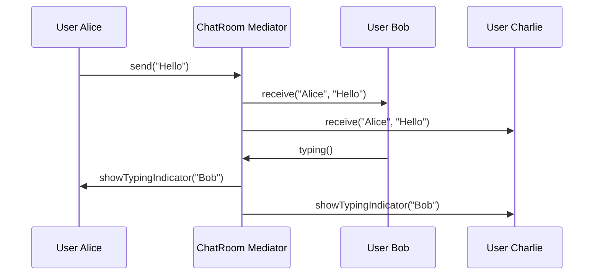

You're building a chat application. Users can send messages, create groups, mention others, and see typing indicators. Every user component talks to every other. Adding a new feature means changing all components.

Mediator centralizes this communication. Components talk to the mediator, not to each other.

## What is the Mediator Pattern?

Mediator defines an object that encapsulates how a set of objects interact. Colleagues don't communicate directly; they go through the mediator. This reduces coupling and makes interactions easier to modify.


UserA and UserB don't know about each other. They only know the ChatRoom mediator.

## When to Use Mediator

| Use Mediator When | Skip Mediator When |
|------------------|-------------------|
| Objects have tight, complex dependencies | Dependencies are simple |
| You want to reuse components in different contexts | Components are used together always |
| Centralizing control logic makes sense | Distributed control is clearer |
| Many objects need to communicate | Only a few objects interact |

Mediator trades many-to-many relationships for many-to-one.

## Implementation

### Chat Room Example

```java
public interface ChatMediator {
    void sendMessage(String message, User sender);
    void addUser(User user);
    void removeUser(User user);
    void notifyTyping(User user);
}

public class ChatRoom implements ChatMediator {
    private final String roomName;
    private final List<User> users = new ArrayList<>();
    
    public ChatRoom(String roomName) {
        this.roomName = roomName;
    }
    
    @Override
    public void addUser(User user) {
        users.add(user);
        // Notify others
        for (User u : users) {
            if (u != user) {
                u.receive("System", user.getName() + " joined the room");
            }
        }
    }
    
    @Override
    public void removeUser(User user) {
        users.remove(user);
        for (User u : users) {
            u.receive("System", user.getName() + " left the room");
        }
    }
    
    @Override
    public void sendMessage(String message, User sender) {
        for (User user : users) {
            if (user != sender) {
                user.receive(sender.getName(), message);
            }
        }
    }
    
    @Override
    public void notifyTyping(User user) {
        for (User u : users) {
            if (u != user) {
                u.showTypingIndicator(user.getName());
            }
        }
    }
}

public class User {
    private final String name;
    private final ChatMediator mediator;
    
    public User(String name, ChatMediator mediator) {
        this.name = name;
        this.mediator = mediator;
    }
    
    public String getName() { return name; }
    
    public void send(String message) {
        System.out.println(name + " sends: " + message);
        mediator.sendMessage(message, this);
    }
    
    public void receive(String from, String message) {
        System.out.println(name + " received from " + from + ": " + message);
    }
    
    public void typing() {
        mediator.notifyTyping(this);
    }
    
    public void showTypingIndicator(String userName) {
        System.out.println(name + " sees: " + userName + " is typing...");
    }
}
```

### Usage

```java
ChatMediator room = new ChatRoom("General");

User alice = new User("Alice", room);
User bob = new User("Bob", room);
User charlie = new User("Charlie", room);

room.addUser(alice);
room.addUser(bob);
room.addUser(charlie);

alice.send("Hello everyone!");
// Output:
// Alice sends: Hello everyone!
// Bob received from Alice: Hello everyone!
// Charlie received from Alice: Hello everyone!

bob.typing();
// Output:
// Alice sees: Bob is typing...
// Charlie sees: Bob is typing...

bob.send("Hi Alice!");
// Output:
// Bob sends: Hi Alice!
// Alice received from Bob: Hi Alice!
// Charlie received from Bob: Hi Alice!
```

## UI Components Example

```java
public interface DialogMediator {
    void notify(Component sender, String event);
}

public class AuthDialog implements DialogMediator {
    private TextField usernameField;
    private TextField passwordField;
    private Button loginButton;
    private Button registerButton;
    private Checkbox rememberMeCheckbox;
    private Label statusLabel;
    
    public AuthDialog() {
        this.usernameField = new TextField(this);
        this.passwordField = new TextField(this);
        this.loginButton = new Button(this, "Login");
        this.registerButton = new Button(this, "Register");
        this.rememberMeCheckbox = new Checkbox(this, "Remember me");
        this.statusLabel = new Label(this);
    }
    
    @Override
    public void notify(Component sender, String event) {
        if (sender == usernameField && event.equals("textChanged")) {
            validateForm();
        }
        else if (sender == passwordField && event.equals("textChanged")) {
            validateForm();
        }
        else if (sender == loginButton && event.equals("click")) {
            attemptLogin();
        }
        else if (sender == registerButton && event.equals("click")) {
            showRegistrationForm();
        }
        else if (sender == rememberMeCheckbox && event.equals("check")) {
            // Handle remember me logic
        }
    }
    
    private void validateForm() {
        boolean valid = !usernameField.getText().isEmpty() 
                     && !passwordField.getText().isEmpty();
        loginButton.setEnabled(valid);
        registerButton.setEnabled(!usernameField.getText().isEmpty());
    }
    
    private void attemptLogin() {
        statusLabel.setText("Logging in...");
        // Perform login
    }
    
    private void showRegistrationForm() {
        // Show registration UI
    }
}

public abstract class Component {
    protected DialogMediator mediator;
    
    public Component(DialogMediator mediator) {
        this.mediator = mediator;
    }
    
    protected void notifyMediator(String event) {
        mediator.notify(this, event);
    }
}

public class TextField extends Component {
    private String text = "";
    
    public TextField(DialogMediator mediator) {
        super(mediator);
    }
    
    public void setText(String text) {
        this.text = text;
        notifyMediator("textChanged");
    }
    
    public String getText() { return text; }
}

public class Button extends Component {
    private final String label;
    private boolean enabled = true;
    
    public Button(DialogMediator mediator, String label) {
        super(mediator);
        this.label = label;
    }
    
    public void click() {
        if (enabled) {
            notifyMediator("click");
        }
    }
    
    public void setEnabled(boolean enabled) {
        this.enabled = enabled;
    }
}
```

## Event Bus Implementation

A simpler, more flexible mediator variant:

```java
public class EventBus {
    private final Map<Class<?>, List<Consumer<?>>> handlers = new ConcurrentHashMap<>();
    
    public <T> void subscribe(Class<T> eventType, Consumer<T> handler) {
        handlers.computeIfAbsent(eventType, k -> new CopyOnWriteArrayList<>())
                .add(handler);
    }
    
    public <T> void unsubscribe(Class<T> eventType, Consumer<T> handler) {
        List<Consumer<?>> eventHandlers = handlers.get(eventType);
        if (eventHandlers != null) {
            eventHandlers.remove(handler);
        }
    }
    
    @SuppressWarnings("unchecked")
    public <T> void publish(T event) {
        List<Consumer<?>> eventHandlers = handlers.get(event.getClass());
        if (eventHandlers != null) {
            for (Consumer<?> handler : eventHandlers) {
                ((Consumer<T>) handler).accept(event);
            }
        }
    }
}

// Events
public record UserLoggedIn(String userId, Instant timestamp) {}
public record OrderPlaced(String orderId, String userId) {}

// Usage
EventBus eventBus = new EventBus();

// Subscribe
eventBus.subscribe(UserLoggedIn.class, event -> {
    System.out.println("Analytics: User " + event.userId() + " logged in");
});

eventBus.subscribe(UserLoggedIn.class, event -> {
    System.out.println("Security: Logging login for " + event.userId());
});

eventBus.subscribe(OrderPlaced.class, event -> {
    System.out.println("Notification: Order " + event.orderId() + " confirmation sent");
});

// Publish
eventBus.publish(new UserLoggedIn("user-123", Instant.now()));
eventBus.publish(new OrderPlaced("order-456", "user-123"));
```

## How It Works



## Common Mistakes

### 1. Mediator Becoming a God Object

```java
// Bad - one mediator does everything
public class ApplicationMediator {
    public void notify(Object sender, String event) {
        // Handles authentication, orders, payments, notifications...
        // 500 lines of switch statements
    }
}

// Better - multiple focused mediators
public class AuthMediator { /* handles auth events */ }
public class OrderMediator { /* handles order events */ }
public class NotificationMediator { /* handles notifications */ }
```

### 2. Colleagues Knowing About Each Other

```java
// Wrong - colleagues still coupled
public class User {
    private List<User> otherUsers;  // Direct references!
    private ChatMediator mediator;
}

// Right - colleagues only know mediator
public class User {
    private ChatMediator mediator;  // Only mediator reference
}
```

### 3. Not Making Mediator Interface

```java
// Wrong - hard to test and swap
public class User {
    private ConcreteMediator mediator;  // Concrete type
}

// Right - depend on abstraction
public class User {
    private ChatMediator mediator;  // Interface
}
```

## Real-World Examples

**Air Traffic Control**: Planes don't talk to each other. They talk to the tower (mediator).

**MVC Frameworks**: Controller mediates between Model and View.

**Message Brokers**: RabbitMQ, Kafka act as mediators between services.

**Event Buses**: Guava EventBus, Spring ApplicationEventPublisher.

## Related Patterns

**[Observer](/design-patterns/observer/)** is one-to-many. Mediator can handle many-to-many.

**[Facade](/design-patterns/facade/)** provides a simple interface to a subsystem. Mediator coordinates between peers.

**[Command](/design-patterns/command/)** objects can be sent through mediators.

## Wrapping Up

Mediator centralizes complex communication between objects. Instead of each object knowing about all others, they only know the mediator.

This reduces coupling and makes the system easier to modify. But watch out: the mediator can become a god object. Split it when it grows too large.

Use Mediator for chat systems, UI coordination, air traffic control, and anywhere many objects need to interact without knowing about each other.

---

**Further Reading:**

- [Event-Driven Architecture](https://martinfowler.com/articles/201701-event-driven.html) - Martin Fowler
- [MediatR Library for .NET](https://github.com/jbogard/MediatR)

