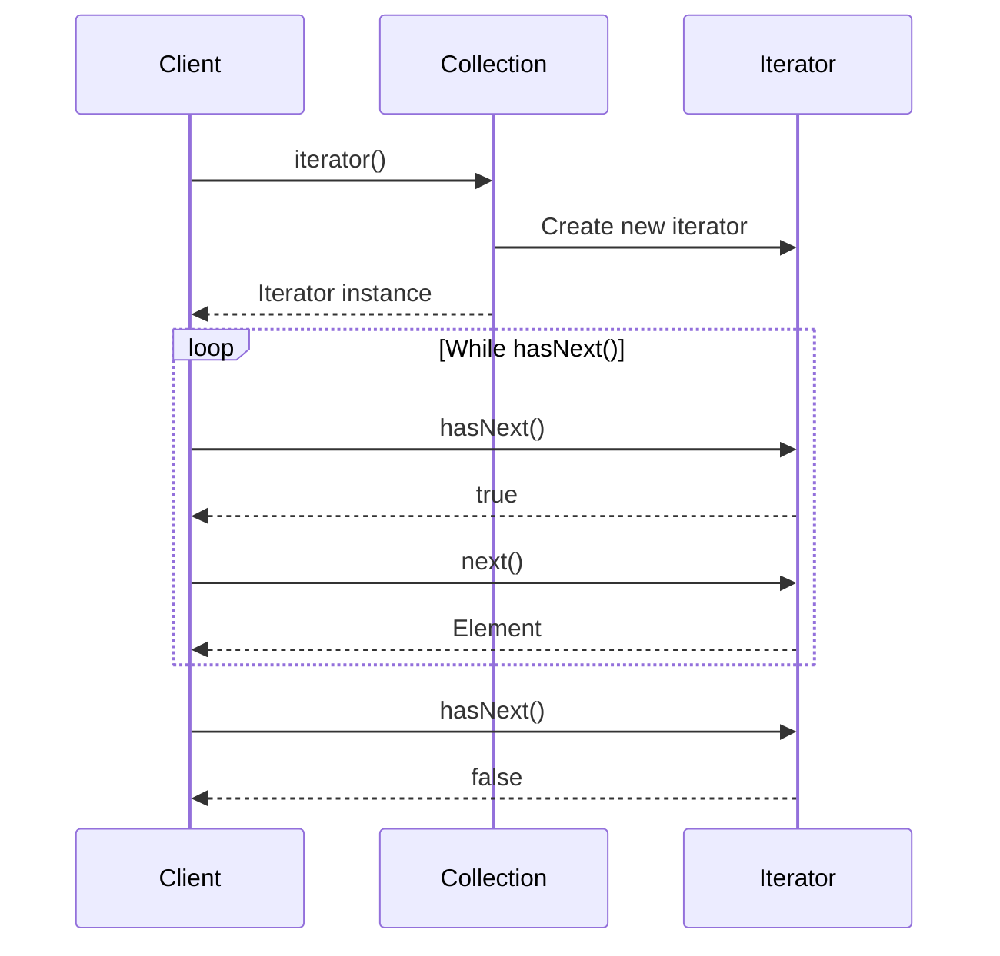

You have a playlist. Sometimes it's stored as an array. Sometimes as a linked list. Sometimes in a database. The UI code shouldn't care. It just needs to play songs one by one.

Iterator lets you traverse any collection without knowing how it's stored.

## What is the Iterator Pattern?

Iterator provides a way to access collection elements sequentially without exposing the underlying representation. The iterator object tracks position and provides consistent access methods.


MyList creates a ListIter. Clients use the iterator to traverse, never accessing the collection's internals directly.

## When to Use Iterator

| Use Iterator When | Skip Iterator When |
|------------------|-------------------|
| You want uniform traversal across different collections | Simple array iteration suffices |
| You need to hide internal representation | Structure is already public |
| You want multiple simultaneous traversals | Only one traversal at a time |
| Traversal logic is complex | Standard for-each works |

In Java, you rarely implement Iterator from scratch because `java.util.Iterator` and `Iterable` are built-in. But understanding the pattern helps when creating custom collections.

## Implementation

### Custom Tree Iterator

```java
public class TreeNode<T> {
    private final T value;
    private final List<TreeNode<T>> children;
    
    public TreeNode(T value) {
        this.value = value;
        this.children = new ArrayList<>();
    }
    
    public void addChild(TreeNode<T> child) {
        children.add(child);
    }
    
    public T getValue() { return value; }
    public List<TreeNode<T>> getChildren() { return children; }
}

public class Tree<T> implements Iterable<T> {
    private TreeNode<T> root;
    
    public Tree(TreeNode<T> root) {
        this.root = root;
    }
    
    @Override
    public Iterator<T> iterator() {
        return new BreadthFirstIterator<>(root);
    }
    
    public Iterator<T> depthFirstIterator() {
        return new DepthFirstIterator<>(root);
    }
}

public class BreadthFirstIterator<T> implements Iterator<T> {
    private final Queue<TreeNode<T>> queue = new LinkedList<>();
    
    public BreadthFirstIterator(TreeNode<T> root) {
        if (root != null) {
            queue.add(root);
        }
    }
    
    @Override
    public boolean hasNext() {
        return !queue.isEmpty();
    }
    
    @Override
    public T next() {
        if (!hasNext()) {
            throw new NoSuchElementException();
        }
        TreeNode<T> node = queue.poll();
        queue.addAll(node.getChildren());
        return node.getValue();
    }
}

public class DepthFirstIterator<T> implements Iterator<T> {
    private final Deque<TreeNode<T>> stack = new ArrayDeque<>();
    
    public DepthFirstIterator(TreeNode<T> root) {
        if (root != null) {
            stack.push(root);
        }
    }
    
    @Override
    public boolean hasNext() {
        return !stack.isEmpty();
    }
    
    @Override
    public T next() {
        if (!hasNext()) {
            throw new NoSuchElementException();
        }
        TreeNode<T> node = stack.pop();
        // Push children in reverse order for left-to-right traversal
        List<TreeNode<T>> children = node.getChildren();
        for (int i = children.size() - 1; i >= 0; i--) {
            stack.push(children.get(i));
        }
        return node.getValue();
    }
}
```

### Usage

```java
// Build a tree
TreeNode<String> root = new TreeNode<>("CEO");
TreeNode<String> cto = new TreeNode<>("CTO");
TreeNode<String> cfo = new TreeNode<>("CFO");
root.addChild(cto);
root.addChild(cfo);
cto.addChild(new TreeNode<>("Dev Lead"));
cto.addChild(new TreeNode<>("QA Lead"));
cfo.addChild(new TreeNode<>("Accountant"));

Tree<String> orgChart = new Tree<>(root);

// Breadth-first (level by level)
System.out.println("Breadth-first:");
for (String name : orgChart) {
    System.out.println("  " + name);
}
// CEO, CTO, CFO, Dev Lead, QA Lead, Accountant

// Depth-first
System.out.println("Depth-first:");
Iterator<String> dfs = orgChart.depthFirstIterator();
while (dfs.hasNext()) {
    System.out.println("  " + dfs.next());
}
// CEO, CTO, Dev Lead, QA Lead, CFO, Accountant
```

## Filtered Iterator

```java
public class FilteredIterator<T> implements Iterator<T> {
    private final Iterator<T> source;
    private final Predicate<T> filter;
    private T nextElement;
    private boolean hasNext;
    
    public FilteredIterator(Iterator<T> source, Predicate<T> filter) {
        this.source = source;
        this.filter = filter;
        advance();
    }
    
    private void advance() {
        hasNext = false;
        while (source.hasNext()) {
            T candidate = source.next();
            if (filter.test(candidate)) {
                nextElement = candidate;
                hasNext = true;
                return;
            }
        }
    }
    
    @Override
    public boolean hasNext() {
        return hasNext;
    }
    
    @Override
    public T next() {
        if (!hasNext) {
            throw new NoSuchElementException();
        }
        T result = nextElement;
        advance();
        return result;
    }
}

// Usage
List<Integer> numbers = Arrays.asList(1, 2, 3, 4, 5, 6, 7, 8, 9, 10);
Iterator<Integer> evenNumbers = new FilteredIterator<>(
    numbers.iterator(),
    n -> n % 2 == 0
);

while (evenNumbers.hasNext()) {
    System.out.println(evenNumbers.next());  // 2, 4, 6, 8, 10
}
```

## Paginated Iterator

```java
public class PaginatedIterator<T> implements Iterator<List<T>> {
    private final Iterator<T> source;
    private final int pageSize;
    
    public PaginatedIterator(Iterator<T> source, int pageSize) {
        this.source = source;
        this.pageSize = pageSize;
    }
    
    @Override
    public boolean hasNext() {
        return source.hasNext();
    }
    
    @Override
    public List<T> next() {
        if (!hasNext()) {
            throw new NoSuchElementException();
        }
        
        List<T> page = new ArrayList<>(pageSize);
        while (source.hasNext() && page.size() < pageSize) {
            page.add(source.next());
        }
        return page;
    }
}

// Usage - process in batches
List<User> users = userRepository.findAll();
Iterator<List<User>> pages = new PaginatedIterator<>(users.iterator(), 100);

while (pages.hasNext()) {
    List<User> batch = pages.next();
    processUserBatch(batch);
}
```

## Java's Iterable and Iterator

Java's standard interfaces:

```java
public class Playlist implements Iterable<Song> {
    private final List<Song> songs = new ArrayList<>();
    
    public void addSong(Song song) {
        songs.add(song);
    }
    
    @Override
    public Iterator<Song> iterator() {
        return songs.iterator();  // Delegate to internal list
    }
    
    // Custom iterator for shuffle mode
    public Iterator<Song> shuffleIterator() {
        List<Song> shuffled = new ArrayList<>(songs);
        Collections.shuffle(shuffled);
        return shuffled.iterator();
    }
    
    // Reverse iterator
    public Iterator<Song> reverseIterator() {
        return new Iterator<Song>() {
            private int index = songs.size() - 1;
            
            @Override
            public boolean hasNext() {
                return index >= 0;
            }
            
            @Override
            public Song next() {
                if (!hasNext()) throw new NoSuchElementException();
                return songs.get(index--);
            }
        };
    }
}

// Usage with for-each (uses iterator() automatically)
Playlist playlist = new Playlist();
playlist.addSong(new Song("Song A"));
playlist.addSong(new Song("Song B"));

for (Song song : playlist) {
    song.play();
}
```

## How It Works



## Common Mistakes

### 1. Modifying Collection During Iteration

```java
// Wrong - ConcurrentModificationException
for (String item : list) {
    if (item.equals("remove me")) {
        list.remove(item);  // Throws exception!
    }
}

// Right - use Iterator.remove()
Iterator<String> iter = list.iterator();
while (iter.hasNext()) {
    if (iter.next().equals("remove me")) {
        iter.remove();  // Safe removal
    }
}

// Or use removeIf
list.removeIf(item -> item.equals("remove me"));
```

### 2. Calling next() Without hasNext()

```java
// Wrong - may throw NoSuchElementException
String first = iterator.next();  // What if empty?

// Right - always check
if (iterator.hasNext()) {
    String first = iterator.next();
}
```

### 3. Reusing Exhausted Iterator

```java
// Wrong - iterator is exhausted
while (iter.hasNext()) {
    process(iter.next());
}
// iter.hasNext() is now always false

while (iter.hasNext()) {  // Never enters - iter is done!
    process(iter.next());
}

// Right - create new iterator
for (String item : collection) {
    process(item);
}
for (String item : collection) {  // Works - new iterator each time
    process(item);
}
```

## Real-World Examples

**Java Collections**: Every `List`, `Set`, `Map` implements `Iterable`.

**JDBC ResultSet**: `next()` moves to next row, hiding how data is fetched.

**Stream API**: Streams use internal iteration with lazy evaluation.

**File Systems**: `DirectoryStream` iterates over directory contents.

## Related Patterns

**[Composite](/design-patterns/composite/)** structures are often traversed using iterators.

**[Visitor](/design-patterns/visitor/)** can work with iterators to apply operations during traversal.

**[Factory Method](/design-patterns/factory-method/)** is used by collections to create appropriate iterators.

## Wrapping Up

Iterator provides uniform access to collections regardless of their internal structure. It encapsulates traversal logic and enables multiple simultaneous iterations.

In Java, implement `Iterable` to enable for-each loops. Use custom iterators for special traversal needs like filtering, pagination, or tree walking.

The pattern hides complexity. Clients don't care if it's an array, linked list, tree, or database. They just call `hasNext()` and `next()`.

---

**Further Reading:**

- [Java Iterator Documentation](https://docs.oracle.com/javase/8/docs/api/java/util/Iterator.html)
- [Effective Java - Item 58: Prefer for-each loops](https://www.oreilly.com/library/view/effective-java/9780134686097/)

