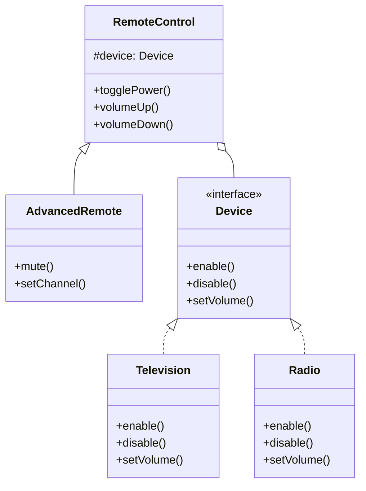

You're building a drawing application. You have shapes: Circle, Square, Triangle. Each shape can be rendered differently: SVG, Canvas, PDF. With inheritance, you'd need CircleSVG, CircleCanvas, CirclePDF, SquareSVG, SquareCanvas... that's 9 classes for 3 shapes and 3 renderers.

Bridge avoids this explosion by separating shape logic from rendering logic.

## What is the Bridge Pattern?

Bridge decouples an abstraction from its implementation so they can vary independently. The abstraction contains a reference to an implementation object and delegates work to it.


The Abstraction uses the Implementor. Both sides can be extended independently.

## When to Use Bridge

| Use Bridge When | Skip Bridge When |
|----------------|------------------|
| You want to avoid class explosion | Combinations are few and stable |
| Both abstraction and implementation should be extensible | One side is fixed |
| Implementation can be switched at runtime | Binding is permanent |
| You want to hide implementation from clients | Implementation details don't matter |

Bridge is about planned decoupling, not retrofitting.

## Implementation

### Shapes and Renderers

```java
// Implementation interface
public interface Renderer {
    void renderCircle(double x, double y, double radius);
    void renderSquare(double x, double y, double side);
    void renderTriangle(double x1, double y1, double x2, double y2, double x3, double y3);
}

// Concrete implementations
public class SvgRenderer implements Renderer {
    @Override
    public void renderCircle(double x, double y, double radius) {
        System.out.printf("<circle cx=\"%.1f\" cy=\"%.1f\" r=\"%.1f\"/>%n", x, y, radius);
    }
    
    @Override
    public void renderSquare(double x, double y, double side) {
        System.out.printf("<rect x=\"%.1f\" y=\"%.1f\" width=\"%.1f\" height=\"%.1f\"/>%n", 
                          x, y, side, side);
    }
    
    @Override
    public void renderTriangle(double x1, double y1, double x2, double y2, double x3, double y3) {
        System.out.printf("<polygon points=\"%.1f,%.1f %.1f,%.1f %.1f,%.1f\"/>%n",
                          x1, y1, x2, y2, x3, y3);
    }
}

public class CanvasRenderer implements Renderer {
    @Override
    public void renderCircle(double x, double y, double radius) {
        System.out.printf("ctx.arc(%.1f, %.1f, %.1f, 0, 2 * Math.PI);%n", x, y, radius);
        System.out.println("ctx.stroke();");
    }
    
    @Override
    public void renderSquare(double x, double y, double side) {
        System.out.printf("ctx.rect(%.1f, %.1f, %.1f, %.1f);%n", x, y, side, side);
        System.out.println("ctx.stroke();");
    }
    
    @Override
    public void renderTriangle(double x1, double y1, double x2, double y2, double x3, double y3) {
        System.out.println("ctx.beginPath();");
        System.out.printf("ctx.moveTo(%.1f, %.1f);%n", x1, y1);
        System.out.printf("ctx.lineTo(%.1f, %.1f);%n", x2, y2);
        System.out.printf("ctx.lineTo(%.1f, %.1f);%n", x3, y3);
        System.out.println("ctx.closePath();");
        System.out.println("ctx.stroke();");
    }
}

// Abstraction
public abstract class Shape {
    protected Renderer renderer;
    
    public Shape(Renderer renderer) {
        this.renderer = renderer;
    }
    
    public abstract void draw();
    public abstract void resize(double factor);
}

// Refined abstractions
public class Circle extends Shape {
    private double x, y, radius;
    
    public Circle(double x, double y, double radius, Renderer renderer) {
        super(renderer);
        this.x = x;
        this.y = y;
        this.radius = radius;
    }
    
    @Override
    public void draw() {
        renderer.renderCircle(x, y, radius);
    }
    
    @Override
    public void resize(double factor) {
        radius *= factor;
    }
}

public class Square extends Shape {
    private double x, y, side;
    
    public Square(double x, double y, double side, Renderer renderer) {
        super(renderer);
        this.x = x;
        this.y = y;
        this.side = side;
    }
    
    @Override
    public void draw() {
        renderer.renderSquare(x, y, side);
    }
    
    @Override
    public void resize(double factor) {
        side *= factor;
    }
}
```

### Usage

```java
// SVG rendering
Renderer svgRenderer = new SvgRenderer();
Shape circle = new Circle(100, 100, 50, svgRenderer);
Shape square = new Square(200, 200, 100, svgRenderer);

circle.draw();
// <circle cx="100.0" cy="100.0" r="50.0"/>
square.draw();
// <rect x="200.0" y="200.0" width="100.0" height="100.0"/>

// Same shapes, different renderer
Renderer canvasRenderer = new CanvasRenderer();
Shape circle2 = new Circle(100, 100, 50, canvasRenderer);
circle2.draw();
// ctx.arc(100.0, 100.0, 50.0, 0, 2 * Math.PI);
// ctx.stroke();
```

## Device and Remote Control Example

```java
// Implementation - different devices
public interface Device {
    boolean isEnabled();
    void enable();
    void disable();
    int getVolume();
    void setVolume(int volume);
    int getChannel();
    void setChannel(int channel);
}

public class Television implements Device {
    private boolean on = false;
    private int volume = 30;
    private int channel = 1;
    
    @Override
    public boolean isEnabled() { return on; }
    
    @Override
    public void enable() { 
        on = true;
        System.out.println("TV is ON");
    }
    
    @Override
    public void disable() { 
        on = false;
        System.out.println("TV is OFF");
    }
    
    @Override
    public int getVolume() { return volume; }
    
    @Override
    public void setVolume(int volume) { 
        this.volume = Math.max(0, Math.min(100, volume));
        System.out.println("TV volume: " + this.volume);
    }
    
    @Override
    public int getChannel() { return channel; }
    
    @Override
    public void setChannel(int channel) { 
        this.channel = channel;
        System.out.println("TV channel: " + this.channel);
    }
}

public class Radio implements Device {
    private boolean on = false;
    private int volume = 20;
    private int channel = 88;  // FM frequency
    
    @Override
    public boolean isEnabled() { return on; }
    
    @Override
    public void enable() { 
        on = true;
        System.out.println("Radio is ON");
    }
    
    @Override
    public void disable() { 
        on = false;
        System.out.println("Radio is OFF");
    }
    
    @Override
    public int getVolume() { return volume; }
    
    @Override
    public void setVolume(int volume) { 
        this.volume = Math.max(0, Math.min(100, volume));
        System.out.println("Radio volume: " + this.volume);
    }
    
    @Override
    public int getChannel() { return channel; }
    
    @Override
    public void setChannel(int channel) { 
        this.channel = channel;
        System.out.println("Radio frequency: " + this.channel + " FM");
    }
}

// Abstraction - remote controls
public class RemoteControl {
    protected Device device;
    
    public RemoteControl(Device device) {
        this.device = device;
    }
    
    public void togglePower() {
        if (device.isEnabled()) {
            device.disable();
        } else {
            device.enable();
        }
    }
    
    public void volumeUp() {
        device.setVolume(device.getVolume() + 10);
    }
    
    public void volumeDown() {
        device.setVolume(device.getVolume() - 10);
    }
    
    public void channelUp() {
        device.setChannel(device.getChannel() + 1);
    }
    
    public void channelDown() {
        device.setChannel(device.getChannel() - 1);
    }
}

// Refined abstraction - advanced remote
public class AdvancedRemote extends RemoteControl {
    
    public AdvancedRemote(Device device) {
        super(device);
    }
    
    public void mute() {
        device.setVolume(0);
    }
    
    public void setChannel(int channel) {
        device.setChannel(channel);
    }
}

// Usage
Device tv = new Television();
RemoteControl remote = new RemoteControl(tv);

remote.togglePower();  // TV is ON
remote.volumeUp();     // TV volume: 40
remote.channelUp();    // TV channel: 2

Device radio = new Radio();
AdvancedRemote advancedRemote = new AdvancedRemote(radio);

advancedRemote.togglePower();  // Radio is ON
advancedRemote.setChannel(102); // Radio frequency: 102 FM
advancedRemote.mute();          // Radio volume: 0
```

## How It Works



Without Bridge: BasicTVRemote, AdvancedTVRemote, BasicRadioRemote, AdvancedRadioRemote... (2 remotes x N devices = 2N classes)

With Bridge: 2 remote classes + N device classes = N+2 classes

## Common Mistakes

### 1. Bridge vs Adapter Confusion

```java
// ADAPTER - makes existing incompatible interfaces work
// You have a Square peg and a Round hole
public class SquarePegAdapter implements RoundPeg {
    private SquarePeg peg;
    // Adapts interface
}

// BRIDGE - designed upfront for decoupling
// You plan for multiple shapes AND multiple renderers
public abstract class Shape {
    protected Renderer renderer;  // Bridge to implementation
}
```

### 2. Leaking Implementation Details

```java
// Wrong - abstraction exposes implementation
public class Shape {
    public Renderer getRenderer() {  // Exposes implementation
        return renderer;
    }
}

// Right - abstraction hides implementation
public class Shape {
    protected Renderer renderer;  // Protected, not exposed
    
    public void draw() {
        renderer.render(this);
    }
}
```

### 3. Over-Engineering Simple Cases

Don't use Bridge when you have only one implementation:

```java
// Overkill - only one renderer exists
public interface Renderer { }
public class TheOnlyRenderer implements Renderer { }

// Just use the class directly
public class Shape {
    public void draw() {
        // Direct rendering code
    }
}
```

## Real-World Examples

**JDBC**: `DriverManager` (abstraction) works with database-specific drivers (implementation).

**Java AWT**: `Window`, `Panel` are abstractions. Peer classes are implementations for each platform.

**Logging Frameworks**: SLF4J abstraction with Logback/Log4j implementations.

**Remote API Clients**: Client abstraction with HTTP/gRPC/WebSocket implementations.

## Related Patterns

**[Adapter](/design-patterns/adapter/)** makes things work together after they exist. Bridge is planned upfront.

**[Abstract Factory](/design-patterns/abstract-factory/)** can create implementations for the Bridge.

**[Strategy](/design-patterns/strategy/)** is similar but focuses on swapping algorithms, not separating abstraction from implementation.

## Wrapping Up

Bridge separates abstraction from implementation so both can evolve independently. It prevents class explosion when you have multiple dimensions of variation.

Use it when you need to vary both what something is and how it works. The abstraction defines "what," the implementation defines "how."

Design Bridge upfront. If you're retrofitting, you probably want Adapter instead.

---

**Further Reading:**

- [Head First Design Patterns](https://www.oreilly.com/library/view/head-first-design/0596007124/) - Appendix
- [JDBC Architecture](https://docs.oracle.com/javase/tutorial/jdbc/overview/index.html)

