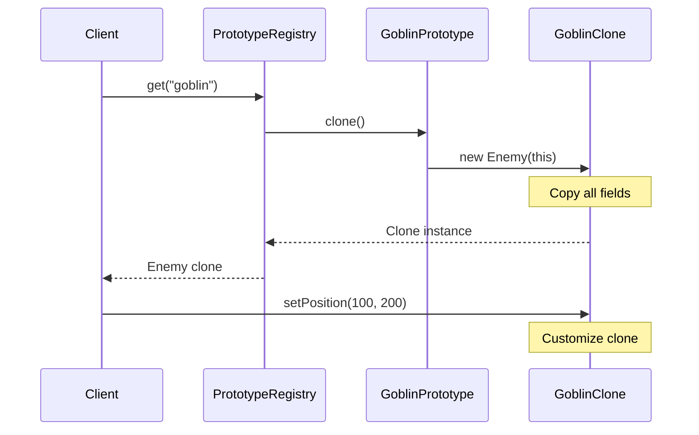

You're building a game. Each level needs thousands of similar enemies: same stats, same abilities, minor variations. Creating each from scratch is slow. Configuration is complex.

What if you could just copy a template enemy and tweak it?

## What is the Prototype Pattern?

Prototype creates new objects by cloning an existing object. You create a prototype, configure it once, then clone it to create new instances. The clone has the same state as the original.


The client works with the Prototype interface. It doesn't know the concrete class being cloned.

## When to Use Prototype

| Use Prototype When | Skip Prototype When |
|-------------------|---------------------|
| Object creation is expensive | Creating objects is cheap |
| You need copies of configured objects | Each object needs unique setup |
| You want to reduce subclasses | Inheritance works fine |
| Concrete classes should be hidden | Class visibility isn't a concern |

Prototype is about copying, not constructing from scratch.

## Implementation

### Basic Prototype

```java
public interface Prototype<T> {
    T clone();
}

public class Enemy implements Prototype<Enemy> {
    private String name;
    private int health;
    private int attack;
    private int defense;
    private List<String> abilities;
    private Position position;
    
    public Enemy(String name, int health, int attack, int defense) {
        this.name = name;
        this.health = health;
        this.attack = attack;
        this.defense = defense;
        this.abilities = new ArrayList<>();
        this.position = new Position(0, 0);
    }
    
    // Private copy constructor
    private Enemy(Enemy source) {
        this.name = source.name;
        this.health = source.health;
        this.attack = source.attack;
        this.defense = source.defense;
        // Deep copy of mutable objects
        this.abilities = new ArrayList<>(source.abilities);
        this.position = new Position(source.position.x, source.position.y);
    }
    
    @Override
    public Enemy clone() {
        return new Enemy(this);
    }
    
    public void addAbility(String ability) {
        abilities.add(ability);
    }
    
    public void setPosition(int x, int y) {
        this.position = new Position(x, y);
    }
    
    // Getters...
}

// Usage
Enemy goblinPrototype = new Enemy("Goblin", 50, 10, 5);
goblinPrototype.addAbility("Quick Attack");
goblinPrototype.addAbility("Dodge");

// Clone for each instance
Enemy goblin1 = goblinPrototype.clone();
goblin1.setPosition(100, 200);

Enemy goblin2 = goblinPrototype.clone();
goblin2.setPosition(150, 220);

// Each goblin has same stats but different positions
```

### Prototype Registry

```java
public class PrototypeRegistry {
    private final Map<String, Prototype<?>> prototypes = new HashMap<>();
    
    public void register(String key, Prototype<?> prototype) {
        prototypes.put(key, prototype);
    }
    
    @SuppressWarnings("unchecked")
    public <T extends Prototype<T>> T get(String key) {
        Prototype<?> prototype = prototypes.get(key);
        if (prototype == null) {
            throw new IllegalArgumentException("Unknown prototype: " + key);
        }
        return (T) prototype.clone();
    }
}

// Usage
PrototypeRegistry enemies = new PrototypeRegistry();

// Register prototypes once
Enemy goblin = new Enemy("Goblin", 50, 10, 5);
goblin.addAbility("Quick Attack");
enemies.register("goblin", goblin);

Enemy orc = new Enemy("Orc", 100, 20, 15);
orc.addAbility("Smash");
orc.addAbility("Rage");
enemies.register("orc", orc);

Enemy dragon = new Enemy("Dragon", 500, 50, 40);
dragon.addAbility("Fire Breath");
dragon.addAbility("Fly");
dragon.addAbility("Tail Sweep");
enemies.register("dragon", dragon);

// Spawn enemies by cloning
Enemy enemy1 = enemies.get("goblin");
Enemy enemy2 = enemies.get("orc");
Enemy boss = enemies.get("dragon");
```

### Deep Copy for Complex Objects

```java
public class GameCharacter implements Prototype<GameCharacter> {
    private String name;
    private Stats stats;
    private Inventory inventory;
    private List<Skill> skills;
    private Map<String, Integer> attributes;
    
    // Copy constructor with deep cloning
    private GameCharacter(GameCharacter source) {
        this.name = source.name;
        this.stats = source.stats.clone();  // Stats must also be cloneable
        this.inventory = source.inventory.clone();  // Deep copy
        this.skills = source.skills.stream()
            .map(Skill::clone)
            .collect(Collectors.toList());
        this.attributes = new HashMap<>(source.attributes);
    }
    
    @Override
    public GameCharacter clone() {
        return new GameCharacter(this);
    }
}

public class Stats implements Prototype<Stats> {
    private int strength;
    private int agility;
    private int intelligence;
    
    private Stats(Stats source) {
        this.strength = source.strength;
        this.agility = source.agility;
        this.intelligence = source.intelligence;
    }
    
    @Override
    public Stats clone() {
        return new Stats(this);
    }
}

public class Inventory implements Prototype<Inventory> {
    private List<Item> items;
    private int gold;
    
    private Inventory(Inventory source) {
        this.items = source.items.stream()
            .map(Item::clone)
            .collect(Collectors.toList());
        this.gold = source.gold;
    }
    
    @Override
    public Inventory clone() {
        return new Inventory(this);
    }
}
```

### Using Java's Cloneable

```java
public class Document implements Cloneable {
    private String title;
    private String content;
    private List<String> authors;
    private Date createdAt;
    
    @Override
    public Document clone() {
        try {
            Document cloned = (Document) super.clone();
            // Deep copy mutable fields
            cloned.authors = new ArrayList<>(this.authors);
            cloned.createdAt = (Date) this.createdAt.clone();
            return cloned;
        } catch (CloneNotSupportedException e) {
            throw new AssertionError("Should not happen", e);
        }
    }
}
```

Note: Java's `Cloneable` is considered problematic. Most prefer copy constructors or custom clone methods.

## Configuration Templates

```java
public class HttpRequestTemplate implements Prototype<HttpRequestTemplate> {
    private String baseUrl;
    private Map<String, String> headers;
    private Duration timeout;
    private int retries;
    
    private HttpRequestTemplate(HttpRequestTemplate source) {
        this.baseUrl = source.baseUrl;
        this.headers = new HashMap<>(source.headers);
        this.timeout = source.timeout;
        this.retries = source.retries;
    }
    
    public HttpRequestTemplate() {
        this.headers = new HashMap<>();
        this.timeout = Duration.ofSeconds(30);
        this.retries = 3;
    }
    
    @Override
    public HttpRequestTemplate clone() {
        return new HttpRequestTemplate(this);
    }
    
    // Builder methods for customization after cloning
    public HttpRequestTemplate withPath(String path) {
        HttpRequestTemplate copy = this.clone();
        copy.baseUrl = this.baseUrl + path;
        return copy;
    }
    
    public HttpRequestTemplate withHeader(String key, String value) {
        HttpRequestTemplate copy = this.clone();
        copy.headers.put(key, value);
        return copy;
    }
}

// Setup base template
HttpRequestTemplate apiTemplate = new HttpRequestTemplate();
apiTemplate.setBaseUrl("https://api.example.com");
apiTemplate.addHeader("Authorization", "Bearer token123");
apiTemplate.addHeader("Content-Type", "application/json");

// Clone and customize for specific endpoints
HttpRequestTemplate usersRequest = apiTemplate.clone()
    .withPath("/users");

HttpRequestTemplate ordersRequest = apiTemplate.clone()
    .withPath("/orders")
    .withHeader("X-Custom-Header", "value");
```

## How It Works



## Common Mistakes

### 1. Shallow Copy Instead of Deep Copy

```java
// Wrong - shallow copy shares references
private Enemy(Enemy source) {
    this.name = source.name;
    this.abilities = source.abilities;  // Same list!
}

// Modifying one affects the other
clone.abilities.add("New Skill");  // Also adds to original!

// Right - deep copy
private Enemy(Enemy source) {
    this.name = source.name;
    this.abilities = new ArrayList<>(source.abilities);  // New list
}
```

### 2. Forgetting Mutable Fields

```java
// Missing deep copy for mutable Date
private Document(Document source) {
    this.title = source.title;  // String is immutable, OK
    this.createdAt = source.createdAt;  // Date is mutable, WRONG
}

// Right
private Document(Document source) {
    this.title = source.title;
    this.createdAt = new Date(source.createdAt.getTime());  // Copy
}
```

### 3. Circular References

```java
// Tricky - nodes reference each other
public class TreeNode implements Prototype<TreeNode> {
    private TreeNode parent;
    private List<TreeNode> children;
    
    @Override
    public TreeNode clone() {
        // Need to handle parent/child relationships carefully
        TreeNode clone = new TreeNode();
        clone.children = children.stream()
            .map(TreeNode::clone)
            .peek(child -> child.parent = clone)  // Fix parent references
            .collect(Collectors.toList());
        return clone;
    }
}
```

## Real-World Examples

**Java Object.clone()**: Built-in cloning mechanism.

**JavaScript Object Spread**: `{...obj}` creates a shallow copy.

**Spreadsheet Templates**: Clone a template row/sheet with formulas.

**IDE Project Templates**: Clone project structure with default files.

## Related Patterns

**[Abstract Factory](/design-patterns/abstract-factory/)** can use prototypes instead of constructors.

**[Builder](/design-patterns/builder/)** creates complex objects step by step. Prototype copies existing complex objects.

**[Memento](/design-patterns/memento/)** captures object state for later restoration. Prototype copies for new instances.

## Wrapping Up

Prototype creates new objects by copying existing ones. It's useful when construction is expensive, when you have pre-configured templates, or when you want to hide concrete classes.

Remember to implement deep copy for mutable fields. Shallow copies lead to shared state bugs.

Use a prototype registry when you have multiple prototype types to manage.

---

**Further Reading:**

- [Effective Java - Item 13: Override clone judiciously](https://www.oreilly.com/library/view/effective-java/9780134686097/)
- [Copy Constructors vs Cloneable](https://stackoverflow.com/questions/2427883/clone-vs-copy-constructor-which-is-recommended-in-java)

