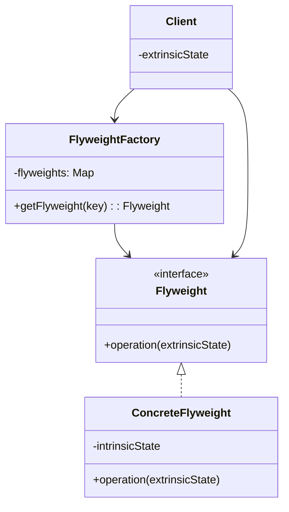
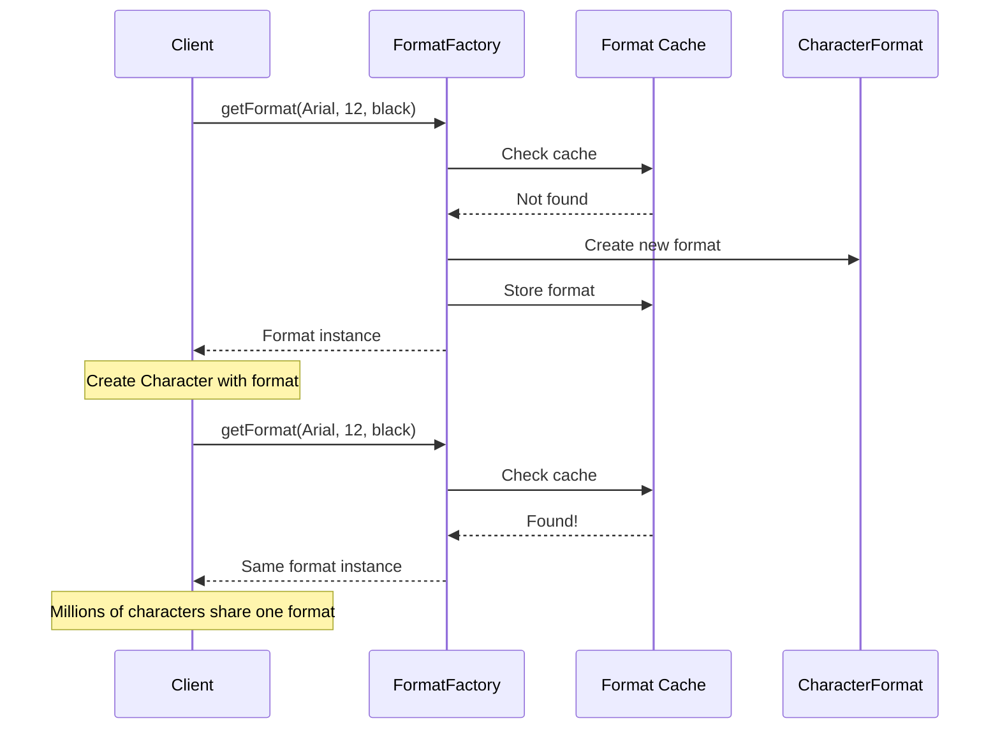

You're building a text editor. A document has a million characters. Each character has a font, size, color, and position. Storing all that for every character would use gigabytes of memory.

Most characters share the same formatting. Flyweight lets you share that common state.

## What is the Flyweight Pattern?

Flyweight minimizes memory by sharing common state between multiple objects. Instead of each object storing all its data, objects share intrinsic (constant) state and receive extrinsic (varying) state from outside.



The factory ensures flyweights are shared. Clients store only extrinsic state and reference shared flyweights.

## When to Use Flyweight

| Use Flyweight When | Skip Flyweight When |
|-------------------|---------------------|
| You have millions of similar objects | Few objects exist |
| Memory usage is a concern | Memory is plentiful |
| Most state can be shared | Objects are mostly unique |
| Object identity isn't important | Each object must be distinct |

Flyweight trades computation (looking up shared objects) for memory savings.

## Implementation

### Text Editor Character Formatting

```java
// Flyweight - shared formatting data
public class CharacterFormat {
    private final String fontFamily;
    private final int fontSize;
    private final String color;
    private final boolean bold;
    private final boolean italic;
    
    public CharacterFormat(String fontFamily, int fontSize, String color, 
                           boolean bold, boolean italic) {
        this.fontFamily = fontFamily;
        this.fontSize = fontSize;
        this.color = color;
        this.bold = bold;
        this.italic = italic;
    }
    
    // Render character with extrinsic state (position, actual character)
    public void render(char character, int x, int y) {
        System.out.printf("Rendering '%c' at (%d,%d) with %s %dpx %s%s%s%n",
            character, x, y, fontFamily, fontSize, color,
            bold ? " bold" : "", italic ? " italic" : "");
    }
    
    // Equals and hashCode for sharing
    @Override
    public boolean equals(Object o) {
        if (this == o) return true;
        if (o == null || getClass() != o.getClass()) return false;
        CharacterFormat that = (CharacterFormat) o;
        return fontSize == that.fontSize && bold == that.bold && italic == that.italic
            && fontFamily.equals(that.fontFamily) && color.equals(that.color);
    }
    
    @Override
    public int hashCode() {
        return Objects.hash(fontFamily, fontSize, color, bold, italic);
    }
}

// Flyweight Factory
public class CharacterFormatFactory {
    private static final Map<CharacterFormat, CharacterFormat> formats = new HashMap<>();
    
    public static CharacterFormat getFormat(String fontFamily, int fontSize, 
                                             String color, boolean bold, boolean italic) {
        CharacterFormat key = new CharacterFormat(fontFamily, fontSize, color, bold, italic);
        return formats.computeIfAbsent(key, k -> k);
    }
    
    public static int getFormatCount() {
        return formats.size();
    }
}

// Client - stores extrinsic state
public class Character {
    private final char character;
    private final int x;
    private final int y;
    private final CharacterFormat format;  // Shared flyweight
    
    public Character(char character, int x, int y, CharacterFormat format) {
        this.character = character;
        this.x = x;
        this.y = y;
        this.format = format;
    }
    
    public void render() {
        format.render(character, x, y);
    }
}
```

### Usage

```java
// Document with many characters, few formats
List<Character> document = new ArrayList<>();

// Most text uses default format (shared)
CharacterFormat defaultFormat = CharacterFormatFactory.getFormat(
    "Arial", 12, "black", false, false
);

// Title uses different format (also shared among title characters)
CharacterFormat titleFormat = CharacterFormatFactory.getFormat(
    "Arial", 24, "blue", true, false
);

// Add title characters
String title = "Document Title";
int x = 0;
for (char c : title.toCharArray()) {
    document.add(new Character(c, x, 0, titleFormat));
    x += 20;
}

// Add body text - millions of characters, same format
String bodyText = "Lorem ipsum dolor sit amet... (imagine millions of characters)";
x = 0;
int y = 50;
for (char c : bodyText.toCharArray()) {
    document.add(new Character(c, x, y, defaultFormat));
    x += 10;
    if (x > 800) {
        x = 0;
        y += 20;
    }
}

System.out.println("Total characters: " + document.size());
System.out.println("Unique formats: " + CharacterFormatFactory.getFormatCount());
// Millions of characters but only 2 format objects
```

## Game Particles Example

```java
// Flyweight - shared particle data
public class ParticleType {
    private final String texturePath;
    private final byte[] textureData;  // Large - several KB
    private final String color;
    private final double size;
    
    public ParticleType(String texturePath, String color, double size) {
        this.texturePath = texturePath;
        this.textureData = loadTexture(texturePath);  // Expensive
        this.color = color;
        this.size = size;
    }
    
    private byte[] loadTexture(String path) {
        // Load texture from disk - simulated
        return new byte[10000];  // 10KB texture
    }
    
    public void render(double x, double y, double velocity, double angle) {
        // Render particle at position with its properties
        System.out.printf("Particle at (%.1f, %.1f) velocity=%.1f angle=%.1f%n",
            x, y, velocity, angle);
    }
}

// Flyweight Factory
public class ParticleTypeFactory {
    private static final Map<String, ParticleType> types = new HashMap<>();
    
    public static ParticleType getType(String name) {
        return types.get(name);
    }
    
    public static void registerType(String name, ParticleType type) {
        types.put(name, type);
    }
    
    static {
        // Pre-register common particle types
        registerType("bullet", new ParticleType("bullet.png", "yellow", 2.0));
        registerType("smoke", new ParticleType("smoke.png", "gray", 10.0));
        registerType("spark", new ParticleType("spark.png", "orange", 1.0));
        registerType("explosion", new ParticleType("explosion.png", "red", 50.0));
    }
}

// Client - individual particle with extrinsic state
public class Particle {
    private double x;
    private double y;
    private double velocityX;
    private double velocityY;
    private double angle;
    private final ParticleType type;  // Shared
    
    public Particle(double x, double y, double vx, double vy, ParticleType type) {
        this.x = x;
        this.y = y;
        this.velocityX = vx;
        this.velocityY = vy;
        this.type = type;
    }
    
    public void update(double deltaTime) {
        x += velocityX * deltaTime;
        y += velocityY * deltaTime;
        angle = Math.atan2(velocityY, velocityX);
    }
    
    public void render() {
        double velocity = Math.sqrt(velocityX * velocityX + velocityY * velocityY);
        type.render(x, y, velocity, angle);
    }
}

// Usage - spawn thousands of particles
List<Particle> particles = new ArrayList<>();
ParticleType bulletType = ParticleTypeFactory.getType("bullet");

for (int i = 0; i < 10000; i++) {
    particles.add(new Particle(
        Math.random() * 1000,
        Math.random() * 1000,
        Math.random() * 10 - 5,
        Math.random() * 10 - 5,
        bulletType  // All share same type object
    ));
}

// 10,000 particles but only 1 bullet texture loaded
System.out.println("Particles: " + particles.size());
System.out.println("Memory saved: ~100MB (10KB texture x 10,000)");
```

## String Interning as Flyweight

Java's String pool is a built-in Flyweight:

```java
String s1 = "hello";
String s2 = "hello";
String s3 = new String("hello").intern();

System.out.println(s1 == s2);  // true - same object
System.out.println(s1 == s3);  // true - interned to same object

// Without interning
String s4 = new String("hello");
System.out.println(s1 == s4);  // false - different objects
```

## How It Works



## Common Mistakes

### 1. Mutable Intrinsic State

```java
// Wrong - flyweight has mutable state
public class CharacterFormat {
    private String color;  // Can be changed!
    
    public void setColor(String color) {
        this.color = color;  // Changes shared state!
    }
}

// One client changes color, all affected!
format.setColor("red");  // All characters using this format turn red

// Right - immutable flyweight
public final class CharacterFormat {
    private final String color;  // Immutable
    // No setters
}
```

### 2. Storing Extrinsic State in Flyweight

```java
// Wrong - position is extrinsic, shouldn't be shared
public class CharacterFormat {
    private int x, y;  // Position varies per character!
}

// Right - extrinsic state in client
public class Character {
    private int x, y;  // Extrinsic - in client
    private CharacterFormat format;  // Only intrinsic shared
}
```

### 3. Not Using Factory

```java
// Wrong - creates duplicates
CharacterFormat f1 = new CharacterFormat("Arial", 12, "black", false, false);
CharacterFormat f2 = new CharacterFormat("Arial", 12, "black", false, false);
// f1 != f2, no sharing

// Right - use factory
CharacterFormat f1 = CharacterFormatFactory.getFormat("Arial", 12, "black", false, false);
CharacterFormat f2 = CharacterFormatFactory.getFormat("Arial", 12, "black", false, false);
// f1 == f2, same object
```

## Real-World Examples

**String Pool**: JVM interns string literals.

**Integer Cache**: Java caches Integer objects from -128 to 127.

**Font Glyphs**: Text rendering systems share glyph data.

**Game Trees**: Chess engines share board position evaluations.

## Related Patterns

**[Singleton](/design-patterns/singleton/)** ensures one instance. Flyweight can have many shared instances.

**[Composite](/design-patterns/composite/)** structures often use flyweight for leaves.

**[State](/design-patterns/state/)** objects can be flyweights if they're stateless.

## Wrapping Up

Flyweight shares intrinsic state between objects to save memory. The factory ensures sharing. Clients store extrinsic state.

Use it when you have millions of similar objects and memory is a concern. Make sure intrinsic state is immutable.

The pattern is invisible to most clients. They just get objects from the factory without knowing they're shared.

---

**Further Reading:**

- [Java String Pool](https://www.baeldung.com/java-string-pool)
- [Integer Cache in Java](https://www.baeldung.com/java-integer-cache)

