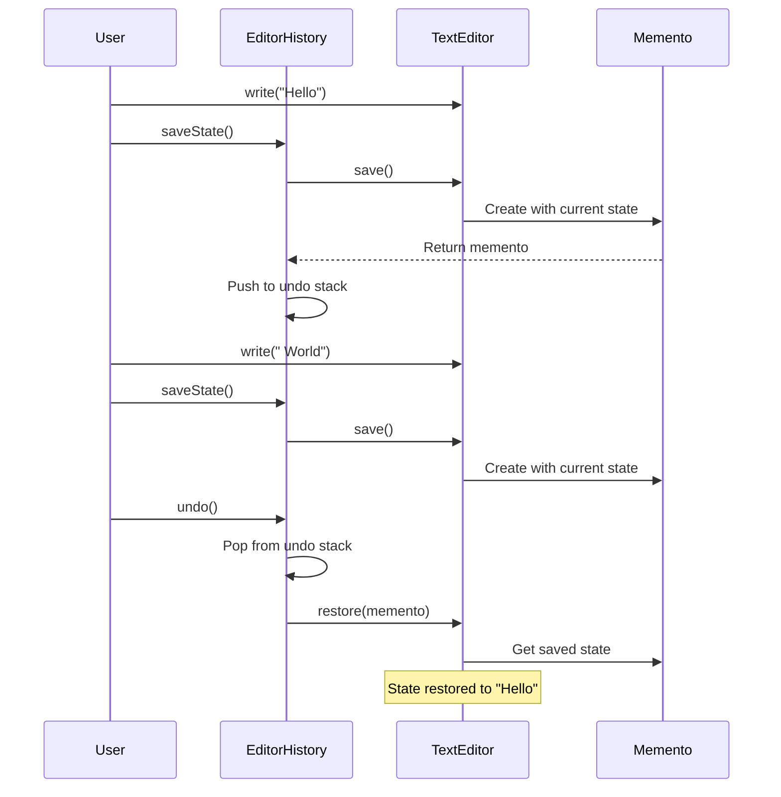

You're building a graphics editor. Users draw, move, resize objects. They expect to undo any action. Some operations are complex. Some modify multiple objects. How do you restore the previous state?

Memento captures snapshots that can be restored later.

## What is the Memento Pattern?

Memento saves an object's state without exposing its implementation. The object creates a memento (snapshot). A caretaker stores mementos. The object can restore from any stored memento.


The Snapshot is opaque to the History. Only the Editor can read its contents.

## When to Use Memento

| Use Memento When | Skip Memento When |
|-----------------|-------------------|
| You need undo/redo functionality | Operations are easily reversible |
| State should be externally saved | State is simple and small |
| Encapsulation must be preserved | Direct state access is acceptable |
| Creating state snapshots is feasible | State is too large to copy |

Memento works when state is manageable. For huge states, consider [Command pattern](/design-patterns/command/) instead.

## Implementation

### Text Editor with Undo

```java
// Memento - stores snapshot
public class EditorMemento {
    private final String content;
    private final int cursorPosition;
    private final Instant timestamp;
    
    EditorMemento(String content, int cursorPosition) {
        this.content = content;
        this.cursorPosition = cursorPosition;
        this.timestamp = Instant.now();
    }
    
    // Package-private getters - only Originator can access
    String getContent() { return content; }
    int getCursorPosition() { return cursorPosition; }
    
    public Instant getTimestamp() { return timestamp; }
}

// Originator - creates and restores from mementos
public class TextEditor {
    private StringBuilder content;
    private int cursorPosition;
    
    public TextEditor() {
        this.content = new StringBuilder();
        this.cursorPosition = 0;
    }
    
    public void write(String text) {
        content.insert(cursorPosition, text);
        cursorPosition += text.length();
    }
    
    public void delete(int count) {
        int start = Math.max(0, cursorPosition - count);
        content.delete(start, cursorPosition);
        cursorPosition = start;
    }
    
    public void moveCursor(int position) {
        this.cursorPosition = Math.max(0, Math.min(position, content.length()));
    }
    
    public String getContent() {
        return content.toString();
    }
    
    // Create snapshot
    public EditorMemento save() {
        return new EditorMemento(content.toString(), cursorPosition);
    }
    
    // Restore from snapshot
    public void restore(EditorMemento memento) {
        this.content = new StringBuilder(memento.getContent());
        this.cursorPosition = memento.getCursorPosition();
    }
}

// Caretaker - manages memento history
public class EditorHistory {
    private final Deque<EditorMemento> undoStack = new ArrayDeque<>();
    private final Deque<EditorMemento> redoStack = new ArrayDeque<>();
    private final TextEditor editor;
    
    public EditorHistory(TextEditor editor) {
        this.editor = editor;
    }
    
    public void saveState() {
        undoStack.push(editor.save());
        redoStack.clear();  // Clear redo on new action
    }
    
    public void undo() {
        if (!undoStack.isEmpty()) {
            redoStack.push(editor.save());  // Save current for redo
            editor.restore(undoStack.pop());
        }
    }
    
    public void redo() {
        if (!redoStack.isEmpty()) {
            undoStack.push(editor.save());  // Save current for undo
            editor.restore(redoStack.pop());
        }
    }
    
    public boolean canUndo() { return !undoStack.isEmpty(); }
    public boolean canRedo() { return !redoStack.isEmpty(); }
}
```

### Usage

```java
TextEditor editor = new TextEditor();
EditorHistory history = new EditorHistory(editor);

// Initial state
history.saveState();
editor.write("Hello");
System.out.println(editor.getContent());  // "Hello"

history.saveState();
editor.write(" World");
System.out.println(editor.getContent());  // "Hello World"

history.saveState();
editor.write("!");
System.out.println(editor.getContent());  // "Hello World!"

// Undo
history.undo();
System.out.println(editor.getContent());  // "Hello World"

history.undo();
System.out.println(editor.getContent());  // "Hello"

// Redo
history.redo();
System.out.println(editor.getContent());  // "Hello World"
```

## Game Save System

```java
public class GameMemento {
    private final int level;
    private final int health;
    private final int score;
    private final Position position;
    private final List<String> inventory;
    private final Map<String, Boolean> achievements;
    private final Instant savedAt;
    
    GameMemento(int level, int health, int score, Position position,
                List<String> inventory, Map<String, Boolean> achievements) {
        this.level = level;
        this.health = health;
        this.score = score;
        this.position = new Position(position.x, position.y);
        this.inventory = new ArrayList<>(inventory);
        this.achievements = new HashMap<>(achievements);
        this.savedAt = Instant.now();
    }
    
    // Getters for Game class
    int getLevel() { return level; }
    int getHealth() { return health; }
    int getScore() { return score; }
    Position getPosition() { return position; }
    List<String> getInventory() { return inventory; }
    Map<String, Boolean> getAchievements() { return achievements; }
    
    public Instant getSavedAt() { return savedAt; }
    public String getDescription() {
        return String.format("Level %d | Score: %d | %s", level, score, savedAt);
    }
}

public class Game {
    private int level;
    private int health;
    private int score;
    private Position position;
    private List<String> inventory;
    private Map<String, Boolean> achievements;
    
    public Game() {
        this.level = 1;
        this.health = 100;
        this.score = 0;
        this.position = new Position(0, 0);
        this.inventory = new ArrayList<>();
        this.achievements = new HashMap<>();
    }
    
    public void play() {
        // Game logic...
        score += 100;
        position = new Position(position.x + 10, position.y + 5);
    }
    
    public void takeDamage(int amount) {
        health -= amount;
    }
    
    public void collectItem(String item) {
        inventory.add(item);
    }
    
    public void completeLevel() {
        level++;
        health = 100;
    }
    
    public GameMemento save() {
        return new GameMemento(level, health, score, position, inventory, achievements);
    }
    
    public void restore(GameMemento memento) {
        this.level = memento.getLevel();
        this.health = memento.getHealth();
        this.score = memento.getScore();
        this.position = memento.getPosition();
        this.inventory = new ArrayList<>(memento.getInventory());
        this.achievements = new HashMap<>(memento.getAchievements());
    }
    
    public String getStatus() {
        return String.format("Level: %d, Health: %d, Score: %d, Position: (%d,%d)",
            level, health, score, position.x, position.y);
    }
}

public class SaveManager {
    private final Map<String, GameMemento> saves = new HashMap<>();
    private final int maxSaves;
    
    public SaveManager(int maxSaves) {
        this.maxSaves = maxSaves;
    }
    
    public void save(String slotName, Game game) {
        if (saves.size() >= maxSaves && !saves.containsKey(slotName)) {
            throw new IllegalStateException("Max saves reached");
        }
        saves.put(slotName, game.save());
        System.out.println("Game saved to slot: " + slotName);
    }
    
    public void load(String slotName, Game game) {
        GameMemento memento = saves.get(slotName);
        if (memento == null) {
            throw new IllegalArgumentException("No save in slot: " + slotName);
        }
        game.restore(memento);
        System.out.println("Game loaded from slot: " + slotName);
    }
    
    public List<String> listSaves() {
        return saves.entrySet().stream()
            .map(e -> e.getKey() + ": " + e.getValue().getDescription())
            .collect(Collectors.toList());
    }
}
```

## Checkpoints with Auto-Save

```java
public class AutoCheckpointManager {
    private final List<EditorMemento> checkpoints = new ArrayList<>();
    private final int maxCheckpoints;
    private final int checkpointInterval;  // In operations
    private int operationCount = 0;
    
    public AutoCheckpointManager(int maxCheckpoints, int checkpointInterval) {
        this.maxCheckpoints = maxCheckpoints;
        this.checkpointInterval = checkpointInterval;
    }
    
    public void onOperation(TextEditor editor) {
        operationCount++;
        if (operationCount % checkpointInterval == 0) {
            createCheckpoint(editor);
        }
    }
    
    private void createCheckpoint(TextEditor editor) {
        if (checkpoints.size() >= maxCheckpoints) {
            checkpoints.remove(0);  // Remove oldest
        }
        checkpoints.add(editor.save());
        System.out.println("Checkpoint created at " + Instant.now());
    }
    
    public void restoreCheckpoint(TextEditor editor, int index) {
        if (index < 0 || index >= checkpoints.size()) {
            throw new IndexOutOfBoundsException("Invalid checkpoint index");
        }
        editor.restore(checkpoints.get(index));
    }
    
    public List<Instant> getCheckpointTimes() {
        return checkpoints.stream()
            .map(EditorMemento::getTimestamp)
            .collect(Collectors.toList());
    }
}
```

## How It Works



## Common Mistakes

### 1. Exposing Memento Internals

```java
// Wrong - memento state exposed to caretaker
public class Memento {
    public String getState() {  // Public!
        return state;
    }
}

// Caretaker can peek at state
String state = memento.getState();  // Breaks encapsulation

// Right - keep internals package-private or use nested class
public class Editor {
    public class Memento {
        private final String state;  // Only Editor can access
    }
}
```

### 2. Not Deep Copying State

```java
// Wrong - memento shares mutable objects
public Memento save() {
    return new Memento(this.items);  // Same list reference!
}

// Original changes affect memento
items.add("new item");  // Memento list also changes!

// Right - deep copy
public Memento save() {
    return new Memento(new ArrayList<>(this.items));  // Copy
}
```

### 3. Memory Leaks from Unbounded History

```java
// Wrong - history grows forever
public void saveState() {
    history.add(editor.save());  // Never removed
}

// Right - limit history size
public void saveState() {
    if (history.size() >= MAX_HISTORY) {
        history.removeFirst();  // Remove oldest
    }
    history.add(editor.save());
}
```

## Real-World Examples

**Java Serialization**: Objects serialize to bytes (memento) and deserialize back.

**Database Transactions**: Savepoints act as mementos for partial rollback.

**Version Control**: Git commits are mementos of repository state.

**Browser History**: Each page state can be a memento.

## Related Patterns

**[Command](/design-patterns/command/)** stores operations. Memento stores state. Command is more efficient when operations are simple and reversible.

**[Prototype](/design-patterns/prototype/)** copies objects. Memento saves object state without creating visible copies.

**[Iterator](/design-patterns/iterator/)** can traverse memento history.

## Wrapping Up

Memento captures object state for later restoration without breaking encapsulation. The originator creates mementos. The caretaker stores them. Only the originator reads them.

Use it for undo/redo, game saves, checkpoints, and transaction rollback. Watch memory usage with large states.

Remember to deep copy mutable fields. Limit history size. Keep memento internals private.

---

**Further Reading:**

- [Java Serialization](https://docs.oracle.com/javase/8/docs/technotes/guides/serialization/)
- [Undo/Redo Best Practices](https://stackoverflow.com/questions/3541383/undo-redo-implementation)

