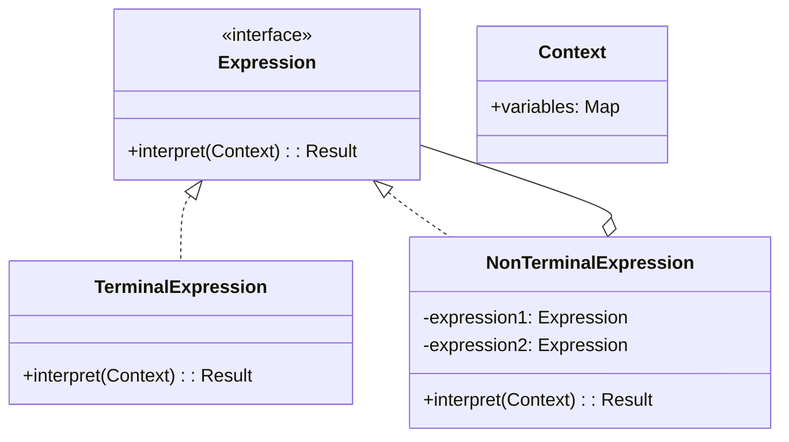
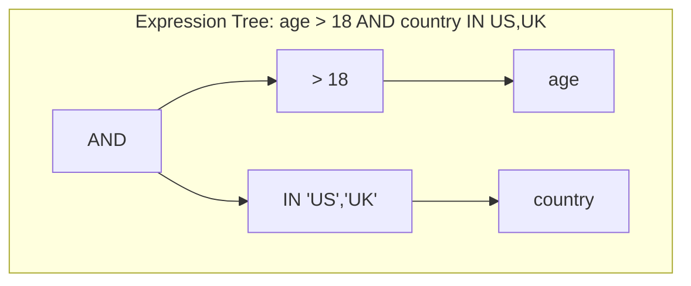
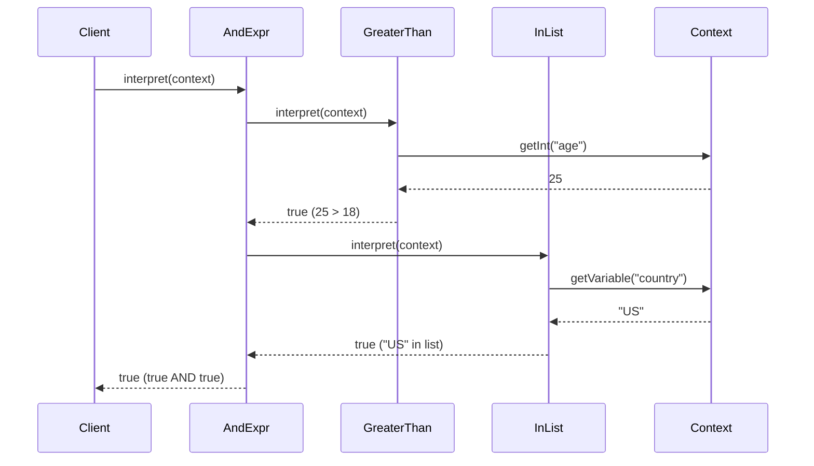

You're building a rules engine. Business users need to define conditions: "if customer.age > 18 AND customer.country IN ['US', 'UK']". You need to parse these rules and evaluate them against data.

Interpreter builds a language for these expressions.

## What is the Interpreter Pattern?

Interpreter defines a grammar as classes. Each rule becomes a class with an interpret method. Complex expressions are trees of these classes, evaluated recursively.



Terminal expressions are leaves (like numbers or variables). Non-terminal expressions combine other expressions (like AND, OR, or arithmetic operators).

## When to Use Interpreter

| Use Interpreter When | Skip Interpreter When |
|---------------------|----------------------|
| Grammar is simple and stable | Grammar is complex |
| Performance isn't critical | You need high performance |
| You're building a DSL | General-purpose parsing needed |
| Expressions are evaluated often | One-time parsing |

For complex languages, use parser generators like ANTLR or parser combinator libraries.

## Implementation

### Boolean Expression Evaluator

```java
// Expression interface
public interface BooleanExpression {
    boolean interpret(Context context);
}

// Context holds variable values
public class Context {
    private final Map<String, Object> variables = new HashMap<>();
    
    public void setVariable(String name, Object value) {
        variables.put(name, value);
    }
    
    public Object getVariable(String name) {
        return variables.get(name);
    }
    
    public int getInt(String name) {
        return (Integer) variables.get(name);
    }
    
    public String getString(String name) {
        return (String) variables.get(name);
    }
}

// Terminal: Variable reference
public class Variable implements BooleanExpression {
    private final String name;
    
    public Variable(String name) {
        this.name = name;
    }
    
    @Override
    public boolean interpret(Context context) {
        Object value = context.getVariable(name);
        if (value instanceof Boolean) {
            return (Boolean) value;
        }
        throw new IllegalArgumentException("Variable " + name + " is not boolean");
    }
}

// Terminal: Constant
public class Constant implements BooleanExpression {
    private final boolean value;
    
    public Constant(boolean value) {
        this.value = value;
    }
    
    @Override
    public boolean interpret(Context context) {
        return value;
    }
}

// Non-terminal: AND
public class AndExpression implements BooleanExpression {
    private final BooleanExpression left;
    private final BooleanExpression right;
    
    public AndExpression(BooleanExpression left, BooleanExpression right) {
        this.left = left;
        this.right = right;
    }
    
    @Override
    public boolean interpret(Context context) {
        return left.interpret(context) && right.interpret(context);
    }
}

// Non-terminal: OR
public class OrExpression implements BooleanExpression {
    private final BooleanExpression left;
    private final BooleanExpression right;
    
    public OrExpression(BooleanExpression left, BooleanExpression right) {
        this.left = left;
        this.right = right;
    }
    
    @Override
    public boolean interpret(Context context) {
        return left.interpret(context) || right.interpret(context);
    }
}

// Non-terminal: NOT
public class NotExpression implements BooleanExpression {
    private final BooleanExpression expression;
    
    public NotExpression(BooleanExpression expression) {
        this.expression = expression;
    }
    
    @Override
    public boolean interpret(Context context) {
        return !expression.interpret(context);
    }
}

// Comparison expressions
public class GreaterThan implements BooleanExpression {
    private final String variableName;
    private final int value;
    
    public GreaterThan(String variableName, int value) {
        this.variableName = variableName;
        this.value = value;
    }
    
    @Override
    public boolean interpret(Context context) {
        return context.getInt(variableName) > value;
    }
}

public class Equals implements BooleanExpression {
    private final String variableName;
    private final Object value;
    
    public Equals(String variableName, Object value) {
        this.variableName = variableName;
        this.value = value;
    }
    
    @Override
    public boolean interpret(Context context) {
        return value.equals(context.getVariable(variableName));
    }
}

public class InList implements BooleanExpression {
    private final String variableName;
    private final Set<Object> values;
    
    public InList(String variableName, Object... values) {
        this.variableName = variableName;
        this.values = new HashSet<>(Arrays.asList(values));
    }
    
    @Override
    public boolean interpret(Context context) {
        return values.contains(context.getVariable(variableName));
    }
}
```

### Usage

```java
// Build expression: age > 18 AND country IN ['US', 'UK']
BooleanExpression ageCheck = new GreaterThan("age", 18);
BooleanExpression countryCheck = new InList("country", "US", "UK");
BooleanExpression rule = new AndExpression(ageCheck, countryCheck);

// Evaluate against different contexts
Context customer1 = new Context();
customer1.setVariable("age", 25);
customer1.setVariable("country", "US");
System.out.println(rule.interpret(customer1));  // true

Context customer2 = new Context();
customer2.setVariable("age", 16);
customer2.setVariable("country", "US");
System.out.println(rule.interpret(customer2));  // false (age)

Context customer3 = new Context();
customer3.setVariable("age", 30);
customer3.setVariable("country", "FR");
System.out.println(rule.interpret(customer3));  // false (country)

// Complex rule: (age > 18 AND country IN ['US', 'UK']) OR isPremium
BooleanExpression isPremium = new Variable("isPremium");
BooleanExpression complexRule = new OrExpression(rule, isPremium);

Context customer4 = new Context();
customer4.setVariable("age", 16);
customer4.setVariable("country", "FR");
customer4.setVariable("isPremium", true);
System.out.println(complexRule.interpret(customer4));  // true (premium overrides)
```

## Mathematical Expression Evaluator

```java
public interface MathExpression {
    double interpret(Map<String, Double> variables);
}

public class Number implements MathExpression {
    private final double value;
    
    public Number(double value) {
        this.value = value;
    }
    
    @Override
    public double interpret(Map<String, Double> variables) {
        return value;
    }
}

public class VariableRef implements MathExpression {
    private final String name;
    
    public VariableRef(String name) {
        this.name = name;
    }
    
    @Override
    public double interpret(Map<String, Double> variables) {
        return variables.getOrDefault(name, 0.0);
    }
}

public class Add implements MathExpression {
    private final MathExpression left;
    private final MathExpression right;
    
    public Add(MathExpression left, MathExpression right) {
        this.left = left;
        this.right = right;
    }
    
    @Override
    public double interpret(Map<String, Double> variables) {
        return left.interpret(variables) + right.interpret(variables);
    }
}

public class Multiply implements MathExpression {
    private final MathExpression left;
    private final MathExpression right;
    
    public Multiply(MathExpression left, MathExpression right) {
        this.left = left;
        this.right = right;
    }
    
    @Override
    public double interpret(Map<String, Double> variables) {
        return left.interpret(variables) * right.interpret(variables);
    }
}

// Usage: (price * quantity) + tax
MathExpression price = new VariableRef("price");
MathExpression quantity = new VariableRef("quantity");
MathExpression tax = new VariableRef("tax");

MathExpression subtotal = new Multiply(price, quantity);
MathExpression total = new Add(subtotal, tax);

Map<String, Double> order = Map.of(
    "price", 29.99,
    "quantity", 3.0,
    "tax", 8.50
);

System.out.println("Total: $" + total.interpret(order));  // Total: $98.47
```

## Simple Parser

```java
public class ExpressionParser {
    
    // Parse simple expressions like "age > 18 AND country = US"
    public BooleanExpression parse(String input) {
        List<String> tokens = tokenize(input);
        return parseExpression(tokens, 0).expression;
    }
    
    private List<String> tokenize(String input) {
        return Arrays.asList(input.split("\\s+"));
    }
    
    private ParseResult parseExpression(List<String> tokens, int pos) {
        ParseResult left = parseSimple(tokens, pos);
        
        if (left.nextPos < tokens.size()) {
            String op = tokens.get(left.nextPos);
            if (op.equalsIgnoreCase("AND")) {
                ParseResult right = parseExpression(tokens, left.nextPos + 1);
                return new ParseResult(
                    new AndExpression(left.expression, right.expression),
                    right.nextPos
                );
            } else if (op.equalsIgnoreCase("OR")) {
                ParseResult right = parseExpression(tokens, left.nextPos + 1);
                return new ParseResult(
                    new OrExpression(left.expression, right.expression),
                    right.nextPos
                );
            }
        }
        
        return left;
    }
    
    private ParseResult parseSimple(List<String> tokens, int pos) {
        String variable = tokens.get(pos);
        String operator = tokens.get(pos + 1);
        String value = tokens.get(pos + 2);
        
        BooleanExpression expr;
        switch (operator) {
            case ">":
                expr = new GreaterThan(variable, Integer.parseInt(value));
                break;
            case "=":
                expr = new Equals(variable, value);
                break;
            default:
                throw new IllegalArgumentException("Unknown operator: " + operator);
        }
        
        return new ParseResult(expr, pos + 3);
    }
    
    private static class ParseResult {
        final BooleanExpression expression;
        final int nextPos;
        
        ParseResult(BooleanExpression expression, int nextPos) {
            this.expression = expression;
            this.nextPos = nextPos;
        }
    }
}

// Usage
ExpressionParser parser = new ExpressionParser();
BooleanExpression expr = parser.parse("age > 18 AND country = US");

Context ctx = new Context();
ctx.setVariable("age", 25);
ctx.setVariable("country", "US");
System.out.println(expr.interpret(ctx));  // true
```

## How It Works





## Common Mistakes

### 1. Complex Grammar

```java
// Grammar becomes unwieldy with many rules
public class IfThenElse implements Expression { }
public class ForLoop implements Expression { }
public class FunctionCall implements Expression { }
public class Assignment implements Expression { }
// ... 50 more classes

// Better: use a parser generator for complex languages
```

### 2. Poor Performance

```java
// Interpreted every time - slow for hot paths
for (int i = 0; i < 1_000_000; i++) {
    expression.interpret(context);  // Parsing overhead each time
}

// Better: compile to bytecode for performance-critical code
```

### 3. No Error Handling

```java
// Wrong - unclear errors
@Override
public boolean interpret(Context ctx) {
    return ctx.getInt(name) > value;  // NullPointerException if missing
}

// Better - meaningful errors
@Override
public boolean interpret(Context ctx) {
    Object val = ctx.getVariable(name);
    if (val == null) {
        throw new InterpretException("Variable '" + name + "' not found");
    }
    if (!(val instanceof Integer)) {
        throw new InterpretException("Variable '" + name + "' is not an integer");
    }
    return (Integer) val > value;
}
```

## Real-World Examples

**Regular Expressions**: `Pattern` compiles regex into an interpretable structure.

**SQL Parsers**: Query engines parse SQL into expression trees.

**Spring Expression Language (SpEL)**: `#{expression}` in Spring configurations.

**JEXL/OGNL**: Expression languages for Java.

## Related Patterns

**[Composite](/design-patterns/composite/)** is the structural foundation. Expression trees are composites.

**[Visitor](/design-patterns/visitor/)** can traverse expression trees for analysis, optimization, or code generation.

**[Flyweight](/design-patterns/flyweight/)** can share terminal expressions like common constants.

## Wrapping Up

Interpreter turns grammar rules into classes with interpret methods. It's good for simple DSLs, rule engines, and expression evaluators.

The pattern becomes unwieldy for complex languages. For real parsers, use tools like ANTLR, parser combinators, or compiled approaches.

Use Interpreter when the grammar is simple, the language is stable, and you need to evaluate expressions repeatedly with different contexts.

---

**Further Reading:**

- [ANTLR Parser Generator](https://www.antlr.org/)
- [Writing a Simple Expression Parser](https://en.wikipedia.org/wiki/Recursive_descent_parser)

