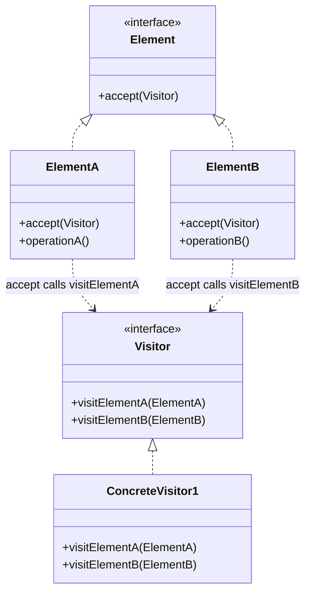
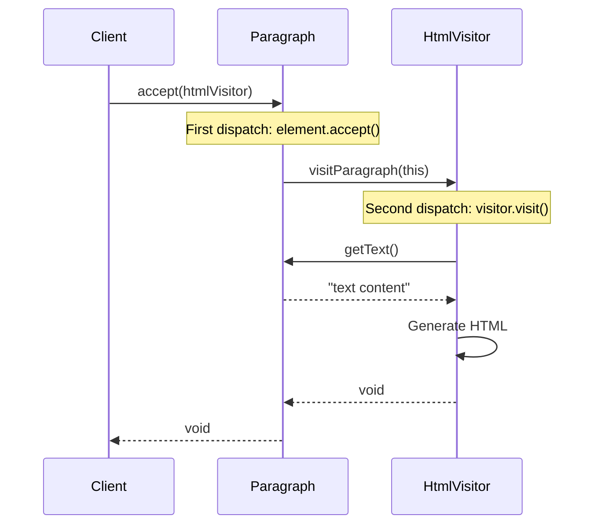

You're building a compiler. The AST has dozens of node types: IfStatement, ForLoop, Assignment, FunctionCall. You need to add operations: type checking, code generation, optimization, pretty printing.

Adding methods to each node class for each operation is chaos. Visitor keeps operations separate from the structure.

## What is the Visitor Pattern?

Visitor lets you define new operations on an object structure without changing the classes of the elements. You create a visitor with a method for each element type. Elements accept visitors and delegate to the appropriate method.



The magic is double dispatch: `element.accept(visitor)` calls `visitor.visit(element)`, selecting the right method based on both types.

## When to Use Visitor

| Use Visitor When | Skip Visitor When |
|-----------------|-------------------|
| Object structure is stable | New element types are added often |
| You frequently add new operations | Operations are stable |
| Operations don't belong in element classes | Operations naturally fit in elements |
| You need to operate on unrelated classes | Classes are related and extendable |

Visitor inverts the trade-off: adding operations is easy, adding element types is hard.

## Implementation

### Document Export System

```java
// Element interface
public interface DocumentElement {
    void accept(DocumentVisitor visitor);
}

// Visitor interface
public interface DocumentVisitor {
    void visitParagraph(Paragraph paragraph);
    void visitHeading(Heading heading);
    void visitImage(Image image);
    void visitTable(Table table);
    void visitList(ListElement list);
}

// Concrete elements
public class Paragraph implements DocumentElement {
    private final String text;
    
    public Paragraph(String text) {
        this.text = text;
    }
    
    public String getText() { return text; }
    
    @Override
    public void accept(DocumentVisitor visitor) {
        visitor.visitParagraph(this);
    }
}

public class Heading implements DocumentElement {
    private final String text;
    private final int level;  // 1-6
    
    public Heading(int level, String text) {
        this.level = level;
        this.text = text;
    }
    
    public String getText() { return text; }
    public int getLevel() { return level; }
    
    @Override
    public void accept(DocumentVisitor visitor) {
        visitor.visitHeading(this);
    }
}

public class Image implements DocumentElement {
    private final String src;
    private final String alt;
    private final int width;
    private final int height;
    
    public Image(String src, String alt, int width, int height) {
        this.src = src;
        this.alt = alt;
        this.width = width;
        this.height = height;
    }
    
    public String getSrc() { return src; }
    public String getAlt() { return alt; }
    public int getWidth() { return width; }
    public int getHeight() { return height; }
    
    @Override
    public void accept(DocumentVisitor visitor) {
        visitor.visitImage(this);
    }
}

public class Table implements DocumentElement {
    private final List<List<String>> rows;
    private final List<String> headers;
    
    public Table(List<String> headers, List<List<String>> rows) {
        this.headers = headers;
        this.rows = rows;
    }
    
    public List<String> getHeaders() { return headers; }
    public List<List<String>> getRows() { return rows; }
    
    @Override
    public void accept(DocumentVisitor visitor) {
        visitor.visitTable(this);
    }
}

public class ListElement implements DocumentElement {
    private final List<String> items;
    private final boolean ordered;
    
    public ListElement(List<String> items, boolean ordered) {
        this.items = items;
        this.ordered = ordered;
    }
    
    public List<String> getItems() { return items; }
    public boolean isOrdered() { return ordered; }
    
    @Override
    public void accept(DocumentVisitor visitor) {
        visitor.visitList(this);
    }
}
```

### Concrete Visitors

```java
// HTML Export Visitor
public class HtmlExportVisitor implements DocumentVisitor {
    private final StringBuilder html = new StringBuilder();
    
    public String getResult() {
        return html.toString();
    }
    
    @Override
    public void visitParagraph(Paragraph p) {
        html.append("<p>").append(escapeHtml(p.getText())).append("</p>\n");
    }
    
    @Override
    public void visitHeading(Heading h) {
        html.append("<h").append(h.getLevel()).append(">")
            .append(escapeHtml(h.getText()))
            .append("</h").append(h.getLevel()).append(">\n");
    }
    
    @Override
    public void visitImage(Image img) {
        html.append("\n");
    }
    
    @Override
    public void visitTable(Table t) {
        html.append("<table>\n<thead><tr>\n");
        for (String header : t.getHeaders()) {
            html.append("<th>").append(escapeHtml(header)).append("</th>");
        }
        html.append("\n</tr></thead>\n<tbody>\n");
        for (List<String> row : t.getRows()) {
            html.append("<tr>");
            for (String cell : row) {
                html.append("<td>").append(escapeHtml(cell)).append("</td>");
            }
            html.append("</tr>\n");
        }
        html.append("</tbody>\n</table>\n");
    }
    
    @Override
    public void visitList(ListElement list) {
        String tag = list.isOrdered() ? "ol" : "ul";
        html.append("<").append(tag).append(">\n");
        for (String item : list.getItems()) {
            html.append("<li>").append(escapeHtml(item)).append("</li>\n");
        }
        html.append("</").append(tag).append(">\n");
    }
    
    private String escapeHtml(String text) {
        return text.replace("&", "&amp;")
                   .replace("<", "&lt;")
                   .replace(">", "&gt;");
    }
}

// Markdown Export Visitor
public class MarkdownExportVisitor implements DocumentVisitor {
    private final StringBuilder md = new StringBuilder();
    
    public String getResult() {
        return md.toString();
    }
    
    @Override
    public void visitParagraph(Paragraph p) {
        md.append(p.getText()).append("\n\n");
    }
    
    @Override
    public void visitHeading(Heading h) {
        md.append("#".repeat(h.getLevel()))
          .append(" ").append(h.getText()).append("\n\n");
    }
    
    @Override
    public void visitImage(Image img) {
        md.append("
          .append(img.getSrc()).append(")\n\n");
    }
    
    @Override
    public void visitTable(Table t) {
        // Headers
        md.append("| ").append(String.join(" | ", t.getHeaders())).append(" |\n");
        md.append("| ").append("--- | ".repeat(t.getHeaders().size())).append("\n");
        // Rows
        for (List<String> row : t.getRows()) {
            md.append("| ").append(String.join(" | ", row)).append(" |\n");
        }
        md.append("\n");
    }
    
    @Override
    public void visitList(ListElement list) {
        int index = 1;
        for (String item : list.getItems()) {
            if (list.isOrdered()) {
                md.append(index++).append(". ").append(item).append("\n");
            } else {
                md.append("- ").append(item).append("\n");
            }
        }
        md.append("\n");
    }
}

// Word Count Visitor
public class WordCountVisitor implements DocumentVisitor {
    private int wordCount = 0;
    
    public int getWordCount() {
        return wordCount;
    }
    
    @Override
    public void visitParagraph(Paragraph p) {
        wordCount += countWords(p.getText());
    }
    
    @Override
    public void visitHeading(Heading h) {
        wordCount += countWords(h.getText());
    }
    
    @Override
    public void visitImage(Image img) {
        wordCount += countWords(img.getAlt());
    }
    
    @Override
    public void visitTable(Table t) {
        for (String header : t.getHeaders()) {
            wordCount += countWords(header);
        }
        for (List<String> row : t.getRows()) {
            for (String cell : row) {
                wordCount += countWords(cell);
            }
        }
    }
    
    @Override
    public void visitList(ListElement list) {
        for (String item : list.getItems()) {
            wordCount += countWords(item);
        }
    }
    
    private int countWords(String text) {
        if (text == null || text.trim().isEmpty()) return 0;
        return text.trim().split("\\s+").length;
    }
}
```

### Usage

```java
// Create document structure
List<DocumentElement> document = List.of(
    new Heading(1, "Welcome to My Blog"),
    new Paragraph("This is an introduction to the Visitor pattern."),
    new Heading(2, "Key Concepts"),
    new ListElement(List.of(
        "Double dispatch",
        "Separation of concerns",
        "Open for extension"
    ), false),
    new Image("diagram.png", "Visitor Pattern Diagram", 800, 600),
    new Table(
        List.of("Pattern", "Type", "Purpose"),
        List.of(
            List.of("Visitor", "Behavioral", "Add operations"),
            List.of("Composite", "Structural", "Tree structures")
        )
    )
);

// Export to HTML
HtmlExportVisitor htmlVisitor = new HtmlExportVisitor();
for (DocumentElement element : document) {
    element.accept(htmlVisitor);
}
System.out.println(htmlVisitor.getResult());

// Export to Markdown
MarkdownExportVisitor mdVisitor = new MarkdownExportVisitor();
for (DocumentElement element : document) {
    element.accept(mdVisitor);
}
System.out.println(mdVisitor.getResult());

// Count words
WordCountVisitor wordCounter = new WordCountVisitor();
for (DocumentElement element : document) {
    element.accept(wordCounter);
}
System.out.println("Word count: " + wordCounter.getWordCount());
```

## How Double Dispatch Works



The accept method provides the first dispatch (element type). Calling visitXxx provides the second dispatch (visitor type).

## AST Visitor Example

```java
// Expression AST
public interface AstNode {
    void accept(AstVisitor visitor);
}

public class NumberNode implements AstNode {
    private final double value;
    
    public NumberNode(double value) { this.value = value; }
    public double getValue() { return value; }
    
    @Override
    public void accept(AstVisitor visitor) {
        visitor.visitNumber(this);
    }
}

public class BinaryOpNode implements AstNode {
    private final AstNode left;
    private final AstNode right;
    private final String operator;
    
    public BinaryOpNode(AstNode left, String operator, AstNode right) {
        this.left = left;
        this.operator = operator;
        this.right = right;
    }
    
    public AstNode getLeft() { return left; }
    public AstNode getRight() { return right; }
    public String getOperator() { return operator; }
    
    @Override
    public void accept(AstVisitor visitor) {
        visitor.visitBinaryOp(this);
    }
}

// Visitor interface
public interface AstVisitor {
    void visitNumber(NumberNode node);
    void visitBinaryOp(BinaryOpNode node);
}

// Evaluation visitor
public class EvalVisitor implements AstVisitor {
    private double result;
    
    public double getResult() { return result; }
    
    @Override
    public void visitNumber(NumberNode node) {
        result = node.getValue();
    }
    
    @Override
    public void visitBinaryOp(BinaryOpNode node) {
        node.getLeft().accept(this);
        double left = result;
        
        node.getRight().accept(this);
        double right = result;
        
        switch (node.getOperator()) {
            case "+": result = left + right; break;
            case "-": result = left - right; break;
            case "*": result = left * right; break;
            case "/": result = left / right; break;
        }
    }
}

// Usage: (3 + 4) * 2
AstNode ast = new BinaryOpNode(
    new BinaryOpNode(
        new NumberNode(3),
        "+",
        new NumberNode(4)
    ),
    "*",
    new NumberNode(2)
);

EvalVisitor eval = new EvalVisitor();
ast.accept(eval);
System.out.println("Result: " + eval.getResult());  // Result: 14.0
```

## Common Mistakes

### 1. Adding New Element Types

```java
// Problem: New element requires updating ALL visitors
public class CodeBlock implements DocumentElement {
    @Override
    public void accept(DocumentVisitor visitor) {
        visitor.visitCodeBlock(this);  // Must add to interface!
    }
}

// Every existing visitor must implement visitCodeBlock()
// This is the pattern's main weakness
```

### 2. Visitor Knows Too Much

```java
// Wrong - visitor accesses private details
@Override
public void visitParagraph(Paragraph p) {
    // Accessing internals breaks encapsulation
    List<TextRun> runs = p.getInternalRuns();  
}

// Better - elements expose what visitors need
@Override
public void visitParagraph(Paragraph p) {
    String text = p.getText();  // Public API
}
```

### 3. Accumulating State Incorrectly

```java
// Wrong - state accumulates across visits
public class BadVisitor implements Visitor {
    private int count = 0;  // Never reset!
    
    public void visitA(A a) {
        count++;
    }
    
    // Using same visitor twice gives wrong results
}

// Right - reset state or create new visitor
public class GoodVisitor implements Visitor {
    private int count = 0;
    
    public void reset() {
        count = 0;
    }
}
```

## Real-World Examples

**Java Compiler**: AST visitors for type checking, optimization, code generation.

**ANTLR**: Generated visitors for parse trees.

**DOM Traversal**: `NodeVisitor` in XML/HTML processing.

**Java 8 Streams**: Internal iteration is visitor-like.

## Related Patterns

**[Composite](/design-patterns/composite/)** structures are often visited. Visitor operates on composite trees.

**[Iterator](/design-patterns/iterator/)** traverses structures. Visitor operates on elements during traversal.

**[Interpreter](/design-patterns/interpreter/)** uses visitor for AST operations.

## Wrapping Up

Visitor separates algorithms from object structures. Double dispatch routes to the right visit method based on both element and visitor types.

Use Visitor when you frequently add operations to a stable structure. Avoid it when element types change often.

The pattern trades one flexibility for another: easy to add operations, hard to add element types.

---

**Further Reading:**

- [Head First Design Patterns](https://www.oreilly.com/library/view/head-first-design/0596007124/) - Appendix
- [Double Dispatch Explained](https://en.wikipedia.org/wiki/Double_dispatch)

